::SumatraPDF-documentation.md
[SumatraPDF](https://www.sumatrapdfreader.org/) is a free [PDF, EPUB, MOBI, CHM, XPS, DjVu, CBZ and CBR](Supported-document-formats.md) reader for Windows. It's small, fast, customizable and full of features.

Using AI? You can ask them questions about SumatraPDF. Ask [Grok](https://grok.com/?q=Read%20this%20page%20from%20the%20SumatraPDF%20docs%3A%20https%3A%2F%2Fwww.sumatrapdfreader.org%2Fdocs%2FSumatraPDF-all-docs-for-llm-ai.md%20and%20answer%20questions%20about%20the%20content.), [ChatGPT](https://chatgpt.com/?q=Read%20this%20page%20from%20the%20SumatraPDF%20docs%3A%20https%3A%2F%2Fwww.sumatrapdfreader.org%2Fdocs%2FSumatraPDF-all-docs-for-llm-ai.md%20and%20answer%20questions%20about%20the%20content.), [Claude](https://claude.ai/new?q=Read%20this%20page%20from%20the%20SumatraPDF%20docs%3A%20https%3A%2F%2Fwww.sumatrapdfreader.org%2Fdocs%2FSumatraPDF-all-docs-for-llm-ai.md%20and%20answer%20questions%20about%20the%20content.).

## Documentation for users

:columns
[FAQ / troubleshooting](FAQ.md)

[Installation](Installation.md)

[Portable vs installer / libmupdf.dll](SumatraPDF-portable.md)

[Command Palette](Command-Palette.md)

[Keyboard shortcuts](Keyboard-shortcuts.md)

[Customize keyboard shortcuts](Customize-keyboard-shortcuts.md)

[Tabs and windows](Tabs-and-windows.md)

[Finding text](Finding-text.md)

[Hyperlinks](Hyperlinks.md)

[Scrolling, zooming, navigating](Scrolling-and-zooming.md)

[Managing favorites](Managing-favorites.md)

[Editing annotations](Editing-annotations.md)

[AI Chat with document](AI-Chat-with-document.md)

[Printing](Printing.md)

[Read Aloud (TTS)](Read-Aloud.md)

[Commands](Commands.md)

[Command-line arguments](Command-line-arguments.md)

[Customize toolbar](Customize-toolbar.md)

[Customize UI colors / theme](Customize-theme-colors.md)

[Customize external viewers](Customize-external-viewers.md)

[Customize search / translation services](Customize-search-translation-services.md)

[LaTeX integration](LaTeX-integration.md)

[Advanced options / settings](Advanced-options-settings.md)

[DDE Commands](DDE-Commands.md)

[Set as default PDF viewer](Set-as-default-pdf-viewer.md)

[Configure for restricted use](Configure-for-restricted-use.md)

[Supported document formats](Supported-document-formats.md)

[Customize eBook UI](Customize-eBook-UI.md)

[Accessibility](Accessibility.md)

[How we store settings](How-we-store-settings.md)

[Installer cmd-line arguments](Installer-cmd-line-arguments.md)

[Uninstalling SumatraPDF](Uninstalling-SumatraPDF.md)

[Version history](Version-history.md)

:columns

## Using SumatraPDF to convert and modify PDF and other files

Starting in [pre-release 3.7](https://www.sumatrapdfreader.org/prerelease) you can use `sumatrapdf-tool.exe <tool> <option> <files>` commands to convert, extract, search PDF and other files. `sumatrapdf-tool.exe` is installed next to `SumatraPDF.exe`, so this only works after SumatraPDF has been installed.

:columns
[All cmd-line tools](Tools.md)

[draw](Tool-draw.md)

[convert](Tool-convert.md)

[audit](Tool-audit.md)

[bake](Tool-bake.md)

[clean](Tool-clean.md)

[extract](Tool-extract.md)

[info](Tool-info.md)

[merge](Tool-merge.md)

[pages](Tool-pages.md)

[poster](Tool-poster.md)

[recolor](Tool-recolor.md)

[show](Tool-show.md)

[trim](Tool-trim.md)

[grep](Tool-grep.md)

[trace](Tool-trace.md)

[run](Tool-run.md)

[run JavaScript examples](Tool-run-javascript-examples.md)

[run JavaScript API reference](Tool-run-javascript-reference.md)

[Extract text from PDF](Tool-x-extract-text-from-pdf.md)

[Convert text file to a PDF](Tool-x-convert-text-to-pdf.md)

[Compress a PDF](Tool-x-compress-pdf.md)

[Decompress a PDF](Tool-x-decompress-pdf.md)

[Encrypt a PDF](Tool-x-encrypt-pdf-with-password.md)

[Decrypt a PDF](Tool-x-decrypt-pdf.md)

[Delete pages from PDF](Tool-x-delete-pages-from-pdf.md)

[Extract pages from PDF](Tool-x-extract-pages-from-pdf.md)

[Extract images from PDF](Tool-x-extract-images-from-pdf.md)

[Search text in a PDF](Tool-x-search-pdf.md)

:columns

## Misc docs

:columns
[Contribute translation](Contribute-translation.md)

[How to submit bug reports](How-to-submit-bug-reports.md)

[Submit crash report](Submit-crash-report.md)

[Reporting printing bugs](Reporting-printing-bugs.md)

[Update check doesnt work?](Update-check-doesnt-work.md)

[Failed to load libmupdf](Failed-to-load-libmupdf.md)

[Corrupted installation](Corrupted-installation.md)

[Why only Windows?](Why-only-Windows.md)
:columns

## Downloads

- [latest stable release](https://www.sumatrapdfreader.org/download-free-pdf-viewer)
- [pre-release builds](https://www.sumatrapdfreader.org/prerelease) (latest features, potentially buggy)

## Feedback

Found a bug? Have feature request? Submit via [issue tracker](https://github.com/sumatrapdfreader/sumatrapdf/issues) and [vote for features](https://sumatrapdf.userjot.com) you want to see next.

Have feedback or question? Discuss in a [forum](https://github.com/sumatrapdfreader/sumatrapdf/discussions).

Want to make SumatraPDF work better in your language? [Contribute a translation.](Contribute-translation.md)

::Supported-document-formats.md
# Supported document formats

SumatraPDF reader supports the following document types:

- PDF (.pdf, .ai)
- eBook formats:
  - unencrypted EPUB (.epub)
  - MOBI / Kindle (.mobi, and un-encrypted .azw, .azw3, .azw4, .prc)
  - FictionBook (.fb2, .fb2z, .fbz, .zfb2, .fb2.zip)
  - Palm DOC (.pdb)
  - plain text (.txt, .log, .nfo, .tcr, …)
- Markdown (.md, .markdown), rendered as GitHub Flavored Markdown
- comic book files: .cbz, .cbr, .cbt, .cb7 (and .ora)
- archive files (.zip, .rar, .7z, .tar) containing images
- DjVu (.djvu, .djv)
- Microsoft Compiled HTML Help (.chm)
- XPS (.xps, .oxps, .xod, .dwfx)
- SVG (.svg)
- images:
  - PNG (.png)
  - JPEG (.jpg, .jpeg, .jfif)
  - GIF (.gif), including animations
  - TIFF (.tif, .tiff), including multi-page
  - BMP (.bmp, .dib)
  - TGA (.tga)
  - WebP (.webp)
  - JPEG XR (.jxr, .hdp, .wdp)
  - JPEG 2000 (.jp2, .j2k, .jpx, .jpf, .jpm, .j2c)
  - AVIF (.avif)
  - JPEG XL (.jxl)
  - HEIF / HEIC (.heic, .heif) — built-in decoder; see below

If [Ghostscript](https://ghostscript.com/) is installed, we support PostScript (.ps, .eps) and PJL (Printer Job Language) files.

## HEIF / HEIC support

SumatraPDF can open [HEIF images](https://nokiatech.github.io/heif/) (.heic, .heif) and AVIF (.avif) with a built-in decoder:

- **HEIC** (typical phone stills, HEVC-coded): decoded in-process; no Windows codec required for most files
- **AVIF** (AV1-coded): decoded in-process via [dav1d](https://code.videolan.org/videolan/dav1d)
- Grids, overlays, and common transforms (crop / rotate / mirror) are handled for still images

If built-in decode fails, on Windows we still try the system [WIC](https://learn.microsoft.com/en-us/windows/win32/wic/-wic-about-windows-imaging-codec) path (for example if a third-party HEIF codec is installed). That fallback is optional for typical HEIC/AVIF files.

You can make SumatraPDF the [default program for handling those file types](Set-as-default-pdf-viewer.md).

::FAQ.md
# Frequently asked questions

Quick answers to common questions from the [GitHub discussions forum](https://github.com/sumatrapdfreader/sumatrapdf/discussions). Each item links to a page with more detail.

## Opening files and windows

**I enabled tabs but every PDF opens in a new window**

Check `ReuseInstance = true` in [advanced settings](Advanced-options-settings.md). With `ReuseInstance = false`, Windows starts a separate SumatraPDF process for each file, so tabs cannot be shared. See [Tabs and windows](Tabs-and-windows.md).

**How do I open a file in a new window instead of a tab?**

Use `-new-window` on the command line, or `Ctrl + Shift + N` in the app. See [Tabs and windows](Tabs-and-windows.md).

**SumatraPDF asks to install when I double-click a PDF**

This usually means the `.exe` you are running has `-install` in its name (the installer renames itself that way) or `libmupdf.dll` is missing next to the executable. Download the [official build](https://www.sumatrapdfreader.org/download-free-pdf-viewer) and run the installer, or use the portable (self-contained) version. See [Installation](Installation.md) and [Corrupted installation](Corrupted-installation.md).

**SumatraPDF is running as admin and cannot open files from a non-admin process**

Do not run SumatraPDF elevated. Run it as a normal user, or run the program that opens the file with the same privilege level.

## Settings and display

**I changed the default layout but reopening a file ignores it**

`DefaultDisplayMode` and `DefaultZoom` apply when you open a file **for the first time**. After that, [per-document state](How-we-store-settings.md) restores the layout from when you last closed the file. To reset a file, remove its entry from `FileStates` in advanced settings or delete the settings file.

**View settings from the menu don't take effect**

Some settings (for example `UseTabs`) require restarting SumatraPDF. Per-document settings override global defaults for files you have opened before. See [How we store settings](How-we-store-settings.md).

**I accidentally inverted document colors — how do I undo?**

Press `Shift + I` again (`CmdInvertColors`), or set `DocumentColorsFollowTheme = off` in advanced settings. See [Customize theme colors](Customize-theme-colors.md).

**How do I get a dark background without inverting images in EPUBs?**

There is no perfect one-click solution: `Shift + I` inverts the whole rendered page including images. For EPUBs you can tune `EBookUI` (custom CSS, `WindowBgCol`) or use themes — see [Customize eBook UI](Customize-eBook-UI.md).

## Links and navigation

**SumatraPDF turns plain-text URLs, email addresses, and DOIs into clickable links**

SumatraPDF auto-detects URLs, email addresses, and plain-text DOIs (e.g. `10.1109/WICSA.2015.29` → `https://doi.org/...`) in PDF text (a long-standing PDF viewer convention for URLs). Embedded hyperlinks in the file are separate. Set `DisableAutoLinks = true` in advanced settings to turn off auto-detection only. See [Hyperlinks](Hyperlinks.md).

**I followed an internal link (footnote) — how do I go back?**

`Alt + Left` or `Backspace` — same as browser back. See [Scrolling and zooming](Scrolling-and-zooming.md).

## Search

**Search shortcuts don't work / F3 changes volume on my laptop**

`F3` only works when keyboard focus is in the document, not in the find box. On many laptops you need `Fn + F3`. See [Finding text](Finding-text.md).

## Printing

**Command-line printing uses the wrong paper size or tray**

Use explicit `-print-settings` tokens (`paper=`, `bin=`, `paperkind=`). On Windows 11 the print dialog may hide Advanced options — CLI printing avoids that. See [Printing](Printing.md).

## Annotations

**How do I change default highlight color or size?**

Edit the `Annotations` section in advanced settings (`HighlightColor`, `FreeTextSize`, etc.). There is no global undo for annotations. See [Editing annotations](Editing-annotations.md).

## PDF tools (merge, split, delete pages)

**How do I delete the last page without knowing the page count?**

Use `sumatrapdf-tool clean` with `N` as the last-page marker, e.g. `1-N-1` keeps all pages except the last. See [Tools](Tools.md) and [Delete pages from PDF](Tool-x-delete-pages-from-pdf.md).

## Accessibility

**Can SumatraPDF read a document aloud?**

Yes — **pre-release 3.7+** adds Read Aloud via the command palette (`Ctrl + K`, type `read aloud`) using Windows text-to-speech. See [Read Aloud (TTS)](Read-Aloud.md).

## Default PDF viewer

**SumatraPDF doesn't appear in Windows Default apps**

Install from the [official installer](https://www.sumatrapdfreader.org/download-free-pdf-viewer) (not only the portable exe), then set defaults manually. See [Set as default PDF viewer](Set-as-default-pdf-viewer.md) and [Installation](Installation.md).

## Still stuck?

- Search [discussions](https://github.com/sumatrapdfreader/sumatrapdf/discussions) — your question may already be answered
- [Report a bug](How-to-submit-bug-reports.md) if something is broken
- [Request a feature](https://sumatrapdf.userjot.com) on the feature board
::Installation.md
# Installation

SumatraPDF is distributed in several forms. Pick the one that matches how you want to deploy it.

## Download flavors

| Flavor | What you get | Best for |
| --- | --- | --- |
| **Installer** (`SumatraPDF-<ver>-install.exe`) | Installs to `%LOCALAPPDATA%\SumatraPDF` (or `%PROGRAMFILES%` with `-all-users`), registers file associations, optional preview handler | Most users |
| **Portable** (`SumatraPDF-<ver>.exe` downloaded as `SumatraPDF-<ver>.zip`) | Single self-contained `.exe` — no separate `libmupdf.dll`, settings live next to the exe | USB stick, custom folder, no installer |
| **Extract only** (`-x`) | Unpack files without installing | IT scripts, inspection |

Download from [sumatrapdfreader.org](https://www.sumatrapdfreader.org/download-free-pdf-viewer) or [pre-release](https://www.sumatrapdfreader.org/prerelease).

## Running the installer

Double-click the installer, or silently:

```
SumatraPDF-<ver>-install.exe -install -silent
```

Common options — full list in [Installer cmd-line arguments](Installer-cmd-line-arguments.md):

| Option | Meaning |
| --- | --- |
| `-d <dir>` | Install directory |
| `-all-users` | Install to `%PROGRAMFILES%\SumatraPDF` for all users (**ver 3.4+**) |
| `-with-preview` | Register PDF preview in File Explorer |
| `-with-filter` | Register Windows Search PDF filter |
| `-log` | Write log to `%LOCALAPPDATA%\sumatra-install-log.txt` |

## Extract without installing

```
SumatraPDF-64-install.exe -x -d "C:\Temp\Sumatra"
```

Extracts `SumatraPDF.exe`, `libmupdf.dll`, `sumatrapdf-tool.exe`, etc. into the target directory. Does **not** register file associations. Recent builds do not create Start Menu / desktop shortcuts when extracting only.

## Portable vs installed settings

| | Portable | Installed |
| --- | --- | --- |
| Settings file | Same folder as `.exe` | `%LOCALAPPDATA%\SumatraPDF\SumatraPDF-settings.txt` |
| Thumbnail cache | `sumatrapdfcache` next to exe | `%LOCALAPPDATA%\SumatraPDF\sumatrapdfcache` |

Override with `-appdata <directory>` — see [Command-line arguments](Command-line-arguments.md) and [How we store settings](How-we-store-settings.md).

### Custom settings directory (enterprise / RDP)

Launch shortcuts with:

```
SumatraPDF.exe -appdata "D:\Shared\SumatraSettings"
```

All users sharing that path use the same `SumatraPDF-settings.txt`. Ensure the directory is writable by every account that runs SumatraPDF.

## Upgrade fails: file in use (PdfFilter.dll / PdfPreview.dll / libmupdf.dll)

When upgrading, the installer renames existing DLLs aside before writing new ones. That can fail if Windows still has the old file open:

| File | Often locked by |
| --- | --- |
| **PdfFilter.dll** | **Windows Search** (`SearchIndexer.exe`, `SearchFilterHost.exe`) after PDF IFilter registration |
| **PdfPreview.dll** | **File Explorer** preview pane / `dllhost.exe` / `prevhost.exe` |
| **libmupdf.dll** | Running **SumatraPDF**, Explorer preview, or Search filter hosts |

Typical Windows errors during install: **32** (sharing violation / file in use), **5** (access denied on replace/delete).

### What the installer does

1. Unregisters the search filter and preview handler (if installed)
2. Stops the **Windows Search** service (`WSearch`) when possible
3. Kills processes that still load install-dir modules
4. Renames `PdfFilter.dll`, `PdfPreview.dll`, and `libmupdf.dll` to `*.copy`
5. If a rename stays blocked, shows a dialog and **retries every few seconds** until success or you abort

### What you can do

1. **Close** all SumatraPDF windows and other PDF apps  
2. **Close** Explorer windows that show a **PDF preview** pane (or turn off the preview pane)  
3. Temporarily **stop Windows Search**:
   - `Win+R` → `services.msc` → **Windows Search** → Stop  
   - Or elevated: `net stop WSearch`  
4. Run the installer again (as admin for “all users” under Program Files)  
5. After install, start Windows Search again if you stopped it (`net start WSearch`)

If the install still fails, reboot and run the installer **before** opening PDFs or browsing folders with preview enabled.

## Corrupted or incomplete installation

If SumatraPDF reports a [corrupted installation](Corrupted-installation.md):

- `libmupdf.dll` is missing next to `SumatraPDF.exe`, or
- `libmupdf.dll` version does not match `SumatraPDF.exe`

**Fix:** run the official installer, use the portable exe, or extract with `-x` so both files match.

Also see [Failed to load libmupdf.dll](Failed-to-load-libmupdf.md) if the app starts but cannot load the DLL (often antivirus).

## Installer runs when I open a PDF

SumatraPDF only shows the installer UI when the executable name contains `-install` (official installers rename themselves that way) or you pass `-install`. If double-clicking a PDF launches an installer:

- File association may point at the **installer .exe** instead of installed `SumatraPDF.exe`
- You may be running a copied installer from Downloads instead of the installed copy

Re-run the [official installer](https://www.sumatrapdfreader.org/download-free-pdf-viewer), then check [Set as default PDF viewer](Set-as-default-pdf-viewer.md).

## Multiple copies / old versions

An older SumatraPDF in `%LOCALAPPDATA%` or a renamed portable copy can confuse file associations. [Uninstall](Uninstalling-SumatraPDF.md) via Settings → Apps, then install fresh.

## Admin vs normal user

Do **not** run SumatraPDF as administrator for everyday reading. An elevated instance cannot open files dropped from a normal Explorer session ("running as admin and cannot open files from a non-admin process").

## Set as default viewer

After installing, follow [Set as default PDF viewer](Set-as-default-pdf-viewer.md). The portable exe alone does not register defaults.

## Command-line tools

`sumatrapdf-tool.exe` is installed next to `SumatraPDF.exe` by the installer. It is not included in the single-file portable build. See [Tools](Tools.md).

## See also

- [Portable vs installer / libmupdf.dll](SumatraPDF-portable.md) — pre-3.7 vs 3.7 single-EXE layout, where the DLL is extracted, installer name / `-install` flag
- [FAQ](FAQ.md)
- [Corrupted installation](Corrupted-installation.md)
- [Uninstalling SumatraPDF](Uninstalling-SumatraPDF.md)
- [Installer cmd-line arguments](Installer-cmd-line-arguments.md)

::SumatraPDF-portable.md
# Portable vs installer (and how `libmupdf.dll` is loaded)

This page explains how SumatraPDF’s **portable** and **installable** layouts work, what changed in **3.7**, and why you sometimes see `libmupdf.dll` on disk even with a “single” executable.

See also [Installation](Installation.md), [Corrupted installation](Corrupted-installation.md), and [Failed to load libmupdf](Failed-to-load-libmupdf.md).

## Before 3.7: two different product shapes

| Flavor | What users got | Layout |
|--------|----------------|--------|
| **Installer** | Run an installer; files under Program Files or `%LOCALAPPDATA%` | Multiple files on disk: `SumatraPDF.exe`, **`libmupdf.dll`**, and optional helpers such as **`PdfPreview.dll`** (Explorer preview) and the **search filter** (ifilter) DLL when registered |
| **Portable** | Download a zip / single program | **One self-contained `.exe`** — no separate `libmupdf.dll` next to the app for normal use |

That meant two build/distribution artifacts: an installable multi-file executable and a portable single-file executable.

## From 3.7: one executable is both installer and portable

Starting with **3.7**, the **same** `SumatraPDF.exe` binary can:

- act as the **installer** (register associations, write files into an install directory, etc.), or  
- run as the **application** in portable or installed form.

**Benefit:** we only need to **build and ship one executable** for the main app (plus optional tools). Installer and portable are no longer two different executables.

### Why `libmupdf.dll` still appears on disk

MuPDF lives in **`libmupdf.dll`**, which is **delay-loaded** and also **embedded** inside the EXE (compressed resource). Windows can only load a normal DLL from a **file path** with `LoadLibrary` — not straight out of the EXE’s resources.

So for the unified single-EXE design to work, SumatraPDF must **extract** `libmupdf.dll` to disk at least once, then load it. That is the cost of merging portable and installer into one binary.

(Static-linked special builds that bake MuPDF into the EXE do not embed/extract `libmupdf.dll`; the public downloads use the DLL model.)

## How we choose installer mode vs app mode

Installer UI / install logic runs when any of these is true:

1. **Executable name contains `install`** (case-insensitive), e.g.  
   `SumatraPDF-3.7-64-install.exe`  
   Official installers are named this way. Names containing **`uninstall`** are treated as uninstaller, not installer.
2. **Command-line flags** that mean “install now”, notably **`-install`** (and related install flags such as fast/silent install variants documented under [Installer cmd-line arguments](Installer-cmd-line-arguments.md)).

So:

- Renaming the file so the name includes `-install` (or downloading the official `*-install.exe`) → installer behavior.  
- Running without that name as a normal app → viewer mode (portable or already-installed layout).  
- You can force install with `-install` even if you renamed the EXE.

If the name looks like an installed app but `libmupdf.dll` next to the EXE is **missing** or the **wrong size** (does not match the copy embedded in this EXE), Sumatra may treat the layout as a **corrupted installation** and stop — see [Corrupted installation](Corrupted-installation.md). Use the installer, portable load path, or **`-x`** extract so EXE and DLL match.

## Where `libmupdf.dll` is extracted / loaded

On startup, SumatraPDF tries to load a DLL whose **file size matches** the embedded `libmupdf.dll` (avoids using a leftover DLL from another build).

Order of attempts (simplified):

1. **Next to the executable**  
   `…\libmupdf.dll` beside `SumatraPDF.exe`  
   - Typical **after a full install** or after **`-x` extract**.  
   - Load only (no extract) if the size already matches.

2. **Build-specific data directory under Local AppData** (portable / single-exe path when the DLL is not already beside the EXE):  
   `%LOCALAPPDATA%\SumatraPDF-data\<build-id>\libmupdf.dll`  
   - `<build-id>` is a short hex id derived from a hash of **this** EXE (so different builds do not share one DLL).  
   - Sumatra **extracts** the embedded DLL here if needed, then loads it.  
   - Same tree is used for other non-settings data (logs, crash info, caches) for that build.

3. **Fallback:** extract next to the EXE (if AppData is unusable) and load from there.

So:

| Situation | Typical `libmupdf.dll` location |
|-----------|----------------------------------|
| Installed via installer / extracted with `-x` | Same folder as `SumatraPDF.exe` |
| Portable / single-exe first run | `%LOCALAPPDATA%\SumatraPDF-data\<build-id>\` |

Settings still follow portable vs installed rules separately (settings next to the EXE when running portable; `%LOCALAPPDATA%\SumatraPDF` when installed) — see [How we store settings](How-we-store-settings.md). That is independent of where the MuPDF DLL is extracted.

## Portable mode (settings / data next to the EXE)

“Portable mode” for **settings** means: not considered an installed copy (not under Program Files / known install location). Then settings and some caches prefer the directory of the executable (if writable). That is separate from “single EXE that still extracts `libmupdf.dll` to AppData.”

## Summary

| Topic | Detail |
|-------|--------|
| **Pre-3.7** | Installer = multi-file (`SumatraPDF.exe` + `libmupdf.dll` + preview/ifilter DLLs as installed); portable = single self-contained EXE |
| **3.7+** | Same EXE is installer *and* app; MuPDF still needs a real `libmupdf.dll` file on disk |
| **Installer trigger** | Name contains `install` (not `uninstall`), and/or `-install` (etc.) |
| **DLL extract** | Embedded DLL → preferably next to EXE if already installed; else `%LOCALAPPDATA%\SumatraPDF-data\<build-id>\` |
| **Why** | One binary to build and distribute; Windows requires loading DLL from disk |

## Related

- [Installation](Installation.md)  
- [Installer cmd-line arguments](Installer-cmd-line-arguments.md)  
- [Corrupted installation](Corrupted-installation.md)  
- [Failed to load libmupdf](Failed-to-load-libmupdf.md)  
- [How we store settings](How-we-store-settings.md)

::Command-Palette.md
# Command Palette

**Available in version 3.4 or later.**

## Commands

Use `Ctrl + K` to invoke command palette:


Command palette is fast and convenient way to:

- access all SumatraPDF functionality via commands : default view and `>`
- `#` : open file from history
- `@` : switch to another tab
- `*` : jump to a table of contents entry of current document
- `$` : jump to a favorite (current document's favorites first, then others)
- `:` : combined view (replicates behavior before ver 3.6)

How to use it:

- press `Ctrl-K` to show command palette window
- enter text to narrow down list of matches
- `up` / `down` arrow navigate between matches
- `Enter` to execute selected match (or double-click with mouse)
- `Escape` to close the window (or click outside of it)

By default it shows available commands.

## Switching between tabs

Type `@` to switch between opened tabs:

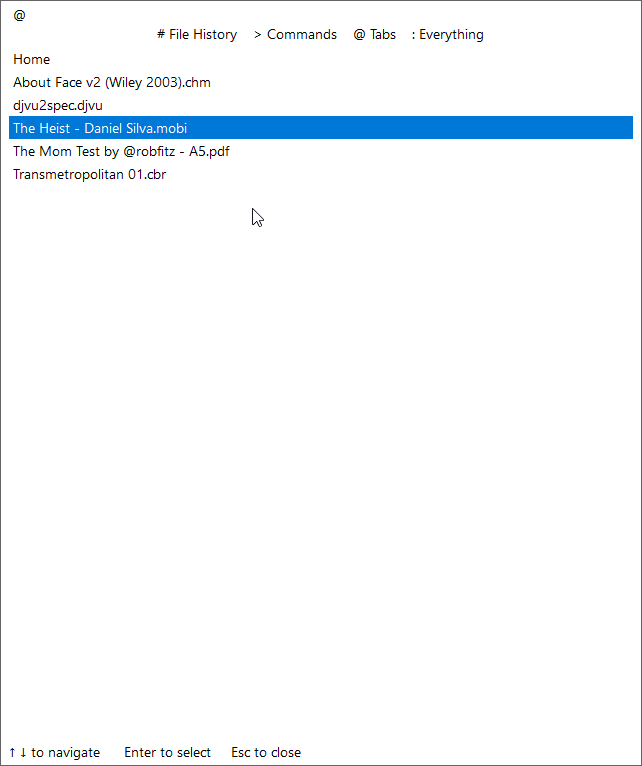

## File history

Type `#` to open a file from list of previously opened files:


## Table of contents

Type `*` to jump to a table of contents entry of the current document (or press
`Shift + F12`, which is bound to the `CmdCommandPaletteTOC` command):

The list shows the fully expanded table of contents, indented to reflect the
tree hierarchy. The entry closest to the current page is pre-selected. Type to
filter, then `Enter` (or double-click) to navigate to the selected entry.

## Favorites

Type `$` to jump to a favorite (bookmark):

Favorites of the current document are listed first, followed by favorites of
other documents (labeled with the file name). Type to filter, then `Enter` (or
double-click) to navigate to the selected favorite. Picking a favorite in
another document opens that document.

You can bind a keyboard shortcut to open the palette directly in favorites mode
with the `CmdCommandPaletteFavorites` [command](./Commands.md) (see
[Managing favorites](./Managing-favorites.md)).

## Combined view

Type `:` for a combined view (replicates 3.4 and 3.5 behavior):

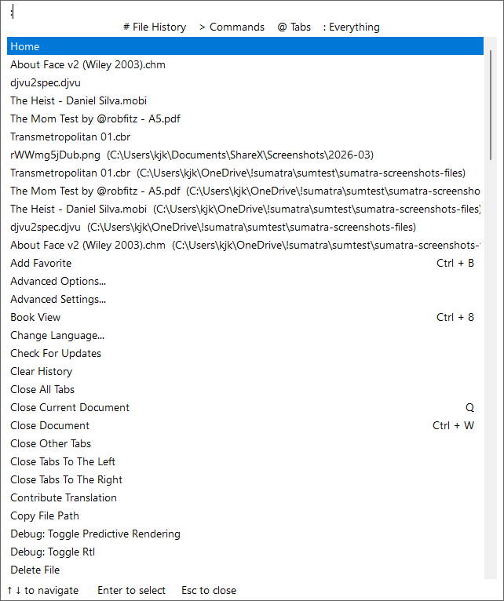

## Replicate 3.4 and 3.5 behavior

In 3.6 we've changed default command palette view from combined (`:`) to just commands (`>`).

You can replicate pre-3.6 behavior by adding to [advanced settings](./Advanced-options-settings.md):

```
Shortcuts [
  [
    Key = Ctrl + K
    Command = CmdCommandPalette :
  ]
]
```

The default for `Ctrl + K` keyboard shortcut is `CmdCommandPalette` [command](./Commands.md).

This changes it to `CmdCommandPalette :`, which replicates 3.4/3.5 behavior.

::Keyboard-shortcuts.md
# Keyboard shortcuts

You can [customize keyboard shortcuts](Customize-keyboard-shortcuts.md). Also see [standard Windows keyboard shortcuts](https://support.microsoft.com/en-us/windows/keyboard-shortcuts-in-windows-dcc61a57-8ff0-cffe-9796-cb9706c75eec) for controls like tree view or edit fields.

:columns
### File menu

- `Ctrl + N` Open a new window
- `Ctrl + O` Open a file
- `Ctrl + W` Close current file
- `Ctrl + S` Save current file as
- `F2` Rename current file
- `Ctrl + P` Print
- `Ctrl + D` Properties
- `Ctrl + Q`, `Alt-F4` Quit app

### Go To menu

- `Right Arrow` / `Left Arrow`- Next / Previous Page
    scrolls left / right if page width > window width
- `Home` First Page
- `End` Last Page
- `Ctrl + G` Go To Page...
- `Alt + Left Arrow` Back
- `Alt + Right Arrow` Forward
- `Ctrl + F` Find... (see [Finding text](Finding-text.md))

### Favorites menu

- `Ctrl + B` Add current page to favorites

### View menu

- `Ctrl + 6` Single Page
- `Ctrl + 7` Facing
- `Ctrl + 8` Book View
- `Ctrl + Shift + -`, `[`- Rotate Left (anti-clockwise)
- `Ctrl + Shift + +`, `]`- Rotate Right (clockwise)
- `F5` Enter / Exit Presentation
- `F11` Enter / Exit Full Screen
- `F12` Show / Hide Bookmarks
- `F8` Show / Hide Toolbar
- `Ctrl + A` Select All
- `Ctrl + C` Copy Selection

### Zoom menu

- `Ctrl + 0` Fit Page
- `Ctrl + 1` Actual Size
- `Ctrl + 2` Fit Width
- `Ctrl + 3` Fit Content
- `Ctrl + Y` Custom Zoom...

### Navigation

- `j` / `k` Scroll up / down by line
- `h` / `l` Scroll left / right
- `Up` / `Down` Scroll up/down by line
- `Shift + Left` / `Shift + Right`- Scroll left /right faster
- `space` Scroll by screen
- `Shift + space` Scroll back by screen
- `n` / `p` Next / previous page
- `Page Down` /  `Page Up` Next / previous page
- `Ctrl + Down` / `Ctrl + Up` Next / previous page
- `Alt + Left` Go back
- `Alt + Right` Go forward
- `Ctrl + G` Go to page
- `g` Go to page
- `Home` Go to first page
- `End` Go to last page
- `b` Flip a page in book mode
- `Ctrl + Shift + Right` Open next document in the directory
- `Ctrl + Shift + Left` Open previous document in the directory

### Viewing state

- `+` / `-` zoom in/out
- `Ctrl + scroll wheel` zoom in/out
- `z` toggle zoom between Fit Page, Fit Width, Fit Height, Fit Content
- `c` toggle between continuous/non-continuous mode
- `Ctrl + Shift + -` rotate left
- `/` on numeric keypad rotate left
- `Ctrl + Shift + +` rotate right
- `*` on numeric keypad rotate left
- `F12` show/hide bookmarks (table of contents)
- `F6` switch focus between bookmarks window and main window
- `Ctrl + L`, `F5`, `Shift + F11`- Enter / exit presentation mode (minimal full screen mode)
- `F11`, `Ctrl + Shift + L`, `f` Enter / Exit full screen mode
- `ESC` exit full screen or presentation mode
- mouse double click exit full screen or presentation mode
- `i` toggle showing page info (**ver 3.6+** )
- `i` invert colors in the document (**ver 3.5.2 or earlier**)
- `Shift + i` invert colors in the document (**ver 3.6+**)
- `Shift + i` toggle showing page info (**ver 3.5.2 or earlier**)
- `m` show cursor position in document coordinates
- `F8` show/hide toolbar
- `F9` show/hide menu
- `w` in presentation mode, make whole screen white
- `.` in presentation mode, make whole screen black

### Actions

- `Ctrl + K` Command palette
- `Ctrl + O` Open a new document
- `Ctrl + W` Close current document
- `Ctrl + F4` Also close current document
- `Ctrl + S` Save current document as...
- `Ctrl + Shift + S` Create a link to current document
- `Ctrl + P` Print
- `F2` Rename file and reopen with new name
- `Ctrl + Shift + N` Open current document in new window
- `r` Reload document
- `Ctrl + F` Find text
- `/` Find text
- `F3` Find next
- `Shift + F3` Find previous
- `Alt + F4` Close window (and all documents in it). Quit app if last window.
- `q` Close current document (tab). Close window if last tab. Quit app if last window.
- `Ctrl + Q` Quit app (close all windows and opened documents)
- `Ctrl + Left Mouse` Select area (can then use with copy, print or +/- zoom)
- `Ctrl + B` Add current page to favorites
- `Right Mouse` Grab and pan page in any direction
- `Alt + Scroll Wheel` Increase vertical scroll wheel steps (faster)
- `Shift + Scroll Wheel` Pan horizontally with scroll wheel
- `Ctrl + Y` Show dropdown zoom control
- `F1` Show documentation / manual

### Tabs

- `Ctrl + Tab` / `Ctrl + Shift + Tab` — next / previous tab. **Ver 3.6+:** these open **Smart Tab Switch** (a tab list while Ctrl is held). For immediate tab-strip order without the list, use `Ctrl + PageDown` / `Ctrl + PageUp`, or [rebind](Customize-keyboard-shortcuts.md) `Ctrl + Tab` to `CmdNextTab` / `CmdPrevTab` (see [Tabs and windows](Tabs-and-windows.md#restore-pre-36-ctrltab-no-switcher-popup))
- `Ctrl + PageDown` go to next tab (strip order, no popup)
- `Ctrl + PageUp` go to previous tab (strip order, no popup)
- `Alt + 1` go to tab 1. Use `Alt + 2`, etc. up to `Alt + 8`
- `Alt + 9` go to last tab

### Annotations

**Ver 3.3+**, some in **ver 3.4+**:

- `a` create highlight annotation from selected text
- `A` like `a` plus opens annotation editor
- `u` create underline annotation from selected text
- `Delete` delete annotation under mouse cursor
- `Ctrl-Shift-S` save annotations to current PDF file

:columns

::Customize-keyboard-shortcuts.md
# Customize keyboard shortcuts

**Available in version 3.4 or later.**

You can add new keyboard shortcuts or re-assign existing shortcut to a different [command](Commands.md).

To customize keyboard shortcuts:

- use `Settings` / `Advanced Options...` menu (or `Ctrl + K` Command Palette, type `adv` to narrow down and select `Advanced Options...` command)
- this opens a notepad with advanced settings file
- find `Shortcuts` array and add new shortcut definitions

An example of customization:

```
Shortcuts [
    [
        Cmd = CmdOpen
        Key = Alt + o
    ]
    [
        Cmd = CmdNone
        Key = q
    ]
    [
        Name = Create green highlight
        Cmd = CmdCreateAnnotHighlight #00ff00 openedit
        Key = a
    ]
    [
        Cmd = CmdNextTab
        ToolbarText = Next Tab
    ]
]
```

### Restore pre-3.6 Ctrl+Tab (no Smart Tab Switch popup)

**Ver 3.6+** binds `Ctrl + Tab` / `Ctrl + Shift + Tab` to **Smart Tab Switch** (`CmdNextTabSmart` / `CmdPrevTabSmart`), which shows a tab list while Ctrl is held. In 3.5 those keys switched tabs immediately in strip order (`CmdNextTab` / `CmdPrevTab`). To get the old behavior back:

```
Shortcuts [
    [
        Cmd = CmdNextTab
        Key = Ctrl + Tab
    ]
    [
        Cmd = CmdPrevTab
        Key = Ctrl + Shift + Tab
    ]
]
```

`Ctrl + PageDown` / `Ctrl + PageUp` already run next/prev tab without the popup. More detail: [Tabs and windows](Tabs-and-windows.md#restore-pre-36-ctrltab-no-switcher-popup).

Explanation of the first example:

- by default SumatraPDF has `Ctrl + O` shortcut for `CmdOpen` (open a file) command. This changes the shortcut to `Alt + o`
- by default `q` closes the document. By binding it to `CmdNone` we can disable a built-in shortcut
- **ver 3.6+:** `CmdCreateAnnotHighlight` takes a color argument (`#00ff00` is green) and boolean `openedit` argument. We re-assign `a` to create a highlight annotation with green color (different from default yellow) and to open annotations edit window (`openedit` boolean argument)
- **ver 3.6+:** `Name` is optional. If given, the command will show up in command palette (`Ctrl + K`)

## Format of `Key` section:

- just a key (like `a`, `Z`, `5`) i.e. letters `a` to `z`, `A` to `Z`, and numbers `0` to `9`
- modifiers + key. Modifiers are: `Shift`, `Alt`, `Ctrl` e.g. `Alt + F1`, `Ctrl + Shift + Y`
- there are some special keys (e.g. `Alt + F3`)
  - `F1` - `F24`
  - `numpad0` - `numpad9` : `0` to `9` but on a numerical keyboard
  - `Delete`, `Backspace`, `Insert`, `Home`, `End`, `Escape`
  - `Left`, `Right`, `Up`, `Down` for arrow keys
  - full list of [special keys](https://github.com/sumatrapdfreader/sumatrapdf/blob/master/src/Accelerators.cpp#L14)
- without modifiers, case does matter i.e. `a` and `A` are different
- with modifiers, use `Shift` to select upper-case i.e. `Alt + a` is the same as `Alt + A` , use `Alt + Shift + A` to select the upper-case `A`

## Commands

You can see a [full list of commands](Commands.md) ([or in the source code](https://github.com/sumatrapdfreader/sumatrapdf/blob/master/src/Commands.h#L9))

## Escaping in settings values

String values in the advanced settings file use `$` as an escape character.
A literal `$` must be written as `$$`. A lone `$` at the end of a value is
treated as a trailing-whitespace marker, not a dollar sign.

This matters for `CmdCommandPalette` mode arguments: use
`CmdCommandPaletteFavorites` (or `CmdCommandPaletteTOC` for table of contents)
instead of `CmdCommandPalette $` / `CmdCommandPalette *` when binding shortcuts.

## Notes

The changes are applied right after you save settings file so that you can test changes without restarting SumatraPDF.

If a custom `Shortcut` doesn't work it could be caused by invalid command name or invalid command arguments.

We log information about unsuccessful parsing of a shortcut so [check the logs](Debugging-Sumatra.md#getting-logs) if things don't work as expected.

::Tabs-and-windows.md
# Tabs and windows

SumatraPDF can open documents in **tabs** inside one window, or in **separate windows**. Which you get depends on two independent settings plus optional command-line flags.

## The two settings

| Setting | Default | What it does |
| --- | --- | --- |
| `UseTabs` | `true` | New documents open as **tabs** in an existing window instead of always spawning a new window |
| `ReuseInstance` | `true` | Opening a file from Explorer or the command line **reuses** an already running SumatraPDF process |

Both live in [advanced settings](Advanced-options-settings.md) (`Settings → Advanced Options...`).

### Common confusion: tabs enabled but new window every time

If `UseTabs = true` but `ReuseInstance = false`, each file is opened by a **new process**, so you always get a separate window — tabs only apply *within* one process.

**Fix:** set `ReuseInstance = true` and restart SumatraPDF.

This is the most frequent tabs question on the [forum](https://github.com/sumatrapdfreader/sumatrapdf/discussions/5621).

## When settings take effect

| Setting | Restart required? |
| --- | --- |
| `ReuseInstance` | No — takes effect on the next file open |
| `UseTabs` | **Yes** — close and restart SumatraPDF |

You can also change `ReuseInstance` and `UseTabs` at runtime (**ver 3.7+**) via `Ctrl + K` → `Advanced Settings...` (`CmdAdvancedSettings`). Changing `UseTabs` affects **new** windows only; switching between tabbed and non-tabbed layout for an existing window may still need a restart.

## Command-line flags

| Flag | Effect |
| --- | --- |
| `-new-window` | Open in a **new window** even when `UseTabs = true` (**ver 3.2+**). With several files: one new window, all files as tabs (**ver 3.7+**) |
| `-reuse-instance` | Send the file to an already running instance (mainly for [DDE](DDE-Commands.md) and scripts). For normal use, prefer the `ReuseInstance` setting |

`-reuse-instance` is **not** needed for everyday double-click opening when `ReuseInstance = true`.

## Multiple instances

If several SumatraPDF processes are already running (for example because `ReuseInstance = false`), behavior of `-reuse-instance` is undefined — the file may go to any instance.

To force a single instance, keep `ReuseInstance = true` and close extra windows.

## Session restore

With `RestoreSession = true`, SumatraPDF reopens tabs (and window positions) from the last session on startup. See [How we store settings](How-we-store-settings.md).

`-for-testing` deliberately skips session restore and does not save settings.

## Keyboard shortcuts for tabs

See [Keyboard shortcuts](Keyboard-shortcuts.md):

- `Ctrl + Tab` / `Ctrl + Shift + Tab` — next / previous tab (**ver 3.6+**: opens the **Smart Tab Switch** list while you hold Ctrl; release to switch). Same idea as the browser tab switcher
- `Ctrl + PageDown` / `Ctrl + PageUp` — next / previous tab in **tab-strip order**, immediately, without the switcher popup (`CmdNextTab` / `CmdPrevTab`)
- `Ctrl + W` or `q` — close current tab
- `Ctrl + Shift + N` — open current document in a new window
- `Alt + 1` … `Alt + 8`, `Alt + 9` (last tab) — jump to tab by number

Use the [command palette](Command-Palette.md): type `@` to switch tabs by name.

### Restore pre-3.6 Ctrl+Tab (no switcher popup)

In **3.5 and earlier**, `Ctrl + Tab` / `Ctrl + Shift + Tab` switched tabs immediately in tab-strip order (no overlay list). In **3.6+** those keys run **Smart Tab Switch** (`CmdNextTabSmart` / `CmdPrevTabSmart`), which shows a tab list while Ctrl is held.

If you prefer the old behavior (useful when flicking quickly between two documents), either:

1. Use **`Ctrl + PageDown` / `Ctrl + PageUp`** instead, or
2. [Rebind the keys](Customize-keyboard-shortcuts.md) in advanced settings so `Ctrl + Tab` runs plain next/prev tab again:

```
Shortcuts [
    [
        Cmd = CmdNextTab
        Key = Ctrl + Tab
    ]
    [
        Cmd = CmdPrevTab
        Key = Ctrl + Shift + Tab
    ]
]
```

Note: the advanced setting `TabsMru` only changes the **order** of tabs inside the Smart Tab Switch list (most-recently-used vs strip order). It does **not** hide the switcher; use the shortcut rebind above for that.

## Home tab

When `UseTabs = true`, an empty window may show a **Home** tab. Set `NoHomeTab = true` in advanced settings to skip it. You can close the Home tab when other tabs are open; reopen it with `Ctrl + K` → `Show Start Page` if needed.

## See also

- [FAQ](FAQ.md) — quick troubleshooting
- [Command-line arguments](Command-line-arguments.md) — `-new-window`, `-reuse-instance`
- [How we store settings](How-we-store-settings.md) — `RestoreSession`, `SessionData`
::Finding-text.md
# Finding text in documents

SumatraPDF can search for text in PDF, EPUB, MOBI, and other formats that support text extraction.

## Open the find box

| Action | Shortcut |
| --- | --- |
| Find | `Ctrl + F` |
| Find (alternate) | `/` |

A small find bar appears near the **Find** button in the toolbar. Type your text
and matches are found as you type; a `n / m` counter shows the current match and
the total number of matches.

## Compact bar vs. floating window

There are two find UIs:

- **Compact bar** (default) — the small overlay near the toolbar.
- **Floating window** — a separate, movable and resizable window that also shows
  a **results list** (see below). It floats over the document so it doesn't cover
  the page.

Switch between them with the diagonal-arrows button on the right of the find UI
(hover it for a tooltip):

| Button | Tooltip | Action |
| --- | --- | --- |
| arrows pointing **out**, on the compact bar | *Open in a window* | Pop the find UI out into a floating window |
| arrows pointing **in**, on the floating window | *Dock to toolbar* | Dock it back to the compact bar |

The choice is remembered across launches via the `SearchUIFloating` advanced
setting (`true` = floating window). The floating window's position and size are
remembered via `SearchUIWindowPos`. See [Advanced options / settings](Advanced-options-settings.md).

## Results list (floating window)

When the find UI is a floating window, it lists every match below the search box:

- each row shows a **snippet** of the surrounding text with the match
  **highlighted**, plus the **page number** on the right.
- click a result, or use **Up / Down** (and **Page Up / Page Down**) while the
  cursor stays in the search box, to jump to that match. **Find Next / Previous**
  (the buttons, `F3` / `Shift + F3`, or `Enter` / `Shift + Enter`) step through
  the list the same way.
- typing selects and jumps to the first match automatically.

The list reflects matches across the whole document, even on large files.

## Find next / previous

| Action | Shortcut |
| --- | --- |
| Find next | `F3` |
| Find previous | `Shift + F3` |
| Find next (selection as needle) | `Ctrl + F3` |
| Find previous (selection as needle) | `Shift + Ctrl + F3` |

All shortcuts are also listed in [Keyboard shortcuts](Keyboard-shortcuts.md) and [Commands](Commands.md).

### Focus matters

Shortcuts behave differently depending on where keyboard focus is:

- **Focus in the document** — `F3` / `Shift + F3` jump to the next / previous match.
- **Focus in the find box** — `Enter` finds the next match; `Shift + Enter` the previous. In the **floating window** these (and the arrow keys) step through the results list with the cursor left in the box; with the **compact bar**, `F3` may not work until you click back in the document.

If `Ctrl + F` behaves oddly (for example replacing the search term with selected text), you may have focus split between the find box and the page. Click the document pane, then press `F3`.

The find UI **closes when you switch tabs** — each tab gets its own fresh search.

### Laptop keyboards

On many laptops the `F1`–`F12` keys control volume and brightness unless you hold **Fn**. If `F3` changes volume instead of finding the next match, use **Fn + F3**, or rebind `CmdFindNext` in [custom keyboard shortcuts](Customize-keyboard-shortcuts.md).

## How search works

- Search is **case-insensitive** by default (German `ß` matches `ss` since 3.7).
- Matching continues onto following pages and **wraps** around to the start of the document.
- The **current** match is highlighted with `FixedPageUI.SelectionColor` (configurable in advanced settings); all other matches use a secondary orange highlight so the active match stands out.

## Command Palette

`Ctrl + K` and type `find` to run the Find command without using the keyboard shortcut.

## Command-line and automation

Open a document and start a search immediately:

```
SumatraPDF.exe -search "needle" document.pdf
```

For an already open document, use [DDE](DDE-Commands.md):

```
[Search("C:\path\file.pdf", "needle")]
```

To jump to a page and select a term only if it appears on that page:

```
[GotoPageWord("C:\path\file.pdf", 12, "needle")]
```

## Search across many PDFs (command-line tool)

Use `sumatrapdf-tool grep` — see [Tool grep](Tool-grep.md) and [Search text in PDF from command line](Tool-x-search-pdf.md).

## Web search / translation of selection

To send **selected** text to Google, Bing, DeepL, etc., see [Customize search / translation services](Customize-search-translation-services.md). That is separate from in-document find.

## See also

- [FAQ](FAQ.md) — search shortcut troubleshooting
- [Keyboard shortcuts](Keyboard-shortcuts.md)
- [Command-line arguments](Command-line-arguments.md) — `-search`
::Hyperlinks.md
# Hyperlinks in documents

SumatraPDF supports two different kinds of "links" in PDF and other documents. They behave differently and are controlled differently.

## Embedded hyperlinks

These are **part of the PDF file** — created by the author in Word, LaTeX, Acrobat, etc. They appear in every standards-compliant viewer. SumatraPDF follows them on click:

- jump to another page or destination in the same file
- open another file
- open a URL in the default browser (`http://`, `https://`, `mailto:`, …)

In [restricted mode](Configure-for-restricted-use.md), launching external URLs can be limited with `LinkProtocols` in `sumatrapdfrestrict.ini` (default: `http,https,mailto`).

## Auto-detected links (plain text)

SumatraPDF also turns **plain text** that *looks* like a URL, email address, or DOI into a clickable link, even when the PDF contains no hyperlink annotation. For example, exporting `www.example.com` as plain text from a word processor creates a clickable link in SumatraPDF but not necessarily in every other viewer. A printed DOI such as `10.1109/WICSA.2015.29` opens as `https://doi.org/10.1109/WICSA.2015.29`.

This follows a long-standing PDF viewer convention (Adobe Reader does something similar). Users who treat unexpected links as a security concern often ask about disabling it — see [discussion #5703](https://github.com/sumatrapdfreader/sumatrapdf/discussions/5703).

### Disable auto-detected links only

In [advanced settings](Advanced-options-settings.md):

```
DisableAutoLinks = true
```

Save the settings file. Embedded hyperlinks that exist in the PDF file itself are **not** removed — only automatic detection of URL-like text, email addresses, and plain-text DOIs is disabled.

### Restricted mode: block following links

`sumatrapdfrestrict.ini` can disable opening URLs from documents entirely:

```
[Policies]
DiskAccess = 0
```

or narrow allowed protocols:

```
LinkProtocols = 
```

An empty `LinkProtocols` value blocks all protocol handlers. This is stricter than `DisableAutoLinks` — it affects embedded links too, not just auto-detection.

See [Configure for restricted use](Configure-for-restricted-use.md) and the [full restrict.ini reference](https://github.com/sumatrapdfreader/sumatrapdf/blob/master/docs/sumatrapdfrestrict.ini).

## Navigating after following a link

Internal links (footnotes, table of contents, cross-references) move you within the document. To return:

- `Alt + Left` or `Backspace` — go back in navigation history
- `Alt + Right` or `Shift + Backspace` — go forward

See [Scrolling and zooming](Scrolling-and-zooming.md).

## CHM and EPUB

- **CHM** files use HTML links; some `ms-its:` links open topics inside the help file.
- **EPUB** links are HTML anchors; external URLs open in the browser.

## See also

- [FAQ](FAQ.md)
- [Advanced options / settings](Advanced-options-settings.md) — `DisableAutoLinks`
- [Configure for restricted use](Configure-for-restricted-use.md) — `LinkProtocols`
::Scrolling-and-zooming.md
# Scrolling and navigating

There are many ways to navigate around the document.

## Scrolling with keyboard

`Up`, `Down`, `Left`, `Right` refers to arrow keys.

* `k`, `j`, `h`, `l` : scroll up / down / left / right
* `Up`, `Down` : scroll up / down
* `n`, `Left` : go to next page (aligns top of page with top of window)
* `p`, `Right` : go to previous page (aligns top of page with top of window)
* `Shift + Down`, `Shift + Up` : scroll forward / backward by a page
* `Space`, `Shift + Space` : scroll forward / backward by a page
* `Home`, `End` : go to first / last page
* `g`, `Ctrl + g` : go to page (text field in toolbar or dialog if toolbar not shown)

## Scrolling with mouse and touch pad

* click on scrollbar to scroll up or down by page
* `Shift` + click on scrollbar : scrolls to that position
* scroll up / down with mouse scroll wheel or touch pad scrolling gesture
* press `Alt` while scrolling : scrolls faster (by half page instead of by line)
* mouse over scrollbar : scrolls faster (by half page instead of by line)

# Zooming and changing view

## With keyboard

* `+`, `-` : zoom in / out
* `Ctrl + +`, `Ctrl + -` : zoom in / out
* `Ctrl + y` : dialog to set custom zoom level (between 8.3% and 6400%)
* `c` : toggle continuous view
* `Ctrl + 0` : set zoom to fit whole page (or pages in multi-column view)
* `Ctrl + 1` : set 100% zoom
* `Ctrl + 2` : set zoom to fit width of page (or pages in multi-column view)
* `Ctrl + 3` : set zoom to fit content (like fit whole page but we auto-remove borders)
* Fit Height (View / Zoom menu or command palette): scale so the page fills the window height (may scroll horizontally)
* `Ctrl + 6` : single page view i.e. single column
* `Ctrl + 7` : facing view i.e. 2 columns (pages)
* `Ctrl + 8` : 2 columns (pages) but offset by one page

## With mouse

* `Ctrl` + mouse scroll wheel : zoom in / out
* `Ctrl` + touch pad scroll gesture : zoom in / out
* pinch zoom gesture on touch screen

## Navigating history

Certain actions add navigation point. You can go back and forward in the history of navigation points (similar to browser back button) with:
* `Alt + Left`, `Backspace` : go back in history
* `Alt + Right`, `Shift + Backspace` : go forward in history

After following an internal hyperlink (footnote, TOC entry), use `Alt + Left` to go back. See [Hyperlinks](Hyperlinks.md).

Actions that add navigation point:
* explicitly going to a page (`g`, `Ctrl + g`)
* clicking on links within documents
* going to a page via Bookmarks tree view
* navigating via favorites (`Ctrl + b`)

## Navigating between tabs

* `Ctrl + Tab` / `Ctrl + Shift + Tab` : next / previous tab. **Ver 3.6+:** **Smart Tab Switch** (tab list while Ctrl is held). To get pre-3.6 immediate strip-order switching on those keys, [rebind](Customize-keyboard-shortcuts.md) them to `CmdNextTab` / `CmdPrevTab` — see [Tabs and windows](Tabs-and-windows.md#restore-pre-36-ctrltab-no-switcher-popup)
* `Ctrl + Page Down` : next tab (strip order, no popup)
* `Ctrl + Page Up` : previous tab (strip order, no popup)

## Moving tabs

**v.3.6+**

* `Ctrl + Shift + Page Down` : move tab right
* `Ctrl + Shift + Page Up` : move tab left

## Navigating between files

* `Shift + Control + Right` : go to next file in current folder
* `Shift + Control + Left` : go to previous file in current folder

# Related commands

You can [assign your own keyboard shortcuts](Customize-keyboard-shortcuts.md). Here are related commands:

* `CmdScrollUp`, `CmdScrollDown`
* `CmdScrollLeft`, `CmdScrollRight`
* `CmdScrollUpHalfPage`, `CmdScrollDownHalfPage`
* `CmdScrollLeftPage`, `CmdScrollRightPage`
* `CmdScrollDownPage`, `CmdScrollUpPage`
* `CmdGoToNextPage`, `CmdGoToPrevPage`
* `CmdGoToFirstPage`, `CmdGoToLastPage`
* `CmdNavigateBack`, `CmdNavigateForward`
* `CmdOpenNextFileInFolder`, `CmdOpenPrevFileInFolder`

Tab commands:

* `CmdNextTab`, `CmdPrevTab`, `CmdNextTabSmart`, `CmdPrevTabSmart`

Zooming and view commands:

* `CmdZoomIn`, `CmdZoomOut`
* `CmdZoomCustom`
* `CmdZoomFitPage`
* `CmdZoomActualSize`
* `CmdZoomFitWidth`
* `CmdZoomFitContent`

::Managing-favorites.md
# Managing favorites

Favorites let you save important places in documents and jump back to them later.

## Add a favorite

Press `Ctrl + B` to add the current page to favorites.

You can also use `Ctrl + K` command palette and run `Add Favorite`.

## Favorites sidebar

The favorites sidebar shows favorites saved across documents.

To show or hide it:

- use `Ctrl + K` command palette and run `Toggle Favorites`
- or assign a shortcut to `CmdFavoriteToggle`

When the sidebar is visible, selecting a favorite navigates to that saved place. If the favorite is in another document, SumatraPDF opens that document.

## Show favorites from command palette

Press `Ctrl + K`, then type `$` to show favorites in the command palette.

Favorites from the current document are listed first. Favorites from other documents are shown after them and include the file name.

## Bind favorites command palette to `b`

You can bind `CmdCommandPaletteFavorites` to a key in [advanced settings](Advanced-options-settings.md).

Open `Settings` / `Advanced Options...`, find the `Shortcuts` section and add:

```
Shortcuts [
    [
        Cmd = CmdCommandPaletteFavorites
        Key = b
    ]
]
```

After saving, pressing `b` opens the command palette directly in favorites mode.

You can also use `CmdCommandPalette` with a `$` mode argument, but in settings
files a literal `$` must be escaped as `$$` (e.g. `Cmd = CmdCommandPalette $$`).
Prefer `CmdCommandPaletteFavorites` to avoid that.

See [customize keyboard shortcuts](Customize-keyboard-shortcuts.md) for details.

::Editing-annotations.md
# Editing annotations

**Available in version 3.3 or later.**

You can add / edit annotations in PDF files.

## Highlight text with `a`

Most common annotation is highlighting of text: select text and press `a`. This creates a highlight annotation in yellow color:

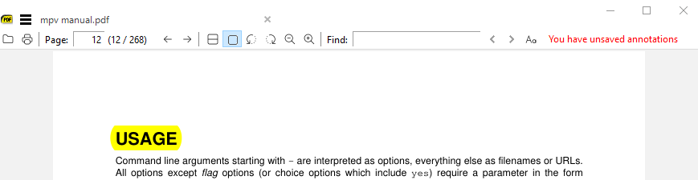

Here I highlighted word `USAGE` and pressed `a`.

## Saving annotations back to PDF file

Notice in toolbar (upper right) we show: You have unsaved annotations.

When you close the document (or exit the app) and have unsaved annotations, SumatraPDF will ask if you want to save them:

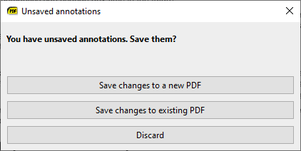

If you close the dialog or choose `Discard`, annotations will be lost.

`Save changes to existing PDF` will over-write the PDF with newly added annotations.

`Save changes to a new PDF` will allow you to save as a new file.

## Open annotation editor

If you press `A` (upper case i.e. `Shift-a`) we will create a highlight annotation (same as lower case `a`) but also open annotation editor window.

Another way to open annotation editor is to use context menu (right mouse click or `Shift-F10`) and use `Edit Annotations`:

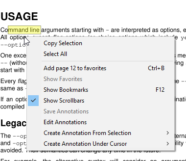

## Other annotations for selected text

When you selected a text, you can create the following annotations from the selection:

- highlight
- underline
- strike out
- squiggly underline

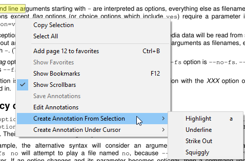

We also copy selected text to a clipboard so that e.g. you can use `Ctrl-V` to paste it into `Contents` property of the annotation.

## Other annotation types

You can also create annotation object at your mouse location:

- text
- free text
- stamp
- caret


## Annotation editor

All those commands will open annotation editor:

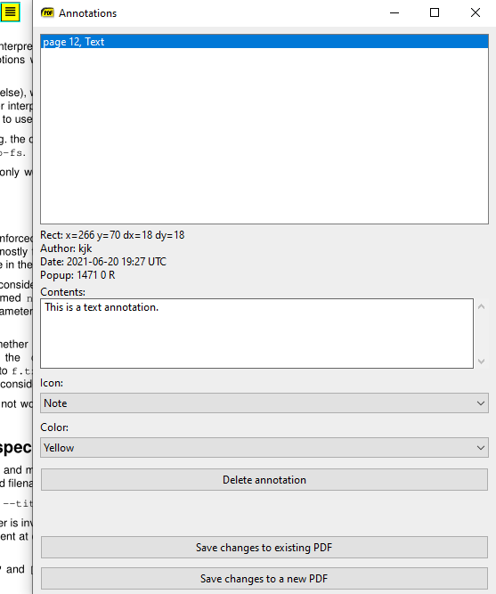

Here we have a text annotation in the editor.

You can delete annotations, change color, text and other attributes.

## Select annotation from page in editor

When you have many annotations on the page, it's hard to locate the desired annotation in the editor list.

To select an annotation in the editor, place the mouse cursor over an annotation in the page, right click for context menu and use `Select Annotation in Editor`.

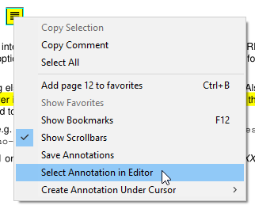

## Moving annotations

To move an annotation on the page, left click with mouse and drag to new location.

## Default colors, size, and opacity

Open **Settings → Advanced Options...** and edit the `Annotations` block:

| Setting | Used for |
| --- | --- |
| `HighlightColor` | New highlights (`a`) — default `#ffff00` |
| `UnderlineColor` | Underline annotations |
| `SquigglyColor` | Squiggly underline |
| `StrikeOutColor` | Strike-out |
| `FreeTextColor` / `FreeTextBackgroundColor` | Free text annotations |
| `FreeTextSize` | Default font size for free text (default `12`) |
| `FreeTextBorderWidth` | Border width for free text |
| `FreeTextOpacity` | `0`–`100` percent opacity for free text |
| `TextIconColor` / `TextIconType` | Sticky-note style icons |
| `DefaultAuthor` | Author name written into new annotations |

Highlight/underline/strikeout opacity is changed **per annotation** in the annotation editor, not via a global default.

See [Advanced options / settings](Advanced-options-settings.md) for the full list.

### Keyboard shortcuts with custom colors

**Ver 3.6+:** `CmdCreateAnnotHighlight` accepts a color argument. You can bind e.g. green highlights to a key — see [Customize keyboard shortcuts](Customize-keyboard-shortcuts.md).

### Toolbar buttons

Add annotation commands to the toolbar via the `Shortcuts` array — see [Customize toolbar](Customize-toolbar.md). Example commands: `CmdCreateAnnotHighlight`, `CmdCreateAnnotUnderline`, `CmdSaveAnnotations`.

## Saving workflow

| Action | Shortcut / command |
| --- | --- |
| Save annotations to file | `Ctrl + Shift + S` (`CmdSaveAnnotations`) |
| Save when closing | Prompt dialog — choose existing file, new file, or discard |

There is **no undo** (`Ctrl + Z`) for annotation edits. Delete an annotation with `Delete` when the cursor is over it, or remove it in the annotation editor.

To avoid the save prompt on every close, save explicitly with `Ctrl + Shift + S` before closing.

## Annotations from other programs

SumatraPDF can display most standard PDF annotations created in Acrobat, Foxit, etc. Some proprietary annotation types may show only an icon. Free-text presets and appearance vary between editors.

## Missing features

We don't yet support every annotation type or every editing operation other PDF apps offer.

The future will be driven by your feedback. If there are features missing or there are better ways of doing things, let me know in [Discussions](https://github.com/sumatrapdfreader/sumatrapdf/discussions)

When providing feedback:

- tell us what
- tell us why. Context is important for prioritizing features. Is new feature / idea something that you absolutely need or is it just a nice improvement
- you might be familiar how other PDF editors work. When referencing feature or UI ideas coming from other apps, tell us which app it is. Screenshots are better than words when describing UI ideas.
::AI-Chat-with-document.md
# AI Chat with document

**Available in pre-release 3.7+ on Windows 10 or later.**

SumatraPDF can show a chat sidebar where you ask questions about the document you are reading. Answers come from an AI agent CLI running on your computer — SumatraPDF does not send your files to its own servers.

Three backends are supported: [Claude Code](#claude-code), [Grok Build](#grok-build), and [OpenAI Codex](#openai-codex).

## Claude Code

This feature requires **[Claude Code](https://docs.anthropic.com/en/docs/claude-code)** to be installed and available on your system. SumatraPDF launches the `claude` command-line tool when you send a message.

If Claude Code is missing, the chat panel shows an error such as *Cannot find claude. Is Claude Code installed?*

Install and set up Claude Code using Anthropic's official guide:

- [Set up Claude Code](https://code.claude.com/docs/en/setup)

After installation, make sure `claude` (or `claude.exe`) is on your `PATH`. SumatraPDF also looks in `%USERPROFILE%\.local\bin\`, `%USERPROFILE%\AppData\Local\Programs\claude-code\`, and `%USERPROFILE%\AppData\Roaming\npm\`.

## Grok Build

This feature can also use **[Grok Build](https://x.ai/news/grok-build-cli)** (the `grok` command-line tool).

If Grok Build is missing, the chat panel shows an error such as *Cannot find grok. Is Grok Build installed?*

Install Grok Build and sign in using xAI's instructions. SumatraPDF looks for `grok.exe` on `PATH`, in `%USERPROFILE%\.grok\bin\`, and in `%USERPROFILE%\.local\bin\`.

Open the panel with **View → Grok chat** (`CmdAIChatWithGrokBuild`), or search for `Grok` in the command palette.

Grok Build settings are in the `GrokBuild` section of [advanced settings](Advanced-options-settings.md). The **Always Approve** checkbox passes `--always-approve` to Grok Build.

## OpenAI Codex

This feature can also use **[OpenAI Codex](https://developers.openai.com/codex/cli)** (the `codex` command-line tool).

If OpenAI Codex is missing, the chat panel shows an error such as *Cannot find codex. Is OpenAI Codex installed?*

Install and sign in using OpenAI's official guides:

- [Codex CLI](https://developers.openai.com/codex/cli)
- [Codex quickstart](https://developers.openai.com/codex/quickstart)
- [Codex on Windows](https://developers.openai.com/codex/windows)

After installation, make sure `codex` (or `codex.exe`) is on your `PATH`, or in `%USERPROFILE%\.codex\bin\` or `%USERPROFILE%\.local\bin\`.

Open the panel with **View → Codex chat** (`CmdAIChatWithOpenAICodex`), or search for `Codex` in the command palette.

Codex settings are in the `CodexBuild` section of [advanced settings](Advanced-options-settings.md). The **Skip Sandbox** checkbox passes `--dangerously-bypass-approvals-and-sandbox` to Codex — use only if you understand the security implications.

In the chat panel you can pick a model (default `gpt-5.5`; `gpt-5.4` and `o3` are also available) and a sandbox mode: **Read-only**, **Workspace write**, or **Full access**.

## How to use

1. Open a supported document (see below).
2. Open a chat sidebar for your preferred backend:
   - **View → Claude chat** (`CmdAIChatWithClaudeCode`)
   - **View → Grok chat** (`CmdAIChatWithGrokBuild`)
   - **View → Codex chat** (`CmdAIChatWithOpenAICodex`)
   
   Or open the [command palette](Command-Palette.md) (`Ctrl + K`) and search for `Claude`, `Grok`, or `Codex`.
3. Type a question in the input box at the bottom of the sidebar and press `Enter`.
4. Drag the splitter between the document and the chat panel to resize the sidebar.

Each document tab has its own chat session. Switching tabs switches the sidebar to that tab's conversation history.

You can pick a previous session from the session dropdown and choose model options. Backend-specific controls:

- **Claude Code:** model, effort level, and optionally **Skip Permissions** (passes `--dangerously-skip-permissions` — use only if you understand the security implications).
- **Grok Build:** model, effort level, and optionally **Always Approve** (passes `--always-approve`).
- **OpenAI Codex:** model, sandbox mode, and optionally **Skip Sandbox**.

While the agent is working on a reply, use **Stop** to cancel the current request.

## Supported documents

AI Chat is available only for file types the agent CLIs can work with directly:

- **PDF** (`.pdf`)
- **Single image files** (e.g. `.png`, `.jpg`, `.webp`, `.gif`, `.tiff`, `.bmp`, and other image formats SumatraPDF opens as a single image)

It is **not** available for comic archives (`.cbr`, `.cbz`, etc.), folders of images, ebooks (EPUB, MOBI, …), CHM, DjVu, XPS, PostScript, plain text, and other formats. On unsupported tabs the command is disabled and the panel shows that the feature is only available for PDF and image files.

## Settings

Sidebar width is shared by all backends via the `AIChatSidebarDx` advanced setting.

Backend-specific options are in [advanced settings](Advanced-options-settings.md) (`SumatraPDF-settings.txt`):

- `ClaudeCode` — default model, effort level, **Skip Permissions**, background color
- `GrokBuild` — default model, effort level, **Always Approve**, background color
- `CodexBuild` — default model, extra models, sandbox mode, **Skip Sandbox**, background color

You can assign your own keyboard shortcut to any of the chat commands — there is no default key binding. See [Customize keyboard shortcuts](Customize-keyboard-shortcuts.md).

## Requirements and limitations

- **Windows 10+** only (uses WebView2 for the chat UI).
- Requires a working installation of at least one supported agent CLI and network access as required by that CLI.
- Session history is stored by each CLI in its own location; SumatraPDF can list and resume sessions for the current document's folder:
  - Claude Code: `~/.claude/projects/` (encoded by project directory)
  - Grok Build: `~/.grok/sessions/`
  - OpenAI Codex: `~/.codex/sessions/` (with descriptions from `~/.codex/history.jsonl`)
- Each agent runs as a separate process; behavior, models, and billing follow that provider's terms and your account.

## See also

- [Commands](Commands.md) — `CmdAIChatWithClaudeCode`, `CmdAIChatWithGrokBuild`, `CmdAIChatWithOpenAICodex`
- [Command Palette](Command-Palette.md)
- [Advanced options / settings](Advanced-options-settings.md) — `ClaudeCode`, `GrokBuild`, and `CodexBuild` sections
- [Version history](Version-history.md) — 3.7 AI Chat entry
- [Claude Code documentation](https://docs.anthropic.com/en/docs/claude-code) (Anthropic)
- [Grok Build](https://x.ai/news/grok-build-cli) (xAI)
- [OpenAI Codex CLI](https://developers.openai.com/codex/cli) (OpenAI)

::Printing.md
# Printing

This page collects everything about printing in SumatraPDF: printing from the
window, printing from the command line, every `-print-settings` option and what
it's good for, and recipes for common printing tasks.

If a printout looks wrong (banding, wrong colors, stalls), see
[Reporting printing bugs](Reporting-printing-bugs.md) first — most such problems
come from the printer driver, not SumatraPDF.

## How SumatraPDF prints

SumatraPDF renders each page to an image and sends that image to the printer.
This is reliable across document types (PDF, XPS, CBZ, etc.) but means:

- the print spool can be large and printing can be slower than text-based printers
- print quality follows the printer resolution, not a vector path
- screen-only settings (anti-aliasing, color range, background color) do **not**
  change the printout

## Printing from the window

Press `Ctrl + P` (or toolbar / menu) to open the system print dialog. There you
pick the printer, number of copies, and page range.

### The Advanced options

The system print dialog has an **Advanced** tab (a second tab next to
*General*) with SumatraPDF's own options:

**Print range**

- **All selected pages** – print the chosen range as-is
- **Odd pages only** / **Even pages only** – print only odd/even pages of the
  range (useful for manual two-sided printing)

**Page scaling**

- **Shrink pages to printable area (if necessary)** – default; only scales down
  pages that are too big for the paper, leaves smaller pages at original size
- **Fit pages to printable area** – scale every page up or down so it fills the
  printable area, keeping the aspect ratio
- **Stretch pages to fill paper (ignore aspect ratio)** – fill the paper in both
  dimensions, *not* keeping the aspect ratio (the page is distorted to fit)
- **Use original page sizes** – print at 100%, no scaling (best for forms,
  labels and anything that must print at an exact size)

**Other**

- **Center page horizontally on the paper** – center a page that is smaller than
  the paper; otherwise such a page is aligned to the top-left corner. Useful for
  envelopes or smaller stock fed through a tray that centers the paper
- **Choose paper source by document page size** – let the printer pick the input
  tray whose paper matches the page size (the same idea as Adobe's "Choose paper
  source by PDF page size")
- **Print each page at its document page size (mixed sizes)** – for documents
  whose pages have different sizes, set the paper size per page so each page goes
  to the right paper/tray instead of all pages using the first page's size

### Windows 11: the "Advanced" tab is missing

On Windows 11 (22H2 and later) Windows replaced the classic print dialog with a
new "modern" one that does **not** show application-provided tabs. As a result
SumatraPDF's **Advanced** options (and print preview) don't appear, even though
SumatraPDF still asks for them.

You have two options:

1. **Use command-line printing** (below) — it doesn't depend on the dialog and
   exposes every Advanced option.
2. **Restore the legacy print dialog** for your user account. This affects all
   apps, not just SumatraPDF:

   ```
   reg add "HKCU\Software\Microsoft\Print\UnifiedPrintDialog" /v PreferLegacyPrintDialog /t REG_DWORD /d 1 /f
   ```

   Then sign out and back in. To undo, delete that value.

## Command-line printing

Command-line printing never shows a dialog (unless you ask for one) and exposes
every option, so it works the same on every Windows version. After printing,
SumatraPDF exits; check the process exit code for success/failure.

- `-print-to-default` — print to the system default printer
- `-print-to "<printer-name>"` — print to a named printer, e.g.
  `-print-to "Microsoft Print to PDF"`
- `-print-settings "<list>"` — tweak printing without the dialog (see below)
- `-silent` — suppress error message boxes (for unattended/background printing)
- `-print-dialog` — show the print dialog instead of printing silently
- `/p` — Adobe Reader alias for `-print-dialog`
- `/t <file> <printer>` — Adobe Reader silent print (`/t <printer>` if the file is
  already on the command line); optional driver/port args are ignored
- `-exit-when-done` — used with `-print-dialog` (and `-stress-test`); exit after
  the dialog is dismissed and the document printed

### Exit codes

For unattended/silent printing, the process exit code tells you *why* a print
failed:

| Exit code | Meaning |
| --- | --- |
| `0` | success |
| `2` | couldn't open the file (not found or unsupported format) |
| `3` | the document doesn't allow printing |
| `4` | the printer (named, or default) doesn't exist |
| `5` | the printer driver / device failed |
| `6` | printing is disabled by restriction policy |

With several files, the code is `0` only if all printed, otherwise the category
of the first failure. Anything that goes wrong inside the spooler/driver *after*
the job is submitted (out of paper, printer offline, jam) can't be reported —
SumatraPDF only knows whether the job was handed off.

You can print several files in one command; the settings apply to all of them:

```
SumatraPDF.exe -print-to "HP LaserJet" -print-settings "fit" a.pdf b.pdf c.pdf
```

### `-print-settings` options

The list is comma-separated, e.g. `-print-settings "1-5,odd,fit,monochrome"`.
Order doesn't matter. Available tokens:

**Which pages**

| Option | Meaning |
| --- | --- |
| `5` | a single page |
| `2-6` | a page range |
| `10-8` | a reversed range (prints 10, 9, 8) |
| `last` | the last page |
| `-1`, `-2` | count from the end (`-1` = last page, `-2` = second-to-last) |
| `-3--1` | a range using negatives (here, the last 3 pages) |
| `even` / `odd` | only even / only odd pages of the selected range |

**Scaling and placement**

| Option | Meaning |
| --- | --- |
| `noscale` | print at 100% (no scaling) |
| `shrink` | scale down only pages too big for the paper (default) |
| `fit` | scale every page to fill the printable area, keeping aspect ratio |
| `stretch` | fill the paper in both dimensions, ignoring aspect ratio |
| `center` | center the page horizontally on the paper |

**Orientation**

| Option | Meaning |
| --- | --- |
| `portrait` / `landscape` | rotate the *content* 90° (this is content rotation, **not** the paper orientation, which is set by the printer/driver) |
| `disable-auto-rotation` | don't auto-rotate a wide page 90° to fit the paper; print it in its original orientation |
| `rotate=90` / `rotate=180` / `rotate=270` | rotate the printout by extra degrees, to fix a wrong orientation (e.g. `rotate=180` for upside-down output on virtual printers). In the window, use the **Rotate printout** dropdown on the Advanced print tab |

**Paper and tray**

| Option | Meaning |
| --- | --- |
| `paper=A4` | standard size: `A2`, `A3`, `A4`, `A5`, `A6`, `letter`, `legal`, `tabloid`, `statement`, or a name the printer reports (e.g. `A3 297 x 420 mm`) |
| `paper=76mm x 130mm` | a custom paper size |
| `paper=auto` | set the paper size from each page's own size (for mixed page sizes) |
| `paperkind=<num>` | paper size by Windows `DMPAPER_*` id; use when `paper=A3` doesn't match the driver's paper name |
| `bin=<num or name>` | select the input tray (by number or name) |
| `bin=auto` | let the printer pick the tray whose paper matches the page size |

Use `SumatraPDF.exe -list-printers` to list installed printers, paper names, `paperkind=` IDs and tray names.

**Copies, sides and color**

| Option | Meaning |
| --- | --- |
| `3x` | number of copies (here, 3) |
| `collate` / `nocollate` | collate copies (`1,2,3 / 1,2,3`) or not (`1,1 / 2,2 / 3,3`) |
| `simplex` | one-sided |
| `duplex` / `duplexlong` | two-sided, flip on long edge |
| `duplexshort` | two-sided, flip on short edge |
| `color` | force color |
| `monochrome` | force grayscale/black-and-white |

**Output (advanced)**

| Option | Meaning |
| --- | --- |
| `output=<file>` | write to a file (for "print to file" style printers) |
| `docname=<name>` | set the print job name shown in the print queue |
| `ignore-pdf-print-settings` | ignore the print defaults embedded in the PDF (see below) |

> If `paper=A4` doesn't take effect, the driver may report the size under a
> different name. List the exact names your printer accepts and use one of them,
> or fall back to `paperkind=<num>`.

## Print defaults embedded in a PDF

A PDF can carry print hints in its `ViewerPreferences` dictionary. When you
print a **PDF** from the command line, SumatraPDF reads them and uses them as
defaults:

| ViewerPreferences key | Effect |
| --- | --- |
| `PrintScaling` | `/None` prints at original size (no scaling); `/AppDefault` uses SumatraPDF's default |
| `NumCopies` | number of copies |
| `Duplex` | `Simplex`, `DuplexFlipShortEdge` or `DuplexFlipLongEdge` |
| `PickTrayByPDFSize` | when true, pick the input tray by page size (same as `bin=auto`) |

These are **defaults only**. Anything you pass in `-print-settings` overrides the
PDF's value — e.g. `-print-settings "2x"` prints 2 copies even if the PDF asks
for 3. To ignore the PDF's embedded values completely, add
`ignore-pdf-print-settings`:

```
SumatraPDF.exe -print-to-default -print-settings "ignore-pdf-print-settings" document.pdf
```

This applies to command-line printing only; when you print from the window, the
print dialog's own values are used.

## Print dialog defaults

You can change some defaults used by the print dialog with the `PrinterDefaults`
advanced setting (in `Settings → Advanced Options`):

```
PrinterDefaults [
	PrintScale = none
	Collate = collate
]
```

- `PrintScale` — default page scaling. Values: `shrink` (default), `fit`,
  `stretch`, `none`.
- `Collate` — default for the print dialog's Collate checkbox. Values: `default`
  (leave the printer/driver default), `collate`, `nocollate`. You can still
  change it per print in the dialog. For command-line printing, use the
  `collate` / `nocollate` `-print-settings` tokens instead.

## Recipes for common tasks

**Print a PDF to the default printer, unattended**

```
SumatraPDF.exe -print-to-default -silent document.pdf
```

**Print at exact size (no scaling) — forms, labels, pre-printed stationery**

```
SumatraPDF.exe -print-to "Label Printer" -print-settings "noscale" label.pdf
```

**Print a small page centered on larger paper (e.g. an envelope)**

```
SumatraPDF.exe -print-to "HP LaserJet" -print-settings "noscale,center" envelope.pdf
```

**Fit every page to the paper, in grayscale, 2 copies**

```
SumatraPDF.exe -print-to "Office Printer" -print-settings "fit,monochrome,2x" report.pdf
```

**Two-sided, long-edge binding, fit to page**

```
SumatraPDF.exe -print-to "Office Printer" -print-settings "fit,duplexlong" report.pdf
```

**Manual two-sided on a one-sided printer** (print odd pages, flip the stack,
then print even pages)

```
SumatraPDF.exe -print-to "Office Printer" -print-settings "odd,fit" report.pdf
SumatraPDF.exe -print-to "Office Printer" -print-settings "even,fit" report.pdf
```

**Print only the last 3 pages**

```
SumatraPDF.exe -print-to-default -print-settings "-3--1" document.pdf
```

**Print a specific paper size from a specific tray**

```
SumatraPDF.exe -print-to "Office Printer" -print-settings "paper=A5,bin=2,fit" booklet.pdf
```

**Print a document with mixed page sizes to matching paper/trays**

```
SumatraPDF.exe -print-to "Multi-tray Printer" -print-settings "paper=auto,bin=auto" mixed.pdf
```

**Print a wide (landscape) page in its original orientation (no 90° rotation)**

```
SumatraPDF.exe -print-to "Receipt Printer" -print-settings "disable-auto-rotation" wide.pdf
```

**Fix an upside-down printout (e.g. when printing to XPS / Print to PDF)**

```
SumatraPDF.exe -print-to "Microsoft Print to PDF" -print-settings "rotate=180" doc.pdf
```

**"Print" to a PDF file**

```
SumatraPDF.exe -print-to "Microsoft Print to PDF" -print-settings "output=C:\out\result.pdf" input.pdf
```

## Common command-line printing problems

### Paper size or tray ignored

Drivers often report paper sizes under non-obvious names. If `paper=A4` has no effect:

1. Print once from the Windows dialog and note the exact paper name in the driver.
2. Use that string: `-print-settings "paper=A3 297 x 420 mm"`.
3. Or use `paperkind=<num>` with the Windows `DMPAPER_*` id.
4. For mixed page sizes: `paper=auto,bin=auto`.

Combine with `ignore-pdf-print-settings` if the PDF embeds conflicting `ViewerPreferences`.

### Wrong orientation or margins

- Wide pages auto-rotate 90° to fit — add `disable-auto-rotation` to keep original orientation.
- Upside-down virtual printer output — try `rotate=180`.
- Content too small — use `fit` or `shrink` (default); exact size — `noscale`.

### Job prints to wrong printer

`-print-to` requires the **exact** printer name from Windows Settings → Printers. `-print-to-default` avoids name mismatches.

### Silent script reports failure

Check the [exit code](#exit-codes). Common results:

| Code | Check |
| --- | --- |
| `4` | Printer name typo or no default printer |
| `5` | Driver error — update driver, try printing to "Microsoft Print to PDF" to isolate |
| `6` | `sumatrapdfrestrict.ini` has `PrinterAccess = 0` |

Add `-silent` only after confirming the command works interactively (without `-silent`, error dialogs explain failures).

### Lines or barcodes missing

SumatraPDF renders each page to a bitmap before printing. Very fine lines, hairline barcodes, or light gray rules may disappear at printer resolution. Try `noscale` with a higher-DPI driver, or print from a vector-aware tool. See [Reporting printing bugs](Reporting-printing-bugs.md) — often driver/resolution, not SumatraPDF logic.

### Windows 11: no Advanced tab in print dialog

Use command-line printing (this section) or enable the [legacy print dialog](#windows-11-the-advanced-tab-is-missing) — CLI exposes every Advanced option on all Windows versions.

## See also

- [FAQ](FAQ.md) — printing quick answers
- [Command-line arguments](Command-line-arguments.md) — all command-line options
- [Reporting printing bugs](Reporting-printing-bugs.md) — what to include when a
  printout is wrong

::Read-Aloud.md
# Read Aloud (TTS)

*Pre-release 3.7+*

Read document text using Windows text-to-speech. You can start from a text selection, from the first visible text in the viewport, or (from the context menu) from the position where you right-clicked.

## How to use

1. Open a document with selectable text (PDF, EPUB, etc.).
2. Start reading from one of these places:
   - **Toolbar** — Read Aloud button (click to start / pause / continue; the icon shows a speaker when idle or paused, and a pause symbol while speaking). Use the dropdown arrow for explicit start scopes and **Voice**.
   - **Main menu** — **Read Aloud (TTS)** (after Selection)
   - **Context menu** — **Read Aloud (TTS)** (after Document)
   - **Command palette** (`Ctrl + K`) — **Read Aloud**, **Start Reading From Top**, **Start Reading Selection**, **Pause Reading**, **Continue Reading**, **Stop Reading** (transport commands appear only when they apply)
3. While a session is active (speaking or paused), a **playback bar** at the bottom of the canvas shows the document name, **page X of Y**, start scope, and **Pause** / **Resume** and **Stop** buttons on the left. The current word is highlighted on the page while speaking. **Pause Reading**, **Continue Reading**, and **Stop Reading** are also in all three Read Aloud menus.

**Pause** stops speech and remembers your position so you can **Continue Reading** later. **Stop** ends the session and clears the resume position.

Switching to another tab stops reading and clears the resume position on the tab you left.

## Start scopes

| Command | Behavior |
|---------|----------|
| **Read Aloud** (toolbar / palette) | Selection if present, otherwise first visible text in the viewport; continues through the rest of the document |
| **Start Reading From Top** | First visible text in the viewport → end of document |
| **Start Reading From Cursor Position** | Context menu only — right-click position → end of document (disabled when there is no text at the cursor) |
| **Start Reading Selection** | Selected text only; does not continue past the selection |

Scope labels on the playback bar: **Smart start**, **From top**, **From cursor**, or **Selection**.

## While listening

- **Word highlight** — the spoken word is highlighted on the page (uses the selection highlight color).
- **Auto-scroll** — the viewport scrolls to keep the spoken word in view. If you scroll the highlight fully off-screen, auto-scroll stops for that session so manual navigation is respected.

## Voice

Open **Voice** in any Read Aloud menu to pick **System default** or an installed Windows voice. Your choice is remembered in `ReadAloudVoiceId` in [Advanced options](Advanced-options-settings.md) (`SumatraPDF-settings.txt`). Leave it empty for the system default.

## Limitations

- Uses Windows speech voices installed on your system (WinRT Speech Synthesis with SAPI fallback).
- EPUB/complex layouts may read in an order that does not match visual layout.
- Copy-restricted documents cannot be read aloud (no message is shown).
- Pages with no extractable text show a short *“No text available to read aloud”* notification.
- Does not replace a full screen-reader experience for blind users — see [Accessibility](Accessibility.md) for UI Automation / Narrator.

## See also

- [Commands](Commands.md) — Read Aloud commands
- [Advanced options](Advanced-options-settings.md) — `ReadAloudVoiceId`
- [Version history](Version-history.md) — 3.7 Read Aloud entry
- [Accessibility](Accessibility.md) — screen readers and other accessibility features
::Commands.md
# Commands

You can control SumatraPDF with commands:

- use [command palette](Command-Palette.md) (`Ctrl + K`) to invoke a command by its description
- [customize a keyboard shortcut](Customize-keyboard-shortcuts.md) to invoke a command by its id
- **ver 3.5+:** [send a command via DDE](DDE-Commands.md) e.g. `[CmdClose]` to invoke `Close Document` command
- **ver 3.6+:** some commands [accept arguments](Commands.md#commands-with-arguments)

:search:

## File

```commands
Command IDs,Keyboard shortcuts,Command Palette,Notes
CmdClose,"Ctrl + W, Ctrl + F4",Close Document,
CmdCloseCurrentDocument,q,Close Current Document,
CmdCommandPalette,Ctrl + K,Command Palette,
CmdCommandPaletteTOC,Shift + F12,Command Palette: Table Of Contents,"Jump to a table of contents entry of the current document, ver 3.7+"
CmdCommandPaletteFavorites,,Command Palette: Favorites,"Jump to a favorite, ver 3.7+"
CmdDuplicateInNewWindow,Shift + Ctrl + N,Open Current Document In New Window,
CmdDuplicateInNewTab,,Open Current Document In New Tab,ver 3.6+
CmdExit,Ctrl + Q,Exit Application,
CmdMoveFrameFocus,F6,Move Frame Focus,
CmdNewWindow,Ctrl + N,Open New SumatraPDF Window,
CmdOpenFile,Ctrl + O,Open File...,
CmdOpenNextFileInFolder,Shift + Ctrl + Right,Open Next File In Folder,
CmdNavigateFilesInFolder,,Navigate Files in Folder,"floating window listing openable files and directories in the current file's folder, ver 3.7+"
CmdOpenPrevFileInFolder,Shift + Ctrl + Left,Open Previous File In Folder,
CmdOpenSelectedDocument,,Open Selected Document,
CmdPinSelectedDocument,,Pin Selected Document,
CmdPrint,Ctrl + P,Print Document...,
CmdProperties,Ctrl + D,Show Document Properties...,
CmdReloadDocument,r,Reload Document,
CmdRenameFile,F2,Rename File...,
CmdReopenLastClosedFile,Shift + Ctrl + T,Reopen Last Closed,
CmdSaveAs,Ctrl + S,Save File As...,
CmdToggleCursorPosition,m,Toggle Cursor Position,
CmdShowInFolder,,Show File In Folder...,
CmdToggleBookmarks,F12,Toggle Bookmarks,
CmdToggleTableOfContents,,Toggle Table Of Contents,ver 3.6+
CmdCollapseAll,,Collapse All,"Bookmarks: collapse the outline; if there is only one top-level entry with children, expand it one level (Word-style TOC), ver 3.7+"
CmdExpandAll,,Expand All,
CmdExpandToCurrentPage,,Expand TOC to Current Page,"In the Bookmarks (table of contents) sidebar, expand the tree down to the entry for the current page and select it, ver 3.7+"
CmdTocExpandToLevel1,,Bookmarks: Expand to Level 1,"Collapse the Bookmarks tree so only top-level entries are visible (context menu), ver 3.7+"
CmdTocExpandToLevel2,,Bookmarks: Expand to Level 2,"Expand top-level Bookmarks once (context menu), ver 3.7+"
CmdTocExpandToLevel3,,Bookmarks: Expand to Level 3,"Expand Bookmarks two levels deep (context menu), ver 3.7+"
CmdTocCollapseSameLevel,,Bookmarks: Collapse Same Level,"Collapse all Bookmarks siblings of the selected/clicked entry (same nesting level), ver 3.7+"
CmdOpenEmbeddedPDF,,Open Embedded PDF,
CmdSaveEmbeddedFile,,Save Embedded File...,
CmdCreateShortcutToFile,,Create .lnk Shortcut,
CmdSelectAll,Ctrl + A,Select All,
CmdCopyComment,,Copy Comment,
CmdCopyImage,,Copy Image,
CmdCopyLinkTarget,,Copy Link Target,
CmdCopySelection,"Ctrl + C, Ctrl + Insert",Copy Selection,
CmdCopyFilePath,,Copy File Path,ver 3.5+
CmdDeleteFile,,Delete Currently Opened File, ver 3.6+
```

## Search

```commands
Command IDs,Keyboard shortcuts,Command Palette,Notes
CmdFindFirst,Ctrl + F,Find,
CmdFindToggleMatchCase,,Find: Toggle Match Case,
CmdFindToggleMatchWholeWord,,Find: Toggle Match Whole Word,
CmdFindNext,F3,Find Next,
CmdFindNextSel,Ctrl + F3,Find Next Selection,
CmdFindPrev,Shift + F3,Find Previous,
CmdFindPrevSel,Shift + Ctrl + F3,Find Previous Selection,
```

## Viewing

```commands
Command IDs,Keyboard shortcuts,Command Palette,Notes
CmdBookView,Ctrl + 8,Book View,
CmdFacingView,Ctrl + 7,Facing View,
CmdInvertColors,Shift + I,Invert Colors,was `i` before 3.6
CmdRotateLeft,"[, Shift + Ctrl + Subtract",Rotate Left,
CmdRotateRight,"], Shift + Ctrl + Add",Rotate Right,
CmdSinglePageView,Ctrl + 6,Single Page View,
CmdToggleContinuousView,c,Toggle Continuous View,
CmdToggleFullscreen,"f, Shift + Ctrl + L, F11",Toggle Fullscreen,
CmdToggleMangaMode,,Toggle Manga Mode,
CmdToggleMenuBar,F9,Toggle Menu Bar,
CmdTogglePageInfo,i,Show / Hide Current Page Number,was Shift + i before 3.6
CmdChangeScrollbar,,Change Scrollbar,"Opens dialog to choose scrollbar mode (windows/smart/overlay/hidden)"
CmdChangeBackgroundColor,,Change Background Color,"Opens color picker to change document background color"
CmdToggleToolbar,F8,Toggle Toolbar,
CmdToggleToolbarPosition,,Toggle Toolbar Position,"ver 3.7+, moves the toolbar between the top and bottom of the window (works in both show and overlay modes)"
CmdAIChatWithClaudeCode,,AI Chat with document using Claude Code,"Toggle Claude Code chat sidebar, ver 3.7+. See AI-Chat-with-document.md"
CmdAIChatWithGrokBuild,,AI Chat with document using Grok Build,"Toggle Grok Build chat sidebar, ver 3.7+. See AI-Chat-with-document.md#grok-build"
CmdAIChatWithOpenAICodex,,AI Chat with document using OpenAI Codex,"Toggle OpenAI Codex chat sidebar, ver 3.7+. See AI-Chat-with-document.md#openai-codex"
CmdSelectNextTheme,,Select Next Theme,ver 3.5+
CmdToggleLightDarkTheme,,Toggle Light/Dark Theme,"ver 3.7+, switches between the last used light and dark themes (see `LastLightTheme` / `LastDarkTheme` advanced settings)"
CmdToggleEngineeringDrawingEnhance,,Toggle Engineering Drawing Enhancement,"ver 3.7+, toggles CAD/engineering-drawing line enhancement for the current PDF (see the `EngineeringDrawingEnhance` advanced setting)"
CmdSetDocumentColorsFollowTheme,,Set Document Colors Follow Theme,"ver 3.7+, opens a dialog to pick how MuPDF-rendered documents follow the UI theme (`DocumentColorsFollowTheme`: off, smart, legacy)"
CmdTogglePreservePdfImages,,Toggle Preserve PDF Image Colors in Dark Mode,"ver 3.7+, session-only toggle of image preservation on inverted pages"
CmdToggleLinks,,Toggle Show Links,"Toggle drawing blue rectangle around links, ver 3.6+"
CmdToggleLibraryHome,,Toggle Library Start Page,"ver 3.7+, switch the start page between the library of your books (cover art, series, per-book page) and the classic Frequently Read page. Books are found under the `Audiobook.LibraryRoots` advanced setting"
CmdLibraryRescan,,Rescan the Library,"ver 3.7+, look for newly added books under the library roots. Only enabled while the library start page is on"
```

## Tabs

```commands
Command IDs,Keyboard shortcuts,Command Palette,Notes
CmdCloseAllTabs,,Close All Tabs,ver 3.6+
CmdCloseTabsToTheLeft,,Close Tabs To The Left,ver 3.6+
CmdCloseTabsToTheRight,,Close Tabs To The Right,ver 3.6+
CmdCloseOtherTabs,,Close Other Tabs,ver 3.6+
CmdNextTab,Ctrl + PageUp,Next Tab,
CmdPrevTab,Ctrl + PageDown,Previous Tab,
CmdMoveTabRight,Ctrl + Shift + PageUp,Move Tab Right,ver 3.6+
CmdMoveTabLeft,Ctrl + Shift + PageDown,Move Tab Left,ver 3.6+
CmdNextTabSmart,Ctrl + Tab,Smart tab Switch,ver 3.6+
CmdPrevTabSmart,Ctrl + Shift + Tab,Smart tab Switch,ver 3.6+
CmdTabGroupSave,,Save Tab Group,ver 3.7+
CmdTabGroupRestore,,Restore Tab Group,ver 3.7+
```

## Navigation

```commands
Command IDs,Keyboard shortcuts,Command Palette,Notes
CmdScrollUp,"k, Up",Scroll Up,
CmdScrollDown,"j, Down",Scroll Down,
CmdScrollLeft,"h, Left",Scroll Left,
CmdScrollRight,"l, Right",Scroll Right,
CmdScrollUpHalfPage,Shift + Up,Scroll Up By Half Page,
CmdScrollDownHalfPage,Shift + Down,Scroll Down By Half Page,
CmdStartAutoScroll,,Start Auto-Scroll,"Start (or stop) middle-click-style auto-scroll anchored at the cursor, without needing a middle mouse button; move the cursor away from the anchor to scroll. Invoke again (or middle-click) to stop, ver 3.7+"
CmdScrollUpPage,"Ctrl + Up, PageUp, Shift + Return, Shift + Space",Scroll Up By Page,
CmdScrollDownPage,"Ctrl + Down, PageDown, Return, Space",Scroll Down By Page,
CmdScrollLeftPage,Shift + Left,Scroll Left By Page,
CmdScrollRightPage,Shift + Right,Scroll Right By Page,
CmdGoToFirstPage,"Ctrl + Home, Home",First Page,
CmdGoToLastPage,"Ctrl + End, End",Last Page,
CmdGoToPrevPage,"p",Previous Page,
CmdGoToNextPage,"n",Next Page,
CmdGoToPage,"g, Ctrl + G",Go to Page...,
CmdNavigateBack,"Alt + Left, Backspace",Navigate Back,
CmdNavigateForward,"Alt + Right, Shift + Backspace",Navigate Forward,
```

## Favorites

```commands
Command IDs,Keyboard shortcuts,Command Palette,Notes
CmdFavoriteAdd,Ctrl + B,Add Favorite,
CmdFavoriteDel,,Delete Favorite,
CmdFavoriteToggle,,Toggle Favorites,
CmdFavoriteShowInTab,,Show Favorites in Tab,"Full-window Favorites tab (independent of sidebar), ver 3.7+"
CmdToggleFavoritesSort,,Sort Favorites By Name,"Toggle alphabetical order within each file (also Favorites tree context menu checkbox); maps to `SortFavoritesByName`, ver 3.7+"
CmdGoToNextFavorite,,Go to Next Favorite,
CmdGoToPrevFavorite,,Go to Previous Favorite,
```

## Presentation

```commands
Command IDs,Keyboard shortcuts,Command Palette,Notes
CmdTogglePresentationMode,"Ctrl + L, Shift + F11, F5",View: Presentation Mode,
CmdPresentationBlackBackground,.,Presentation Black Background,
CmdPresentationWhiteBackground,w,Presentation White Background,
```

## Annotations

```commands
Command IDs,Keyboard shortcuts,Command Palette,Notes
CmdCreateAnnotCaret,,Create Caret Annotation,
CmdCreateAnnotCircle,,Create Circle Annotation,
CmdCreateAnnotFileAttachment,,Create File Attachment Annotation,
CmdCreateAnnotFreeText,,Create Free Text Annotation,
CmdCreateAnnotHighlight,"a, A",Create Highlight Annotation,
CmdCreateAnnotInk,,Create Ink Annotation,
CmdCreateAnnotLine,,Create Line Annotation,
CmdCreateAnnotLink,,Create Link Annotation,
CmdCreateAnnotPolygon,,Create Polygon Annotation,
CmdCreateAnnotPolyLine,,Create Poly Line Annotation,
CmdCreateAnnotPopup,,Create Popup Annotation,
CmdCreateAnnotRedact,,Create Redact Annotation,
CmdCreateAnnotSquare,,Create Square Annotation,
CmdCreateAnnotSquiggly,,Create Squiggly Annotation,
CmdCreateAnnotStamp,,Create Stamp Annotation,
CmdCreateAnnotImageFromClipboard,,Create Image Annotation From Clipboard,
CmdCreateAnnotStrikeOut,,Create Strike Out Annotation,
CmdCreateAnnotText,,Create Text Annotation,
CmdCreateAnnotUnderline,"u, U",Create Underline Annotation,
CmdDeleteAnnotation,Delete,Delete Annotation,
CmdEditAnnotations,,Edit Annotations,
CmdSaveAnnotations,Shift + Ctrl + S,Save Annotations to existing PDF,
CmdSaveAnnotationsNewFile,,Save Annotations to new PDF,ver 3.6+
CmdShowAnnotations,,Show Annotations,"ver 3.6+, for current document"
CmdHideAnnotations,,Hide Annotations,"ver 3.6+, for current document"
CmdToggleShowAnnotations,,Toggle Showing Annotations,"ver 3.6+, for current document"
```

## Zoom

```commands
Command IDs,Keyboard shortcuts,Command Palette,Notes
CmdToggleZoom,z,Toggle Zoom,
CmdZoomActualSize,Ctrl + 1,Zoom: Actual Size,
CmdZoomCustom,Ctrl + Y,Zoom: Custom...,
CmdZoomFitContent,Ctrl + 3,Zoom: Fit Content,
CmdZoomShrinkToFit,,Zoom: Shrink To Fit,"Shows at 100% if page is smaller than view area, otherwise fits page"
CmdZoomFitPage,Ctrl + 0,Zoom: Fit Page,
CmdZoomFitPageAndSinglePage,,Zoom: Fit Page and Single Page,
CmdZoomFitWidth,Ctrl + 2,Zoom: Fit Width,
CmdZoomFitHeight,,Zoom: Fit Height,"Scale so the page fills the window height (may scroll horizontally); useful for landscape pages on portrait screens (fixes #1714), ver 3.7+"
CmdZoomFitByOrientation,,Zoom: Fit Page or Width by Orientation,"Fit width when the view is wider than tall (landscape), fit page otherwise (portrait); re-evaluated as the window/screen is resized or rotated"
CmdZoomFitWidthAndContinuous,,Zoom: Fit Width And Continuous,
CmdZoomIn,Ctrl + Add,Zoom In,
CmdZoomOut,Ctrl + Subtract,Zoom Out,
CmdZoom100,,Zoom: 100%,
CmdZoom12_5,,Zoom: 12.5%,
CmdZoom125,,Zoom: 125%,
CmdZoom150,,Zoom: 150%,
CmdZoom1600,,Zoom: 1600%,
CmdZoom200,,Zoom: 200%,
CmdZoom25,,Zoom: 25%,
CmdZoom3200,,Zoom: 3200%,
CmdZoom400,,Zoom: 400%,
CmdZoom50,,Zoom: 50%,
CmdZoom6400,,Zoom: 6400%,
CmdZoom8_33,,Zoom: 8.33%,
CmdZoom800,,Zoom: 800%,
```

## File information / conversion

```commands
Command IDs,Keyboard shortcuts,Command Palette,Notes
CmdPdShowInfo,,Show PDF Info,shows information about currently opened PDF file
CmdDocumentShowOutline,,Show Document Outline,shows the outline (table of contents) of currently opened document
CmdPdfBake,,Bake PDF File,bakes interactive form and annotation content into static graphics; saves to a new PDF file and opens it
CmdDocumentExtractText,,Extract Text From Document,"extract text from document pages to a .txt file, with configurable page ranges, ver 3.7+"
```

## External app

```commands
Command IDs,Keyboard shortcuts,Command Palette,Notes
CmdOpenWithExplorer,,Open Directory In Explorer,ver 3.5+
CmdOpenWithDirectoryOpus,,Open Directory In Directory Opus,ver 3.5+
CmdOpenWithTotalCommander,,Open Directory In Total Commander,ver 3.5+
CmdOpenWithDoubleCommander,,Open Directory In Double Commander,ver 3.5+
CmdOpenWithAcrobat,,Open in Adobe Acrobat,
CmdOpenWithFoxIt,,Open in Foxit Reader,
CmdOpenWithFoxItPhantom,,Open in Foxit Phantom,
CmdOpenWithHtmlHelp,,Open in Microsoft HTML Help,
CmdOpenWithPdfDjvuBookmarker,,Open in Pdf&Djvu Bookmarker,
CmdOpenWithPdfXchange,,Open in PDF-XChange,
CmdOpenWithXpsViewer,,Open in Microsoft Xps Viewer,
CmdTranslateSelectionWithDeepL,,Translate Selection With DeepL,
CmdTranslateSelectionWithGoogle,,Translate Selection with Google,
CmdTranslateSelectionWithGrokBuild,,Translate Selection with Grok Build,
CmdTranslateSelectionWithClaudeCode,,Translate Selection with Claude Code,
CmdTranslateSelectionWithOpenAICodex,,Translate Selection with OpenAI Codex,
CmdSearchSelectionWithBing,,Search Selection with Bing,
CmdSearchSelectionWithGoogle,,Search Selection with Google,
CmdSearchSelectionWithWikipedia,,Search Selection with Wikipedia,ver 3.6+
CmdSearchSelectionWithGoogleScholar,,Search Selection with Google Scholar,ver 3.6+
CmdSendByEmail,,Send Document By Email...,
CmdInvokeInverseSearch,,Invoke Inverse Search,ver 3.6+

```

## System

```commands
Command IDs,Keyboard shortcuts,Command Palette,Notes
CmdAdvancedOptions,,Advanced Options...,Opens the settings file in a text editor
CmdAdvancedSettings,,Advanced Settings...,"ver 3.7+, opens a dialog for viewing and editing the advanced settings: filter by name, click a setting to toggle / pick / edit its value, then Save"
CmdChangeLanguage,,Change Language...,
CmdCheckUpdate,,Check For Updates,
CmdClearHistory,,Clear History,Clears history of opened files (for recently opened list in home page)
CmdRemoveDeletedFilesFromHistory,,Remove Deleted Files From History,"ver 3.7+, removes from history entries for files that no longer exist on disk"
CmdContributeTranslation,,Contribute Translation,
CmdForgetSelectedDocument,,Remove Selected Document From History,
CmdListPrinters,,List Printers,ver 3.7+
CmdOptions,,Options...,
CmdSetInverseSearch,,Set Inverse Search Command Line,"ver 3.7+, opens a dialog to set the SyncTeX inverse-search command and enables TeX enhancements"
CmdScreenshot,,Take Screenshot,"ver 3.7+, requires Shortcuts entry (e.g. Key = PrtSc) to register global hotkey"
CmdCropImage,,Crop Image,ver 3.7+
CmdResizeImage,,Resize Image,ver 3.7+
CmdSaveImage,,Save Image,"Save image from context menu, ver 3.7+"
CmdConvertImageToPdf,,Convert Image To PDF,"Save the image under the cursor (or the current image document) as a new PDF, ver 3.7+"
CmdPasteClipboardImage,,Paste Image From Clipboard,"Paste image from clipboard and open it, ver 3.7+"
CmdShowErrors,,Show Errors,"Show mupdf warnings/errors in right-click context menu, ver 3.7+"
CmdShowLog,,Show Logs,
```

## Help

```commands
Command IDs,Keyboard shortcuts,Command Palette,Notes
CmdHelpOpenManual,F1,Help: Manual,
CmdHelpOpenKeyboardShortcuts,,Help: Keyboard Shortcuts,
CmdHelpAbout,,Help: About SumatraPDF,
CmdHelpOpenManualOnWebsite,,Help: Manual On Website,
CmdHelpVisitWebsite,,Help: SumatraPDF Website,
```

## Misc

```commands
Command IDs,Keyboard shortcuts,Command Palette,Notes
CmdToggleInverseSearch,,Toggle Inverse Search,"temporarily disable TeX inverse search on left mouse click, ver 3.6+"
CmdToggleWindowsPreviewer,,Register / Un-register Windows Previewer,"Only available when SumatraPDF is installed. Registers or un-registers the PDF preview handler for Windows Explorer preview pane, ver 3.7+"
CmdToggleWindowsSearchFilter,,Register / Un-register Windows Search Filter,"Only available when SumatraPDF is installed. Registers or un-registers the PDF search filter for Windows Search indexing, ver 3.7+"
CmdSetTabColor,,Set Tab Color,"Set a custom color for the tab of the current document, available from tab context menu, ver 3.7+"
CmdPdfCompress,,Compress PDF,"Compress a PDF file using aggressive garbage collection and optimization, ver 3.7+"
CmdPdfDecompress,,Decompress PDF,"Decompress a PDF file for easier inspection, ver 3.7+"
CmdPdfDeletePages,,Delete Pages From PDF,"Delete pages from a PDF file using page ranges like 1,3-8,13-N where N is the last page, ver 3.7+"
CmdPdfExtractPages,,Extract Pages From PDF,"Extract pages from a PDF file using page ranges like 1,3-8,13-N where N is the last page, ver 3.7+"
CmdPdfEncrypt,,Encrypt PDF,"Encrypt a PDF file with a password using AES-256 encryption, ver 3.7+"
CmdPdfDecrypt,,Decrypt PDF,"Decrypt an encrypted PDF file, removing password protection, ver 3.7+"
CmdSetScreenshotHotkey,,Set Screenshot Hotkey,"Open dialog to set or remove a global hotkey for taking screenshots, ver 3.7+"
CmdReadAloud,,Read Aloud,"Read selected text (or from the viewport if no selection) through the end of the document using Windows text-to-speech. Invoking again pauses reading. Voice is chosen in the Read Aloud Voice submenu and remembered in ReadAloudVoiceId, ver 3.7+"
CmdPauseReadAloud,,Pause Reading,"Pause reading text aloud; resume with CmdContinueReadAloud, ver 3.7+"
CmdContinueReadAloud,,Continue Reading,"Continue reading text aloud from where it was paused, ver 3.7+"
CmdStopReadAloud,,Stop Reading,"Stop reading text aloud and clear the resume position, ver 3.7+"
CmdReadAloudFromTopPage,,Start Reading From Top,"Read from the first visible text in the viewport through the end of the document, ver 3.7+"
CmdReadAloudSelection,,Start Reading Selection,"Read the current text selection aloud, ver 3.7+"
CmdToggleAudiobookVoices,,Read Aloud with Chatterbox Voices,"Switch Read Aloud between Windows text-to-speech and the Chatterbox engine, which gives each character in the book its own voice. Needs the Chatterbox paths in the `Audiobook` advanced settings, ver 3.7+"
CmdAudiobookCharacters,,Audiobook Characters,"Open the Audiobook Characters panel for the current book: who speaks, how many lines each has, and which voice is cast for them, ver 3.7+"
```

## Debug

```commands
Command IDs,Keyboard shortcuts,Command Palette,Notes
CmdDebugCrashMe,,Debug: Crash Me,
CmdDebugDownloadSymbols,,Debug: Download Symbols,
CmdDebugShowNotif,,Debug: Show Notification,
CmdDebugStartStressTest,,Debug: Start Stress Test,
CmdDebugTestApp,,Debug: Test App,
CmdDebugTogglePredictiveRender,,Debug: Toggle Predictive Rendering,
CmdDebugToggleRenderInfo,,Debug: Toggle Render Queue Info,
CmdDebugToggleCacheInfo,,Debug: Toggle Cache Info,
CmdDebugToggleRtl,,Debug: Toggle Rtl,
CmdNone,,Do nothing,
```

## Deprecated or internal

```commands
Command IDs,Keyboard shortcuts,Command Palette,Notes
CmdDebugCorruptMemory,,don't use,
CmdOpenWithKnownExternalViewerFirst,,don't use,
CmdOpenWithKnownExternalViewerLast,,don't use,
CmdSelectionHandler,,use SelectionHandlers advanced setting instead,
CmdSetTheme,,don't use,
CmdViewWithExternalViewer,,don't use,
CmdSaveAttachment,,don't use,
CmdOpenAttachment,,don't use,
CmdExec,,don't use,
```

`CmdFindMatch` is an old name for `CmdFindToggleMatchCase`. It is not a generated command ID, but SumatraPDF still accepts it in old shortcut settings for compatibility.

# Commands with arguments

**Ver 3.6+:** some commands accept arguments which provides more capabilities when creating [custom keyboard shortcut](Customize-keyboard-shortcuts.md).

For example:

```
Shortcuts [
    [
        Cmd = CmdCreateAnnotHighlight #00ff00 openedit
        Key = a
    ]
]
```

By default `a` invokes `CmdCreateAnnotHighlight` with default yellow color.

You can over-ride `a` shortcut to create green (`#00ff00`) highlight annotation instead and automatically open annotations edit window (`openedit` boolean argument).

You can create multiple keyboard shortcuts for multiple colors.

Arguments can be: strings, numbers, booleans, colors (`#rrggbb` or `#aarrggbb` format).

Arguments have names. For example `CmdCreateAnnotHighlight` has `color` argument of type color and optional `openedit` boolean argument.

The format of providing arguments is: `CmdCreateAnnotHighlight color: #fafafa openedit: true`.

For boolean arguments name is the same as `true` value i.e. `openedit` is the same as `openedit: true`.

For default arguments you can skip the name. For example: `color` is a default `CmdCreateAnnotHighlight` argument so `CmdCreateAnnotHighlight #fafafa` is the same as `CmdCreateAnnotHighlight color: #fafafa`

You can combine those rules: `CmdCreateAnnotHighlight #fafafa openedit` is the same as `CmdCreateAnnotHighlight color: #fafafa openedit: true`.

## `CmdScrollUp`, `CmdScrollDown`

**Ver 3.6+**

Arguments:

- `n` : default, integer, how many lines to scroll up or down (default: 1)

Use case: if you want to speed up scrolling with `j`, `k` keys, you can re-assign them:

```
Shortcuts [
    [
        Cmd = CmdScrollDown 5
        Key = j
    ]
    [
        Cmd = CmdScrollUp n: 5
        Key = k
    ]
]
```

## `CmdGoToNextPage`, `CmdGoToPrevPage`

**Ver 3.6+**

Arguments:

- `n` : default, integer, how many pages to advance by (default: 1)

Use case: if you want to go forward, back by more than 1 page

## `CmdCreateAnnotHighlight` and other `CmdCreateAnnot*`

Arguments:

- `color` : default, color
- `openedit` : boolean, `false` if not given
- `copytoclipboard` : boolean, `false` if not given. For highlight/underline/squiggly/strikeout annotations, copies the selection (text of annotation) to clipboard. This used to be default behavior for built-in `a` etc. keyboard shortcuts but now it has to be explicitly chosen.
- `setcontent` : boolean, false if not given. For highlight/underline/squiggly/strikeout sets content of annotation to the selection (text of annotation)

Use cases:

- change default color for annotations
- create multiple shortcuts for different colors

Example: change `a` to create green highlight annotation:

```
Shortcuts [
    [
        Cmd = CmdCreateAnnotHighlight #00ff00 openedit
        Key = a
    ]
]
```

## Other CmdCreateAnnot\* arguments

**Ver 3.6+**

Arguments for `CmdCreateAnnotHighlight` plus:

- `color` : default, color of text and border, black if not given
- `bgcolor` : background color of annotation, fully transparent if not given
- `textsize` : size of annotation text, 12 if not given
- `borderwidth` : border width, 1 if not given
- `opacity` : opacity of annotation, 0 - fully transparent (i.e. invisible), 100 - fully opaque (default if not given)
- `interiorcolor` : interior color for circle, square etc. annotations, fully transparent if not given
- `focusedit` : boolean, when annotation edit window opens, focus the contents edit control
- `focuslist` : boolean, when annotation edit window opens, focus the annotations list

## `CmdZoomCustom`

**Ver 3.6+**

Arguments:

- `level` : default, string or integer, zoom level

`level` can be:

- a number describing zoom level in percent e.g.:
  - `50` or `50%` means 50% zoom
  - `125` means 125% zoom
- a virtual zoom level:
  - `actual size` (100% zoom level)
  - `fit page`
  - `fit width`
  - `fit content`

Example:

```
Shortcuts [
    [
        Cmd = CmdZoomCustom 50%
        Key = z
    ]
]
```

## `CmdCommandPalette`

**Ver 3.6+**

Argument:

- `mode` : default, optional string, Values:
  - `@` for opened files (tabs)
  - `#` for history of files
  - `>` for commands
  - `*` for table of contents (`CmdCommandPaletteTOC`, `Shift + F12`)
  - `$` for favorites (`CmdCommandPaletteFavorites`)

Without an argument it defaults to `>`.

To bind a keyboard shortcut to a palette mode, prefer the dedicated commands
(`CmdCommandPaletteTOC`, `CmdCommandPaletteFavorites`) over `CmdCommandPalette`
with a `mode` argument. A literal `$` in settings must be written as `$$` (see
[customize keyboard shortcuts](Customize-keyboard-shortcuts.md#escaping-in-settings-values)).

Example:

```
Shortcuts [
    [
        Cmd = CmdCommandPalette #
        Key = Ctrl + h
    ]
    [
        Cmd = CmdCommandPaletteFavorites
        Key = b
    ]
]
```

## Toggle commands (force an on/off state)

**Ver 3.7+**

These toggle commands accept an optional `state` boolean argument that forces an explicit state instead of flipping the current one. This is useful for automation (e.g. via [DDE](DDE-Commands.md)) where you want to set a known state rather than toggle blindly:

- `CmdToggleFullscreen`
- `CmdTogglePresentationMode`
- `CmdToggleToolbar`
- `CmdToggleMenuBar`
- `CmdToggleContinuousView`
- `CmdToggleTableOfContents`, `CmdToggleBookmarks`

Arguments:

- `state` : default, boolean. `on`/`true`/`1`/`yes` forces the feature on, `off`/`false`/`0`/`no` forces it off. If the document is already in the requested state, nothing happens. If omitted, the command toggles (the original behavior).

Examples (DDE):

```
[CmdToggleFullscreen on]
[CmdToggleToolbar off]
[CmdToggleContinuousView state: on]
```

# Debugging

If a custom shortcut defined in `Shortcuts` doesn't work it could be caused by invalid command name or invalid command arguments.

We log information about unsuccessful parsing of a shortcut so [check the logs](Debugging-Sumatra.md#getting-logs) if things don't work as expected.

::Command-line-arguments.md
# Command-line arguments

For command-line arguments for the installer see [this page](Installer-cmd-line-arguments.md).

You can launch Sumatra with additional command-line options: `SumatraPDF [argument ...] [filepath ...]`.

Most arguments start with dash (`-`). Printing options also accept Adobe Reader's slash form (`/p`, `/t`). Some arguments are followed by additional parameters.

Anything that is not recognized as a known option is interpreted as a file path so it's possible to mix file paths and command-line arguments.

## List of command line options

- `-presentation` : start in presentation view
- `-fullscreen` : start in full screen view
- `-new-window` : when opening a file, always open it in a new window, as opposed to in a tab (**ver 3.2+**). With several file arguments, opens **one** new window and loads all files as tabs in that window (**ver 3.7+**, fixes #5044); previously each file opened in its own window
- `-appdata <directory>` : set custom directory where we'll store `SumatraPDF-settings.txt` file and thumbnail cache
- `-restrict` : runs in restricted mode where you can disable features that require access to file system, registry and the internet. Useful for kiosk-like usage. See [Configure for restricted use](Configure-for-restricted-use.md).
- `-for-testing` : for ad-hoc testing by humans or agents. Always starts a new instance, doesn't restore a session (only loads files given on the command line) and doesn't save settings (**ver 3.7+**)
- `-dbg-control <named-pipe>` : starts a test control server on a named pipe. Used by automated tests through `cmd/control.ts`; combine with `-for-testing`. (**ver 3.7+**)
- `-dump-chm <file>` : headlessly opens a CHM file, lists contained files with sizes, unpacks each file to memory to validate retrieval, and prints TOC/index metadata to stdout. Exits with a non-zero code if the CHM can't be opened, enumerated, or unpacked.
- `-pwd <password>` : use the given password to open password-protected documents. If the password is wrong, SumatraPDF falls back to default passwords and then asks interactively.

## Navigation options

- `-named-dest <destination-name>` : searches the first indicated file for a destination or a table-of-contents entry (or starting with version 3.1 also a page label) matching destination-name and scrolls the document to it. Combine with -reuse-instance if the document is already open.
- `-page <pageNo>` : scrolls the first indicated file to the indicated page. Combine with -reuse-instance if the document is already open.
- `-view <view-mode>` : set view mode for the first indicated file. Available view modes:
  - `"single page"`
  - `"continuous single page"`
  - `facing`
  - `"continuous facing"`
  - `"book view"`
  - `"continuous book view"`

  Notice that options with space have to be surrounded by "" quotes.

  Combine with `-reuse-instance` if the document is already open.

- `-zoom <zoom-level>` : Sets the zoom level for the first indicated file. Alternatives are "fit page", "fit width", "fit height", "fit content" or any percentage value. Combine with -reuse-instance if the document is already open.
- `-scroll <x,y>` : Scrolls to the given coordinates for the first indicated file. Combine with `-reuse-instance` if the document is already open.
- `search <term>` : Start a search for a given term when opening a document e.g. `SumatraPDF -search "foo" bar.pdf`. **Ver 3.4+**

## Send DDE commands

- `-dde cmd` : send [DDE commands](DDE-Commands.md) to currently running instance e.g. `-dde '[Open("C:\Users\kjk\foo.pdf")]'`. Make sure to properly quote arguments. File paths must be absolute. **Ver 3.5+**.

## Printing options

For a detailed printing guide with examples for common tasks, see [Printing](Printing.md).

- `-print-to-default` : prints all files indicated on this command line to the system default printer. After printing, SumatraPDF exits immediately (check the error code for failure).
- `-print-to <printer-name>` : prints all files indicated on this command line to the named printer. After printing, SumatraPDF exits immediately (check the error code for failure). E.g. `-print-to "Microsoft XPS Document Writer"` prints all indicated files to the XPS virtual printer.
- `-print-settings <settings-list>`
  - used in combination with `-print-to` and `-print-to-default`. Allows to tweak some of the printing related settings without using the Print dialog. The settings-list is a comma separated list of page ranges and advanced options such as
    - page ranges: a single page (e.g. `5`), a range (e.g. `2-6`, or reversed `10-8`), `last` for the last page, or a negative number counting from the end (`-1` is the last page, `-2` the second-to-last; ranges may use negatives too, e.g. `-3--1` for the last 3 pages)
    - `even` or `odd`.
    - `portrait` or `landscape` : can provide 90 degree rotation of contents (NOT the rotation of paper which must be pre-set by the choice of printer defaults)
    - `disable-auto-rotation` : by default a page wider than it is tall is rotated 90 degrees to fit the paper; this prints the content in its original orientation instead (available since 3.5)
    - `rotate=<degrees>` : rotate the printout by an extra `90`, `180` or `270` degrees (on top of the automatic rotation). Useful to fix a wrong orientation, e.g. upside-down (`rotate=180`) output on virtual printers
    - `noscale`, `shrink`, `fit` and `stretch` (`stretch` fills the paper in both dimensions, ignoring the aspect ratio)
    - `center` : horizontally center the page on the paper. Useful with `noscale` when the page is smaller than the paper (e.g. envelopes or A5 stock fed through a tray that centers the paper)
    - `color` or `monochrome`
    - `collate` or `nocollate` : when printing multiple copies, collate (1,2,3,1,2,3) or don't (1,1,2,2,3,3)
    - `duplex`, `duplexshort`, `duplexlong` and `simplex`
    - `bin=<num or name>` : select tray to print to. Use `bin=auto` to let the printer pick the input tray whose paper matches the document page size (like Adobe's "Choose paper source by PDF page size")
    - `paper=<page size>` : page size is `A2`, `A3`, `A4`, `A5`, `A6`, `letter`, `legal`, `tabloid`, `statement`, or a name reported by the printer (e.g. `A3 297 x 420 mm`). Custom dimensions: `paper=76mm x 130mm`. Use `paper=auto` to set the paper size from each page's own size, for documents with mixed page sizes (combine with `bin=auto` to also pick the matching tray)
    - `paperkind=<num>` : paper size by Windows `DMPAPER_*` id (from `SumatraPDF.exe -list-printers`); use when `paper=A3` does not match the driver's paper name
    - `ignore-pdf-print-settings` : don't apply the print defaults embedded in a PDF's `ViewerPreferences` (see below)
  - e.g. `-print-settings "1-3,5,10-8,odd,fit,bin=2"` prints pages 1, 3, 5, 9 (i.e. the odd pages from the ranges 1-3, 5-5 and 10-8) and scales them so that they fit into the printable area of the paper.
  - `-print-settings "3x"` : prints the document 3 times
  - For PDF files, print defaults embedded in the document's `ViewerPreferences` are applied automatically: `PrintScaling` (`/None` means no scaling), `NumCopies`, `Duplex` (`Simplex` / `DuplexFlipShortEdge` / `DuplexFlipLongEdge`) and `PickTrayByPDFSize` (pick the tray by page size). Any explicit value in `-print-settings` overrides the PDF's default; add `ignore-pdf-print-settings` to ignore the PDF's values entirely.
- `-silent` : used in combination with `-print-to` and `-print-to-default`. Silences any error messages related to command line printing.
- `-print-dialog` : displays the Print dialog for all the files indicated on this command line.
- `/p` : Adobe Reader compatibility alias for `-print-dialog`.
- `/t <file> <printer>` : Adobe Reader compatibility for silent printing (same as `-print-to <printer> <file>`). Optional driver and port arguments are accepted and ignored. If the file is already on the command line, `/t <printer>` is enough.
- `-exit-when-done` : used in combination with `-print-dialog` (and `-stress-test`). Exits SumatraPDF after the Print dialog has been dismissed and the document printed.

Adobe Reader flags that are **not** supported because they conflict with SumatraPDF options: `/h` (help, not hidden mode), `/n` (stress-test parallelism, not new instance), `/s` (silent printing errors, not suppress splash).

When printing with `-print-to` / `-print-to-default`, the process exit code tells you why printing failed (useful for unattended/silent printing):

| Exit code | Meaning |
| --- | --- |
| `0` | success |
| `2` | couldn't open the file (not found or unsupported format) |
| `3` | the document doesn't allow printing |
| `4` | the printer (named, or default) doesn't exist |
| `5` | the printer driver / device failed |
| `6` | printing is disabled by restriction policy |

With multiple files, the exit code is `0` only if all printed; otherwise it's the category of the first failure. Note: failures that happen inside the print spooler/driver *after* the job is submitted (out of paper, offline, etc.) can't be reported this way.

## Options related to forward/inverse search (for LaTeX editors)

- `-forward-search "<sourcepath>" <line> "<pdfpath>"`: performs a forward search from a LaTeX source file to a loaded PDF document (using PdfSync or SyncTeX). This is an alternative to the ForwardSearch DDE command. E.g. `-forward-search "/path/to/main.tex" 123 "/path/to/main.pdf"` highlights all text related to line 123 in main.tex.
- `-reuse-instance` : tells an already open SumatraPDF to load the indicated files. If there are several running instances, behavior is undefined. Only needed when communicating with SumatraPDF through DDE (use the ReuseInstance setting instead otherwise).
- `-inverse-search <command-line>` : sets the command line to be used for performing an inverse search from a PDF document (usually back to a LaTeX source file). The inverse search command line can also be set from the **Set Inverse Search Command Line** dialog (`Ctrl + K` command palette), from _Settings / Options_ when `EnableTeXEnhancements` is enabled, or via the `InverseSearchCmdLine` advanced setting. Use the variable %f for the current filename and %l for the current line.
- `-fwdsearch-offset <offset> -fwdsearch-width <width> -fwdsearch-color <hexcolor> -fwdsearch-permanent <flag>` : allows to customize the forward search highlight. Set the offset to a positive number to change the highlight style to a rectangle at the left of the page (instead of rectangles over the whole text). The flag for `-fwdsearch-permanent` can be 0 (make the highlight fade away, default) or 1.
  [Deprecated]: Use the corresponding advanced settings instead.

## Developer options

- `-console` : Opens a console window alongside SumatraPDF for accessing (MuPDF) debug output.
- `-list-printers` : prints installed printers, default settings, paper sizes and input trays, then exits. This is useful when choosing `-print-to`, `paper=`, `paperkind=` or `bin=` values for command-line printing. With `-console` or `-silent`, output goes only to the console (no dialog window).
- `-stress-test <path> [file-filter] [range] [cycle-count]`
  : Renders all pages of the indicated file/directory for stability and performance testing. E.g.:

  ```
  -stress-test file1.pdf 25x
  -stress-test file2.pdf 1-3
  -stress-test dir *.pdf;*.xps 15- 3x
  ```

  renders file1.pdf 25 times, renders pages 1 to 3 of file2.pdf and renders all but the first 14 PDF and XPS files from dir 3 times.

- `-bench <filepath> [page-range]` : Renders all pages (or just the indicated ones) for the given file and then outputs the required rendering times for performance testing and comparisons. Often used together with `-console`.

## Deprecated options

The following options just set values in the settings file and may be removed in any future version:

- `-bg-color <hexcolor>` : changes the yellow background color to a different color. See e.g. [html-color-codes.info](https://html-color-codes.info/) for a way to generate the hexcode for a color. E.g. `-bg-color #999999` changes the color to gray. Deprecated: use the `MainWindowBackground` setting instead.
- `-esc-to-exit` : enables the Escape key to quit SumatraPDF. Deprecated: use the `EscToExit` setting instead.
- `-set-color-range <text-hexcolor> <background-hexcolor>` : uses the given two colors for foreground and background and maps all other colors used in a document in between these two. E.g. `-set-color-range #dddddd #333333` displays soft white text on a dark gray background. Deprecated: use the `FixedPageUI.TextColor` and `FixedPageUI.BackgroundColor` settings instead.
- `-lang <language-code>` : sets the UI language. See [Translation languages](https://github.com/sumatrapdfreader/sumatrapdf/blob/master/src/TranslationLangs.cpp) for the list of available language codes. E.g. `-lang de`. Deprecated: use the `UiLanguage` setting instead.
- `-manga-mode <mode>` : enables or disables "Manga mode" for reading (mainly Japanese) comic books from right to left. Mode must be "true" or 1 for enabling and "false" or 0 for disabling this feature. Deprecated: use the `ComicBookUI.CbxMangaMode` setting instead.
- `-invert-colors` : temporarily swaps fixed-page document text and background colors for the current run. The older alias `-invertcolors` is also accepted.

::Customize-toolbar.md
# Customize toolbar

**Available in version 3.6 or later.**

You can add buttons to a toolbar using `Shortcuts` [advanced setting](Advanced-options-settings.md). You can also add toolbar buttons for custom external viewers using `ExternalViewers`.

## Show, hide or overlay the toolbar

**Ver 3.7+:** the `Toolbar` [advanced setting](Advanced-options-settings.md) controls how the toolbar is shown:

- `show` : toolbar is pinned at the top of the window (the default)
- `hide` : no toolbar
- `overlay` : the toolbar floats over the page, sized to its natural width and horizontally centered. It's hidden by default and only revealed when the mouse moves near the top of the page

Press `F8` (the **Toggle Toolbar** command) to cycle through the modes: show → overlay → hide.

```
Toolbar = overlay
```

To customize toolbar:

- use `Settings` / `Advanced Options...` menu (or `Ctrl + K` Command Palette, type `adv` to narrow down and select `Advanced Options...` command)
- this opens default .txt editor with advanced settings file
- find `Shortcuts` array and add new shortcut definitions

Example using text labels (`ToolbarText`):

```
Shortcuts [
    [
        Cmd = CmdPrevTab
        ToolbarText = Prev Tab
    ]
    [
        Cmd = CmdNextTab
        ToolbarText = Next Tab
    ]
    [
        Name = Send By Mail
        Cmd = CmdSendByEmail
        Key = Shift + M
        ToolbarText = ✉
    ]
    [
        Cmd = CmdNavigateBack
        ToolbarText = ←
    ]
    [
        Cmd = CmdNavigateForward
        ToolbarText = →
    ]
]
```

Explanation:
- `CmdNextTab` is one of the [commands](Commands.md)
- `Next Tab` will be shown in the toolbar

If you provide `Name`, it'll be available in [Command Palette](Command-Palette.md).

See [customize shortcuts](Customize-keyboard-shortcuts.md) for more complete docs on `Shortcuts` [advanced setting](Advanced-options-settings.md).

See [customize external viewers](Customize-external-viewers.md) for adding external-viewer toolbar buttons.

## Using SVG icons

**Ver 3.7+:** set `ToolbarSvgIcon` to an SVG icon. The icon is rendered like built-in toolbar icons (theme text/background colors are applied automatically).

If both `ToolbarSvgIcon` and `ToolbarText` are set, the icon is used.

Use [Tabler Icons](https://tabler.io/icons) SVGs (24×24, `stroke="currentColor"`, `fill="none"`) for best results — the built-in toolbar icons use the same format.

Example:

```
Shortcuts [
    [
        Cmd = CmdNavigateBack
        Name = Back
        ToolbarSvgIcon = <svg xmlns="http://www.w3.org/2000/svg" width="24" height="24" viewBox="0 0 24 24" stroke-width="1" stroke="currentColor" fill="none" stroke-linecap="round" stroke-linejoin="round"><rect x="0" y="0" width="24" height="24" stroke="none"></rect><path d="M9 14l-4 -4l4 -4" /><path d="M5 10h11a4 4 0 1 1 0 8h-1" /></svg>
    ]
    [
        Cmd = CmdNavigateForward
        Name = Forward
        ToolbarSvgIcon = <svg xmlns="http://www.w3.org/2000/svg" width="24" height="24" viewBox="0 0 24 24" stroke-width="1" stroke="currentColor" fill="none" stroke-linecap="round" stroke-linejoin="round"><rect x="0" y="0" width="24" height="24" stroke="none"></rect><path d="M15 14l4 -4l-4 -4" /><path d="M19 10h-11a4 4 0 1 0 0 8h1" /></svg>
    ]
]
```

`Name` is used as the toolbar button tooltip. If omitted, the command's default name is used.

## Using Unicode symbols

As an alternative to SVG, you can use Unicode symbols in `ToolbarText` — they are drawn as button labels using the UI font.

Symbols supported by Windows' Segoe UI font: http://zuga.net/articles/unicode-all-characters-supported-by-the-font-segoe-ui/

To find a symbol you can search for example for `arrow` and then copy & paste the symbol (e.g. `→`) into settings file.

::Customize-theme-colors.md
# Customize theme (colors)

**Available in version 3.6 or later.**

You can change colors of SumatraPDF UI by creating a custom theme using `Themes` [advanced setting](Advanced-options-settings.md).

To create a theme:
- Navigate to `Settings` / `Advanced Options...` menu (or `Ctrl + K` Command Palette, type `adv` to narrow down and select `Advanced Options...` command)
- This will open `SumatraPDF-settings.txt` text file using your default text editor
- Scroll down to the bottom to find `Themes` array and add new shortcut definitions

Example of customization:

```
Themes [
    [
        Name = My Dark Theme
        TextColor = #bac9d0
        BackgroundColor = #263238
        ControlBackgroundColor = #263238
        LinkColor = #8aa3b0
        DisabledTextColor = #6b7c85
        DarkerTextColor = #8aa3b0
        HotBackgroundColor = #324047
        EdgeColor = #37474f
        HotEdgeColor = #546e7a
        DisabledEdgeColor = #1e272c
        ErrorBackgroundColor = #5c2b2b
        NotificationBackgroundColor = #2e3c43
        NotificationHighlightColor = #455a64
        NotificationHighlightTextColor = #eceff1
        ColorizeControls = true
    ]
    [
        Name = Dracula
        TextColor = #f8f8f2
        BackgroundColor = #282a36
        ControlBackgroundColor = #44475a
        LinkColor = #8be9fd
        DisabledTextColor = #6272a4
        DarkerTextColor = #6272a4
        HotBackgroundColor = #565a73
        EdgeColor = #6272a4
        HotEdgeColor = #bd93f9
        DisabledEdgeColor = #343746
        ErrorBackgroundColor = #ff5555
        NotificationBackgroundColor = #343746
        NotificationHighlightColor = #bd93f9
        NotificationHighlightTextColor = #f8f8f2
        ColorizeControls = true
    ]
]
```

The above will provide you with custom themes such as `My Dark Theme` and `Dracula`. Built-in themes already ship with these colors filled in, including Solarized, Dracula, **One Dark**, **Monokai**, **Nord**, **GitHub Dark**, **Catppuccin Mocha**, **Tokyo Night**, **Gruvbox**, **Night Owl**, **Ayu**, and **Palenight**.

Meaning of the parameters:

**Required / base colors**
- `TextColor` and `BackgroundColor` are for main window color and color of text.
- **`Shift + I`** (`CmdInvertColors`) toggles `DocumentColorsFollowTheme` between `off` and `smart` for MuPDF-rendered documents (PDF, ePub, etc.). With `smart` or `legacy`, `FixedPageUI.TextColor` and `FixedPageUI.BackgroundColor` (or theme colors when those are left at default) drive page recoloring.
- `ControlBackgroundColor` is for background of Windows controls (buttons, window frame, menus, list controls etc.).
- `LinkColor` is a color for links. Typically it's blue.
- `ColorizeControls` should be `true`. If `false` we won't try to change colors of standard windows controls (menu, toolbar, buttons etc.) so a lot of UI will not respect theme colors.

**Optional UI colors** (leave empty to derive from the base colors; set them when a warm or tinted `TextColor` would make derived disabled/hover colors look wrong — e.g. Dracula’s near-white foreground)

- `DisabledTextColor` — grayed / disabled labels and buttons
- `DarkerTextColor` — secondary / muted text
- `HotBackgroundColor` — hovered control background
- `EdgeColor` / `HotEdgeColor` / `DisabledEdgeColor` — control borders
- `ErrorBackgroundColor` — error surfaces
- `NotificationBackgroundColor` / `NotificationHighlightColor` / `NotificationHighlightTextColor` — in-app notification tips

Now, once you save the text file above, there are three main ways to choose a theme that you had created:
1. By changing the value of `Theme = ` in the `SumatraPDF-settings.txt` which we accessed above (e.g. `Theme = Solarized Dark`). Or,
2. By launching the Command Palette (`Ctrl + k`), and then typing `theme` (afterwards, select the desired theme from the list). Or,
3. By navigating to `Settings` / `Theme` and then choosing a theme.

::Customize-external-viewers.md
# Customize external viewers

SumatraPDF makes it easy for you to open current document in a different program.

For example, if you also have Adobe Reader installed, you can use `File` menu to open PDF document you're viewing in Adobe Reader. We auto-detect some popular apps (Adobe, Foxit, PDF X-Change etc.).

You can add custom viewers using [advanced settings](https://www.sumatrapdfreader.org/settings/settings.html).

To configure an external viewer:

- use `Settings / Advanced Settings...` menu to open configuration file
- modify `ExternalViewers` section

Relevant settings:

```
ExternalViewers [
  [
    CommandLine =
    Name =
    Filter =

    // ver 3.6+:
    Key = 

    // ver 3.7+:
    ToolbarText =
    ToolbarSvgIcon =
  ]
]
```

Example:

```
ExternalViewers [
  [
    CommandLine = "C:\Program Files\FoxitReader\FoxitReader.exe" /A page=%p "%1"
    Name = Foxit &Reader
    Filter = *.pdf
    Key = Ctrl + m
    ToolbarText = Foxit
  ]
]
```

`CommandLine` is a full path of executable to open a file with arguments.

Arguments can use special values:

- `"%1"` : will be replaced with a full path of the current document
- `%p` : will be replaced with current page number. Not all viewers support page numbers
- `"%d"` : will be replaced with directory of the current document. Useful for launching file managers. Available in version **3.5** and later
- `%%` : will be replaced with a literal `%`. Use this to pass a `%` to the external program, e.g. `%%d` reaches it as `%d` (handy for tools like `sumatrapdf-tool draw -o page-%d.png`). Available in version **3.7** and later

Please make sure to use quotes around file / directory special values (i.e. `"%1"` and `"%d"`) to avoid issues with file paths that have spaces in them.

`Name` will be displayed in `File` menu.

`Filter` restricts which files can be opened by the reader. For example:

- to only activate it for PDF files, use `*.pdf`
- to activate for PNG and JPEG files, use `*.png;*.jpg;*.jpeg`
- to allow all files, use `*` (useful for file managers)

`Key` is optional and is a keyboard shortcut to invoke that viewer. Available in **3.6** and later.

`ToolbarText` is optional and adds a toolbar button for that viewer. `ToolbarSvgIcon` is optional and sets an SVG icon for that toolbar button. If both are set, the SVG icon is used. Available in **3.7** and later.

::Customize-search-translation-services.md
# Customize search / translation services

**Available in version 3.4 or later.**

You can send selected text to Google / Bing search engine or Google / DeepL translation web service:

- select text using mouse
- right-click for context menu


- use `Selection` sub-menu and select web service to use for translation or search:


You can also use command palette (`Ctrl + K`):

- select text
- `Ctrl + K` to open command palette
- type e.g. `deepl` to find `Translate with DeepL` command


- press `Enter` (or double-click with mouse) to execute the action

## Adding more services

You can add more web services using [advanced settings](https://www.sumatrapdfreader.org/settings/settings.html).

To configure an external reader:

- use `Settings / Advanced Settings...` menu to open configuration file
- modify `SelectionHandlers` section

Here's an example of adding [DuckDuckGo](https://duckduckgo.com/) search engine:

```
SelectionHandlers [
  [
    URL = https://duckduckgo.com/?ia=web&q=${selection}
    Name = &DuckDuckGo
    Key = Ctrl + t
  ]
]
```

`URL` is the website that will be launched. `${selection}` will be replaced with (URL-encoded) current selection.

`Name` is what shows in the menu. You can use `&` characters to add Windows hot-key for keyboard-only invocation.

**Ver3.6+**: `Key` is a keyboard shortcut in the same format as in [Shortcuts](Customize-keyboard-shortcuts.md) advanced setting.

::LaTeX-integration.md
# LaTeX integration

SumatraPDF is a common PDF previewer for LaTeX on Windows: it opens quickly, reloads when the PDF is rebuilt, and supports **SyncTeX** so you can jump between source and PDF.

For LaTeX edited/compiled **inside WSL**, see [LaTeX integration with WSL](LaTeX-integration-wsl.md). Editors can also drive Sumatra with [DDE commands](DDE-Commands.md); prefer command-line `-forward-search` when possible (simpler and Unicode-friendly).

## SyncTeX: forward and inverse search

Compile with SyncTeX enabled (most tools use `-synctex=1` or an equivalent). That produces a `.synctex` / `.synctex.gz` next to the PDF.

| Direction | Who starts it | What happens |
|-----------|---------------|--------------|
| **Forward search** | Editor → Sumatra | Jump from a `.tex` line to the matching place in the PDF (highlight). |
| **Inverse search** | Sumatra → editor | Double-click (or inverse-search click) in the PDF opens the matching source line in your editor. |

Forward search is usually configured **in the editor** (viewer command / external PDF viewer). Inverse search is configured **in Sumatra** via the inverse-search command line (below).

Recommended Sumatra settings (Advanced Options or once via the inverse-search dialog):

```
EnableTeXEnhancements = true
ReuseInstance = true
ReloadModifiedDocuments = true
```

- **EnableTeXEnhancements** — shows TeX-related UI (including inverse-search options) and enables inverse search on click when configured.
- **ReuseInstance** — one Sumatra process reuses the open window when the editor launches the viewer again (avoids many windows).
- **ReloadModifiedDocuments** — reloads the PDF after LaTeX rebuilds it.

## Inverse search command line (`InverseSearchCmdLine`)

**Purpose:** when you inverse-search in the PDF, Sumatra builds a process command line from this pattern and launches your editor at the matching source file and line.

**Where to set it (any one of these):**

1. `Ctrl + K` [command palette](Command-Palette.md) → **Set Inverse Search Command Line** (detects common editors; enables TeX enhancements on OK)
2. **Settings → Options** (when TeX enhancements are on) → inverse-search field
3. Advanced setting `InverseSearchCmdLine` in `SumatraPDF-settings.txt`
4. One-shot via command line: `-inverse-search "<command-line>"` (writes the same setting)

**Placeholders** (replaced by Sumatra when launching the editor):

| Token | Meaning |
|-------|---------|
| `%f` | Full path of the source `.tex` file |
| `%l` | Line number (1-based) |
| `%c` | Column (when available; often 0) |

Use quotes around paths that may contain spaces. Adjust executable paths to match your install (Program Files vs Program Files (x86), user installs, portable layouts).

**Example (Notepad++):**

```
"C:\Program Files\Notepad++\notepad++.exe" -n%l "%f"
```

---

## Setup by editor / environment

In each section: (1) configure Sumatra inverse search, (2) configure the editor to open Sumatra and run forward search, (3) compile with SyncTeX.

Paths below use common 64-bit install locations; change them if yours differ.

### TeXstudio

**1. Inverse search (in Sumatra)**

```
"C:\Program Files\TeXstudio\texstudio.exe" "%f" -line %l
```

**2. Viewer / forward search (in TeXstudio)**

- **Options → Configure TeXstudio → Commands** (or **Build**)
- Set **External PDF viewer** / PDF viewer command to something like:

```
"C:/Program Files/SumatraPDF/SumatraPDF.exe" -reuse-instance -forward-search "?c:am.tex" @ "?am.pdf"
```

TeXstudio’s `?c:am.tex`, `@` (line), and `?am.pdf` expand to the current root source, line, and PDF. Older docs used `-inverse-search` on this same command line; setting `InverseSearchCmdLine` once in Sumatra is enough and easier to maintain.

**3. Use it**

- Build with SyncTeX (default in TeXstudio PDF workflows).
- Forward: TeXstudio’s “Go to PDF” / jump to PDF action.
- Inverse: double-click in Sumatra.

### Visual Studio Code / Cursor (LaTeX Workshop)

**1. Inverse search (in Sumatra)**

Prefer the `code` / `cursor` CLI on `PATH`, or a full path to the `.cmd` launcher:

```
"C:\Users\<you>\AppData\Local\Programs\Microsoft VS Code\bin\code.cmd" -r -g "%f:%l"
```

For Cursor, use the analogous `cursor.cmd` path. Using `.cmd` (not only `Code.exe`) avoids some inverse-search failures on Windows.

**2. External viewer (in `settings.json`)**

```json
{
  "latex-workshop.view.pdf.viewer": "external",
  "latex-workshop.view.pdf.external.viewer.command": "C:/Program Files/SumatraPDF/SumatraPDF.exe",
  "latex-workshop.view.pdf.external.viewer.args": [
    "-reuse-instance",
    "%PDF%"
  ],
  "latex-workshop.view.pdf.external.synctex.command": "C:/Program Files/SumatraPDF/SumatraPDF.exe",
  "latex-workshop.view.pdf.external.synctex.args": [
    "-reuse-instance",
    "-forward-search",
    "%TEX%",
    "%LINE%",
    "%PDF%"
  ]
}
```

**3. Use it**

- Build so SyncTeX is produced (LaTeX Workshop recipes usually do).
- Forward: LaTeX Workshop “SyncTeX from cursor” / view PDF actions.
- Inverse: double-click in Sumatra → editor focuses `%f` at line `%l`.

### TeXworks

**1. Inverse search (in Sumatra)**

```
"C:\Program Files\MiKTeX\miktex\bin\x64\texworks.exe" -p=%l "%f"
```

(or your TeX Live / standalone TeXworks path)

**2. Viewer (in TeXworks)**

- **Edit → Preferences → Typesetting** (or **Preview**)
- PDF viewer: SumatraPDF, or a custom command:

```
"C:\Program Files\SumatraPDF\SumatraPDF.exe" -reuse-instance "$fullname.pdf"
```

Enable SyncTeX in the typesetting tool arguments (`-synctex=1` on pdfLaTeX/XeLaTeX/LuaLaTeX). TeXworks’ “jump to PDF” uses SyncTeX when the viewer supports it; with Sumatra, forward search is often:

```
"C:\Program Files\SumatraPDF\SumatraPDF.exe" -reuse-instance -forward-search "$fullname.tex" $line "$fullname.pdf"
```

(exact placeholders depend on TeXworks version; use its help for `$fullname` / line variables).

### WinEdt

WinEdt has built-in SumatraPDF integration.

**1. PDF viewer (in WinEdt)**

- **Options → Execution Modes → PDF Viewer**
- Uncheck Auto-detect if needed, choose **SumatraPDF**, or browse to `SumatraPDF.exe`.

WinEdt’s macros typically call Sumatra with `-forward-search` (preferred over older DDE).

**2. Inverse search (in Sumatra)**

```
"C:\Program Files\WinEdt Team\WinEdt\WinEdt.exe" "[Open(|%f|);SelPar(%l,8)]"
```

**3. Use it**

- Compile with SyncTeX enabled in the execution mode.
- Forward: WinEdt’s PDF preview / search commands.
- Inverse: double-click in Sumatra.

### TeXnicCenter

**1. Inverse search (in Sumatra)**

```
"C:\Program Files\TeXnicCenter\TeXnicCenter.exe" /nosplash /ddecmd "[goto('%f', '%l')]"
```

**2. Output profile viewer (in TeXnicCenter)**

- **Build → Define Output Profiles** (`Alt + F7`) → PDF profile → **Viewer**
- **Executable path:** `C:\Program Files\SumatraPDF\SumatraPDF.exe` (path only)
- **View project’s output:** command-line argument `"%bm.pdf"`
- **Forward search:**

```
-reuse-instance -forward-search "%Wc" %l "%bm.pdf"
```

**3. Sumatra**

- `ReuseInstance = true`, `ReloadModifiedDocuments = true`, `EnableTeXEnhancements = true`
- Build and view once, then inverse-search with double-click.

### Texmaker

**1. Inverse search (in Sumatra)**

```
"C:\Program Files\Texmaker\texmaker.exe" "%f" -line %l
```

**2. Viewer (in Texmaker)**

- **Options → Configure Texmaker → Commands**
- **External viewer:**

```
"C:/Program Files/SumatraPDF/SumatraPDF.exe" -reuse-instance %.pdf
```

For SyncTeX forward search (if your Texmaker version supports a dedicated “built-in + external” / jump option), use:

```
"C:/Program Files/SumatraPDF/SumatraPDF.exe" -reuse-instance -forward-search %.tex @ %.pdf
```

(`%.tex` / `%.pdf` / `@` are Texmaker placeholders for root name and line.)

Ensure **PdfLaTeX** (etc.) includes `-synctex=1`.

### Notepad++

Notepad++ is not a full LaTeX IDE; pair it with a build tool (e.g. NppExec + `latexmk`, or an external Makefile).

**1. Inverse search (in Sumatra)**

```
"C:\Program Files\Notepad++\notepad++.exe" -n%l "%f"
```

**2. Open / forward search**

Run Sumatra with something like (NppExec / Run dialog; expand paths to match your macros):

```
"C:\Program Files\SumatraPDF\SumatraPDF.exe" -reuse-instance -forward-search "$(FULL_CURRENT_PATH)" $(CURRENT_LINE) "$(CURRENT_DIRECTORY)\$(NAME_PART).pdf"
```

### Sublime Text (LaTeXTools or similar)

**1. Inverse search (in Sumatra)**

```
"C:\Program Files\Sublime Text\sublime_text.exe" "%f:%l:%c"
```

**2. LaTeXTools**

In LaTeXTools settings, set the Windows viewer to SumatraPDF (or the package’s Sumatra preset). LaTeXTools documents the forward-search invocation; it generally calls Sumatra with `-forward-search` and `-reuse-instance`.

### Vim / gVim

**1. Inverse search (in Sumatra)**

Simple open at line:

```
"C:\Program Files\Vim\vim91\gvim.exe" --remote-silent +%l "%f"
```

Or, with a custom callback (see below), a `--remote-send` form.

**2. Forward search** (example, Vim9 script in `ftplugin/tex.vim`):

```vim
def ForwardSearch()
  var root = expand('%:p:r')
  system($'SumatraPDF.exe -reuse-instance -forward-search {root}.tex {line(".")} {root}.pdf')
enddef
nnoremap <buffer> <F5> <ScriptCmd>ForwardSearch()<CR>
```

Use the full path to `SumatraPDF.exe` if it is not on `PATH`.

**3. Optional callback inverse search**

Define a global function the inverse-search line can call, then set:

```
gvim --servername GVIM --remote-send ":call BackwardSearch(%l, '%f')<CR>"
```

(with a matching `BackwardSearch` implementation in your config).

### Emacs (AUCTeX)

See [EmacsWiki AUCTeX – SumatraPDF](https://www.emacswiki.org/emacs/AUCTeX#toc25) for the maintained recipe.

Typical pieces:

- **Inverse search (Sumatra):**  
  `"C:\...\emacsclientw.exe" -n +%l "%f"`  
  (start an Emacs server first)
- **Forward search:** AUCTeX viewer entry calling  
  `SumatraPDF.exe -reuse-instance -forward-search %b.tex %n %o`  
  (exact expandos depend on your AUCTeX viewer config)

### LyX

On Windows, set the PDF viewer to SumatraPDF under **Tools → Preferences → File Handling → File Formats** (PDF).

For SyncTeX-style jumps, use a PDF viewer converter / view command that launches:

```
SumatraPDF.exe -reuse-instance "$o"
```

and set inverse search in Sumatra to your LyX executable with the arguments LyX documents for SyncTeX inverse search (version-specific). See [LyX + Sumatra forward/inverse search notes](http://joonro.github.io/blog/posts/inverse-and-forward-search-lyx-windows/) for a full walkthrough.

---

## Tips and troubleshooting

1. **Always compile with SyncTeX** (`-synctex=1`). Without `.synctex`/`.synctex.gz`, jumps cannot map lines.
2. **Set inverse search once in Sumatra** rather than stuffing a long `-inverse-search "..."` into every editor viewer command.
3. **Paths with spaces** must be quoted; placeholders `%f` / `%l` stay outside or inside quotes as in the examples.
4. **PDF does not reload after build** — set `ReloadModifiedDocuments = true`; avoid locking the PDF (Sumatra does not lock like some readers).
5. **Many Sumatra windows** — set `ReuseInstance = true` and pass `-reuse-instance` from the editor when opening/forward-searching.
6. **Wrong or missing inverse editor** — use **Set Inverse Search Command Line** and pick a detected editor, or paste a command that works from a `cmd` prompt with a sample file and line.
7. **Accented / non-ASCII paths** — use a Unicode-capable editor launch line; prefer UTF-8 locale / editor settings (see also historical notes on inverse search and encoding).
8. **WSL sources** — use [LaTeX integration with WSL](LaTeX-integration-wsl.md).
9. **DDE** — still works for some editors (e.g. TeXnicCenter `goto`); for new setups prefer `-forward-search` and a normal process command for inverse search. See [DDE Commands](DDE-Commands.md).

## Related

- [Command-line arguments](Command-line-arguments.md) (`-forward-search`, `-inverse-search`, forward-search highlight flags)
- [DDE Commands](DDE-Commands.md)
- [LaTeX integration with WSL](LaTeX-integration-wsl.md)
- Advanced settings: `InverseSearchCmdLine`, `EnableTeXEnhancements`, `ForwardSearch` highlight options

::Advanced-options-settings.md
# Advanced options / settings

SumatraPDF has many [advanced settings](https://www.sumatrapdfreader.org/settings/settings) to customize look and behavior.

To open advanced settings file:

- menu `Settings` / `Advanced options...`
- or with Command Palette: `Ctrl + K`, type `adv` to narrow down to command, press `Enter` to select `Advanced Options...` command

This opens a settings text file in default .txt editor. Make changes and save the file.

To reset to default settings, delete settings file. SumatraPDF will re-create it with default values.

Most settings take effect immediately after saving the settings file. Some settings (e.g. `UseTabs`) require closing and re-starting SumatraPDF.

Documentation for all settings is at [https://www.sumatrapdfreader.org/settings/settings](https://www.sumatrapdfreader.org/settings/settings)

Here are some things you can customize:

- [keyboard shortcuts](Customize-keyboard-shortcuts.md)
- width of tab with `Tab Width`
- window background color with `FixedPageUI.BackgroundColor`
- color used to highlight text with `FixedPageUI.SelectionColor`
- control scrollbar mode with `FixedPageUI.Scrollbars` (values: `windows`, `smart`, `overlay`, `hidden`)

Advanced settings file also stores the history and state of opened files so that we can e.g. re-open on the page

## Settings

Below is an explanation of what the different settings mean and what their default values are.

If you add or remove lines with square brackets, **make sure to always add/remove square brackets in pairs**! Else you risk losing all the data following them.

```
; default layout of pages. valid values: automatic, single page, facing, book
; view, continuous, continuous facing, continuous book view
DefaultDisplayMode = automatic

; default zoom. valid values: fit page, fit width, fit height, fit content or
; percent like 100%
DefaultZoom = fit page

; if true, JavaScript in PDF documents is disabled (e.g. form-field calculations
; won't run) (introduced in version 3.7)
DisableJavaScript = false

; if true, a PDF may load an image stored in a separate file referenced by name
; (an external image stream); the file must sit next to the PDF. Off by default
; for security (matches Acrobat) (introduced in version 3.7)
AllowExternalImages = false

; if true, we expose the SyncTeX inverse search command line in Settings ->
; Options
EnableTeXEnhancements = false

; if true, Esc key closes SumatraPDF
EscToExit = false

; if true, we show the full path to a file in the title bar (introduced in
; version 3.0)
FullPathInTitle = false

; pattern used to launch the LaTeX editor when doing inverse search
InverseSearchCmdLine =

; when restoring session, delay loading of documents until their tab is selected
; (introduced in version 3.6)
LazyLoading = false

; background color of the non-document windows, traditionally yellow
MainWindowBackground = #80fff200

; if true, doesn't open Home tab
NoHomeTab = false

; if true implements pre-3.6 behavior of showing opened files by frequently used
; count. If false, shows most recently opened first
HomePageSortByFrequentlyRead = false

; Valid values: thumbnails, list (introduced in version 3.7)
HomePageViewMode = thumbnails

; if true, a document will be reloaded automatically whenever it's changed
; (currently doesn't work for documents shown in the ebook UI) (introduced in
; version 2.5)
ReloadModifiedDocuments = true

; if true, we remember which files we opened and their display settings
RememberOpenedFiles = true

; if true, we store display settings for each document separately (i.e.
; everything after UseDefaultState in FileStates)
RememberStatePerDocument = true

; if true and SessionData isn't empty, that session will be restored at startup
RestoreSession = true

; if true, we'll always open files using existing SumatraPDF process
ReuseInstance = true

; if false, the menu bar will be hidden (use F9 to toggle, persisted across
; sessions) (introduced in version 2.5)
ShowMenubar = true

; if true, show the menu bar when using tabs (useTabs = true) (introduced in
; version 3.7)
ShowMenubarWithTabs = false

; if true, we show tips on the home page (introduced in version 3.7)
ShowTips = true

; up to 13 custom colors for the background color picker, separated by space
; (e.g. '#ff0000 #00ff00 #0000ff') (introduced in version 3.7)
CustomColors =

; if true, we show the toolbar at the top of the window
ShowToolbar = true

; toolbar mode: show (pinned), hide (no toolbar), overlay (toolbar floats over
; the page, sized to its natural width and centered, only shown when the mouse
; is near it). if empty, derived from ShowToolbar (introduced in version 3.7)
Toolbar =

; where the toolbar is placed: top or bottom (applies to both show and overlay
; modes) (introduced in version 3.7)
ToolbarPosition = top

; if true, the find UI is a floating, movable window with a results list instead
; of the compact toolbar overlay (introduced in version 3.7)
SearchUIFloating = false

; if true, we show the Favorites sidebar
ShowFavorites = false

; if true, favorites within each file are sorted alphabetically by name (or page
; label); if false (the default), they are sorted by page number (introduced in
; version 3.7)
SortFavoritesByName = false

; if true, we show table of contents (Bookmarks) sidebar if it's present in the
; document
ShowToc = true

; if true we draw a blue border around links in the document (introduced in
; version 3.6)
ShowLinks = false

; if true, draw a focus ring around the document when it has keyboard focus (Tab
; to the page area) (introduced in version 3.7)
ShowDocumentFocusIndicator = false

; if true, show a tip when hovering an annotation (e.g. "Highlight annotation.
; Ctrl+click to edit.") (introduced in version 3.7)
ShowAnnotationNotification = true

; if true, show page numbers (labels) right-aligned on bookmark /
; table-of-contents entries (introduced in version 3.7)
ShowTocPageNumbers = true

; if true, we show a list of frequently read documents when no document is
; loaded
ShowStartPage = true

; width of favorites/bookmarks sidebar (if shown)
SidebarDx = 0

; scrollbar mode: windows (standard Windows scrollbar), smart (overlay scrollbar
; with auto-hide), overlay (always visible overlay scrollbar), hidden (no
; scrollbars) (introduced in version 3.7)
Scrollbars = windows

; if true, we show scrollbar in single page mode (introduced in version 3.6)
ScrollbarInSinglePage = false

; if true, smooth mouse-wheel scrolling (exponential chase of the target;
; continuous wheel input stays fluid) (introduced in version 3.6)
SmoothScroll = true

; if true, continuous view has extra scroll room after the last page so you can
; scroll the end of the document to the top of the window (introduced in version
; 3.7)
PaddingAfterLastPage = false

; how long to hover an internal-document link (in ms) before we show a popup
; rendering the destination region (citation entry, figure, footnote). -1 (the
; default) disables the popup; set a positive value like 300 to enable it
; (introduced in version 3.7)
CitationHoverDelay = -1

; voice id for Read Aloud text-to-speech; empty or unset means system default.
; Voice ids match those used internally by the Read Aloud Voice menu (WinRT
; voice id or SAPI token id) (introduced in version 3.7)
ReadAloudVoiceId =

; playback speed multiplier for Read Aloud text-to-speech (0.5 .. 3.0), 1 is
; normal speed; can also be changed from the Read Aloud playback bar (introduced
; in version 3.7)
ReadAloudSpeed = 1

; if true, mouse wheel scrolling is faster when mouse is over a scrollbar
; (introduced in version 3.6)
FastScrollOverScrollbar = false

; if true, prevents the screen from turning off when in fullscreen or
; presentation mode
PreventSleepInFullscreen = true

; maximum width of a single tab
TabWidth = 300

; Valid themes: light, dark, darker, system (introduced in version 3.5)
Theme = 

; the light theme the light/dark toggle and the System theme switch to
; (introduced in version 3.7)
LastLightTheme = 

; the dark theme the light/dark toggle and the System theme switch to
; (introduced in version 3.7)
LastDarkTheme = 

; Valid values: off, smart, legacy (introduced in version 3.7)
DocumentColorsFollowTheme = off

; if both favorites and bookmarks parts of sidebar are visible, this is the
; height of bookmarks (table of contents) part
TocDy = 0

; height of toolbar (introduced in version 3.4)
ToolbarSize = 18

; font name for bookmarks and favorites tree views. automatic means Windows
; default
TreeFontName = automatic

; font size for bookmarks and favorites tree views. 0 means Windows default
; (introduced in version 3.3)
TreeFontSize = 0

; over-ride application font size. 0 means Windows default (introduced in
; version 3.6)
UIFontSize = 0

; if true, disables anti-aliasing for rendering PDF documents (introduced in
; version 3.6)
DisableAntiAlias = false

; CAD/engineering PDF line rendering: off, auto (enhance if a CAD drawing is
; detected) or on (introduced in version 3.7)
EngineeringDrawingEnhance = auto

; if true, disables auto-linking of URLs and email addresses found in PDF text
DisableAutoLinks = false

; if true, we use Windows system colors for background/text color. Over-rides
; other settings
UseSysColors = false

; if true, documents are opened in tabs instead of new windows (introduced in
; version 3.0)
UseTabs = true

; if true, a small floating toolbar with selection actions (copy, read aloud,
; highlight etc.) pops up after selecting text. Set to false to disable it
; (introduced in version 3.7)
SelectionToolbar = true

; if true, Ctrl+Tab and Ctrl+Shift+Tab show the tab switcher in most recently
; used order instead of tab-strip order
TabsMru = false

; sequence of zoom levels when zooming in/out; all values must lie between 8.33
; and 6400
ZoomLevels = 

; zoom step size in percents relative to the current zoom level. if zero or
; negative, the values from ZoomLevels are used instead
ZoomIncrement = 0

; customization options for PDF, XPS, DjVu and PostScript UI
FixedPageUI [
    ; color value with which black (text) will be substituted
    TextColor = #000000

    ; color value with which white (background) will be substituted
    BackgroundColor = #ffffff

    ; color value for the text selection rectangle (also used to highlight found
    ; text). Use an #aarrggbb value to control opacity: a smaller alpha (e.g.
    ; #40ffff00) makes the selection more transparent so the selected text stays
    ; crisp; #rrggbb uses the default opacity (introduced in version 2.4)
    SelectionColor = #ffff00

    ; top, right, bottom and left margin (in that order) between window and
    ; document
    WindowMargin = 2 4 2 4

    ; horizontal and vertical distance between two pages in facing and book view
    ; modes
    PageSpacing = 4 4

    ; colors to use for the gradient from top to bottom (stops will be inserted
    ; at regular intervals throughout the document); currently only up to three
    ; colors are supported; the idea behind this experimental feature is that
    ; the background might allow to subconsciously determine reading progress;
    ; suggested values: #2828aa #28aa28 #aa2828
    GradientColors =

    ; if given, sets the canvas background color for PDF files (introduced in
    ; version 3.7)
    WindowBgCol = 
]

; customization options for eBookUI
EBookUI [
    ; font size, default 8.0
    FontSize = 0

    ; default is 420
    LayoutDx = 0

    ; default is 595
    LayoutDy = 0

    ; if true, we ignore ebook's CSS
    IgnoreDocumentCSS = false

    ; custom CSS. Might need to set IgnoreDocumentCSS = true
    CustomCSS =

    ; if given, sets the canvas background color for ebook documents (epub, mobi
    ; etc.) (introduced in version 3.7)
    WindowBgCol = 
]

; customization options for Comic Book UI
ComicBookUI [
    ; top, right, bottom and left margin (in that order) between window and
    ; document
    WindowMargin = 0 0 0 0

    ; horizontal and vertical distance between two pages in facing and book view
    ; modes
    PageSpacing = 4 4

    ; if true, default to displaying Comic Book files in manga mode (from right
    ; to left if showing 2 pages at a time)
    CbxMangaMode = false

    ; if given, sets the canvas background color for comic book files
    ; (introduced in version 3.7)
    WindowBgCol = 
]

; customization options for image files UI
ImageUI [
    ; if given, sets the canvas background color for image files (introduced in
    ; version 3.7)
    WindowBgCol = 

    ; default zoom for image files. valid values: fit page, fit width, fit
    ; height, fit content, shrink to fit or percent like 100% (introduced in
    ; version 3.7)
    DefaultZoom = shrink to fit
]

; customization options for CHM UI. If UseFixedPageUI is true, FixedPageUI
; settings apply instead
ChmUI [
    ; if true, the UI used for PDF documents will be used for CHM documents as
    ; well
    UseFixedPageUI = false
]

; customization options for Markdown UI. If UseFixedPageUI is true, MuPDF is
; used; otherwise WebView2 browser view is used when available
MarkdownUI [
    ; if true, use MuPDF (cmark-gfm) to render markdown; if false, use WebView2
    ; browser view when available
    UseFixedPageUI = false
]

; settings for the Claude Code chat sidebar (introduced in version 3.7)
ClaudeCode [
    ; Claude model alias for --model (e.g. sonnet, opus, haiku); uses opus if
    ; not in the model list
    Model = sonnet

    ; extra Claude model aliases for the dropdown, comma-separated; sonnet,
    ; opus, and haiku are always included
    Models = 

    ; Claude effort level: 0=Low, 1=Medium, 2=High, 3=Max
    Effort = 1

    ; if true, pass --dangerously-skip-permissions to Claude Code
    SkipPermissions = false

    ; background color of the Claude Code chat panel
    BgColor = #ffffff
]

; settings for the Chatterbox audiobook Read Aloud engine (introduced in version
; 3.7)
Audiobook [
    ; if true, the Read Aloud button reads the document with the Chatterbox
    ; audiobook engine (per-character voices and word highlighting) instead of
    ; the built-in Windows TTS
    UseChatterbox = false

    ; folder of the Chatterbox-TTS-Extended install (contains tts_server.py and
    ; audiobook\engine.py); found automatically, only set this if auto-detection
    ; fails
    ChatterboxDir = 

    ; python for the Chatterbox virtualenv; if empty,
    ; <ChatterboxDir>\.venv-amd\Scripts\pythonw.exe is used
    PythonExe = 

    ; port of the Chatterbox headless TTS server
    TtsServerPort = 7861

    ; local LLM used once per book to work out who speaks each line (LM Studio,
    ; Ollama, or anything OpenAI-compatible); if unreachable the whole book is
    ; read in the narrator voice
    LmStudioUrl = http://127.0.0.1:11434

    ; default narrator voice name; empty = first available trained voice
    NarratorVoice = 

    ; local LLM used to work out who speaks each line; empty = pick it
    ; automatically (the only chat model the server has, or the one already
    ; loaded). Chosen in the Audiobook Characters panel
    LmModel = 

    ; extra LLM servers to analyse with, comma-separated, e.g.
    ; http://192.168.1.20:11434,http://192.168.1.21:11434 . The book's chunks
    ; are shared out across LmStudioUrl and these, so a second machine roughly
    ; halves the time. LM Studio and Ollama both work, and one computer running
    ; both counts as two. Unreachable ones are skipped. The Audiobook Characters
    ; panel can find these for you rather than requiring them typed here
    LmUrls = 

    ; who works out who speaks each line: "llm" (a local LLM, per chunk) or
    ; "booknlp" (a local BookNLP model, one pass, no LLM server needed). BookNLP
    ; is faster and needs nothing running, but the LLM handles the hardest
    ; untagged lines a little better. Chosen in the Audiobook Characters panel
    Analyzer = llm

    ; how the Audiobook Characters panel orders the cast: "appearance" (first
    ; appearance first), "appearance-desc", "lines" (most lines first),
    ; "lines-asc", "name" (A to Z) or "name-desc". Chosen in the panel
    CharSort = appearance

    ; width of the Audiobook Characters panel docked on the left
    SidebarDx = 0

    ; if true, the start page is the library: a wall of book covers grouped by
    ; series, with a page per book showing its metadata, the
    ; characters/family/places BookNLP found in it, and its film and TV
    ; adaptations. If false, the classic Frequently Read page is shown instead
    LibraryHome = true

    ; folders to look for books in, separated by ; . Empty means work them out:
    ; the folders already analysed, then Documents/Downloads/Desktop, then a
    ; bounded scan of every fixed drive
    LibraryRoots = 

    ; port of the Chatterbox library service (audiobook\library)
    LibraryPort = 7863

    ; how the library start page orders the series list: "alpha" (A to Z),
    ; "genre" (grouped under genre headings), "most" (most books first) or
    ; "fewest" (fewest books first). Chosen on the page
    LibrarySort = alpha
]

; settings for the Grok Build chat sidebar (introduced in version 3.7)
GrokBuild [
    ; Grok model ID for --model (e.g. grok-composer-2.5-fast, grok-build)
    Model = grok-composer-2.5-fast

    ; extra Grok model IDs for the dropdown, comma-separated;
    ; grok-composer-2.5-fast and grok-build are always included
    Models = 

    ; Grok effort level: 0=Low, 1=Medium, 2=High, 3=XHigh, 4=Max
    Effort = 1

    ; if true, pass --always-approve to Grok Build (auto-approve tool
    ; executions)
    AlwaysApprove = false

    ; background color of the Grok Build chat panel
    BgColor = #ffffff
]

; settings for the OpenAI Codex chat sidebar (introduced in version 3.7)
CodexBuild [
    ; Codex model ID for -m (e.g. gpt-5.5, gpt-5.4, o3)
    Model = gpt-5.5

    ; extra Codex model IDs for the dropdown, comma-separated; gpt-5.5, gpt-5.4,
    ; and o3 are always included
    Models = 

    ; Codex sandbox mode: 0=read-only, 1=workspace-write, 2=danger-full-access
    Sandbox = 1

    ; if true, pass --dangerously-bypass-approvals-and-sandbox to Codex
    SkipSandbox = false

    ; background color of the OpenAI Codex chat panel
    BgColor = #ffffff
]

; width of the AI chat sidebar (0 = use default); shared by Claude Code, Grok
; Build, and OpenAI Codex (internal) (introduced in version 3.7)
AIChatSidebarDx = 0

; remembered destination language for selection translation; empty uses OS UI
; language (introduced in version 3.7)
TranslateToLang = 

; remembered source language for selection translation; empty means Auto
; (introduced in version 3.7)
TranslateFromLang = 

; remembered engine for Translate Selection: Google, DeepL, Grok Build, Claude
; Code or OpenAI Codex (introduced in version 3.7)
TranslateEngine = 

; default values for annotations in PDF documents (introduced in version 3.3)
Annotations [
    ; highlight annotation color
    HighlightColor = #ffff00

    ; underline annotation color
    UnderlineColor = #00ff00

    ; squiggly annotation color (introduced in version 3.5)
    SquigglyColor = #ff00ff

    ; strike out annotation color (introduced in version 3.5)
    StrikeOutColor = #ff0000

    ; text color of free text annotation (introduced in version 3.5)
    FreeTextColor = 

    ; background color of free text annotation (introduced in version 3.6)
    FreeTextBackgroundColor = 

    ; opacity of free text annotation in percent (0-100); 0 - fully transparent
    ; (invisible), 50 - half transparent, 100 - fully opaque (introduced in
    ; version 3.6)
    FreeTextOpacity = 100

    ; size of free text annotation (introduced in version 3.5)
    FreeTextSize = 12

    ; width of free text annotation border (introduced in version 3.5)
    FreeTextBorderWidth = 1

    ; text icon annotation color
    TextIconColor = 

    ; type of text annotation icon: comment, help, insert, key, new paragraph,
    ; note, paragraph. If not set: note.
    TextIconType = 

    ; default author for created annotations, use (none) to not add an author at
    ; all. If not set will use Windows user name (introduced in version 3.4)
    DefaultAuthor = 
]

; list of additional external viewers for various file types. See docs for more information (https://www.sumatrapdfreader.org/docs/Customize-external-viewers)
ExternalViewers [
  [
    ; command line with which to call the external viewer, may contain %p for
    ; page number and "%1" for the file name (add quotation marks around paths
    ; containing spaces)
    CommandLine =

    ; name of the external viewer to be shown in the menu (implied by
    ; CommandLine if missing)
    Name =

    ; optional filter for which file types the menu item is to be shown;
    ; separate multiple entries using ';' and don't include any spaces (e.g.
    ; *.pdf;*.xps for all PDF and XPS documents)
    Filter =

    ; optional: keyboard shortcut e.g. Alt + 7 (introduced in version 3.6)
    Key =

    ; if given, shows in toolbar (introduced in version 3.7)
    ToolbarText =

    ; optional SVG icon for toolbar button; if both ToolbarSvgIcon and
    ; ToolbarText are set, the icon is used (introduced in version 3.7)
    ToolbarSvgIcon =
  ]
]

; customization options for how we show forward search results (used from LaTeX
; editors)
ForwardSearch [
    ; when set to a positive value, the forward search highlight style will be
    ; changed to a rectangle at the left of the page (with the indicated amount
    ; of margin from the page margin)
    HighlightOffset = 0

    ; width of the highlight rectangle (if HighlightOffset is > 0)
    HighlightWidth = 15

    ; color used for the forward search highlight
    HighlightColor = #6581ff

    ; if true, highlight remains visible until the next mouse click (instead of
    ; fading away immediately)
    HighlightPermanent = false
]

; these override the default settings in the Print dialog
PrinterDefaults [
    ; default value for scaling (shrink, fit, none)
    PrintScale = shrink

    ; default value for collate in the print dialog (default, collate,
    ; nocollate)
    Collate = default
]

; options for fullscreen mode (introduced in version 3.7)
Fullscreen [
    ; if true, show the toolbar in fullscreen mode
    ShowToolbar = false

    ; if true, show the menu bar in fullscreen mode
    ShowMenubar = false
]

; list of handlers for selected text, shown in context menu when text selection
; is active. See docs for more information (https://www.sumatrapdfreader.org/docs/Customize-search-translation-services)
SelectionHandlers [
  [
    ; url to invoke for the selection. ${selection} will be replaced with
    ; current selection and ${userlang} with language code for current UI (e.g.
    ; 'de' for German)
    URL =

    ; name shown in context menu
    Name =

    ; keyboard shortcut (introduced in version 3.6)
    Key =
  ]
]

; custom keyboard shortcuts
Shortcuts [
  [
    ; command
    Cmd = 

    ; keyboard shortcut (e.g. Ctrl-Alt-F)
    Key = 

    ; name shown in command palette (introduced in version 3.6)
    Name =

    ; if given, shows in toolbar (introduced in version 3.6)
    ToolbarText =

    ; optional SVG icon for toolbar button; if both ToolbarSvgIcon and
    ; ToolbarText are set, the icon is used (introduced in version 3.7)
    ToolbarSvgIcon =
  ]
]

; color themes (introduced in version 3.6)
Themes [
  [
    ; name of the theme
    Name = 

    ; text color
    TextColor = 

    ; background color
    BackgroundColor = 

    ; control background color
    ControlBackgroundColor = 

    ; link color
    LinkColor = 

    ; disabled / grayed text color (introduced in version 3.7)
    DisabledTextColor = 

    ; secondary / muted text color (introduced in version 3.7)
    DarkerTextColor = 

    ; hovered control background color (introduced in version 3.7)
    HotBackgroundColor = 

    ; control border / edge color (introduced in version 3.7)
    EdgeColor = 

    ; hovered control border color (introduced in version 3.7)
    HotEdgeColor = 

    ; disabled control border color (introduced in version 3.7)
    DisabledEdgeColor = 

    ; error background color (introduced in version 3.7)
    ErrorBackgroundColor = 

    ; notification tip background color (introduced in version 3.7)
    NotificationBackgroundColor = 

    ; notification tip highlight background color (introduced in version 3.7)
    NotificationHighlightColor = 

    ; notification tip highlight text color (introduced in version 3.7)
    NotificationHighlightTextColor = 

    ; should we colorize Windows controls and window areas
    ColorizeControls = false
  ]
]

; saved groups of tabs (introduced in version 3.7)
TabGroups [
  [
    ; name of the tab group
    Name = 

    ; files in the tab group
    TabFiles [
      [
        ; file path
        Path = 
      ]
    ]
  ]
]

; actual resolution of the main screen in DPI (if this value isn't positive, the
; system's UI setting is used) (introduced in version 2.5)
CustomScreenDPI = 0

; a whitespace separated list of passwords to try when opening a password
; protected document (passwords containing spaces must be quoted) (introduced in
; version 2.4)
DefaultPasswords =

; ISO code (langs.html) of the current UI language
UiLanguage =

; we won't ask again to update to this version
VersionToSkip =

; default state of the window. 1 is normal, 2 is maximized, 3 is fullscreen, 4
; is minimized
WindowState = 1

; default position (x, y) and size (width, height) of the window
WindowPos = 0 0 0 0

; position/size of the floating find window (see SearchUIFloating)
SearchUIWindowPos = 0 0 0 0

; information about opened files (in most recently used order)
FileStates [
  [
    ; path of the document
    FilePath =

    ; Values which are persisted for bookmarks/favorites
    Favorites [
      [
        ; name of this favorite as shown in the menu
        Name =

        ; number of the bookmarked page
        PageNo = 0

        ; label for this page (only present if logical and physical page numbers
        ; are not the same)
        PageLabel =
      ]
    ]

    ; a document can be "pinned" to the Frequently Read list so that it isn't
    ; displaced by recently opened documents
    IsPinned = false

    ; if true, the file is considered missing and won't be shown in any list
    IsMissing = false

    ; number of times this document has been opened recently
    OpenCount = 0

    ; data required to open a password protected document without having to ask
    ; for the password again
    DecryptionKey =

    ; if true, we use global defaults when opening this file (instead of the
    ; values below)
    UseDefaultState = false

    ; layout of pages. valid values: automatic, single page, facing, book view,
    ; continuous, continuous facing, continuous book view
    DisplayMode = automatic

    ; how far this document has been scrolled (in x and y direction)
    ScrollPos = 0 0

    ; number of the last read page
    PageNo = 1

    ; zoom (in %) or one of those values: fit page, fit width, fit height, fit
    ; content
    Zoom = fit page

    ; how far pages have been rotated as a multiple of 90 degrees
    Rotation = 0

    ; state of the window. 1 is normal, 2 is maximized, 3 is fullscreen, 4 is
    ; minimized
    WindowState = 0

    ; default position (can be on any monitor)
    WindowPos = 0 0 0 0

    ; if true, we show table of contents (Bookmarks) sidebar if it's present in
    ; the document
    ShowToc = true

    ; width of the left sidebar panel containing the table of contents
    SidebarDx = 0

    ; if true, the document is displayed right-to-left in facing and book view
    ; modes (only used for comic book documents)
    DisplayR2L = false

    ; if given, overrides the background color for this document (introduced in
    ; version 3.7)
    BgCol = 

    ; if given, overrides the tab color for this document (introduced in version
    ; 3.7)
    TabCol = 

    ; data required to restore the last read page in the ebook UI
    ReparseIdx = 0

    ; data required to determine which parts of the table of contents have been
    ; expanded
    TocState =
  ]
]

; state of the last session, usage depends on RestoreSession (introduced in
; version 3.1)
SessionData [
  [
    ; data required for restoring the view state of a single tab
    TabStates [
      [
        ; path of the document
        FilePath =

        ; same as FileStates -> DisplayMode
        DisplayMode = automatic

        ; number of the last read page
        PageNo = 1

        ; same as FileStates -> Zoom
        Zoom = fit page

        ; same as FileStates -> Rotation
        Rotation = 0

        ; how far this document has been scrolled (in x and y direction)
        ScrollPos = 0 0

        ; if true, the table of contents was shown when the document was closed
        ShowToc = true

        ; same as FileStates -> TocState
        TocState =
      ]
    ]

    ; index of the currently selected tab (1-based)
    TabIndex = 1

    ; same as FileState -> WindowState
    WindowState = 0

    ; default position (can be on any monitor)
    WindowPos = 0 0 0 0

    ; width of favorites/bookmarks sidebar (if shown)
    SidebarDx = 0
  ]
]

; data required for reloading documents after an auto-update (introduced in
; version 3.0)
ReopenOnce =

; data required to determine when SumatraPDF last checked for updates
TimeOfLastUpdateCheck = 0 0

; value required to determine recency for the OpenCount value in FileStates
OpenCountWeek = 0

; position of the document properties window
PropWinPos = 0 0

; if true, we check once a day if an update is available
CheckForUpdates = true
```

## Syntax for color values

The syntax for colors is: `#rrggbb` or `#aarrggbb`.

The components are hex values (ranging from 00 to FF) and stand for:
- `aa` : alpha (transparency). ff is fully transparent, 0 is not transparent, and 7f is 50% transparent
- `rr` : red component
- `gg` : green component
- `bb` : blue component

For example #ff0000 means red color. #7fff0000 is half-transparent red. You can use [Sphere](https://colorsphere.app/) to pick a color.


::DDE-Commands.md
# DDE Commands

You can control SumatraPDF with [DDE commands.](https://docs.microsoft.com/en-us/windows/win32/dataxchg/dynamic-data-exchange) 

They are mostly used to use SumatraPDF as a [preview tool from e.g. LaTeX editors](LaTeX-integration.md) that generate PDF files.

## Format of DDE commands

Single DDE command: `[Command(parameter1, parameter2, ..., )]`

Multiple DDE commands: `[Command1(parameter1, parameter2, ..., )][Command2(...)][...]`

## Sending DDE commands

You can either use windows api by sending DDE commands to server `SUMATRA` and topic `control`. See the `DDEExecute()` function in [src/base/Win.cpp](https://github.com/sumatrapdfreader/sumatrapdf/blob/master/src/base/Win.cpp) for an example of sending a DDE command.

Or you can use `-dde` command-line argument to `SumatraPDF.exe` e.g. `SumatraPDF.exe -dde "[SetView(\"c:\\file.pdf\",\"continuous\",-3)]"`.

Notice escaping of DDE command string: `"` and `\` with `\`.

## List of DDE commands:

### Named commands

**Ver 3.5+**: you can send all [named commands](Commands.md) as DDE:

- format `[<command_id>]` e.g. `[CmdClose]`

### Open file

- format: `[Open("<filePath>"[,<newWindow>,<focus>,<forceRefresh>])]`
- arguments:
    - if `newWindow` is 1 then a new window is created even if the file is already open
    - if `focus` is 1 then the focus is set to the window
    - if `forceRefresh` is 1 the command forces the refresh of the file window if already open (useful for files opened over network that don't get file-change notifications)".
- example: `[Open("c:\file.pdf",1,1,0)]`

### Forward-search

- format: `[ForwardSearch(["<pdffilepath>",]"<sourcefilepath>",<line>,<column>[,<newwindow>,<setfocus>])]`
- arguments:
    - `pdffilepath` : path to the PDF document (if this path is omitted and the document isn't already open, SumatraPDF won't open it for you)
    - `column` : this parameter is for future use (just always pass 0)
    - `newwindow` : 1 to open the document in a new window (even if the file is already opened)
    - `focus` : 1 to set focus to SumatraPDF's window.
- examples
    - `[ForwardSearch("c:\file.pdf","c:\folder\source.tex",298,0)]`
    - `[ForwardSearch("c:\folder\source.tex",298,0,0,1)]`

### Jump to named destination command

- format: `[GotoNamedDest("<pdffilepath>","<destination name>")]`
- example: `[GotoNamedDest("c:\file.pdf", "chapter.1")]`
- note: the pdf file must be already opened

### Go to page

- format: `[GotoPage("<pdffilepath>",<page number>)]`
- example: `[GotoPage("c:\file.pdf", 37)]`
- note: the pdf file must be already opened.

### Search

Search the document for a term and select/scroll to the first match. Like the Find box, the search continues onto following pages and wraps around to the start.

- format: `[Search("<pdffilepath>","<search-term>")]`
- example: `[Search("c:\file.pdf", "needle")]`
- note: the pdf file must be already opened.

### Go to page and word

**Ver 3.7+**

Go to a specific page and select the search term **only if it is found on that page** (unlike `Search`, which keeps searching following pages and wraps around). If the term is not on that page, it stays on the page and selects nothing. Useful for making a shortcut to a precise location.

- format: `[GotoPageWord("<pdffilepath>",<page number>,"<search-term>")]`
- example: `[GotoPageWord("c:\file.pdf", 12, "green")]`
- note: the pdf file must be already opened.

### Set view settings

- format: `[SetView("<pdffilepath>","<view mode>",<zoom level>[,<scrollX>,<scrollY>])]`
- arguments:
    - `view mode`:
        - `"single page"`
        - `"facing"`
        - `"book view"`
        - `"continuous"`
        - `"continuous facing"`
        - `"continuous book view"`
    - `zoom level` : either a zoom factor between 8 and 6400 (in percent) or one of -1 (Fit Page), -2 (Fit Width), -3 (Fit Content) or -6 (Fit Height). Use `0` to keep the current zoom unchanged — useful when scrolling with the scroll arguments, since re-applying a Fit zoom on every call re-fits the page and would reset the scroll position
    - `scrollX, scrollY` : PDF document (user) coordinates of the point to be visible in the top-left of the window
- example: `[SetView("c:\file.pdf","continuous",-3)]`
- note: the pdf file must already be opened

### Get file state

Unlike the commands above (which are sent as DDE *execute* requests), this is a DDE *request* transaction: it returns information about a document.

- format: `[GetFileState("<pdffilepath>")]` or `[GetFileState()]` for the currently active document
- returns multiple `key: value` lines (split the response by `\n`, then each line by the first `:`):

    ```
    path: c:\file.pdf
    page: 1
    pageCount: 6
    zoom: 120
    view: continuous
    sumver: 3.7
    ```

    - `page` : the current page number; `pageCount` : the total number of pages
    - `zoom` : a zoom factor in percent, or -1 (Fit Page), -2 (Fit Width), -3 (Fit Content), -6 (Fit Height) — the same convention as `SetView`
    - on error (no such open file) it returns `error: <message>`
- example: `[GetFileState()]`

### Get open files

Also a DDE *request* transaction: returns the full path of every open document (across all windows and tabs), one per line.

- format: `[GetOpenFiles()]`
- returns one file path per line (split the response by `\n`); empty if nothing is open
- example: `[GetOpenFiles()]`

### Get mouse position

**Ver 3.7+**

Also a DDE *request* transaction: returns the document position currently under the mouse cursor, in PDF points (the same unit used by `.smx` files and the `m` cursor-position notification). Useful for external tools that interact with annotations at the cursor.

- format: `[GetMousePos()]`
- returns:

    ```
    page: 1
    x: 305.04
    y: 395.58
    ypdf: 396.42
    ```

    - `page` : the page under the cursor, or `0` if the cursor isn't over a page
    - `x`, `y` : the position on that page, in PDF points, MuPDF convention (origin top-left, `y` increases downward — same as the `m` notification and `.smx`)
    - `ypdf` : the same point's `y` in PDF/Adobe convention (origin bottom-left, `y` increases upward); only present when over a page. `x` is the same in both conventions.
- example: `[GetMousePos()]`
::Set-as-default-pdf-viewer.md
# Set as default PDF viewer

SumatraPDF registers itself for all [supported file types](Supported-document-formats.md) (.pdf, .png etc.).

If there are no other applications registered for a given extension, you can open the file in SumatraPDF simply by double-clicking the file in File Explorer.

If there is more than one application, you have to explicitly tell Windows 10+ to make SumatraPDF default application.

## Using File Explorer

In File Explorer:

- find a .pdf file (or any other supported file type)
- right-click to get a context menu
- select `Open with` and then `Choose another app`

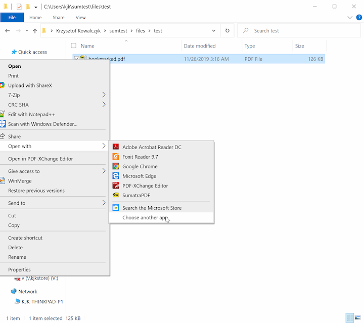

From the list, choose `SumatraPDF` and check `Always use this app to open .pdf files`:

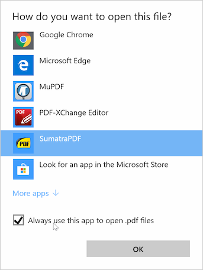

## Using Default apps system settings

This is based on latest Windows 11 build at the time of this writing.

Unfortunately the details differ between Windows updates.

Launch `Default app` section in settings app, e.g. use `Windows logo` hot-key to launch system-wide search, type `default apps` and click on `Default apps` search result to launch settings app.


In Default apps type `.pdf` for file extension:

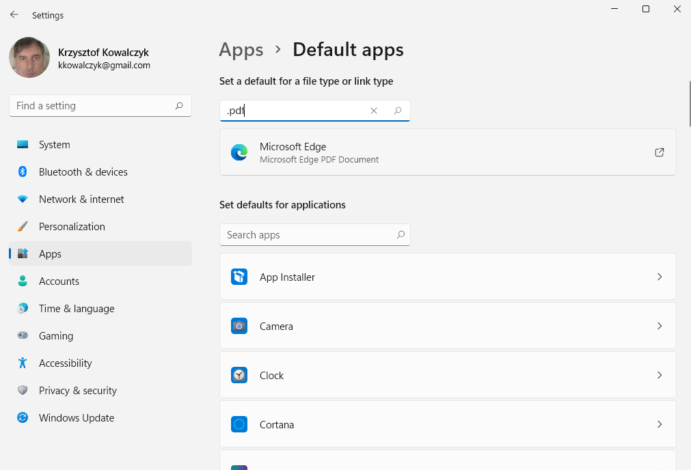

Click on current default PDF application (`Microsoft Edge` in this example) and select `SumatraPDF`:

You can do that for other file formats.

::Configure-for-restricted-use.md
# Configure for restricted use

SumatraPDF can be configured for restricted use.

A restricted mode is useful if you want to use SumatraPDF as a bundled viewer for your program's documentation or in kiosk mode

In restricted mode some actions that are not appropriate in such context are disabled:

- opening new files
- launching URLs from within PDF document
- text and image selection
- printing
- changing default settings
- saving to disk
- automatic and manual update checks
- a history of recently opened files
- TeX preview support
- registering as a default PDF viewer
- opening with Adobe Acrobat
- e-mailing PDF

To restrict SumatraPDF put file `sumatrapdfrestrict.ini` in the same directory where `SumatraPDF` is.

Here's a [full documentation of available options](https://github.com/sumatrapdfreader/sumatrapdf/blob/master/docs/sumatrapdfrestrict.ini).

To disable only auto-detected URL, email, and plain-text DOI links in PDF text (not embedded hyperlinks), use `DisableAutoLinks` in normal [advanced settings](Advanced-options-settings.md) instead — see [Hyperlinks](Hyperlinks.md).

::Customize-eBook-UI.md
# Customize eBook UI

EPUB, MOBI, FB2, and similar formats use SumatraPDF's **eBook UI** (HTML-based layout). Since **version 3.4** the engine is MuPDF-based: text selection, in-document search, and bookmarks work much like PDF.

## What you can customize

Open **Settings → Advanced Options...** and edit the `EBookUI` section:

```
EBookUI [
    FontSize = 0
    LayoutDx = 0
    LayoutDy = 0
    IgnoreDocumentCSS = false
    CustomCSS =
    WindowBgCol =
]
```

| Setting | Meaning |
| --- | --- |
| `FontSize` | Base font size (default `8.0`; `0` = built-in default) |
| `LayoutDx` / `LayoutDy` | Virtual page width / height for reflow (defaults `420` / `595`) |
| `IgnoreDocumentCSS` | Ignore stylesheet from the EPUB (`true` = your `CustomCSS` wins) |
| `CustomCSS` | Extra CSS rules — often paired with `IgnoreDocumentCSS = true` |
| `WindowBgCol` | Canvas background around the reflowed text (**ver 3.7+**) |

Full field reference: [Advanced options / settings](Advanced-options-settings.md).

## Themes and invert colors

UI themes (`Theme = ...` in advanced settings) change window chrome. To change how the **document** looks:

- **`Shift + I`** (`CmdInvertColors`) toggles the `DocumentColorsFollowTheme` advanced setting between `off` and `smart` for MuPDF-rendered documents (PDF-style and ebook pages through the shared color path). `smart` recolors text and background but preserves images; `legacy` recolors images too (pre-3.7 behavior).

For dark reading without crushing photos, experiment with `CustomCSS` (dark background, light text) and `IgnoreDocumentCSS = true` instead of global invert. See [Customize theme colors](Customize-theme-colors.md).

## Continuous vs paged view

Use the same view commands as PDF: `c` toggles continuous mode; `Ctrl + 6` / `7` / `8` change column layout. See [Scrolling and zooming](Scrolling-and-zooming.md).

## Search and navigation

- In-document find: `Ctrl + F`, `F3` — see [Finding text](Finding-text.md)
- Table of contents: `F12` or command palette `*` prefix
- Internal links: click to follow; `Alt + Left` to go back

## Known limitations

Report issues in [discussions](https://github.com/sumatrapdfreader/sumatrapdf/discussions) or the [issue tracker](https://github.com/sumatrapdfreader/sumatrapdf/issues).

- **Vertical writing** (some Asian EPUBs): may not detect top-to-bottom / right-to-left layout correctly.
- **CSS features**: not every EPUB3 layout feature is supported; complex fixed-layout EPUBs may look wrong.
- **`ReloadModifiedDocuments`**: auto-reload when the file changes on disk does not apply to eBook UI documents.
- **Thumbnails in Explorer** for `.epub`: limited compared to PDF — see installer `-with-preview` in [Installation](Installation.md).

## CHM files

CHM uses a separate `ChmUI` section. Set `ChmUI.UseFixedPageUI = true` to render CHM with the PDF-style fixed-page engine instead of the HTML ebook engine.

## See also

- [Supported document formats](Supported-document-formats.md)
- [FAQ](FAQ.md) — dark mode / invert questions
- [Advanced options / settings](Advanced-options-settings.md)
::Accessibility.md
# Accessibility

SumatraPDF provides several accessibility-related features. Maturity varies by feature.

## Read Aloud

**Read Aloud (TTS)** — read document text with Windows text-to-speech, word highlight, playback bar, and pause / continue / stop — is documented in [Read Aloud (TTS)](Read-Aloud.md).

## Screen readers (UI Automation)

SumatraPDF exposes a [UI Automation](https://learn.microsoft.com/en-us/windows/win32/winauto/uiauto-uiautomationoverview) tree so screen readers (Microsoft Narrator, NVDA, and other UIA clients) can access document text on the canvas.

### Microsoft Narrator

1. Start **Narrator** (Windows built-in, `Win+Ctrl+Enter`).
2. Open a document in SumatraPDF.
3. Move focus to the document canvas and navigate / select text — Narrator should read document content via the UIA text pattern.

**Supported document types for UIA:** PDF, XPS, DjVu (engines that expose extractable page text).

**Known issue:** Narrator sometimes stops reading until you switch focus to another window and back.

### Other screen readers (NVDA, JAWS, …)

Any client that uses Windows UI Automation can query the same document tree. NVDA and JAWS are not exhaustively tested for every document; feedback welcome in [discussions](https://github.com/sumatrapdfreader/sumatrapdf/discussions) or issues.

**Tips:**

- Prefer documents with real text (not scan-only image PDFs). Scanned pages need OCR elsewhere.
- Standard UI (menus, toolbar, TOC, bookmarks) uses native Windows controls and is generally readable by screen readers even without canvas UIA.
- Built-in [Read Aloud](Read-Aloud.md) is a separate, app-driven TTS path — useful when you want continuous reading with word highlight, but it is not a full screen-reader substitute.

### Plugin

Accessibility is **not** enabled in the SumatraPDF browser plugin.

## Keyboard-only use

Many actions are available without a mouse — see [Keyboard shortcuts](Keyboard-shortcuts.md), [Command Palette](Command-Palette.md), and [Finding text](Finding-text.md) (important for users who cannot use function keys without `Fn`).

## See also

- [Read Aloud (TTS)](Read-Aloud.md)
- [FAQ](FAQ.md)
- [Commands](Commands.md)

# Technical documentation

For SumatraPDF developers — UIAutomation element structure when a document is loaded:

```
Window
 |-> FragmentRoot
     Name: "Canvas"
     ControlType: UIA_CustomControlTypeId
      |
      |-> Fragment
          Name: [filename]
          ControlType: UIA_DocumentControlTypeId 
          NativeWindowHandle: 0
          Patterns: ITextProvider
            |
            | -> Fragment
            |    Name: "Page 1"
            |    Patterns: IValueProvider
            -
            -
            |
            | -> Fragment
                 Name: "Page n"
                 Patterns: IValueProvider
```

When no document is loaded:

```
Window
 |-> FragmentRoot
     Name: "Canvas"
     ControlType: UIA_CustomControlTypeId
      |
      |-> Fragment
          Name: "Start Page"
```

::How-we-store-settings.md
# How we store settings

## Where we store settings

Persisted data is stored in `SumatraPDF-settings.txt` file.

In portable version the file is stored in the same directory as SumatraPDF executable. In non-portable version, it's in `%LOCALAPPDATA%\SumatraPDF` directory.

Starting with version 1.6 we also persist thumbnails for "Frequently read" list. They are stored in subdirectory `sumatrapdfcache` as `.png` files.

Override the directory with `-appdata <path>` on the command line — see [Installation](Installation.md).

See [https://www.sumatrapdfreader.org/settings/settings](https://www.sumatrapdfreader.org/settings/settings) for information about all the settings.

## How settings apply

Not every setting works the same way. Understanding the three layers avoids "I changed it but nothing happened" confusion.

### 1. Global defaults (first open)

Settings like `DefaultDisplayMode` and `DefaultZoom` in [advanced settings](Advanced-options-settings.md) apply when you open a document **for the first time** — when there is no saved state for that file yet.

The **Settings → Options** dialog ("remember these settings for each document") writes global defaults into the same settings file. They do **not** retroactively change files you have already opened.

### 2. Per-document state (reopen)

When `RememberStatePerDocument = true` (default), SumatraPDF saves display settings per file in the `FileStates` section: zoom, scroll position, view mode, sidebar width, tab color, etc.

The next time you open that file, **saved state wins** over global defaults. This is why changing "default two-page view" does not affect a PDF you have opened before — see [FAQ](FAQ.md).

To reset one file: delete its `[[FileStates]]` block from the settings file, or delete the entire settings file to reset everything.

### 3. Restart-required settings

Some settings apply only after restarting SumatraPDF:

- `UseTabs` — tabbed vs separate windows for **new** windows
- Others noted in [advanced settings](Advanced-options-settings.md) (e.g. some UI layout options)

`ReuseInstance` and most color/theme changes take effect immediately or on the next file open.

### Session restore

| Setting | Effect |
| --- | --- |
| `RestoreSession = true` | On startup, reopen tabs and window layout from `SessionData` |
| `RememberOpenedFiles = true` | Track history for Home / `#` command palette |
| `LazyLoading = true` | When restoring session, load tab content only when the tab is selected |

`-for-testing` skips restore and does not save settings.

### What is not in the settings file

- **Unsaved annotations** — kept in memory until you save or discard; see [Editing annotations](Editing-annotations.md)
- **Installer / restrict policy** — `sumatrapdfrestrict.ini` beside the executable; see [Configure for restricted use](Configure-for-restricted-use.md)

## Reset to defaults

Delete `SumatraPDF-settings.txt`. SumatraPDF recreates it on next launch with factory defaults.

## See also

- [FAQ](FAQ.md)
- [Tabs and windows](Tabs-and-windows.md) — `UseTabs`, `ReuseInstance`, `RestoreSession`
- [Advanced options / settings](Advanced-options-settings.md)
::Installer-cmd-line-arguments.md
# Installer cmd-line arguments

To get list of options run the installer with `-help`.

Available options:

- `-install` : this triggers installation
- `-s`, `-silent` : silent installation, doesn't show UI
- `-d <directory>` e.g. `Sumatra-install.exe -install -d "c:\Sumatra PDF"`
    set directory where program is installed. The default is `%LOCALAPPDATA%\SumatraPDF` or `%PROGRAMFILES%\SumatraPDF` with `-all-users`
- `-x` : don't install, extract the files
    extracts files to current directory or directory provided with `-d` option
- `-with-filter` : install search filter
- `-with-preview` : install shell preview for PDF files
- `-uninstall` : uninstalls SumatraPDF

**Ver 3.2+**

- `-log`
writes installation log to `%LOCALAPPDATA%\sumatra-install-log.txt`. At the end of installation will open the log file in notepad.

**Ver 3.4+**

- `-all-users` : installs system-wide, for all users
installs to `%PROGRAMFILES%\SumatraPDF` and writes to `HKLM` registry

**Ver 3.6+**

- `-fast-install` : internal for auto-update, automatically starts installation with default options, starts the app when installation is finished

::Uninstalling-SumatraPDF.md
# Uninstalling SumatraPDF

## Are you using official Sumatra build?

Did you download Sumatra from [official Sumatra website](https://www.sumatrapdfreader.org/download-free-pdf-viewer)?

If not, we can't help you because we didn't create the software you're using.

## Uninstalling Sumatra

There are 2 versions of Sumatra: an installer and a portable version (zipped executable).

## Uninstalling portable version

If you're using zipped executable, the only thing you need to do is to delete SumatraPDF.exe.

## Uninstalling the installer version

If you installed SumatraPDF by running official installer, you uninstall it like every other application.

On Windows 10 / 11:

- start Settings app ([https://www.digitalcitizen.life/introducing-windows-10-ways-open-settings](https://www.digitalcitizen.life/introducing-windows-10-ways-open-settings))
- Select `Apps`
- find `SumatraPDF` on the list, click it and press `Uninstall` button:


## What if the above doesn't help?

What if you still have questions? You can use [Discussions](https://github.com/sumatrapdfreader/sumatrapdf/discussions) to ask for additional help.

However, in order for someone to help you, you need to provide the following information:

- Sumatra PDF version you're using
- your OS (Windows) version
- did you download an installer or zipped executable?
- where did you download the Sumatra from (the url of the webpage you used to download Sumatra)?
- is there SumatraPDF directory in your program files directory (usually "c:\Program Files" or "c:\Program Files (x86)" on 64-bit systems)?
- what evidence there is that Sumatra is installed? Be precise and specific. Don't just say "there's a link to it", tell us where that link is, what is the name of the link etc.

To emphasize: if you don't provide this information, we cannot help you.
::Version-history.md
# Version history

**next: 3.7**

Available in [pre-release](https://www.sumatrapdfreader.org/prerelease) builds.

- Themes can set optional UI colors (`DisabledTextColor`, `DarkerTextColor`, `HotBackgroundColor`, `EdgeColor`, `HotEdgeColor`, `DisabledEdgeColor`, `ErrorBackgroundColor`, and notification highlight colors) so disabled and hover states are not derived only from `TextColor` / backgrounds; built-in themes (including Dracula) set them so tinted foregrounds no longer look muddy yellow (issue #4721)
- new built-in themes: **One Dark**, **Monokai**, **Nord**, **GitHub Dark**, **Catppuccin Mocha**, **Tokyo Night**, **Gruvbox**, **Night Owl**, **Ayu**, and **Palenight** (common palettes from VS Code and other editors)
- theme list cleanup: removed **Darker** (folded into **Charcoal**, the former “Dark background Bright text”); settings that still name `Darker` or the old long name keep working
- Screen readers (Narrator, NVDA, and other UI Automation clients) can access document text on the canvas for PDF, XPS, and DjVu; the experimental UIA provider is now enabled in release builds, not only debug (issue #321)
- smoother mouse-wheel scrolling when `SmoothScroll` is enabled (default **true**): continuous exponential chase of the target, sub-pixel steps, 1 ms timer while animating; set `SmoothScroll = false` for instant wheel steps
- Favorites can open as a full-window tab so long paths and names use the whole window; the sidebar Favorites panel still works independently. The sidebar Favorites/ToC width can also be dragged past half the window (keeps ~200px for the document)
- Favorites list has a search box (like Bookmarks), in both the sidebar panel and the Favorites tab
- Favorites can be sorted alphabetically by name (or page label) within each file instead of by page number: `SortFavoritesByName = true`, or the **Sort By Name** checkbox in the Favorites tree context menu (fixes #2277)

- fix UI (tabs, toolbar, bookmarks/favorites trees, caption) not rescaling when moving the window between monitors with different DPI/scaling (issue #5827)
- PDF bookmark / link destinations now apply Adobe-style view modes (`/Fit`, `/FitH`, `/FitV`, `/FitB`, `/FitBH`, `/FitBV`, `/XYZ` zoom) instead of only jumping to the page (fixes #5828)
- fix Advanced Settings list jumping scroll position on the first click after open or filter change (fixes #5829)
- Bookmarks sidebar: **Collapse All** expands a single top-level root one level when that is all the outline has (typical Word-export TOC), and the context menu has **Expand to Level 1/2/3** for explicit depth control (fixes #5239)
- Bookmarks context menu **Collapse Same Level** collapses every outline entry that shares the parent of the selected/clicked item (siblings at that nesting level) (fixes #1895)
- FB2 document properties (`Ctrl+D`) now show the book annotation from `title-info` as Subject (fixes #2254)
- fix portable self-update failing to replace the running exe when installing from the update dialog
- new `Advanced Settings...` dialog (`Ctrl + K` command palette): a filterable list of the advanced settings where you can toggle booleans, pick enum values from a drop-down and edit strings, colors and numbers in-place, then `Save`. Replaces the per-setting toggle commands (`CmdToggleSmoothScroll`, `CmdToggleEscToExit`, `CmdToggleReuseInstance` etc.), which were removed
- can open and view Markdown documents (`.md`, `.markdown`): they render as formatted text (GitHub Flavored Markdown, including tables, task lists and strikethrough) via the rendering engine, and the installer registers the file association so they open from Explorer and drag&drop
- HEIC / HEIF still images now decode with a built-in decoder (no Windows HEIC codec required for most phone photos); AVIF still uses dav1d. The system WIC path remains as a fallback if built-in decode fails
- Read Aloud: adjustable playback speed — pick 0.5x .. 3x in the new `Speed` submenu (next to `Voice` in the Read Aloud menu, toolbar dropdown and context menu) or click the speed button on the playback bar to cycle presets (right-click cycles backwards); the speed persists across sessions via the `ReadAloudSpeed` advanced setting
- updated the bundled MuPDF rendering engine to 1.28.0
- add [AI Chat with document](AI-Chat-with-document.md) sidebar (in View menu and `Ctrl + k` [command palette](Command-Palette.md)) for asking questions about the open PDF or image via [Claude Code](https://docs.anthropic.com/en/docs/claude-code); per-tab session state, model/effort selection, and session history from `~/.claude/projects/`
- add `ClaudeCode` advanced settings (`Model`, `Effort`, `SkipPermissions`, `BgColor`, `SidebarDx`) in `SumatraPDF-settings.txt`
- auto-link plain-text DOIs in PDF text (e.g. `10.1109/WICSA.2015.29` opens `https://doi.org/...`); uses the same auto-detect path as URLs and email addresses
- add `DisableAutoLinks` advanced setting to disable auto-linking of URLs, email addresses, and plain-text DOIs found in PDF text (fixes #5703)
- add `ShowDocumentFocusIndicator` advanced setting: when true, draws a focus ring around the document when it has keyboard focus (Tab to the page area); off by default (fixes #4644)
- add `ShowAnnotationNotification` advanced setting: when false, disables the tip shown when hovering an annotation (e.g. "Highlight annotation. Ctrl+click to edit."); on by default (fixes #4501)
- `TabWidth` advanced setting is now DPI-scaled so it takes effect on HiDPI / high-scaling displays (fixes #3850)
- Bookmarks sidebar shows page numbers (labels) right-aligned on each entry; disable with `ShowTocPageNumbers = false` (fixes #3288)
- page-info tip (`I` key) is preserved across tab switches and visits to the Home page (fixes #4454)
- page-info tip shows extra detail for images: comics / image folders list the current image file name and size (both pages when two are visible in facing view); a single image file shows pixel resolution, size, and DPI when it is not the default 96 (fixes #4456)
- `-new-window` with several file arguments opens one new window containing all files as tabs, instead of a separate window per file (fixes #5044)
- Manga mode (R2L): Left/Right arrows and horizontal swipe reverse so Left advances and Right goes back, matching right-to-left reading (fixes #3964)
- starting a search (Ctrl+F) remembers the current page as favorite `/` so you can jump back via Favorites or the command palette `$` mode (fixes #5726)
- PDFs with a Catalog `/OpenAction` GoTo destination open at that page on first load (when there is no remembered view); URI/Launch/JavaScript open actions are ignored (fixes #1631)
- add `PaddingAfterLastPage` advanced setting: when true, continuous view has extra scroll room after the last page so you can bring the end of the document up (e.g. when the window is partly covered); off by default (fixes #411)
- document properties page size shows cm, mm, in (locale unit first) and pixels, e.g. `21.0 x 29.7 cm, 210 x 297 mm, 8.27 x 11.69 in, 595 x 842 px` (fixes #2186)
- Zoom menu shows the current level (radio/check mark) when using custom `ZoomLevels` and zooming with +/- (fixes #5832)
- fix EPUB/reflow images that vanished when publisher CSS set `img { width: 100%; height: 100%; }` (default user CSS forces `height: auto` and `max-width: 100%`) (fixes #5805)
- the `FixedPageUI.SelectionColor` advanced setting now honors an alpha channel: set an `#aarrggbb` value (e.g. `#40f5fc0c`) to make the text-selection overlay more transparent so selected text stays crisp instead of looking washed out; `#rrggbb` keeps the previous default opacity (fixes #3209)
- middle-click auto-scroll is now smooth: it's driven by a high-frequency timer with fractional-pixel accumulation instead of a coarse 20ms timer with integer steps, so it no longer looks choppy (also enables fine, slow scroll speeds) (fixes #2693)
- associated file types now show their localized name in Explorer's "Type" column on non-English Windows; previously registration hardcoded an English name like "PDF File", overriding the name Windows would localize (fixes #3323)
- expand the table of contents tree down to the current page's entry and select it, like Explorer's "Expand to current folder" (in the Bookmarks sidebar right-click menu and the `Ctrl + k` command palette) (fixes #1998)
- Save As now warns instead of failing silently when a file can't be written (e.g. the destination path exceeds the Windows `MAX_PATH` limit); previously there was no way to tell the save hadn't happened (fixes #1016)
- can convert an image to a PDF: right-click an image (or an open image document) and choose `Image / Convert to PDF`, or pick `PDF` in the format drop-down of the Save Image dialog. The new PDF gets `CreationDate`/`ModDate` metadata with the current time and time zone (fixes #949)
- in the Favorites pane and menu, a favorite for a file with a long name now shows your favorite's name first, then the file name, so the name you gave it is no longer pushed out of view (fixes #829, #2236)
- case-insensitive search now treats German ß as equivalent to `ss`, so searching `Strasse` finds `Straße` and vice versa (fixes #933)
- hovering a thumbnail on the Frequently Read home page now shows a ✕ button in its top-right corner to remove that document from the list, without going through the right-click menu (fixes #283)
- the home page document history can be shown as a list instead of thumbnails (toggle buttons next to the header, or the `HomePageViewMode = thumbnails | list` advanced setting). Each list row shows a small preview, the file name, the file's directory (right-aligned, muted), the file size, and remove/pin buttons (fixes #4909)
- the start page can be a library of your books instead of the Frequently Read list: a wall of cover art (taken from the file itself, or fetched online when the file has none) with a sidebar listing the series it found. Folders are a hint, not the rule: a folder holding one series becomes that series (a box set and its spin-offs nest under the parent), while a folder that just holds other series (`Books`, `manga`, `ebooks`...) is skipped. Books that sit loose on disk are grouped by the names they actually carry - a repeated title phrase that is distinctive within your library (weighted by how rare it is, so `Make` or `The MagPi` groups a series while `Raspberry Pi`, which twenty unrelated books share, does not), plus character-level similarity for run-together filenames - and each series is named with the wording printed in the books themselves. A book that belongs to nothing is listed under its own title. Order the list with the `Sort` buttons - `A-Z`, `Genre`, `Most` books first or `Fewest` first - and the choice is remembered (`Audiobook.LibrarySort`). The series list and the cover wall each have their own scrollbar, shown whenever there is more to see; both scroll with the wheel under the pointer, and the scrollbar can be dragged or clicked to jump. You can also make your own **partitions** to sort books into: right-click any series, book or cover for `Move to partition` and either pick an existing one or make a new one, and the series nests under it the way a box set nests under its parent. Once two things are in a partition it works out what they have in common and files the rest of the matching books there on its own. It weighs two kinds of evidence apart and takes a book when either one is convincing: what the books are **called** - a distinctive word they carry, weighted by how rare it is in your library - and what the books **are** - the author, the catalogue subjects, the shelf they were sorted onto, and the make-up of their pages. So putting `Official Raspberry Pi Projects Book` and `Exploring Raspberry Pi` into one partition pulls in the other twenty Raspberry Pi books but leaves Kali Linux and grep/sed/awk where they are, while a partition of comics fills itself from the pages rather than from any word. The broad signals - page make-up and shelf - only start counting once five books are in by hand, so a two-book partition cannot decide that it means all of computing. If what you put in shares nothing distinctive it says so and files nothing rather than guessing. Hovering a row that it filed says which word it went on, `Take out of ...` puts it back and it stays out, and partitions survive a rescan. `Genre` groups the series under a genre and sub-genre heading worked out from each book's catalogue subjects, while comics and manga are recognised from the pages themselves (a page that is one full-bleed picture with almost no text), so format and subject stay apart: story comics shelve under `Comics & Manga`, but a comic or manga about a subject shelves under that subject, e.g. `Computing / Manga`. Click a cover to open the book where you left off, click its title for the book's page: author, year, page count, blurb, subjects and a chapter list (an omnibus nests its chapters under each book, and any chapter opens the book at that page). The book page also shows what the BookNLP analyser found — characters, families, places, and a *Who knows what* subject list where picking a subject lists everyone who knows about it, with the book and page it was learnt in — plus the films and TV series adapted from the book, each opening its IMDb page. Right-click a cover for **Open book from last page read**, **Open book from beginning** and **Play as Audio Book**. Turn it on in the View menu (`Library start page`, `CmdToggleLibraryHome`) and point it at your books with the `Audiobook.LibraryRoots` advanced setting; `Rescan the library` (`CmdLibraryRescan`) looks for newly added books
- new zoom mode `Fit by Orientation` (in the View / Zoom menu) that automatically fits width when the view is landscape and fits page when portrait, updating as you resize the window or rotate the screen (fixes #702)
- new zoom mode `Fit Height` (View / Zoom menu and command palette): scales the page so its height fills the window (width may require horizontal scrolling) — useful for landscape pages on portrait screens and for mixed page widths with a stable vertical size; also accepted as `-zoom fitheight` / advanced setting `fit height` and DDE zoom `-6` (fixes #1714)
- add `sumatrapdf-tool.exe` command-line tools for PDF manipulation (see [Tools](Tools.md))
- [command palette](Command-Palette.md) has a new `*` mode that jumps to a table of contents entry of the current document (`Shift + F12`). Shows the fully expanded outline, indented by nesting level, with the entry closest to the current page pre-selected (fixes #5676)
- [command palette](Command-Palette.md) has a new `$` mode that jumps to a favorite, listing the current document's favorites first, then favorites of other documents
- [external viewer](Customize-external-viewers.md) command lines now support `%%` as a literal `%`, so e.g. `%%d` is passed to the program as `%d` (fixes #5583)
- with `ReuseInstance`, opening a file now reuses a window on the current virtual desktop (or opens a new window there) instead of switching to a window on another desktop (fixes #5630)
- add Back / Forward navigation buttons to the toolbar; navigation history now also records views you scrolled to and stayed on, not just table of contents / link jumps
- improved overlay scrollbar
- make thumbnails on home page scrollable
- add ability to register / unregister Windows preview handler and search filter from `Ctrl + k` command palette
- set a custom color for a document's tab from the tab right-click context menu
- compress, decompress, encrypt, decrypt, bake, delete pages from, and extract pages from PDF files (via `Ctrl + k` [command palette](Command-Palette.md))
- extract text from document pages to a .txt file (via `Ctrl + k` [command palette](Command-Palette.md))
- read text aloud using Windows text-to-speech: toolbar, main menu, and context menu **Read Aloud (TTS)** submenus with **Start Reading From Top** (viewport through end of document), **Start Reading Selection**, **Start Reading From Cursor Position** (context menu), pause / continue / stop, a playback bar on the canvas showing the document name, current page, and scope, word highlight while speaking, and a **Voice** submenu; chosen voice is remembered via the `ReadAloudVoiceId` advanced setting
- add `ToolbarText` and `ToolbarSvgIcon` parameters for `ExternalViewers` advanced setting to show external viewer as a toolbar button with text or an SVG icon (fixes #5741)
- move `Scrollbars` advanced setting from `FixedPageUI` to top-level
- toolbar has a new `overlay` mode: the toolbar floats over the page (sized to its natural width and centered) and is only revealed when the mouse moves near it. Set it with the new top-level `Toolbar = show | hide | overlay` advanced setting; `F8` (Toggle Toolbar) now cycles show → overlay → hide instead of just toggling show/hide
- the toolbar can be placed at the top or bottom of the window via the new `ToolbarPosition = top | bottom` advanced setting (works in both show and overlay modes)
- DjVu documents can be rendered with a new built-in plain-C decoder (`ext/djvudec`) instead of libdjvu. Choose it with the new `DjvuEngine = djvudec | libdjvu` advanced setting (defaults to `djvudec`); toggle and reload the current document with the `CmdToggleDjvuEngine` command (`Ctrl + k` command palette)
- add `EBookUI.BackgroundColor` advanced setting to override background color for ebook documents (epub, mobi etc.)
- add `ComicBookUI.BackgroundColor` advanced setting to override the default black background for comic book files
- add `ImageUI.BackgroundColor` advanced setting to override the default black background for image files
- background color settings (`FixedPageUI.BackgroundColor`, `EBookUI.BackgroundColor`, `ComicBookUI.BackgroundColor`, `ImageUI.BackgroundColor`) accept `checkered` value to show a checkerboard transparency pattern
- change document background color per-file or for all files of the same type (via `Ctrl + k` [command palette](Command-Palette.md))
- `Ctrl + click` on a PDF link opens it in a new tab (instead of navigating in the current tab)
- you can now drag&drop selected text to another application, like a text editor
- triple-click selects the whole line of text (double-click still selects a word) (fixes #694)
- fix `ExternalViewers` `CommandLine` parsing mangling quotes (e.g. `-t="Hello World"` became `"-t=Hello World"`); the command line is now passed through with the user's quoting preserved, only substituting `%1`/`%p`/`%d` (fixes #5695)
- fix `-print-settings paper=A3` (and other standard sizes) when the printer driver reports a longer paper name such as `A3 297 x 420 mm` (fixes #5632)
- add `stretch` page scaling (and a matching "Stretch pages to fill paper" option in the Advanced print dialog) that fills the paper in both dimensions, ignoring the aspect ratio (fixes #2220)
- add "Center page horizontally on the paper" option to the Advanced print dialog, to center a page smaller than the paper (fixes #348)
- add "Choose paper source by document page size" option to the Advanced print dialog, to let the printer pick the input tray whose paper matches the page (fixes #349)
- add "Print each page at its document page size" option to the Advanced print dialog, to correctly print documents with mixed page sizes (fixes #533)
- use the file name (not the full path) as the print job name, which some printer drivers couldn't handle for long or non-ASCII paths (fixes #2166)
- command-line printing now honors print defaults embedded in a PDF's `ViewerPreferences` (`PrintScaling`, `NumCopies`, `Duplex`, `PickTrayByPDFSize`); explicit `-print-settings` values override them, and `ignore-pdf-print-settings` disables them (fixes #534)
- command-line printing (`-print-to` / `-print-to-default`) now returns a distinct process exit code per failure category (file not loadable, printing not allowed, printer not found, driver failed, etc.) instead of a plain success/failure, so unattended callers can tell why a print failed (fixes #3478)
- can set a default for the print dialog's Collate checkbox via the new `PrinterDefaults.Collate` advanced setting (fixes #1558)
- add a "Rotate printout" option to the Advanced print dialog, to rotate the printout and fix a wrong orientation (e.g. upside-down output on virtual printers like XPS / Print to PDF) (fixes #1246)
- implement the `[GetFileState]` [DDE command](DDE-Commands.md) to query a document's path, zoom, view mode and version; also fixes a crash and broken/empty replies in the DDE request path on 64-bit (fixes #483)
- `[GetFileState]` also returns the current page and page count, and a new `[GetOpenFiles]` DDE request returns the paths of all open documents (fixes #5060)
- add `[GetMousePos]` DDE request returning the document position under the mouse cursor in PDF points (the `.smx` unit), for external annotation tools (fixes #1411)
- `[SetView]` DDE command now accepts a zoom of `0` to keep the current zoom; previously, scrolling via `SetView` while passing a Fit zoom re-fit the page and jumped the scroll position to the next page (fixes #5068)
- toggle commands (`CmdToggleFullscreen`, `CmdTogglePresentationMode`, `CmdToggleToolbar`, `CmdToggleMenuBar`, `CmdToggleContinuousView`, `CmdToggleTableOfContents`/`CmdToggleBookmarks`) accept an optional `state` argument to force an on/off state instead of toggling, e.g. `[CmdToggleFullscreen on]` (fixes #5067); also fixes parsing of boolean command arguments (`off`/`no`/`0` and `on` are now recognized)
- add `[GotoPageWord]` [DDE command](DDE-Commands.md) to go to a page and select a search term only if it's on that page (a page-constrained search, unlike `[Search]` which wraps); also documented the existing `[Search]` DDE command (fixes #3085)
- fix EXIF orientation ignored for JPEG and WebP images (fixes #1544)
- move `DefaultImageZoom` advanced setting to `ImageUI.DefaultZoom`, default to `shrink to fit`
- improve Toggle Use Tabs: you can now transition between using tabs / not using tabs without restarting the app
- allow showing menu bar when using tabs (previously menu bar was only shown when not using tabs)
- capture screenshots of the desktop and all visible windows, saved as PNG files in `Screenshots` sub-directory of SumatraPDF data directory (global hotkey e.g. PrtSc requires a Shortcuts entry)
- you can drag&drop images from a browser onto SumatraPDF window. We'll download it to Downloads folder and open
- crop and resize images when viewing image files
- `Ctrl + V` pastes image from clipboard, saves as PNG in Downloads folder and opens it
- Can save images in different formats: PNG, JPEG, BMP, GIF, TIFF.
- add `Fullscreen` advanced setting with `ShowToolbar` and `ShowMenubar` options to show toolbar and menu bar in fullscreen mode. Use `F9` / `F8` to toggle them while in fullscreen
- add `Show Errors` in right-click context menu for PDF documents that have mupdf warnings/errors
- replace `HideScrollbars` and `UseOverlayScrollbar` settings with `Scrollbars` setting (values: `windows`, `smart`, `overlay`, `hidden`)
- save and restore groups of tabs; saved groups are persisted in `TabGroups` advanced setting
- add `Shrink To Fit` zoom mode: shows at 100% if page is smaller than view area, otherwise fits page
- add `TabsMru` advanced setting to change order of navigating tabs when using `Ctrl + Tab`
- improve document properties for comic book files (CBZ, CBR, CB7, CBT). We now show list of image files and per-image EXIF metadata
- improve document properties for image files: size, dimensions, DPI, exif metadata
- support encrypted .cbz, .cbr files
- you can drag&drop images from PDF documents to other applications (web apps, image editors, file explorer etc.)
- pen/stylus input now works for text selection on Windows tablets
- fix Edit Annotations window not restoring to the correct monitor in multi-monitor setups
- use `GetFileAttributesEx` instead of opening files for change detection on network drives, avoiding Windows Defender re-scans
- fix toolbar page number misalignment when `PrinterAccess` is revoked in `sumatrapdfrestrict.ini`
- add citation/reference hover preview: hovering an internal-document link (e.g. a `[1]` citation, figure reference, or footnote marker) now shows a small popup rendering the destination region, so you can see the bibliography entry / figure / footnote without leaving the current page. The `CitationHoverDelay` advanced setting sets the hover delay in ms (-1 disables the popup) (fixes [#128](https://github.com/sumatrapdfreader/sumatrapdf/issues/128), [#4221](https://github.com/sumatrapdfreader/sumatrapdf/issues/4221))
- translate selected text with Grok Build, Claude Code, or OpenAI Codex when the corresponding CLI is installed (selection context menu); opens a dialog to edit the text, pick source and destination languages, and show the translation inline
- add a **Match whole word** toggle to the Find bar (next to **Match Case**) so a search only matches complete words, e.g. `cat` no longer matches `category` (fixes #4295)
- when searching, the **current** match is now highlighted with the customizable `FixedPageUI.SelectionColor` (the color users tune to be most noticeable) and all other matches use a secondary orange highlight, so the active match is easier to spot; previously it was the other way around (fixes #5740)
- find-as-you-type now waits briefly after you stop typing before searching (500 ms, or 1 s for 1–2 character terms) instead of searching on every keystroke; pressing Enter searches immediately (fixes #4626)
- add **Go to Next/Previous Favorite** commands (`Ctrl + k` command palette) that jump to the nearest favorite (bookmark) page after / before the current page (fixes #3744)
- can paste an image from the clipboard into a PDF as an image stamp annotation: right-click → **Create Annotation Under Cursor** → **Image From Clipboard** (or the `Ctrl + k` command palette). The stamp is created at the click point, sized to the image, and immediately selected so it can be moved/resized
- text in some PDFs that use embedded subset fonts naming glyphs like `G45` (with no `ToUnicode` map) is now extracted and searchable: previously such text came out as `�` and couldn't be found (e.g. searching "Emergency" failed). mupdf now recovers Unicode from those glyph names the way pdf.js does (fixes #3219)
- add `AllowExternalImages` advanced setting (off by default): when on, a PDF may display an image stored in a separate file referenced by name (an "external image stream"); the file must sit next to the PDF. Off by default for security, matching Acrobat (fixes #3731)
- add **Set Inverse Search Command Line** (`Ctrl + K` [command palette](Command-Palette.md)): opens a standalone dialog to configure the SyncTeX inverse-search command (with detected TeX editors in a drop-down and a Help link to [LaTeX integration](LaTeX-integration.md)); OK saves `InverseSearchCmdLine` and enables TeX enhancements, Cancel leaves settings unchanged. Works from the home page without an open document
- one-click light/dark theme switching: **Toggle Light/Dark Theme** (`Ctrl + K` command palette) flips between the last used light and dark themes (remembered in the new `LastLightTheme` / `LastDarkTheme` advanced settings). Setting `Theme = System` makes SumatraPDF follow the Windows light/dark app mode, switching automatically when the OS does. Inspired by the [SumatraPDF Plus](https://github.com/dengxibo/sumatrapdf-plus) fork
- caption (title bar) minimize/maximize/restore/close buttons are drawn with Windows 11 style rounded glyphs (Segoe Fluent Icons outlines), DPI-scaled (from the [SumatraPDF Plus](https://github.com/dengxibo/sumatrapdf-plus) fork)
- new built-in **Light Warm** theme: a warm, paper-like "eye-care" chrome palette (from the [SumatraPDF Plus](https://github.com/dengxibo/sumatrapdf-plus) fork; their Dracula and pure-black dark palettes already exist here as the `Dracula` and `Dark` themes)
- smarter inverted (dark) page rendering for MuPDF documents (PDF, XPS, EPUB, MOBI, FB2, HTML, etc.): the `DocumentColorsFollowTheme` advanced setting (also via **Set Document Colors Follow Theme** in the `Ctrl + K` command palette and the **Change Theme** dialog) picks how page colors follow the UI theme: `off` (keep original page colors, the default), `smart` (recolor text and background but not images; **Invert Colors** / `Shift + I` toggles between `off` and `smart`), or `legacy` (recolor text, background and images — pre-3.7 behavior). **Toggle Preserve PDF Image Colors in Dark Mode** switches image preservation for the session. Ported from the [SumatraPDF Plus](https://github.com/dengxibo/sumatrapdf-plus) fork
- a small floating toolbar pops up after selecting text, with the most common selection actions: **Copy**, **Read Aloud**, **Highlight**, **Underline**, **Squiggly**, **Strike Out** (annotation buttons only for documents that support annotations). Disable it with the new `SelectionToolbar` advanced setting. Ported from the [SumatraPDF Plus](https://github.com/dengxibo/sumatrapdf-plus) fork
- clearer rendering of CAD / engineering-drawing PDFs: hairline strokes get a zoom-aware minimum width and typical CAD-export grays are darkened toward Acrobat-like contrast, so drawings stay readable when zoomed out. Applied automatically when a drawing is detected (PDF/E marker, CAD authoring tool in the metadata, or content heuristics; screenshot/raster and WPS-style hairline exports are handled too); control it with the `EngineeringDrawingEnhance` advanced setting (`off` / `auto` / `on`) or per document with **Toggle Engineering Drawing Enhancement** (`Ctrl + K` command palette). Ported from the [SumatraPDF Plus](https://github.com/dengxibo/sumatrapdf-plus) fork

**New commands:**

- `CmdAIChatWithClaudeCode` : "AI Chat"
- `CmdChangeBackgroundColor` : "Change Background Color"
- `CmdChangeScrollbar` : "Change Scrollbar"
- `CmdCommandPalette *` : command palette table-of-contents mode (`CmdCommandPaletteTOC`, `Shift + F12`)
- `CmdCommandPalette $` : command palette favorites mode (`CmdCommandPaletteFavorites`)
- `CmdCommandPaletteFavorites` : "Command Palette: Favorites"
- `CmdContinueReadAloud` : "Continue Reading"
- `CmdFavoriteShowInTab` : "Show Favorites in Tab" — full-window Favorites tab (sidebar Favorites still works)
- `CmdToggleFavoritesSort` : "Sort Favorites By Name" — Favorites tree context menu checkbox; toggles `SortFavoritesByName` (fixes #2277)
- `CmdZoomFitHeight` : "Zoom: Fit Height" — scale page height to the window (fixes #1714)
- `CmdFindToggleMatchWholeWord` : "Find: Toggle Match Whole Word" — Find bar toggle button
- `CmdGoToNextFavorite` : "Go to Next Favorite"
- `CmdNavigateFilesInFolder` : "Navigate Files in Folder" — floating directory browser for openable files (Enter/double-click opens a file or enters a directory, `..` goes up, Esc closes)
- `CmdGoToPrevFavorite` : "Go to Previous Favorite"
- `CmdCreateAnnotImageFromClipboard` : "Create Image Annotation From Clipboard"
- `CmdStopReadAloud` : "Stop Reading"
- `CmdReadAloudFromTopPage` : "Start Reading From Top"
- `CmdReadAloudSelection` : "Start Reading Selection"
- `CmdConvertImageToPdf` : "Convert Image To PDF"
- `CmdCropImage` : "Crop Image"
- `CmdDocumentExtractText` : "Extract Text From Document"
- `CmdDocumentShowOutline` : "Show Document Outline"
- `CmdExpandToCurrentPage` : "Expand TOC to Current Page"
- `CmdTocExpandToLevel1` : "Bookmarks: Expand to Level 1" — Bookmarks context menu
- `CmdTocExpandToLevel2` : "Bookmarks: Expand to Level 2" — Bookmarks context menu
- `CmdTocExpandToLevel3` : "Bookmarks: Expand to Level 3" — Bookmarks context menu
- `CmdTocCollapseSameLevel` : "Bookmarks: Collapse Same Level" — Bookmarks context menu
- `CmdListPrinters` : "List Printers"
- `CmdPauseReadAloud` : "Pause Reading"
- `CmdPdfBake` : "Bake PDF File"
- `CmdPdfCompress` : "Compress PDF"
- `CmdPdfDecrypt` : "Decrypt PDF"
- `CmdPdfDecompress` : "Decompress PDF"
- `CmdPdfDeletePages` : "Delete Pages From PDF"
- `CmdPdfEncrypt` : "Encrypt PDF"
- `CmdPdfExtractPages` : "Extract Pages From PDF"
- `CmdPdShowInfo` : "Show PDF Info"
- `CmdReadAloud` : "Read Aloud"
- `CmdRemoveDeletedFilesFromHistory` : "Remove Deleted Files From History"
- `CmdResizeImage` : "Resize Image"
- `CmdScreenshot` : "Take Screenshot"
- `CmdSetScreenshotHotkey` : "Set Screenshot Hotkey"
- `CmdSetInverseSearch` : "Set Inverse Search Command Line" — opens a dialog to configure the SyncTeX inverse-search command (`Ctrl + k` command palette)
- `CmdSetTabColor` : "Set Tab Color"
- `CmdStartAutoScroll` : "Start Auto-Scroll"
- `CmdTabGroupRestore` : "Restore Tab Group"
- `CmdTabGroupSave` : "Save Tab Group"
- `CmdToggleDjvuEngine` : "Toggle DjVu Engine" (command palette shows the target, e.g. "set to libdjvu")
- `CmdSetDocumentColorsFollowTheme` : "Set Document Colors Follow Theme"
- `CmdToggleEngineeringDrawingEnhance` : "Toggle Engineering Drawing Enhancement" — per-document override of the `EngineeringDrawingEnhance` advanced setting
- `CmdToggleLightDarkTheme` : "Toggle Light/Dark Theme"
- `CmdToggleLibraryHome` : "Toggle Library Start Page" — switch the start page between the library and the classic Frequently Read page
- `CmdLibraryRescan` : "Rescan the Library" — look for new books under the library roots
- `CmdTogglePreservePdfImages` : "Toggle Preserve PDF Image Colors in Dark Mode" — session-only toggle
- `CmdToggleWindowsPreviewer` : "Toggle Windows Previewer"
- `CmdToggleWindowsSearchFilter` : "Toggle Windows Search Filter"
- `CmdTranslateSelectionWithClaudeCode` : "Translate Selection with Claude Code"
- `CmdTranslateSelectionWithGrokBuild` : "Translate Selection with Grok Build"
- `CmdTranslateSelectionWithOpenAICodex` : "Translate Selection with OpenAI Codex"
- `CmdZoomFitByOrientation` : "Fit by Orientation"
- `CmdZoomShrinkToFit` : "Shrink To Fit"

**New command-line arguments:**

- `-for-testing` : for ad-hoc testing; always starts a new instance, doesn't restore a session, doesn't save settings
- `-dbg-control <named-pipe>` : drive automated tests over a named-pipe request/response protocol (`cmd/control.ts`)
- `-dump-chm <file>` : headlessly list CHM contents, unpack entries to memory, and print TOC/index metadata
- `-pwd <password>` : open password-protected documents from the command line (fixes #906)
- `-log-to-file <file>` : log to a specific file (like `-log` but with a custom log file path)
- `/p` : Adobe Reader-compatible alias for `-print-dialog`
- `/t` : Adobe Reader-compatible silent print (alias for `-print-to`)
- `sumatrapdf-tool.exe <tool> <args>` : command-line tools (draw, convert, audit, bake, clean, create, extract, info, merge, pages, poster, recolor, show, trim, grep, trace)
- `-print-settings` tokens: `stretch`, `center`, `bin=auto`, `paper=auto`, `collate` / `nocollate`, `rotate=<90|180|270>`, `ignore-pdf-print-settings`

## 3.6.1 (2026-04-06)

- bugfixes

## 3.6 (2026-03-17)

- add `DisableAntiAlias` advanced setting
- temporarily hide / show annotations
- temporarily disable mouse click invoking TeX inverse search
- add `bgcolor`, `opacity`, `textsize`, `borderWidth` arguments to `CmdCreateAnnot*` commands
- add `Annotations.FreeTextBackgroundColor` and `Annotations.FreeTextOpacity` advanced settings
- sort thumbnails on home page by most recently used date. Set advanced setting `HomePageSortByFrequentlyRead = true` to revert to pre-3.6 behavior of sorting by frequency of use.
- support brotli compression in PDF files
- in Command Palette, if you start search with `:` we show everything (like in 3.5)
- in Command Palette, when viewing opened files history (`#`), you can press Delete to remove the entry from history
- improved zooming:
  - zooming with pinch touch screen gesture or with ctrl + scroll wheel now zooms around the mouse position and does continuous zoom levels. Used to zoom around top-left corner and progress fixed zoom levels shown in menu
- include manual (`F1` to launch browser with documentation)
- add `LazyLoading` advanced setting, defaults to true. When restoring a session lazy loading delays loading a file until its tab is selected. Makes SumatraPDF startup faster.
- move tabs left / right, like in Chrome (`Ctrl + Shift + PageUp` / `Ctrl + Shift + PageDown`)
- add ability to provide arguments to some commands when creating bindings in `Shortcuts`:
  - `CmdCreateAnnot*` commands take a color argument, `openedit` to automatically open edit annotations window when creating an annotation, `copytoclipboard` to copy selection to clipboard and `setcontent` to set contents of annotation to selection
  - `CmdScrollDown`, `CmdScrollUp` : integer argument, how many lines to scroll
  - `CmdGoToNextPage`, `CmdGoToPrevPage` : integer argument, how many pages to advance
  - `CmdNextTabSmart`, `CmdPrevTabSmart` (`Smart Tab Switch`), shortcut: `Ctrl + Tab`, `Ctrl + Shift + Tab`
- added `UIFontSize` advanced setting
- removed `TreeFontWeightOffset` advanced setting
- increase number of thumbnails on home page from 10 => 30
- add `ShowLinks` advanced setting
- default `ReuseInstance` setting to true
- added `Key` arg to `ExternalViewers` advanced setting (keyboard shortcut)
- added `Key` arg to `SelectionHandlers` advanced setting (keyboard shortcut)
- improved scrolling with mouse wheel and touch gestures
- theming improvements
- go back to opening settings file with default .txt editor (notepad most likely)
- don't exit fullscreen on double-click. must double-click in upper-right corner
- when opening via double-click, if `Ctrl` is pressed will always open in new tab (vs. activating existing tab)
- register for handling `.webp` files
- bug fix: Del should not delete an annotation if editing content
- bug fix: re-enable tree view full row select
- change: `CmdCreateAnnotHighlight` etc. no longer copies selection to clipboard by default. To get that behavior back, you can use `copytoclipboard` argument [instead](Commands.md#cmdcreateannothighlight-and-other-cmdcreateannot).
- change: `Ctrl + Tab` is now `CmdNextTabSmart`, was `CmdNextTab`. `Ctrl + Shift + Tab` is now `CmdPrevTabSmart`, was `CmdPrevTab`. To restore pre-3.6 immediate switching (no switcher popup), [rebind the keys](Customize-keyboard-shortcuts.md#restore-pre-36-ctrltab-no-smart-tab-switch-popup) or use `Ctrl + PageDown` / `Ctrl + PageUp` — see [Tabs and windows](Tabs-and-windows.md#restore-pre-36-ctrltab-no-switcher-popup)
- `CmdCommandPalette` takes optional `mode` argument: `@` for tab selection, `#` for selecting from file history and `>` for commands.
- command palette no longer shows combined tabs/file history/commands. `CmdCommandPalette` only shows commands. Because of that removed `CmdCommandPaletteNoFiles` because now `CmdCommandPalette` behaves like it
- removed `CmdCommandPaletteOnlyTabs`, replaced by `CmdCommandPaletteNoFiles @`
- `Ctrl + Shift + K` no longer active, use `Ctrl + K`. You can restore this shortcut by binding it to `CmdCommandPalette >` command.
- add `Name` field for shortcuts. If given, the command will show up in Command Palette (`Ctrl + K`)
- closing a current tab now behaves like in Chrome: selects next tab (to the right). We used to select previously active tab, but that's unpredictable and we prefer to align SumatraPDF behavior with other popular apps.
- swapped key bindings: `i` is now CmdTogglePageInfo, `I` is CmdInvertColors. Several people were confused by accidentally typing `i` to invert colors, is less likely to type it accidentally
- allow creating custom themes in advanced settings in `Themes` section. [See docs](https://www.sumatrapdfreader.org/docs/Customize-theme-colors).
- improve scrolling with middle click drag [#4529](https://github.com/sumatrapdfreader/sumatrapdf/issues/4529)
- make built-in keyboard shortcuts work on non-us keyboards (cyrillic , hebrew etc.)
- open current document in a new tab

**New commands:**

- `CmdCloseAllTabs` : "Close All Tabs"
- `CmdCloseTabsToTheLeft` : "Close Tabs To The Left"
- `CmdDeleteFile` : "Delete File"
- `CmdDuplicateInNewTab` : "Open Current Document In New Tab"
- `CmdHideAnnotations` : "Hide Annotations"
- `CmdInvokeInverseSearch` : "Invoke Inverse Search"
- `CmdMoveTabLeft` : "Move Tab Left" (`Ctrl + Shift + PageDown`)
- `CmdMoveTabRight` : "Move Tab Right" (`Ctrl + Shift + PageUp`)
- `CmdNextTabSmart` : "Smart Tab Switch" (`Ctrl + Tab`)
- `CmdPrevTabSmart` : "Smart Tab Switch" (`Ctrl + Shift + Tab`)
- `CmdShowAnnotations` : "Show Annotations"
- `CmdToggleTableOfContents` : "Toggle Table Of Contents"
- `CmdToggleAntiAlias` : "Toggle Anti-Alias"
- `CmdToggleFrequentlyRead` : "Toggle Frequently Read"
- `CmdToggleInverseSearch` : "Toggle Inverse Search"
- `CmdToggleLinks` : "Toggle Show Links"
- `CmdToggleShowAnnotations` : "Toggle Show Annotations"

## 3.5.2 (2023-10-25)

- fix not showing tab text
- make menus in dark themes look more like standard menus (bigger padding)
- fix Bookmarks for folder showing bad file names
- update translations

## 3.5.1 (2023-10-24)

- fix uninstaller crash
- disable lazy loading of files when restoring a session

## 3.5 (2023-10-23)

- Arm 64-bit builds
- dark mode (menu `Settings / Theme` or `Ctrl + K` command `Select next theme`)
  you can use `i` (invert colors) to match the background / text color of rendered
  PDF document. Due to technical limitations, it doesn't work well with images
- `i` (invert colors) is remembered in settings
- select annotation under cursor and open annotation edit window
- rename `CmdShowCursorPosition` => `CmdToggleCursorPosition`
- add `Annotations [ FreeTextColor, FreeTextSize, FreeTextBorderWidth ]` settings
- ability to move annotations. `Ctrl + click` to select annotation and then move via drag & drop
- exit full screen / presentation modes via double click with left mouse button
- ability to drag out a tab to open it in new window
- support opening `.avif` images (including inside .cbz/,cbr files)
- respect image orientation `exif` metadata in .jpeg and .png images
- support Adobe Reader syntax for opening files (see command-line arguments below)
- add Next Tab / Prev Tab commands with `Ctrl + PageUp` / `Ctrl + PageDown` shortcuts
- keep Home tab open; add `NoHomeTab` advanced option to disable that
- add context menu to tabs
- bugfix: handle files we can't open in `next file in folder` / `prev file in folder` commands
- command palette: when search starts with `>`, only show commands, not files (like in Visual Studio Code)
- reopen last closed tab (`Ctrl + Shift + T`, like in web browsers)
- clear history from command palette
- can send commands via [DDE](https://www.sumatrapdfreader.org/docs/DDE-Commands)
- open file in Explorer, Directory Opus, Total Commander, or Double Commander from command palette
- close other tabs / close tabs to the right from command palette
- recognize `PgUp` / `PgDown` and a few more in keyboard shortcuts

**New commands:**

- `CmdClearHistory` : "Clear History"
- `CmdCloseOtherTabs` : "Close Other Tabs"
- `CmdCloseTabsToTheRight` : "Close Tabs To The Right"
- `CmdCommandPaletteOnlyTabs` : "Command Palette: Tabs Only" (`Alt + K`)
- `CmdEditAnnotations` : "Edit Annotations"
- `CmdNextTab` : "Next Tab" (`Ctrl + PageDown`)
- `CmdOpenWithDirectoryOpus` : "Open With Directory Opus"
- `CmdOpenWithDoubleCommander` : "Open With Double Commander"
- `CmdOpenWithExplorer` : "Open With Explorer"
- `CmdOpenWithTotalCommander` : "Open With Total Commander"
- `CmdPrevTab` : "Prev Tab" (`Ctrl + PageUp`)
- `CmdReopenLastClosedFile` : "Reopen Last Closed" (`Ctrl + Shift + T`)
- `CmdToggleCursorPosition` : "Toggle Cursor Position" (renamed from `CmdShowCursorPosition`)

**New command-line arguments:**

- `-dde` : enable DDE server
- `/A "page=<pageno>#nameddest=<dest>search=<string>"` : Adobe Reader-compatible open syntax
- `-print-settings disable-auto-rotation` : don't auto-rotate wide pages to fit paper

## 3.4.6 (2022-06-08)

- fix crashes
- fix hang in Fit Content mode and Bookmark links

## 3.4.5 (2022-06-05)

- fix crashes

## 3.4.4 (2022-06-02)

- restore `HOME` and `END` in find edit field
- fix crashes

## 3.4.3 (2022-05-29)

- re-enable `Backspace` in edit field
- fix installation for all users when using custom installation directory
- re-enable `Copy Image` context menu for comic book files
- fix display of some PDF images
- fix slow loading of some ePub files

## 3.4.2 (2022-05-27)

- make keyboard accelerators work when tree view has focus
- fix `-set-color-range` and `-bg-color` replacing `MainWindowBackground`
- fix crash with incorrectly defined selection handlers

## 3.4.1 (2022-05-25)

- fix downloading of symbols for better crash reports

## 3.4 (2022-05-24)

- [Command Palette](Command-Palette.md) (`Ctrl + K`)
- [customizable keyboard shortcuts](Customize-keyboard-shortcuts.md)
- better support for epub files using mupdf's epub engine. Adds text selection and search in ebook files. Better rendering fidelity. On the downside, might be slower.
- [search / translate selected text](Customize-search-translation-services.md) with web services
  - we have few built-in and you can [add your own](https://www.sumatrapdfreader.org/settings/settings3-4#SelectionHandlers)
- installer supports system-wide install via command line
- added `Annotations.TextIconColor` and `TextIconType` advanced settings
- added `Annotations.UnderlineColor` advanced setting
- added `Annotations.DefaultAuthor` advanced setting
- `i` keyboard shortcuts inverts document colors `Shift + i` does what `i` used to do i.e. show page number
- `u` and `Shift + u` keyboard shortcuts adds underline annotation for currently selected text
- `Delete` / `Backspace` keyboard shortcuts delete an annotation under mouse cursor
- support `.svg` files
- faster scrolling with mouse wheel when cursor over scrollbar
- search for text when opening a document from the command line; also `[Search("<file>", "<search-term>")]` DDE command
- a way to get list of used fonts in properties window
- support opening `.heic` image files (if Windows heic codec is installed)
- add experimental smooth scrolling (enabled with `SmoothScroll` advanced setting)

**New commands:**

- `CmdCommandPalette` : "Command Palette" (`Ctrl + K`)

**New command-line arguments:**

- `-all-users` : system-wide install (installer)
- `-search <term>` : search for text when opening a document

## 3.3.3 (2021-07-20)

- fix a crash in PdfFilter.dll

## 3.3.2 (2021-07-19)

- restore showing Table Of Contents for `.chm` files
- fix crashes

## 3.3.1 (2021-07-14)

- fix rotation in DjVu documents

## 3.3 (2021-07-06)

- added support for adding / removing / editing annotations in PDF files. Read [the tutorial](Editing-annotations.md)
- new toolbar
  - changed toolbar to scale with DPI by using new, vector icons
  - added rotate left / right to the toolbar
  - new toolbar:

  

- added ability to hide scrollbar (more screen space for the document). Use right-click context menu.

Minor improvements and bug-fixes:

- advanced setting to change font size in bookmarks / favorites tree view e.g. `TreeFontSize = 12`
- support newer versions of ghostscript (≥ 9.54) for opening `.ps` files
- support jpeg-xr images in `.xps` files
- restore tooltips (regression in 3.2)
- update mupdf to latest version
- make silent installation always silent
- don't crash when attempting to zoom in on home page
- don't show "manga" view menu item for documents that are not comic books
- allow opening `fb2.zip` files ([#1657](https://github.com/sumatrapdfreader/sumatrapdf/issues/1657))
- restore ability to save embedded files (fixes [#1557](https://github.com/sumatrapdfreader/sumatrapdf/issues/1557))
- `Alt + Space` opens a sys menu

**New command-line arguments:**

- `-print-settings paperkind=${num}` : select paper by Windows paper kind constant ([checkin](https://github.com/sumatrapdfreader/sumatrapdf/pull/1815/commits/2104e6104ea759dc4f839c7e8be5973f5a4f0488))

## 3.2 (2020-03-15)

This release upgrades the core PDF parsing and rendering library mupdf to the latest version. This fixes PDF rendering bugs and improves performance.

Added support for multiple windows with tabs:

- added `File / New Window` (`Ctrl-n`) which opens a new window
- to compare the same file side-by-side, `Ctrl-Shift-n` shortcut opens current file in a new window. The same file is now opened in 2 windows that you can re-arrange as needed
- if you hold `SHIFT` when drag&dropping files from Explorer (and other apps), the file will be opened in a new window

Improved management of favorites:

- context menu (right mouse click) on the document area adds menu items for:
  - showing / hiding favorites view
  - adding current page to favorites (or removing if already is in favorites)
- context menu in bookmarks view adds menu item for adding selected page to favorites

This release no longer supports Windows XP. Latest version that support XP is 3.1.2 that you can download from

[https://www.sumatrapdfreader.org/download-prev.html](https://www.sumatrapdfreader.org/download-prev.html)

**New command-line arguments:**

- `-new-window` : open the document in a new window

## 3.1.2 (2016-08-14)

- fixed issue with icons being purple in latest Windows 10 update
- tell Windows 10 that SumatraPDF can open supported file types

## 3.1.1 (2015-11-02)

- (re)add support for old processors that don’t have SSE2
- support newer versions of unrar.dll
- allow keeping the browser plugin if it’s already installed
- crash fixes

## 3.1 (2015-10-24)

- 64bit builds
- all documents are restored at startup if a window with multiple tabs is closed (or if closing happened through File -> Exit); this can be disabled through the `RestoreSession` advanced setting
- printing happens (again) always as image which leads to more reliable results at the cost of requiring more printer memory; the "Print as Image" advanced printing option has been removed
- scrolling with touchpad (e.g. on Surface Pro) now works
- many crash and other bug fixes

## 3.0 (2014-10-18)

- Tabs! Enabled by default. Use Settings/Options... menu to go back to the old UI
- support table of contents and links in ebook UI
- add support for PalmDoc ebooks
- add support for displaying CB7 and CBT comic books (in addition to CBZ and CBR)
- add support for LZMA and PPMd compression in CBZ comic books
- allow saving Comic Book files as PDF
- swapped keybindings:
  - `F11` : Fullscreen mode (still also `Ctrl + Shift + L`)
  - `F5` : Presentation mode (also `Shift + F11`, still also `Ctrl + L`)
- added a document measurement UI. Press `m` to start. Keep pressing `m` to change measurement units
- new advanced settings: `FullPathInTitle`, `UseSysColors` (no longer exposed through the Options dialog), `UseTabs`
- replaced non-free UnRAR with a free RAR extraction library. If some CBR files fail to open for you, download unrar.dll from https://www.rarlab.com/rar_add.htm and place it alongside SumatraPDF.exe
- deprecated browser plugin. We keep it if it was installed in earlier version

## 2.5.2 (2014-05-13)

- use less memory for comic book files
- PDF rendering fixes

## 2.5.1 (2014-05-07)

- hopefully fix frequent ebook crashes

## 2.5 (2014-05-05)

- 2 page view for ebooks
- new keybindings:
  - `Ctrl + PgDn`, `Ctrl + Right` : go to next page
  - `Ctrl + PgUp`, `Ctrl + Left` : go to previous page
- 10x faster ebook layout
- support JP2 images
- new **[advanced settings](https://www.sumatrapdfreader.org/settings.html)**: `ShowMenuBar`, `ReloadModifiedDocuments`, `CustomScreenDPI`
- left/right clicking no longer changes pages in fullscreen mode (use Presentation mode if you rely on this feature)
- fixed multiple crashes and made multiple minor improvements

## 2.4 (2013-10-01)

- full-screen mode for ebooks (`Ctrl-L`)
- new key bindings:
  - `F9` - show/hide menu (not remembered after quitting)
  - `F8` - show/hide toolbar
- support WebP images (standalone and in comic books)
- support for RAR5 compressed comic books
- fixed multiple crashes

## 2.3.2 (2013-05-25)

- fix changing a language via Settings/Change Language

## 2.3.1 (2013-05-23)

- don't require SSE2 (to support old computers without SSE2 support)

## 2.3 (2013-05-22)

- greater configurability via **[advanced settings](https://www.sumatrapdfreader.org/settings.html)**
- "Go To Page" in ebook ui
- add View/Manga Mode menu item for Comic Book (CBZ/CBR) files
- new key bindings:
  - `Ctrl-Up` : page up
  - `Ctrl-Down` : page down
- add support for OpenXPS documents
- support Deflate64 in Comic Book (CBZ/CBR) files
- fixed missing paragraph indentation in EPUB documents
- printing with "Use original page sizes" no longer centers pages on paper
- reduced size. Installer is ~1MB smaller
- downside: this release no longer supports very old processors without **[SSE2 instructions](https://en.wikipedia.org/wiki/SSE2)**. Using SSE2 makes Sumatra faster. If you have an old computer without SSE2, you need to use 2.2.1.

## 2.2.1 (2013-01-12)

- fixed ebooks sometimes not remembering the viewing position
- fixed Sumatra not exiting when opening files from a network drive
- fixes for most frequent crashes and PDF parsing robustness fixes

## 2.2 (2012-12-24)

- add support for FictionBook ebook format
- add support for PDF documents encrypted with Acrobat X
- “Print as image” compatibility option in print dialog for documents that fail to print properly
- many robustness fixes and small improvements

**New command-line arguments:**

- `-manga-mode [1|true|0|false]` : proper display of manga comic books

## 2.1.1 (2012-05-07)

- fixes for a few crashes

## 2.1 (2012-05-03)

- support for EPUB ebook format
- added File/Rename menu item to rename currently viewed file (contributed by Vasily Fomin)
- support multi-page TIFF files
- support TGA images
- support for some comic book (CBZ) metadata
- support JPEG XR images (available on Windows Vista or later, for Windows XP the **[Windows Imaging Component](https://www.microsoft.com/en-us/download/details.aspx?id=32)** has to be installed)
- the installer is now signed

## 2.0.1 (2012-04-08)

- fix loading `.mobi` files from command line
- fix a crash loading multiple `.mobi` files at once
- fix a crash showing tooltips for table of contents tree entries

## 2.0 (2012-04-02)

- support for **[MOBI](https://blog.kowalczyk.info/articles/mobi-ebook-reader-viewer-for-windows.html)** eBook format
- support opening CHM documents from network drives
- a selection can be copied to a clipboard as an image by using right-click context menu
- using ucrt to reduce program size

## 1.9 (2011-11-23)

- support for **[CHM](https://blog.kowalczyk.info/articles/chm-reader-viewer-for-windows.html)** documents
- support touch gestures, available on Windows 7 or later. Contributed by Robert Prouse
- open linked audio and video files in an external media player
- improved support for PDF transparency groups

## 1.8 (2011-09-18)

- improved support for PDF form text fields
- various minor improvements and bug fixes
- speedup handling some types of djvu files

## 1.7 (2011-07-18)

- favorites
- improved support for right-to-left languages e.g. Arabic
- logical page numbers are displayed and used, if a document provides them (such as i, ii, iii, etc.)
- allow to restrict SumatraPDF's features with more granularity; see **[sumatrapdfrestrict.ini](https://github.com/sumatrapdfreader/sumatrapdf/blob/master/docs/sumatrapdfrestrict.ini)** for documentation
- `-named-dest` also matches strings in table of contents (improvement to existing option)
- improved support for EPS files (requires Ghostscript)
- more robust installer
- many minor improvements and bugfixes

## 1.6 (2011-05-30)

- add support for displaying DjVu documents
- display Frequently Read list when no document is open
- add support for displaying Postscript documents (requires recent Ghostscript version to be already installed)
- add support for displaying a folder containing images: drag the folder to SumatraPDF window
- support clickable links and a Table of Content for XPS documents
- display printing progress and allow to cancel it
- add Print toolbar button
- experimental: previewing of PDF documents in Windows Vista and 7. Creates thumbnails and displays documents in Explorer's Preview pane. Needs to be explicitly selected during install process. We've had reports that it doesn't work on Windows 7 x64.

## 1.5.1 (2011-04-26)

- fixes for rare crashes

## 1.5 (2011-04-23)

- add support for viewing XPS documents
- add support for viewing CBZ and CBR comic books
- add File/Save Shortcut menu item to create shortcuts to a specific place in a document
- add context menu for copying text, link addresses and comments. In browser plugin it also adds saving and printing commands
- add folder browsing (`Ctrl + Shift + Right` opens next PDF document in the current folder, `Ctrl + Shift + Left` opens previous document)

## 1.4 (2011-03-12)

- browser plugin for Firefox/Chrome/Opera (Internet Explorer is not supported). It's not installed by default so you have to check the appropriate checkbox in the installer
- IFilter that enables full-text search of PDF files in Windows Desktop Search (i.e. search from Windows Vista/7's Start Menu). Also not installed by default
- scrolling with right mouse button
- you can choose a custom installation directory in the installer
- menu items for re-opening current document in Foxit and PDF-XChange (if they're installed)
- we no longer compress the installer executable with mpress. It caused some anti-virus programs to falsely report Sumatra as a virus. The downside is that the binaries on disk are now bigger. Note: we still compress the portable .zip version
- removed `-title` cmd-line option
- support for AES-256 encrypted PDF documents
- fixed an integer overflow reported by Jeroen van der Gun and other small fixes and improvements to PDF handling

## 1.3 (2011-02-04)

- improved text selection and copying. We now mimic the way a browser or Adobe Reader works: just select text with mouse and use `Ctrl-C` to copy it to a clipboard
- `Shift + Left Mouse` now scrolls the document, `Ctrl + Left mouse` still creates a rectangular selection (for copying images)
- `c` shortcut toggles continuous mode
- `+` / `*` on the numeric keyboard now do zoom and rotation
- added toolbar icons for Fit Page and Fit Width and updated the look of toolbar icons
- add support for back/forward mouse buttons for back/forward navigation
- 1.2 introduces a new full screen mode and made it the default full screen mode. Old mode was still available but not easily discoverable. We've added View/Presentation menu item for new full screen mode and View/Fullscreen menu item for the old full screen mode, to make it more discoverable
- new, improved installer
- improved zoom performance (zooming to 6400% no longer crashes)
- text find uses less memory
- further printing improvements
- translation updates
- updated to latest mupdf for misc bugfixes and improvements
- use libjpeg-turbo library instead of libjpeg, for faster decoding of some PDFs
- updated openjpeg library to version 1.4 and freetype to version 2.4.4
- fixed 2 integer overflows reported by Stefan Cornelius from Secunia Research

## 1.2 (2010-11-26)

- improved printing: faster and uses less resources
- add `Ctrl-Y` as a shortcut for Custom Zoom
- add `Ctrl-A` as a shortcut for Select All Text
- improved full screen mode
- open embedded PDF documents
- allow saving PDF document attachments to disk
- latest fixes and improvements to PDF rendering from mupdf project

## 1.1 (2010-05-20)

- added book view (“View/Book View” menu item) option. It’s known as “Show Cover Page During Two-Up” in Adobe Reader
- added “File/Properties” menu item, showing basic information about PDF file
- added “File/Send by email” menu
- added export as text. When doing “File/Save As”, change “Save As types” from “ PDF documents” to “Text documents”. Don’t expect miracles, though. Conversion to text is not very good in most cases.
- auto-detect commonly used TeX editors for inverse-search command
- bug fixes to PDF handling (more PDFs are shown correctly)
- misc bug fixes and small improvements in UI
- add `Ctrl +` and `Ctrl –` as shortcuts for zooming (matches Adobe Reader)

## 1.0.1 (2009-11-27)

- many memory leaks fixed (Simon Bünzli)
- potential crash due to stack corruption (pointed out by Christophe Devine)
- making Sumatra default PDF reader no longer asks for admin privileges on Vista/Windows 7
- translation updates

## 1.0 (2009-11-17)

- lots of small bug fixes and improvements

## 0.9.4 (2009-07-19)

- improved PDF compatibility (more types of documents can be rendered)
- added settings dialog (contributed by Simon Bünzli)
- improvements in handling unicode
- changed default view from single page to continuous
- SyncTex improvements (contributed by William Blum)
- add option to not remember opened files
- a new icon for documents association (contributed by George Georgiou)
- lots of bugfixes and UI polish

## 0.9.3 (2008-10-07)

- fix an issue with opening non-ascii files
- updated Japanese and Brazilian translation

## 0.9.2 (2008-10-06)

- ability to disable auto-update check
- improved text rendering - should fix problems with overlapping text
- improved font substitution for fonts not present in PDF file
- can now open PDF files with non-ascii names
- improvements to DDE (contributed by Danilo Roascio)
- SyncTex improvements
- improve persistence of state (contributed by Robert Liu)
- fix crash when pressing `Cancel` when entering a password
- updated translations

## 0.9.1 (2008-08-22)

- improved rendering of some PDFs
- support for links inside PDF file
- enabled SyncTex support which mistakenly disabled in 0.9
- misc fixes and translation updates

**New command-line arguments:**

- `-restrict` : restrict features via `sumatrapdfrestrict.ini` (contributed by Matthew Wilcoxson)
- `-title <title>` : set window title (contributed by Matthew Wilcoxson)

## 0.9 (2008-08-10)

- add `Ctrl-P` as print shortcut
- add `F11` as full-screen shortcut
- password dialog no longer shows the password
- support for AES-encrypted PDF files
- updates to SyncTeX/PdfSync integration (contributed by William Blum)
- add DDE commands for jumping to named destination and opening PDF files (contributed by Alexander Klenin, William Blum)
- removed poppler rendering engine resulting in smaller program and updated to latest mupdf sources
- misc bugfixes and translation updates

**New command-line arguments:**

- `-nameddest <name>` : jump to named destination (contributed by Alexander Klenin)
- `-reuse-instance` : reuse an already running instance (contributed by William Blum)

## 0.8.1 (2008-05-27)

- automatic reloading of changed PDFs (contributed by William Blum)
- tex integration (contributed by William Blum)
- updated icon for case-sensitivity selection in find (contributed by Sonke Tesch)
- language change is now a separate dialog instead of a menu
- remember more settings (like default view)
- automatic checks for new versions
- ESC or single mouse click hides selection
- fix showing boxes in table of contents tree
- translation updates

**New command-line arguments:**

- `-lang <language-code>` : set UI language
- `-print-dialog` : show print dialog (contributed by Peter Astrand)

## 0.8 (2008-01-01)

- added search (contributed by MrChuoi)
- added table of contents (contributed by MrChuoi)
- added many translations
- new program icon
- fixed printing
- fixed some crashes
- rendering speedups
- fixed loading of some PDFs

**New command-line arguments:**

- `-esc-to-exit` : press Esc to exit
- `-bgcolor <color>` : set background color

## 0.7 (2007-07-28)

- added ability to select the text and copy to clipboard - contributed by Tomek Weksej
- made it multi-lingual (13 translations)
- added Save As option
- list of recently opened files is updated immediately
- fixed `.pdf` extension registration on Vista
- added ability to compile as DLL and C# sample application - contributed by Valery Possoz
- mingw compilation fixes and project files for CodeBlocks - contributed by MrChuoi
- fixed a few crashes
- moved the sources to Google Code project hosting

## 0.6 (2007-04-29)

- enable opening password-protected PDFs
- don't allow printing in PDFs that have printing forbidden
- don't automatically reopen files at startup
- fix opening PDFs from network shares
- new, better icon
- reload the document when changing rendering engine
- improve cursor shown when dragging
- fix toolbar appearance on XP and Vista with classic theme
- when MuPDF engine cannot load a file or render a page, we fallback to poppler engine to make rendering more robust
- fixed a few crashes

## 0.5 (2007-03-04)

- fixed rendering problems with some PDF files
- speedups - the application should feel snappy and there should be less waiting for rendering
- added `r` keybinding for reloading currently open PDF file
- added `Ctrl-Shift-+` and `Ctrl-Shift--` keybindings to rotate clockwise and counter-clockwise (just like Acrobat Reader)
- fixed a crash or two

## 0.4 (2007-02-18)

- printing
- ask before registering as a default handler for PDF files
- faster rendering thanks to alternative PDF rendering engine. Previous engine is available as well.
- scrolling with mouse wheel
- fix toolbar issues on win2k
- improve the way fonts directory is found
- improvements to portable mode
- uninstaller completely removes the program
- changed name of preferences files from `prefs.txt` to `sumatrapdfprefs.txt`

## 0.3 (2006-11-25)

- added toolbar for most frequently used operations
- should be more snappy because rendering is done in background and it caches one page ahead
- some things are faster

## 0.2 (2006-08-06)

- added facing, continuous and continuous facing viewing modes
- remember history of opened files
- session saving i.e. on exit remember which files are opened and restore the session when the program is started without any command-line parameters
- ability to open encrypted files
- "Go to page dialog"
- less invasive (less yellow) icon that doesn't jump at you on desktop
- fixed problem where sometimes text wouldn't show (better mapping for fonts; use a default font if can't find the font specified in PDF file)
- handle URI links inside PDF documents
- show "About" screen
- provide a download in a .zip file for those who can't run installation program
- switched to poppler code instead of xpdf

## 0.1 (2006-06-01)

- first version released

::Tools.md
# SumatraPDF command-line tools

**Available in [pre-release 3.7](https://www.sumatrapdfreader.org/prerelease)**

You can run `sumatrapdf-tool.exe <tool>` to perform operations on PDF and other files.

Convert, extract, compress and more.

> `sumatrapdf-tool.exe` is a small console program installed next to `SumatraPDF.exe`. The command-line tools only work after SumatraPDF has been installed (not in the single-file portable build). See [Installation](Installation.md).

## I want to…

| Goal | Tool / doc |
| --- | --- |
| Delete specific pages | `clean` — [Delete pages from PDF](Tool-x-delete-pages-from-pdf.md) |
| Delete the last page without knowing the count | `clean input.pdf out.pdf 1-N-1` (`N` = last page) |
| Extract pages into a new PDF | `clean` — [Extract pages from PDF](Tool-x-extract-pages-from-pdf.md) |
| Merge PDFs | `merge` — [Tool merge](Tool-merge.md) |
| Search text in one or many PDFs | `grep` — [Tool grep](Tool-grep.md) |
| Extract plain text | `draw -tt` or `grep` — [Extract text from PDF](Tool-x-extract-text-from-pdf.md) |
| Extract embedded images | `extract` — [Extract images from PDF](Tool-x-extract-images-from-pdf.md) |
| Compress / rewrite PDF | `clean` — [Compress a PDF](Tool-x-compress-pdf.md) |
| Remove compression streams | `clean` — [Decompress a PDF](Tool-x-decompress-pdf.md) |
| Password-protect a PDF | `clean` — [Encrypt a PDF](Tool-x-encrypt-pdf-with-password.md) |
| Remove password | `clean` — [Decrypt a PDF](Tool-x-decrypt-pdf.md) |
| Convert images / other formats to PDF | `convert` / `draw` — [Tool convert](Tool-convert.md) |
| Inspect PDF structure | `info`, `show`, `pages` — [Tool info](Tool-info.md) |
| Run JavaScript on PDFs | `run` — [Tool run](Tool-run.md) |

The same page-delete operations are also available in the app: `Ctrl + K` → **Delete Pages From PDF**, or context menu **Document → Delete Pages From PDF**.

```
sumatrapdf-tool.exe <command> [options]
  draw    -- convert document
  convert -- convert document (with simpler options)
  audit   -- produce usage stats from PDF files
  bake    -- bake PDF form into static content
  clean   -- rewrite PDF file
  create  -- create PDF document
  extract -- extract font and image resources
  info    -- show information about PDF resources
  merge   -- merge pages from multiple PDF sources into a new PDF
  pages   -- show information about PDF pages
  poster  -- split large PDF page into many tiles
  recolor -- change colorspace of PDF document
  show    -- show internal PDF objects
  trim    -- trim PDF page contents
  grep    -- search for text
  trace   -- trace device calls
  run     -- run a MuPDF JavaScript program
```

Tools:

- [draw](Tool-draw.md)
- [convert](Tool-convert.md)
- [audit](Tool-audit.md)
- [bake](Tool-bake.md)
- [clean](Tool-clean.md)
- [extract](Tool-extract.md)
- [info](Tool-info.md)
- [merge](Tool-merge.md)
- [pages](Tool-pages.md)
- [poster](Tool-poster.md)
- [recolor](Tool-recolor.md)
- [show](Tool-show.md)
- [trim](Tool-trim.md)
- [grep](Tool-grep.md)
- [trace](Tool-trace.md)
- [run](Tool-run.md)
- [run JavaScript examples](Tool-run-javascript-examples.md)

::Tool-draw.md
# sumatrapdf-tool draw

> The command-line tools are provided by `sumatrapdf-tool`, which is installed next to `SumatraPDF.exe`. They only work after SumatraPDF has been installed.

**Available in [pre-release 3.7](https://www.sumatrapdfreader.org/prerelease)**

**Usage:** `sumatrapdf-tool draw [options] file [pages]`

See [all-options](#all-options) below.

You can use `draw` to:

- convert PDF to other formats (image, html, svg)
- extract, delete pages
- extract text

## Example usage

Let's assume you have `foo.pdf` with 8 pages.

### Extract 2nd page as png image

`sumatrapdf-tool draw -o foo-page-2.png -F png foo.pdf 2`

### Rotate pages

Use `-R 90|180|270` option to rotate pages.

### Extract each page as PNG image

`sumatrapdf-tool draw -o "foo-%d.png" foo.pdf`

### Convert PDF to PNG

`sumatrapdf-tool draw -o "foo-%d.png" foo.pdf`

### Change output image size

Each page in a PDF has a given width / height.

When converting to an image (like PNG), you can change the size of the output image:

`sumatrapdf-tool draw -o "foo-%d.png" -w 400 -h 800 foo.pdf`

### Render at a specific resolution (DPI)

Instead of a pixel size you can render at a resolution with `-r` (the default is 72 dpi). This is handy for print-quality images:

`sumatrapdf-tool draw -o "foo-%d.png" -r 300 foo.pdf`

### Convert PNG to PDF

`sumatrapdf-tool draw  -o foo.pdf foo.png`

### Convert PDF to self-contained HTML file

`sumatrapdf-tool draw -o foo.html foo.pdf`

### Convert PDF to self-contained SVG file

`sumatrapdf-tool draw -o foo.svg foo.pdf`

### Extract all text from PDF

`sumatrapdf-tool draw -o foo.txt foo.pdf`

### Structured text

In PDF text really consists of characters positioned in a page.

If you want to see detailed information about text in PDF, especially for further programmatic processing, you can extract structured text which is: font, glyph (character), position.

### Extract structured text from PDF in XML format

`sumatrapdf-tool draw -o foo.stext foo.pdf`

In XML format it might look like:

```xml
<font name="CharisSIL" size="7.9701">
<char quad="187.4652 295.9985 191.96033 295.9985 187.4652 301.9683 191.96033 301.9683" x="187.4652" y="301.871" bidi="0" color="#000000" alpha="#ff" flags="16" c="d"/>
```

Here it shows that letter `d` in font `CharisSIL` is at a given x/y position in the page.

### Extract structured text from PDF in JSON format

`sumatrapdf-tool draw -o foo.stext.json -F stext.json foo.pdf`

It's the same information but in JSON format.

## All options

```
usage: SumatraPDF draw [options] file [pages]
  -p -    password

  -o -    output file name (%d for page number)
  -F -    output format (default inferred from output file name)
          raster: png, pnm, pam, pbm, pkm, pwg, pcl, ps, pdf, j2k
          vector: svg, pdf, trace, ocr.trace
          text: txt, html, xhtml, stext, stext.json
          ocr'd text: ocr.txt, ocr.html, ocr.xhtml, ocr.stext, ocr.stext.json (disabled)
          bitmap-wrapped-as-pdf: pclm, ocr.pdf

  -q      be quiet (don't print progress messages)
  -s -    show extra information:
          m - show memory use
          t - show timings
          f - show page features
          5 - show md5 checksum of rendered image

  -R -    rotate clockwise (default: 0 degrees)
  -r -    resolution in dpi (default: 72)
  -w -    width (in pixels) (maximum width if -r is specified)
  -h -    height (in pixels) (maximum height if -r is specified)
  -f      fit width and/or height exactly; ignore original aspect ratio
  -b -    use named page box (MediaBox, CropBox, BleedBox, TrimBox, or ArtBox)
  -B -    maximum band_height (pXm, pcl, pclm, ocr.pdf, ps, psd and png output only)
  -T -    maximum number of rendering threads (banded mode only, limited to number of bands per page)

  -W -    page width for EPUB layout
  -H -    page height for EPUB layout
  -S -    font size for EPUB layout
  -U -    file name of user stylesheet for EPUB layout
  -X      disable document styles for EPUB layout
  -a      disable usage of accelerator file

  -c -    colorspace (mono, gray, grayalpha, rgb, rgba, cmyk, cmykalpha, filename of ICC profile)
  -e -    proof icc profile (filename of ICC profile)
  -G -    apply gamma correction
  -I      invert colors

  -A -    number of bits of antialiasing (0 to 8)
  -A -/-  number of bits of antialiasing (0 to 8) (graphics, text)
  -l -    minimum stroked line width (in pixels)
  -K      do not draw text
  -KK     only draw text
  -D      disable use of display list
  -i      ignore errors
  -m -    limit memory usage in bytes
  -L      low memory mode (avoid caching, clear objects after each page)
  -P      parallel interpretation/rendering
  -N      disable ICC workflow ("N"o color management)
  -O -    Control spot/overprint rendering
            0 = No spot rendering
            1 = Overprint simulation (default)
            2 = Full spot rendering
  -t -    Specify language/script for OCR (default: eng) (disabled)
  -d -    Specify path for OCR files (default: rely on TESSDATA_PREFIX environment variable) (disabled)
  -k -{,-}        Skew correction options. auto or angle {0=increase size, 1=maintain size, 2=decrease size} (disabled)

  -y l    List the layer configs to stderr
  -y -    Select layer config (by number)
  -y -{,-}*       Select layer config (by number), and toggle the listed entries

  -Y      List individual layers to stderr
  -z -    Hide individual layer
  -Z -    Show individual layer

  pages   comma separated list of page numbers and ranges
```

::Tool-convert.md
# sumatrapdf-tool convert

> The command-line tools are provided by `sumatrapdf-tool`, which is installed next to `SumatraPDF.exe`. They only work after SumatraPDF has been installed.

**Available in [pre-release 3.7](https://www.sumatrapdfreader.org/prerelease)**

**Usage:** `sumatrapdf-tool convert [options] file [pages]`

`convert` converts a document into another format: raster images (`png`, `pnm`, `cbz` ...), print formats (`pcl`, `ps`, `pwg` ...), vector formats (`pdf`, `svg`) or text (`html`, `xhtml`, `text`, `stext`). The output format is inferred from the output file's extension, or set explicitly with `-F`.

The output file name is given with `-o`. For per-page formats, embed `%d` in the name to substitute the page number (printf modifiers like `%03d` work too). If you don't pass `-o`, output goes to stdout.

Convert each page of a PDF to a PNG image:

`sumatrapdf-tool convert -o page%d.png input.pdf`

Convert a PDF to plain text:

`sumatrapdf-tool convert -o out.txt input.pdf`

Convert only pages 1-5 to a single CBZ:

`sumatrapdf-tool convert -o out.cbz input.pdf 1-5`

Fine-tune the output with `-O` (for example the render resolution for raster output):

`sumatrapdf-tool convert -o page%d.png -O resolution=300 input.pdf`

## All options

```
Usage: SumatraPDF convert [options] file [pages]
  -p -    password

  -b -    use named page box (MediaBox, CropBox, BleedBox, TrimBox, or ArtBox)
  -A -    number of bits of antialiasing (0 to 8)
  -W -    page width for EPUB layout
  -H -    page height for EPUB layout
  -S -    font size for EPUB layout
  -U -    file name of user stylesheet for EPUB layout
  -X      disable document styles for EPUB layout

  -o -    output file name (%d for page number)
  -F -    output format (default inferred from output file name)
                  raster: cbz, png, pnm, pgm, ppm, pam, pbm, pkm.
                  print-raster: pcl, pclm, ps, pwg.
                  vector: pdf, svg.
                  text: html, xhtml, text, stext.
  -O -    comma separated list of options for output format

  pages   comma separated list of page ranges (N=last page)

Raster output options:
  rotate=N: rotate rendered pages N degrees counterclockwise
  resolution=N: set both X and Y resolution in pixels per inch
  x-resolution=N: X resolution of rendered pages in pixels per inch
  y-resolution=N: Y resolution of rendered pages in pixels per inch
  width=N: render pages to fit N pixels wide (ignore resolution option)
  height=N: render pages to fit N pixels tall (ignore resolution option)
  colorspace=(gray|rgb|cmyk): render using specified colorspace
  alpha: render pages with alpha channel and transparent background
  graphics=(aaN|cop|app): set the rasterizer to use
  text=(aaN|cop|app): set the rasterizer to use for text
          aaN=antialias with N bits (0 to 8)
          cop=center of pixel
          app=any part of pixel

PCL output options:
  colorspace=mono: render 1-bit black and white page
  colorspace=rgb: render full color page
  preset=generic|ljet4|dj500|fs600|lj|lj2|lj3|lj3d|lj4|lj4pl|lj4d|lp2563b|oce9050
  spacing=0: No vertical spacing capability
  spacing=1: PCL 3 spacing (<ESC>*p+<n>Y)
  spacing=2: PCL 4 spacing (<ESC>*b<n>Y)
  spacing=3: PCL 5 spacing (<ESC>*b<n>Y and clear seed row)
  mode2: Enable mode 2 graphics compression
  mode3: Enable mode 3 graphics compression
  eog_reset: End of graphics (<ESC>*rB) resets all parameters
  has_duplex: Duplex supported (<ESC>&l<duplex>S)
  has_papersize: Papersize setting supported (<ESC>&l<sizecode>A)
  has_copies: Number of copies supported (<ESC>&l<copies>X)
  is_ljet4pjl: Disable/Enable HP 4PJL model-specific output
  is_oce9050: Disable/Enable Oce 9050 model-specific output

PCLm output options:
  compression=none: No compression (default)
  compression=flate: Flate compression
  strip-height=N: Strip height (default 16)

PWG output options:
  media_class=<string>: set the media_class field
  media_color=<string>: set the media_color field
  media_type=<string>: set the media_type field
  output_type=<string>: set the output_type field
  rendering_intent=<string>: set the rendering_intent field
  page_size_name=<string>: set the page_size_name field
  advance_distance=<int>: set the advance_distance field
  advance_media=<int>: set the advance_media field
  collate=<int>: set the collate field
  cut_media=<int>: set the cut_media field
  duplex=<int>: set the duplex field
  insert_sheet=<int>: set the insert_sheet field
  jog=<int>: set the jog field
  leading_edge=<int>: set the leading_edge field
  manual_feed=<int>: set the manual_feed field
  media_position=<int>: set the media_position field
  media_weight=<int>: set the media_weight field
  mirror_print=<int>: set the mirror_print field
  negative_print=<int>: set the negative_print field
  num_copies=<int>: set the num_copies field
  orientation=<int>: set the orientation field
  output_face_up=<int>: set the output_face_up field
  page_size_x=<int>: set the page_size_x field
  page_size_y=<int>: set the page_size_y field
  separations=<int>: set the separations field
  tray_switch=<int>: set the tray_switch field
  tumble=<int>: set the tumble field
  media_type_num=<int>: set the media_type_num field
  compression=<int>: set the compression field
  row_count=<int>: set the row_count field
  row_feed=<int>: set the row_feed field
  row_step=<int>: set the row_step field

Structured text options:
  preserve-images: keep images in output
  preserve-ligatures: do not expand ligatures into constituent characters
  preserve-spans: do not merge spans on the same line
  preserve-whitespace: do not convert all whitespace into space characters
  inhibit-spaces: don't add spaces between gaps in the text
  paragraph-break: break blocks at paragraph boundaries
  dehyphenate: attempt to join up hyphenated words
  ignore-actualtext: do not apply ActualText replacements
  use-cid-for-unknown-unicode: use character code if unicode mapping fails
  use-gid-for-unknown-unicode: use glyph index if unicode mapping fails
  accurate-bboxes: calculate char bboxes from the outlines
  accurate-ascenders: calculate ascender/descender from font glyphs
  accurate-side-bearings: expand char bboxes to completely include width of glyphs
  collect-styles: attempt to detect text features (fake bold, strikeout, underlined etc)
  clip: do not include text that is completely clipped
  clip-rect=x0:y0:x1:y1 specify clipping rectangle within which to collect content
  structured: collect structure markup
  vectors: include vector bboxes in output
  segment: attempt to segment the page
  table-hunt: hunt for tables within a (segmented) page
  resolution: resolution to render at

PDF output options:
  decompress: decompress all streams (except compress-fonts/images)
  compress=yes|flate|brotli: compress all streams, yes defaults to flate
  compress-fonts: compress embedded fonts
  compress-images: compress images
  compress-effort=0|percentage: effort spent compressing, 0 is default, 100 is max effort
  ascii: ASCII hex encode binary streams
  pretty: pretty-print objects with indentation
  labels: print object labels
  clean: pretty-print graphics commands in content streams
  sanitize: sanitize graphics commands in content streams
  garbage: garbage collect unused objects
  or garbage=compact: ... and compact cross reference table
  or garbage=deduplicate: ... and remove duplicate objects
  incremental: write changes as incremental update
  objstms: use object streams and cross reference streams
  appearance=yes|all: synthesize just missing, or all, annotation/widget appearance streams
  continue-on-error: continue saving the document even if there is an error
  decrypt: write unencrypted document
  encrypt=rc4-40|rc4-128|aes-128|aes-256: write encrypted document
  permissions=NUMBER: document permissions to grant when encrypting
  user-password=PASSWORD: password required to read document
  owner-password=PASSWORD: password required to edit document
  regenerate-id: (default yes) regenerate document id

SVG output options:
  text=text: Emit text as <text> elements (inaccurate fonts).
  text=path: Emit text as <path> elements (accurate fonts).
  no-reuse-images: Do not reuse images using <symbol> definitions.
  resolution: Resolution to use when rasterizing elements.
```

::Tool-audit.md
# sumatrapdf-tool audit

> The command-line tools are provided by `sumatrapdf-tool`, which is installed next to `SumatraPDF.exe`. They only work after SumatraPDF has been installed.

**Available in [pre-release 3.7](https://www.sumatrapdfreader.org/prerelease)**

**Usage:** `sumatrapdf-tool audit [options] input.pdf [input2.pdf ...]`

See [all-options](#all-options) below.

Audit is an advanced option for inspecting the PDF file format.

It generates an HTML report of operator and space usage in a PDF file. The report has three parts:

- how much of the file is actual object data vs. the overhead of storing those objects (inside and outside of object streams)
- a breakdown of how space is used by the different kinds of objects
- how frequently each graphical operator is used in the content streams

The figures are indicative rather than 100% accurate, and the report assumes some familiarity with the PDF format.

## Generate HTML report about PDF file

`sumatrapdf-tool audit -o report.html .\foo.pdf`

You can then open `report.html` in a browser.

## All options

```
Usage: SumatraPDF audit [options] input.pdf [input2.pdf ...]
  -o -    output file
```

::Tool-bake.md
# sumatrapdf-tool bake

> The command-line tools are provided by `sumatrapdf-tool`, which is installed next to `SumatraPDF.exe`. They only work after SumatraPDF has been installed.

**Available in [pre-release 3.7](https://www.sumatrapdfreader.org/prerelease)**

**Usage:** `sumatrapdf-tool bake [options] input.pdf [output.pdf]`

PDF format has annotations and widgets (used in forms) as special kinds of objects.

`bake` is an advanced tool that converts annotations and widgets into regular PDF objects. It bakes PDF form and annotations into static content.

By default it bakes both annotations and form fields into the page content. Use `-A` to keep annotations as annotations (don't bake them) and `-F` to keep form fields interactive.

If you don't specify an output file, it writes to `out.pdf`.

## All options

```
Usage: SumatraPDF bake [options] input.pdf [output.pdf]
  -A      keep annotations
  -F      keep forms
  -O -    comma separated list of output options
```

::Tool-clean.md
# sumatrapdf-tool clean

> The command-line tools are provided by `sumatrapdf-tool`, which is installed next to `SumatraPDF.exe`. They only work after SumatraPDF has been installed.

**Available in [pre-release 3.7](https://www.sumatrapdfreader.org/prerelease)**

**Usage:** `sumatrapdf-tool clean [options] input.pdf [output.pdf] [pages]`

See [all-options](#all-options) below.

`clean` rewrites the syntax of a PDF file. You can:

- compress a PDF
- decompress a PDF
- encrypt / decrypt PDF
- extract / remove pages
- repair a broken PDF (rewriting it often fixes structural problems)

If you don't specify an output file, it writes to `out.pdf`.

## Compress a PDF

`sumatrapdf-tool clean -gggg -e 100 -f -i -t -Z foo.pdf foo-compressed.pdf`

## Decompress a PDF

`sumatrapdf-tool clean -d foo.pdf foo-decompressed.pdf`

## Encrypt a PDF

`sumatrapdf-tool clean -E aes-256 -U pwd foo.pdf foo-encrypted.pdf`

Now to open `foo-encrypted.pdf` the user will have to provide password `pwd`.

## Decrypt a PDF

`sumatrapdf-tool clean -D -p pwd foo-encrypted.pdf foo-decrypted.pdf`

## Extract pages from PDF as PDF

`sumatrapdf-tool clean input.pdf output.pdf 1,3-5`

This creates PDF output.pdf with pages 1,3,4,5 of PDF input.pdf

## Delete a page from PDF

Let's say you have `input.pdf` with 8 pages. To delete a page 4:

`sumatrapdf-tool clean input.pdf output.pdf 1-3,5-N`

`N` represents last page.

### Extract 2nd page

`sumatrapdf-tool draw -o foo-page-2.pdf foo.pdf 2`

### Extract pages 1,2,7,8 into a separate file each

`sumatrapdf-tool draw -o "foo-page-%d.pdf" foo.pdf 1-2,7,8`

### Delete 3rd page

`sumatrapdf-tool draw -o foo-3rd-page-deleted.pdf foo.pdf 1-2,4-8`

## All options

```
Usage: SumatraPDF clean [options] input.pdf [output.pdf] [pages]
  -p -    password
  -g      garbage collect unused objects
  -gg     in addition to -g compact xref table
  -ggg    in addition to -gg merge duplicate objects
  -gggg   in addition to -ggg check streams for duplication
  -D      save file without encryption
  -E -    save file with new encryption (rc4-40, rc4-128, aes-128, or aes-256)
  -O -    owner password (only if encrypting)
  -U -    user password (only if encrypting)
  -P -    permission flags (only if encrypting)
  -a      ascii hex encode binary streams
  -d      decompress streams
  -z      deflate uncompressed streams
  -e -    compression "effort" (0 = default, 1 = min, 100 = max)
  -f      compress font streams
  -i      compress image streams
  -c      clean content streams
  -s      sanitize content streams
  -t      compact object syntax
  -tt     indented object syntax
  -L      write object labels
  -v      vectorize text
  -A      create appearance streams for annotations
  -AA     recreate appearance streams for annotations
  -m      preserve metadata
  -S      subset fonts if possible [EXPERIMENTAL!]
  -Z      use objstms if possible for extra compression
  --{color,gray,bitonal}-{,lossy-,lossless-}image-subsample-method -
          average, bicubic
  --{color,gray,bitonal}-{,lossy-,lossless-}image-subsample-dpi -[,-]
          DPI at which to subsample [+ target dpi]
  --{color,gray,bitonal}-{,lossy-,lossless-}image-recompress-method -[:quality]
          never, same, lossless, jpeg, j2k, fax, jbig2
  --recompress-images-when -
          smaller (default), always
  --structure=keep|drop   Keep or drop the structure tree
  pages   comma separated list of page numbers and ranges
```

::Tool-extract.md
# sumatrapdf-tool extract

> The command-line tools are provided by `sumatrapdf-tool`, which is installed next to `SumatraPDF.exe`. They only work after SumatraPDF has been installed.

**Available in [pre-release 3.7](https://www.sumatrapdfreader.org/prerelease)**

**Usage:** `sumatrapdf-tool extract [options] file.pdf [object numbers]`

`extract` saves embedded images and font files from a PDF to disk. The files are written to the folder the PDF is in.

You can use [`sumatrapdf-tool info`](Tool-info.md) to get a list of image, font etc. objects present in a PDF file.

You can then use `sumatrapdf-tool extract` to save image objects to a file.

For example `sumatrapdf-tool info -I` returned:

```
Images (73):
        1       (8 0 R):        [ DCT ] 1280x1781 8bpc ICC (3 0 R)
```

`(8 0 R)` is object number of the page with the image.

`(3 0 R)` is object number of the image.

`sumatrapdf-tool extract file.pdf 3` will save image with object number 3 as `image-3.jpg`.

If you don't give any object numbers, it extracts all images and fonts from the file.

## All options

```
Usage: SumatraPDF extract [options] file.pdf [object numbers]
  -p      password
  -r      convert images to rgb
  -a      embed SMasks as alpha channel
  -N      do not use ICC color conversions
```

::Tool-info.md
# sumatrapdf-tool info

> The command-line tools are provided by `sumatrapdf-tool`, which is installed next to `SumatraPDF.exe`. They only work after SumatraPDF has been installed.

**Available in [pre-release 3.7](https://www.sumatrapdfreader.org/prerelease)**

**Usage:** `sumatrapdf-tool info [options] file.pdf [pages]`

PDF file can contain embedded fonts, images, patterns etc. Each object has an object number.

`sumatrapdf-tool info foo.pdf` shows list of objects in the PDF file.

By default it shows all supported types of objects.

Objects are reported per page: the page's object number followed by the matching objects used on it. If you don't supply a `pages` list, all pages are inspected.

You can narrow down what it prints with options:

- `-F` list fonts
- `-I` list images

## All options

```
Usage: SumatraPDF info [options] file.pdf [pages]
  -p -    password for decryption
  -F      list fonts
  -I      list images
  -M      list dimensions
  -P      list patterns
  -S      list shadings
  -X      list form and postscript xobjects
  -Z      list ZUGFeRD info
  pages   comma separated list of page numbers and ranges
```

::Tool-merge.md
# sumatrapdf-tool merge

> The command-line tools are provided by `sumatrapdf-tool`, which is installed next to `SumatraPDF.exe`. They only work after SumatraPDF has been installed.

**Available in [pre-release 3.7](https://www.sumatrapdfreader.org/prerelease)**

**Usage:** `sumatrapdf-tool merge [-o output.pdf] [-O options] input.pdf [pages] [input2.pdf] [pages2] ...`

`merge` picks pages from two or more files and combines them into a single output PDF.

Each input file can be followed by a comma-separated list of page numbers and ranges to take from it (the first page is `1`, the last is `N`). If you omit the page list for a file, all of its pages are used.

To take pages 1-3 from `a.pdf` and page 5 from `b.pdf` into `merged.pdf`:

`sumatrapdf-tool merge -o merged.pdf a.pdf 1-3 b.pdf 5`

If you don't specify `-o`, the output is written to `out.pdf`. See `-O` below for the available output options.

## All options

```
Usage: SumatraPDF merge [-o output.pdf] [-O options] input.pdf [pages] [input2.pdf] [pages2] ...
  -o -    name of PDF file to create
  -O -    comma separated list of output options
  input.pdf       name of input file from which to copy pages
  pages   comma separated list of page numbers and ranges

PDF output options:
  decompress: decompress all streams (except compress-fonts/images)
  compress=yes|flate|brotli: compress all streams, yes defaults to flate
  compress-fonts: compress embedded fonts
  compress-images: compress images
  compress-effort=0|percentage: effort spent compressing, 0 is default, 100 is max effort
  ascii: ASCII hex encode binary streams
  pretty: pretty-print objects with indentation
  labels: print object labels
  clean: pretty-print graphics commands in content streams
  sanitize: sanitize graphics commands in content streams
  garbage: garbage collect unused objects
  or garbage=compact: ... and compact cross reference table
  or garbage=deduplicate: ... and remove duplicate objects
  incremental: write changes as incremental update
  objstms: use object streams and cross reference streams
  appearance=yes|all: synthesize just missing, or all, annotation/widget appearance streams
  continue-on-error: continue saving the document even if there is an error
  decrypt: write unencrypted document
  encrypt=rc4-40|rc4-128|aes-128|aes-256: write encrypted document
  permissions=NUMBER: document permissions to grant when encrypting
  user-password=PASSWORD: password required to read document
  owner-password=PASSWORD: password required to edit document
  regenerate-id: (default yes) regenerate document id
```

::Tool-pages.md
# sumatrapdf-tool pages

> The command-line tools are provided by `sumatrapdf-tool`, which is installed next to `SumatraPDF.exe`. They only work after SumatraPDF has been installed.

**Available in [pre-release 3.7](https://www.sumatrapdfreader.org/prerelease)**

`Usage: sumatrapdf-tool pages [options] file.pdf [pages]`

`pages` lists the box dimensions (MediaBox, CropBox, TrimBox etc.), rotation and UserUnit for each page, in XML format. The output looks like:

```xml
<page pagenum="1">
<MediaBox l="0" b="0" r="595.28" t="841.89" />
<CropBox l="85.0394" b="109.134" r="510.241" t="732.756" />
<TrimBox l="113.386" b="137.48" r="481.894" t="704.41" />
<Rotate v="0" />
</page>
```

If you don't supply a `pages` list, all pages are shown.

## All options

```
Usage: SumatraPDF pages [options] file.pdf [pages]
  -p -    password for decryption
  pages   comma separated list of page numbers and ranges
```

::Tool-poster.md
# sumatrapdf-tool poster

> The command-line tools are provided by `sumatrapdf-tool`, which is installed next to `SumatraPDF.exe`. They only work after SumatraPDF has been installed.

**Available in [pre-release 3.7](https://www.sumatrapdfreader.org/prerelease)**

**Usage:** `sumatrapdf-tool poster [options] input.pdf [output.pdf]`

`poster` splits large PDF pages into many tiles.

Imagine you want to print PDF page in a larger size. `poster` allows you to create a PDF where each PDF page is enlarged and split into multiple pages, you can print separately and then stitch together.

To print a page that is twice as big in both x and y dimensions:

`sumatrapdf-tool poster -x 2 -y 2 input.pdf output.pdf`

`-x` and `-y` are the number of pieces to divide each page into horizontally and vertically, so `-x 2 -y 2` turns every PDF page into 4 pages you can print separately and assemble into a bigger print.

Use `-m` to add an overlap (in points or as a percentage) between adjacent tiles, which makes it easier to align and glue them together. If you don't specify an output file, it writes to `out.pdf`.

## All options

```
Usage: SumatraPDF poster [options] input.pdf [output.pdf]
  -p -    password
  -m -    margin (overlap) between pages (pts, or %)
  -x      x decimation factor
  -y      y decimation factor
  -r      split right-to-left
```

::Tool-recolor.md
# sumatrapdf-tool recolor

> The command-line tools are provided by `sumatrapdf-tool`, which is installed next to `SumatraPDF.exe`. They only work after SumatraPDF has been installed.

**Available in [pre-release 3.7](https://www.sumatrapdfreader.org/prerelease)**

**Usage:** `sumatrapdf-tool recolor [options] <input filename>`

A PDF can use several color spaces. You can use `recolor` to change the colorspace.

To convert a PDF to gray: `sumatrapdf-tool recolor -o output.pdf -c gray input.pdf`

The output colorspace (`-c`) can be `gray` (the default), `rgb` or `cmyk`. Use `-r` to also remove any [output intents](https://en.wikipedia.org/wiki/PDF/X) (embedded color profiles) from the file.

## All options

```
Usage: SumatraPDF recolor [options] <input filename>
  -c -    Output colorspace (gray(default), rgb, cmyk)
  -r      Remove OutputIntent(s)
  -o -    Output file
```

::Tool-show.md
# sumatrapdf-tool show

> The command-line tools are provided by `sumatrapdf-tool`, which is installed next to `SumatraPDF.exe`. They only work after SumatraPDF has been installed.

**Available in [pre-release 3.7](https://www.sumatrapdfreader.org/prerelease)**

**Usage:** `sumatrapdf-tool show [options] file.pdf ( trailer | xref | pages | grep | outline | js | form | <path> ) *`

`show` is an advanced tool for inspecting the internal structure of a PDF file. It prints the requested objects and streams to standard output (streams are decoded, and non-printable bytes are shown as a period by default).

You tell it what to show with one or more keywords, or a path to an object:

- `trailer` - the trailer dictionary
- `xref` - the cross reference table
- `pages` - the object number for every page
- `grep` - all objects in a compact one-line format, suitable for piping to `grep`
- `outline` - the document outline (table of contents / bookmarks)
- `js` - document-level JavaScript
- `form` - form objects
- `<path>` - a path to a specific object (see [Object paths](#object-paths) below)

## trailer

```
<<
  /ID [ <FD33BEA90DDE04BE16E7189D77594BCA> <614CE953883E263E0CE7B36E3DAD0D99> ]
  /Root 145 0 R
  /Info 144 0 R
  /Type /XRef
  /Size 161
  /W [ 1 4 2 ]
  /DecodeParms <<
    /Columns 7
    /Predictor 12
  >>
  /Filter /FlateDecode
  /Length 288
>>
```

**trailer.Root**

```
145 0 obj
<<
  /PageLayout /TwoPageRight
  /Type /Catalog
  /PageLabels <<
    /Kids [ 131 0 R 132 0 R 133 0 R 134 0 R 135 0 R 136 0 R 137 0 R
        138 0 R 139 0 R 140 0 R 141 0 R 142 0 R 143 0 R ]
  >>
  /ViewerPreferences <<
    /Direction /L2R
  >>
  /Pages 43 0 R
  /Version /1.6
  /AcroForm 148 0 R
  /Outlines 149 0 R
  /Metadata 160 0 R
>>
endobj
```

**trailer.Root.Outlines.First**

```
PS C:\Users\kjk\Downloads> 150 0 obj
<<
  /Parent 149 0 R
  /Title (de DAME.)
  /Dest 151 0 R
  /C [ 0 0 0 ]
  /Next 152 0 R
>>
endobj
```

## xref

```
00000: 0000000000 65535 f
00001: 0000000017 00000 n
00002: 0000610334 00000 n
00003: 0000000147 00000 o
```

## pages

```
page 1 = 3 0 R
page 2 = 8 0 R
page 3 = 13 0 R
```

## outline

```
|    "de DAME."      #page=1&zoom=75,0,0
|       "DATHIS."       #page=3&zoom=75,0,0
|       "DAVID D'ANGERS."       #page=5&zoom=75,0,0
```

## Object paths

Instead of a keyword you can pass a path to drill down to a specific object. A path starts with an object number, the keyword `trailer` or `pages`, and walks into the object with `.` or `/` separators. Use `pages/N` to select the N-th page (the first page is `1`), and `*` to iterate over all array indices or dictionary properties.

Find the number of pages in a document:

`sumatrapdf-tool show input.pdf trailer/Root/Pages/Count`

Print the content stream of the first page (`-b` prints raw stream bytes):

`sumatrapdf-tool show -b input.pdf pages/1/Contents`

Print the base font name of every font used on every page:

`sumatrapdf-tool show input.pdf pages/*/Resources/Font/*/BaseFont`

List all JPEG-compressed streams (using `grep` to filter the one-line output):

`sumatrapdf-tool show input.pdf grep | grep "/Filter/DCTDecode"`

## All options

```
Usage: SumatraPDF show [options] file.pdf ( trailer | xref | pages | grep | outline | js | form | <path> ) *
  -p -    password
  -o -    output file
  -e      leave stream contents in their original form
  -b      print only stream contents, as raw binary data
  -g      print only object, one line per object, suitable for grep
  -r      force repair before showing any objects
  -L      show object labels
  path: path to an object, starting with either an object number,
          'pages', 'trailer', or a property in the trailer;
          path elements separated by '.' or '/'. Path elements must be
          array index numbers, dictionary property names, or '*'.
```

::Tool-trim.md
# sumatrapdf-tool trim

> The command-line tools are provided by `sumatrapdf-tool`, which is installed next to `SumatraPDF.exe`. They only work after SumatraPDF has been installed.

**Available in [pre-release 3.7](https://www.sumatrapdfreader.org/prerelease)**

**Usage:** `sumatrapdf-tool trim [options] <input filename>`

A PDF page has a fixed dimension. It can also have MediaBox, CropBox, BleedBox, TrimeBox and ArtBox which define rectangular area within the page.

You can see what kind of boxes a PDF page has using [sumatrapdf-tool pages](Tool-pages.md).

Using `trim` you can trim the area outside of a given box i.e. if there is content outside of the box, it'll be removed.

With `-e` it'll do the opposite i.e. remove the content inside the box.

The `-m` margin can be given as a single value applied to all sides, two values `<V>,<H>` (vertical, horizontal) or four values `<T>,<R>,<B>,<L>` (top, right, bottom, left). Positive values move inwards, negative outwards.

## Examples

Trim to the MediaBox with a 200 point margin inwards:

`sumatrapdf-tool trim -b mediabox -m 200 -o out.pdf in.pdf`

Trim with 20 points off the top & bottom and 30 points off the left & right:

`sumatrapdf-tool trim -b mediabox -m 20,30 -o out.pdf in.pdf`

Trim with separate margins for each side (top, right, bottom, left):

`sumatrapdf-tool trim -b mediabox -m 10,10,50,20 -o out.pdf in.pdf`

Remove the contents of the ArtBox instead of keeping them:

`sumatrapdf-tool trim -b artbox -e -o out.pdf in.pdf`

## All options

```
Usage: SumatraPDF trim [options] <input filename>
  -b -    Which box to trim to (MediaBox(default), CropBox, BleedBox, TrimBox, ArtBox)
  -m -    Add margins to box (+ve for inwards, -ve outwards).
                  <All> or <V>,<H> or <T>,<R>,<B>,<L>
  -e      Exclude contents of box, rather than include them
  -f      Fallback to mediabox if specified box not available
  -o -    Output file
```

::Tool-grep.md
# sumatrapdf-tool grep

> The command-line tools are provided by `sumatrapdf-tool`, which is installed next to `SumatraPDF.exe`. They only work after SumatraPDF has been installed.

**Available in [pre-release 3.7](https://www.sumatrapdfreader.org/prerelease)**

To search text in `file.pdf`:

`sumatrapdf-tool grep -i foo file.pdf`

`-i` ignores case i.e. does case-insensitive search, which is probably a good default.

Other options:

- `-a` ignore accents (diacritics)

## Search with a regular expression

`sumatrapdf-tool grep -i -G x.* file.pdf`

- `-G` search pattern is a regex
- `-i` you can combine it with case-insensitive flag
- `x.*` is a regular expression that says: every string that starts with `x`

## Show where matches are

By default only the matching text is printed. Add:

- `-n` to print the page number for each match
- `-H` to print the file name for each match (useful when searching several files at once)
- `-[` and `-]` to wrap each match with a start / end marker, so you can spot it within the line

`sumatrapdf-tool grep -i -n -H foo file.pdf file2.pdf`

You can also search more than one file by listing them after the pattern.

## All options

```
usage: SumatraPDF grep [options] pattern input.pdf [ input2.pdf ... ]
  -p -    password for encrypted PDF files
  -G      pattern is a regexp
  -a      ignore accents (diacritics)
  -i      ignore case
  -H      print filename for each match
  -n      print page number for each match
advanced options:
  -S      comma-separated list of search options
  -O      comma-separated list of stext options
  -b      search pages in backwards order
  -[ -    start marker
  -] -    end marker
  -v      verbose
  -q      quiet (don't print warnings and errors)

Search options:
  exact: match exact, case sensitive pattern
  ignore-case: case insensitive search
  ignore-diacritics: ignore character diacritics
  regexp: interpret search pattern as regular expression
  keep-lines: preserve line breaks so pattern can match them
  keep-paragraphs: preserve paragraph breaks so pattern can match them
  keep-hyphens: preserve hyphens, avoiding joining lines

Structured text options:
  preserve-images: keep images in output
  preserve-ligatures: do not expand ligatures into constituent characters
  preserve-spans: do not merge spans on the same line
  preserve-whitespace: do not convert all whitespace into space characters
  inhibit-spaces: don't add spaces between gaps in the text
  paragraph-break: break blocks at paragraph boundaries
  dehyphenate: attempt to join up hyphenated words
  ignore-actualtext: do not apply ActualText replacements
  use-cid-for-unknown-unicode: use character code if unicode mapping fails
  use-gid-for-unknown-unicode: use glyph index if unicode mapping fails
  accurate-bboxes: calculate char bboxes from the outlines
  accurate-ascenders: calculate ascender/descender from font glyphs
  accurate-side-bearings: expand char bboxes to completely include width of glyphs
  collect-styles: attempt to detect text features (fake bold, strikeout, underlined etc)
  clip: do not include text that is completely clipped
  clip-rect=x0:y0:x1:y1 specify clipping rectangle within which to collect content
  structured: collect structure markup
  vectors: include vector bboxes in output
  segment: attempt to segment the page
  table-hunt: hunt for tables within a (segmented) page
  resolution: resolution to render at
```

::Tool-trace.md
# sumatrapdf-tool trace

> The command-line tools are provided by `sumatrapdf-tool`, which is installed next to `SumatraPDF.exe`. They only work after SumatraPDF has been installed.

**Available in [pre-release 3.7](https://www.sumatrapdfreader.org/prerelease)**

**Usage:** `sumatrapdf-tool trace [options] file [pages]`

Trace is an advanced tool for inspecting how a page is rendered.

It prints a trace of all the device calls used to draw a page, in XML format. The root element is the document, with a child element for each page, and within each page one element per device call (path fills and strokes, text spans, images, clips etc.).

The output is very large and can look like:

```xml
<?xml version="1.0"?>
<document filename=".\bug-5476-discussion-Andre.Leroy.Dictionnaire.de.pomologie.pdf">
<page number="1" mediabox="0 0 409 684">
<set_default_colorspaces gray="DeviceGray" rgb="DeviceRGB" cmyk="DeviceCMYK" oi="None"/>
<group bbox="0 0 409 684" isolated="1" knockout="0" blendmode="Normal" alpha="1">
    <ignore_text transform=".17986 0 0 -.17986 0 684">
        <span font="Courier" wmode="0" bidi="0" trm="231.11 0 0 231.11">
            <g unicode="P" glyph="P" x="688" y="3173" adv=".6"/>
            <g unicode="O" glyph="O" x="826.666" y="3173" adv=".6"/>
            <g unicode="I" glyph="I" x="965.33206" y="3173" adv=".6"/>
            <g unicode="R" glyph="R" x="1103.998" y="3173" adv=".6"/>
            <g unicode="E" glyph="E" x="1242.6641" y="3173" adv=".6"/>
            <g unicode="S" glyph="S" x="1381.3301" y="3173" adv=".6"/>
        </span>
    </ignore_text>
...
```

## All options

```
Usage: SumatraPDF trace [options] file [pages]
  -p -    password

  -b -    use named page box (MediaBox, CropBox, BleedBox, TrimBox, or ArtBox)

  -W -    page width for EPUB layout
  -H -    page height for EPUB layout
  -S -    font size for EPUB layout
  -U -    file name of user stylesheet for EPUB layout
  -X      disable document styles for EPUB layout

  -d      use display list

  pages   comma separated list of page numbers and ranges
```

::Tool-run.md
# sumatrapdf-tool run

> The command-line tools are provided by `sumatrapdf-tool`, which is installed next to `SumatraPDF.exe`. They only work after SumatraPDF has been installed.

**Available in [pre-release 3.7](https://www.sumatrapdfreader.org/prerelease)**

**Usage:** `sumatrapdf-tool run script.js [arguments...]`

`run` executes a [sumatrapdf-tool](Tool-run-javascript-examples.md) JavaScript program. It's
the same scripting engine as `mutool run` and gives you programmatic access to
PDF (and other) documents: read and edit pages, annotations, metadata, render to
images, extract text and more.

## Run a script

`sumatrapdf-tool run script.js` runs the program in `script.js`.

A minimal `hello.js`:

```js
print("hello from sumatrapdf-tool run");
```

```
sumatrapdf-tool run hello.js
```

## Open a document

The MuPDF API is available to scripts. For example, `pages.js` prints the number
of pages of a document:

```js
var doc = Document.openDocument(scriptArgs[0]);
print(doc.countPages() + " pages");
```

```
sumatrapdf-tool run pages.js file.pdf
```

## Script arguments

When you run `sumatrapdf-tool run script.js a b c`, the script can read the arguments
that follow the script name:

- `scriptPath` - path of the script (`script.js`)
- `scriptArgs` - array of the arguments after the script (`["a", "b", "c"]`)
- `process.argv` - Node-compatible array of all arguments, including the program
  name and script path

## Interactive mode (REPL)

Run `sumatrapdf-tool run` with no script to start an interactive read-eval-print loop.
It prints a `> ` prompt, evaluates each line you type and prints the result:

```
sumatrapdf-tool run
> 1 + 2
3
> var doc = Document.openDocument("file.pdf")
> doc.countPages()
21
```

Press `Ctrl + Z` then `Enter` (end of input) to quit, or call `quit()`.

## Reading from stdin

`readline()` reads a line from standard input, so scripts can be driven by
piped or typed input (added in 3.7, [issue #5665](https://github.com/sumatrapdfreader/sumatrapdf/issues/5665)).

`echo.js`:

```js
var line = readline();
print("you typed: " + line);
```

```
echo hello | sumatrapdf-tool run echo.js
```

The interactive REPL also reads from stdin, so you can pipe a whole program into
it:

```
echo "print(6*7)" | sumatrapdf-tool run
```

## Built-in functions

In addition to the MuPDF API, these global functions are available:

- `print(...)` - print arguments followed by a newline
- `write(...)` - print arguments without a trailing newline
- `read(filename)` - read a file and return its contents as a string
- `readline()` - read one line from standard input
- `repr(value)` - return a string representation of a value
- `load(filename)` - load and execute another script file
- `gc()` - run the garbage collector
- `quit(code)` - exit the program

## MuPDF JavaScript API

The objects used above (`Document`, `Page`, `Pixmap`, `PDFDocument`, `Buffer`
etc.) are the MuPDF scripting API. `sumatrapdf-tool run` is the same as `mutool run`.
See the upstream documentation:

- [`mutool run`](https://mupdf.readthedocs.io/en/1.27.2/tools/mutool-run.html) - the equivalent MuPDF command-line tool
- [JavaScript examples](Tool-run-javascript-examples.md) - example-driven recipes
- [JavaScript API reference](Tool-run-javascript-reference.md) - full list of classes and methods

::Tool-run-javascript-examples.md
# JavaScript examples for sumatrapdf-tool run

> The command-line tools are provided by `sumatrapdf-tool`, which is installed next to `SumatraPDF.exe`. They only work after SumatraPDF has been installed.

**Available in [pre-release 3.7](https://www.sumatrapdfreader.org/prerelease)**

Example-driven recipes for [sumatrapdf-tool run](Tool-run.md). The scripting engine is the
same as [`mutool run`](https://mupdf.readthedocs.io/en/latest/tools/mutool-run.html);
these examples are adapted from the [MuPDF JavaScript cookbook](https://mupdf.readthedocs.io/en/latest/cookbook/javascript/index.html).

Save a script to a `.js` file and run it:

```
sumatrapdf-tool run script.js [arguments...]
```

For the full list of classes and methods, see the [JavaScript API reference](Tool-run-javascript-reference.md).

## Contents

### Basics

- [Load a PDF](#load-a-pdf)
- [Create a PDF](#create-a-pdf)
- [Add an annotation](#add-an-annotation)
- [Convert PDF to plain text](#convert-pdf-to-plain-text)
- [Convert PDF to images](#convert-pdf-to-images)

### Advanced

- [Create PDF](#create-pdf)
- [Create PDF (low level)](#create-pdf-low-level)
- [Merge PDFs](#merge-pdfs)
- [Create PDF with thumbnails](#create-pdf-with-thumbnails)
- [Draw graphics with Device](#draw-graphics-with-device)
- [Trace device](#trace-device)

## Basics

### Load a PDF

The following example demonstrates how to load a document and then print out the page
count. Ensure you have a PDF file named `test.pdf` alongside this example before
running it.

```js
import * as mupdf from "mupdf"

var doc = mupdf.Document.openDocument("test.pdf")
console.log(doc.countPages())
```

### Create a PDF

How to create a new PDF file with a single blank page:

```js
import * as mupdf from "mupdf"

var doc = new mupdf.PDFDocument()
doc.insertPage(-1, doc.addPage([0, 0, 595, 842], 0, null, ""))
doc.save("blank.pdf")
```

### Add an annotation

How to add a simple annotation to a PDF file:

```js
import * as mupdf from "mupdf"

var doc = mupdf.Document.openDocument("blank.pdf")

var page = doc.loadPage(0)

var annot = page.createAnnotation("FreeText")
annot.setRect([10, 10, 200, 100])
annot.setContents("Hello, world!")

page.update()

doc.save("annotation.pdf")
```

### Convert PDF to plain text

```js
import * as mupdf from "mupdf"

var doc = mupdf.Document.openDocument("test.pdf")
for (var i = 0; i < doc.countpages(); ++i) {
	var page = doc.loadPage(i)
	var text = page.toStructuredText().asText()
	console.log(text)
}
```

### Convert PDF to images

```js
import * as fs from "fs"
import * as mupdf from "mupdf"

var doc = mupdf.Document.openDocument("test.pdf")
for (var i = 0; i < doc.countpages(); ++i) {
	var page = doc.loadPage(i)
	var pixmap = page.toPixmap(
		mupdf.Matrix.scale(96 / 72, 96 / 72),
		mupdf.ColorSpace.DeviceRGB
	)
	var buffer = pixmap.asPNG()
	fs.writeFileSync("page" + (i+1) + ".png", buffer)
}
```

## Advanced

### Create PDF

Create a new PDF from scratch using helper functions to create resources and page
objects. This assumes a basic working knowledge of the PDF file format.

```js
import * as mupdf from "mupdf"

// Create a PDF from scratch using helper functions.

// This example creates a new PDF file from scratch, using helper
// functions to create resources and page objects.
// This assumes a basic working knowledge of the PDF file format.

import mupdf from "mupdf"

// Create a new empty document with no pages.
var pdf = new mupdf.PDFDocument()

// Load built-in font and create WinAnsi encoded simple font resource.
var font = pdf.addSimpleFont(new mupdf.Font("Times-Roman"))

// Load PNG file and create image resource.
var image = pdf.addImage(new mupdf.Image("example.jpg"))

// Create resource dictionary.
var resources = pdf.addObject({
	Font: { Tm: font },
	XObject: { Im0: image },
})

// Create content stream data.
var contents =
	"10 10 280 330 re s\n" +
	"q 200 0 0 200 50 100 cm /Im0 Do Q\n" +
	"BT /Tm 16 Tf 50 50 TD (Hello, world!) Tj ET\n"

// Create a new page object.
var page = pdf.addPage([0,0,300,350], 0, resources, contents)

// Insert page object at the end of the document.
pdf.insertPage(-1, page)

// Save the document to file.
pdf.save("out.pdf", "pretty,ascii,compress-images,compress-fonts")
```

### Create PDF (low level)

Create a new PDF from scratch using only the low-level APIs.

```js
import * as mupdf from "mupdf"

// Create a PDF from scratch.

// This example creates a new PDF file from scratch, using only the low level APIs.
// This assumes a basic working knowledge of the PDF file format.

// Create a new empty document with no pages.
var pdf = new mupdf.PDFDocument()

// Create and add a font resource.
var font = pdf.addObject({
	Type: "Font",
	Subtype: "Type1",
	Encoding: "WinAnsiEncoding",
	BaseFont: "Times-Roman",
})

// Create and add an image resource:
var image = pdf.addRawStream(
	// The raw stream contents, hex encoded to match the Filter entry:
	"004488CCEEBB7733>",
	// The image object dictionary:
	{
		Type: "XObject",
		Subtype: "Image",
		Width: 4,
		Height: 2,
		BitsPerComponent: 8,
		ColorSpace: "DeviceGray",
		Filter: "ASCIIHexDecode",
	}
);

// Create resource dictionary.
var resources = pdf.addObject({
	Font: { Tm: font },
	XObject: { Im0: image },
})

// Create content stream.
var buffer = new Buffer()
buffer.writeLine("10 10 280 330 re s")
buffer.writeLine("q 200 0 0 200 50 100 cm /Im0 Do Q")
buffer.writeLine("BT /Tm 16 Tf 50 50 TD (Hello, world!) Tj ET")
var contents = pdf.addStream(buffer)

// Create page object.
var page = pdf.addObject({
	Type: "Page",
	MediaBox: [0,0,300,350],
	Contents: contents,
	Resources: resources,
})

// Insert page object into page tree.
var pagetree = pdf.getTrailer().Root.Pages
pagetree.Count = 1
pagetree.Kids = [ page ]
page.Parent = pagetree

// Save the document.
pdf.save("out.pdf")
```

### Merge PDFs

A re-implementation of `sumatrapdf-tool merge` in JavaScript.

```
sumatrapdf-tool run pdf-merge.js output.pdf input1.pdf input2.pdf ...
```

```js
// A re-implementation of "sumatrapdf-tool merge" in JavaScript.

import * as mupdf from "mupdf"

function copyPage(dstDoc, srcDoc, pageNumber, dstFromSrc) {
	var srcPage, dstPage
	srcPage = srcDoc.findPage(pageNumber)
	dstPage = dstDoc.newDictionary()
	dstPage.Type = dstDoc.newName("Page")
	if (srcPage.MediaBox) dstPage.MediaBox = dstFromSrc.graftObject(srcPage.MediaBox)
	if (srcPage.Rotate) dstPage.Rotate = dstFromSrc.graftObject(srcPage.Rotate)
	if (srcPage.Resources) dstPage.Resources = dstFromSrc.graftObject(srcPage.Resources)
	if (srcPage.Contents) dstPage.Contents = dstFromSrc.graftObject(srcPage.Contents)
	dstDoc.insertPage(-1, dstDoc.addObject(dstPage))
}

function copyAllPages(dstDoc, srcDoc) {
	var dstFromSrc = dstDoc.newGraftMap()
	var k, n = srcDoc.countPages()
	for (k = 0; k < n; ++k)
		copyPage(dstDoc, srcDoc, k, dstFromSrc)
}

function pdfmerge() {
	var srcDoc, dstDoc, i

	dstDoc = new mupdf.PDFDocument()
	for (i = 3; i < process.argv.length; ++i) {
		srcDoc = mupdf.Document.openDocument(process.argv[i])
		copyAllPages(dstDoc, srcDoc)
	}
	dstDoc.save(process.argv[2], "compress")
}

if (process.argv.length < 4)
	print("usage: sumatrapdf-tool run pdf-merge.js output.pdf input1.pdf input2.pdf ...")
else
	pdfmerge()
```

### Create PDF with thumbnails

Create a PDF containing thumbnails of pages rendered from another PDF.

```js
// Create a PDF containing thumbnails of pages rendered from another PDF.

import * as mupdf from "mupdf"

var pdf = new mupdf.PDFDocument()

var subdoc = mupdf.Document.openDocument("pdfref17.pdf")

var resources = { XObject: {} }

var contents = new mupdf.Buffer()
for (var i=0; i < 5; ++i) {
	var pixmap = subdoc.loadPage(1140+i).toPixmap([0.2,0,0,0.2,0,0], mupdf.ColorSpace.DeviceRGB, true)
	resources.XObject["Im" + i] = pdf.addImage(new Image(pixmap))
	contents.writeLine("q 100 0 0 150 " + (50+100*i) + " 50 cm /Im" + i + " Do Q")
}

var page = pdf.addPage([0,0,100+i*100,250], 0, resources, contents)
pdf.insertPage(-1, page)

pdf.save("out.pdf")
```

### Draw graphics with Device

Use the device interface to draw graphics and save as a PNG.

```js
// Use device interface to draw some graphics and save as a PNG.

import * as mupdf from "mupdf"

var font = new mupdf.Font("Times-Roman")
var image = new mupdf.Image("huntingofthesnark.png")
var path, text

var pixmap = new mupdf.Pixmap(mupdf.ColorSpace.DeviceRGB, [ 0, 0, 500, 600 ], false)
pixmap.clear(255)
var device = new mupdf.DrawDevice(mupdf.Matrix.identity, pixmap)
var transform = [ 2, 0, 0, 2, 0, 0 ]
{
	text = new mupdf.Text()
	{
		text.showString(font, [ 16, 0, 0, -16, 100, 30 ], "Hello, world!")
		text.showString(font, [ 0, 16, 16, 0, 15, 100 ], "Hello, world!")
	}
	device.fillText(text, transform, mupdf.ColorSpace.DeviceGray, [ 0 ], 1)

	path = new mupdf.Path()
	{
		path.moveTo(10, 10)
		path.lineTo(90, 10)
		path.lineTo(90, 90)
		path.lineTo(10, 90)
		path.closePath()
	}
	device.fillPath(path, false, transform, mupdf.ColorSpace.DeviceRGB, [ 1, 0, 0 ], 1)
	device.strokePath(
		path,
		{ dashes: [ 5, 10 ], lineWidth: 3, lineCap: "Round" },
		transform,
		mupdf.ColorSpace.DeviceRGB,
		[ 0, 0, 0 ],
		1
	)

	path = new mupdf.Path()
	{
		path.moveTo(100, 100)
		path.curveTo(150, 100, 200, 150, 200, 200)
		path.curveTo(200, 300, 0, 300, 100, 100)
		path.closePath()
	}
	device.clipPath(path, true, transform)
	{
		device.fillImage(image, Matrix.concat(transform, [ 300, 0, 0, 300, 0, 0 ]), 1)
	}
	device.popClip()
}
device.close()

pixmap.saveAsPNG("out.png")
```

### Trace device

Trace device calls while rendering a page.

```
sumatrapdf-tool run trace-device.js document.pdf pageNumber
```

```js
import * as mupdf from "mupdf"

var Q = JSON.stringify

var pathPrinter = {
	moveTo: function (x,y) { print("moveTo", x, y) },
	lineTo: function (x,y) { print("lineTo", x, y) },
	curveTo: function (x1,y1,x2,y2,x3,y3) { print("curveTo", x1, y1, x2, y2, x3, y3) },
	closePath: function () { print("closePath") },
}

var textPrinter = {
	beginSpan: function (f,m,wmode, bidi, dir, lang) {
		print("beginSpan",f,m,wmode,bidi,dir,repr(lang));
	},
	showGlyph: function (f,m,g,u,v,b) { print("glyph",f,m,g,u,v,b) },
	endSpan: function () { print("endSpan"); }
}

var traceDevice = {
	fillPath: function (path, evenOdd, ctm, colorSpace, color, alpha) {
		print("fillPath", evenOdd, ctm, colorSpace, color, alpha)
		path.walk(pathPrinter)
	},
	clipPath: function (path, evenOdd, ctm) {
		print("clipPath", evenOdd, ctm)
		path.walk(pathPrinter)
	},
	strokePath: function (path, stroke, ctm, colorSpace, color, alpha) {
		print("strokePath", Q(stroke), ctm, colorSpace, color, alpha)
		path.walk(pathPrinter)
	},
	clipStrokePath: function (path, stroke, ctm) {
		print("clipStrokePath", Q(stroke), ctm)
		path.walk(pathPrinter)
	},

	fillText: function (text, ctm, colorSpace, color, alpha) {
		print("fillText", ctm, colorSpace, color, alpha)
		text.walk(textPrinter)
	},
	clipText: function (text, ctm) {
		print("clipText", ctm)
		text.walk(textPrinter)
	},
	strokeText: function (text, stroke, ctm, colorSpace, color, alpha) {
		print("strokeText", Q(stroke), ctm, colorSpace, color, alpha)
		text.walk(textPrinter)
	},
	clipStrokeText: function (text, stroke, ctm) {
		print("clipStrokeText", Q(stroke), ctm)
		text.walk(textPrinter)
	},
	ignoreText: function (text, ctm) {
		print("ignoreText", ctm)
		text.walk(textPrinter)
	},

	fillShade: function (shade, ctm, alpha) {
		print("fillShade", shade, ctm, alpha)
	},
	fillImage: function (image, ctm, alpha) {
		print("fillImage", image, ctm, alpha)
	},
	fillImageMask: function (image, ctm, colorSpace, color, alpha) {
		print("fillImageMask", image, ctm, colorSpace, color, alpha)
	},
	clipImageMask: function (image, ctm) {
		print("clipImageMask", image, ctm)
	},

	beginMask: function (area, luminosity, colorspace, color) {
		print("beginMask", area, luminosity, colorspace, color)
	},
	endMask: function () {
		print("endMask")
	},

	popClip: function () {
		print("popClip")
	},

	beginGroup: function (area, isolated, knockout, blendmode, alpha) {
		print("beginGroup", area, isolated, knockout, blendmode, alpha)
	},
	endGroup: function () {
		print("endGroup")
	},
	beginTile: function (area, view, xstep, ystep, ctm, id) {
		print("beginTile", area, view, xstep, ystep, ctm, id)
		return 0
	},
	endTile: function () {
		print("endTile")
	},
	beginLayer: function (name) {
		print("beginLayer", name)
	},
	endLayer: function () {
		print("endLayer")
	},
	beginStructure: function (structure, raw, uid) {
		print("beginStructure", structure, raw, uiw)
	},
	endStructure: function () {
		print("endStructure")
	},
	beginMetatext: function (meta, metatext) {
		print("beginMetatext", meta, metatext)
	},
	endMetatext: function () {
		print("endMetatext")
	},

	renderFlags: function (set, clear) {
		print("renderFlags", set, clear)
	},
	setDefaultColorSpaces: function (colorSpaces) {
		print("setDefaultColorSpaces", colorSpaces.getDefaultGray(),
		colorSpaces.getDefaultRGB(), colorSpaces.getDefaultCMYK(),
		colorSpaces.getOutputIntent())
	},

	close: function () {
		print("close")
	},
}

if (scriptArgs.length != 2)
	print("usage: sumatrapdf-tool run trace-device.js document.pdf pageNumber")
else {
	var doc = mupdf.Document.openDocument(scriptArgs[0]);
	var page = doc.loadPage(parseInt(scriptArgs[1])-1);
	page.run(traceDevice, mupdf.Matrix.identity);
}
```

::Tool-run-javascript-reference.md
# JavaScript API reference for sumatrapdf-tool run

> The command-line tools are provided by `sumatrapdf-tool`, which is installed next to `SumatraPDF.exe`. They only work after SumatraPDF has been installed.

**Available in [pre-release 3.7](https://www.sumatrapdfreader.org/prerelease)**

API reference for [sumatrapdf-tool run](Tool-run.md). The scripting engine is the same as [`mutool run`](https://mupdf.readthedocs.io/en/latest/tools/mutool-run.html); this page is adapted from the [MuPDF JavaScript reference](https://mupdf.readthedocs.io/en/latest/reference/javascript/index.html).

See also [JavaScript examples](Tool-run-javascript-examples.md).

## Contents

- [Introduction](#introduction)
- [Functions](#functions)
- [Types](#types)
  - [Archive](#archive)
  - [Buffer](#buffer)
  - [Color](#color)
  - [ColorSpace](#colorspace)
  - [DOM](#dom)
  - [DefaultColorSpaces](#defaultcolorspaces)
  - [Device](#device)
  - [DisplayList](#displaylist)
  - [DisplayListDevice](#displaylistdevice)
  - [Document](#document)
  - [DocumentWriter](#documentwriter)
  - [DrawDevice](#drawdevice)
  - [Font](#font)
  - [Image](#image)
  - [Link](#link)
  - [LinkDestination](#linkdestination)
  - [Matrix](#matrix)
  - [MultiArchive](#multiarchive)
  - [OutlineItem](#outlineitem)
  - [OutlineIterator](#outlineiterator)
  - [Page](#page)
  - [Path](#path)
  - [PathWalker](#pathwalker)
  - [Pixmap](#pixmap)
  - [Point](#point)
  - [Quad](#quad)
  - [Rect](#rect)
  - [Shade](#shade)
  - [Story](#story)
  - [StrokeState](#strokestate)
  - [StructuredText](#structuredtext)
  - [StructuredTextWalker](#structuredtextwalker)
  - [Text](#text)
  - [TextWalker](#textwalker)
  - [TreeArchive](#treearchive)
  - [PDFAnnotation](#pdfannotation)
  - [PDFDocument](#pdfdocument)
  - [PDFFilespecParams](#pdffilespecparams)
  - [PDFGraftMap](#pdfgraftmap)
  - [PDFObject](#pdfobject)
  - [PDFPage](#pdfpage)
  - [PDFProcessor](#pdfprocessor)
  - [PDFWidget](#pdfwidget)

## Introduction

This is the JavaScript API available through `sumatrapdf-tool run`. The
scripting engine is the same as `mutool run`.

## Functions

Most functionality is provided by member functions of class objects.
There are just a couple of top level configuration functions listed
here.

#### mupdf.installLoadFontFunction(callback)

Install a handler to load system (or missing) fonts.

The callback function will be called with four arguments:

```
callback(fontName, scriptName, isBold, isItalic)
```

The callback should return either a `Font` object for the requested
font, or `null` if an exact match cannot be found (so that the font
loading machinery can keep looking through the chain of fallback
fonts).

#### mupdf.enableICC()

Enable ICC-profiles based operation.

#### mupdf.disableICC()

Disable ICC-profiles based operation.

#### mupdf.emptyStore()

Empty all cached entries from the store.

#### mupdf.shrinkStore(percent)

Remove cached entries from the store until it holds less
data than the specified threshold.

If the store was initialized with a limit, the threshold is a
percentage of the limit. If the store is unlimited in size, the
threshold is a percentage of what the store currently holds.

Returns a boolean indicating whether or not the store was able to be
shrunk to below the threshold.

- **number percent**: 
- **Returns:** boolean

#### mupdf.setUserCSS(stylesheet, useDocumentStyles)

Set a style sheet to apply to all reflowable documents.

- **string stylesheet**: The CSS text to use.
- **boolean useDocumentStyles**: 
Whether to respect the document's own style sheet.

## Types

### Common

### Archive

#### Constructors

#### Archive(path)

Create a new archive based either on a tar- or zip-file or the contents of a directory.

- **string path**: Path string to the archive file or directory.

```
var archive1 = new mupdf.Archive("example1.zip")
var archive2 = new mupdf.Archive("example2.tar")
var archive3 = new mupdf.Archive("images/")
```

#### Archive(buffer)

Create a new archive based either on a tar- or zip-file contained in a buffer.

- **Buffer | ArrayBuffer | Uint8Array | string buffer**: Buffer containing a archive.

```
var archive1 = new mupdf.Archive(fs.readFileSync("example1.zip"))
var archive2 = new mupdf.Archive(fs.readFileSync("example1.tar"))
```

#### Instance methods

#### Archive.prototype.getFormat()

Returns a string describing the archive format.

- **Returns:** string

```
var archive = new mupdf.Archive("example1.zip")
print(archive.getFormat())
```

#### Archive.prototype.countEntries()

Returns the number of entries in the archive.

- **Returns:** number

```
var archive = new mupdf.Archive("example1.zip")
var numEntries = archive.countEntries()
```

#### Archive.prototype.listEntry(idx)

Returns the name of entry number idx in the archive, or null if idx is
out of range.

- **number idx**: Entry index.

- **Returns:** string | null

```
var archive = new mupdf.Archive("example1.zip")
var entry = archive.listEntry(0)
```

#### Archive.prototype.hasEntry(name)

Returns true if an entry of the given name exists in the archive.

- **string name**: Entry name to look for.

- **Returns:** boolean

```
var archive = new mupdf.Archive("example1.zip")
var hasEntry = archive.hasEntry("file1.txt")
```

#### Archive.prototype.readEntry(name)

Returns the contents of the entry of the given name.

- **string name**: Name of entry to look for.

- **Returns:** `Buffer`

```
var archive = new mupdf.Archive("example1.zip")
var contents = archive.readEntry("file1.txt")
```

#### Examples

```
		var archive = new mupdf.Archive("example1.zip")
		var n = archive.countEntries()
		for (var i = 0; i < n; ++i) {
			var entry = archive.listEntry(i)
			var contents = archive.readEntry(entry)
			console.log("entry", entry, contents.length)
		}
```

### Buffer

Buffer objects are used for working with binary data, e.g. returned from
`asJPEG`. They can be used much like arrays, but are much more
efficient since they only store bytes.

#### Constructors

#### Buffer(data)

Creates a new Buffer initialized with contents from data.

- **Buffer | ArrayBuffer | Uint8Array | string | null data**: Contents used to populate buffer, or leave it empty if `null`.

```
var buffer = new mupdf.Buffer("hello world")
```

#### Instance properties

#### Buffer.prototype.length

The number of bytes in this buffer (read-only).

- **Throws:** TypeError on attempted writes.

- **Returns:** number

#### Buffer.prototype.[n]

Get or set the byte at index `n`.

- **Throws:** RangeError on out of bounds accesses.

```
var byte = buffer[0]
```

#### Instance methods

#### Buffer.prototype.asString()

Returns the contents of this buffer as a string.

- **Returns:** string

```
var str = buffer.asString()
```

#### Buffer.prototype.getLength()

Returns the number of bytes in this buffer.

- **Returns:** number

```
var length = buffer.getLength()
```

#### Buffer.prototype.readByte(at)

Returns the byte at the specified index `at` if within `0 <= at < getLength()`. Otherwise returns `undefined`.

- **number at**: Index to read byte at.

- **Returns:** number

```
buffer.readByte(0)
```

#### Buffer.prototype.slice(start, end)

Create a new buffer containing a (subset of) the data in this buffer.
Start and end are offsets from the beginning of this buffer, and if negative from the end of this buffer.
If `start` points to the end of this buffer, or if `end` point to at or before `start`, then an empty buffer will be returned.

- **number start**: Start index.
- **number end**: End index (optional).

- **Returns:** `Buffer`

```
var buffer = new mupdf.Buffer()
buffer.write("hello world") // buffer contains "hello world"
var newBuffer = buffer.slice(1, -1) // newBuffer contains "ello worl"
```

#### Buffer.prototype.write(str)

Append the string as UTF-8 to the end of this buffer.

- **string str**: String to append.

```
buffer.write("hello world")
```

#### Buffer.prototype.writeBuffer(data)

Append the contents of the `data` buffer to the end of this buffer.

- **Buffer | ArrayBuffer | Uint8Array | string data**: Data buffer to append.

```
buffer.writeBuffer(anotherBuffer)
```

#### Buffer.prototype.writeByte(byte)

Append a single byte to the end of this buffer.
Only the least significant 8 bits of the value are appended.

- **number byte**: The byte value to append.

```
buffer.writeByte(0x2a)
```

#### Buffer.prototype.writeLine(str)

Append string to the end of this buffer ending with a newline.

- **string str**: String to append.

```
buffer.writeLine("a line")
```

#### Buffer.prototype.writeRune(c)

Encode a unicode character as UTF-8 and append to the end of
the buffer.

- **number c**: The character unicode codepoint.

```js
buffer.writeRune(0x4f60) // To append U+4f60, 你
buffer.writeRune(0x597d) // To append U+597d, 好
buffer.writeRune(0xff01) // To append U+ff01, ！
```

#### Buffer.prototype.save(filename)

Write the contents of the buffer to a file.

- **string filename**: Filename to save to.

```js
buffer.save("buffer.dat")
```

### Color

Colors are specified as arrays with the appropriate number of components for
the associated `ColorSpace`. Each component value is stored as floating
point value between 0 and 1, where 0 means no colorant and 1
means maximum colorant.

For example:

- In the `ColorSpace.DeviceCMYK` color space the components are [Cyan, Magenta, Yellow, Black]. A full intensity magenta color would therefore be [0, 1, 0, 0].
- In the `ColorSpace.DeviceRGB` color space the components are [Red, Green, Blue]. A full intensity green color would therefore be [0, 1, 0].
- In the `ColorSpace.DeviceGray` color space the components are [Black]. A full intensity black color would therefore be [0].

In TypeScript this is defined as follows:

```
	type Color = [number] | [number, number, number] | [number, number, number, number]
```

### ColorSpace

Defines what color system is used for an object, and which colorants exist.

For a `Pixmap` the interface `Pixmap.prototype.getColorSpace()` returns its colorspace,
which defines what colorants make up the pixel colors in the Pixmap and
how those colorants are stored. If that colorspace is e.g.,
`ColorSpace.DeviceRGB`, then the colorants **red**, **green** and
**blue** are combined to make up the color of each pixel.

#### Constructors

#### ColorSpace(from, name)

Create a new ColorSpace from an ICC profile.

- **Buffer | ArrayBuffer | Uint8Array | string from**: A buffer containing an ICC profile.
- **string name**: A user descriptive name for the new colorspace.

```
var icc_colorspace = new mupdf.ColorSpace(fs.readFileSync("SWOP.icc"), "SWOP")
```

#### Static properties

#### ColorSpace.DeviceGray

The default Grayscale colorspace

#### ColorSpace.DeviceRGB

The default RGB colorspace

#### ColorSpace.DeviceBGR

The default RGB colorspace, but with components in reverse order

#### ColorSpace.DeviceCMYK

The default CMYK colorspace

#### ColorSpace.Lab

The default Lab colorspace

#### Instance methods

#### ColorSpace.prototype.getName()

Return the name of this colorspace.

#### ColorSpace.prototype.getNumberOfComponents()

A Grayscale colorspace has one component, RGB has 3, CMYK has 4, and DeviceN may have any number of components.

- **Returns:** number of components

```
var cs = mupdf.ColorSpace.DeviceRGB
var num = cs.getNumberOfComponents() // 3
```

#### ColorSpace.prototype.getType()

Returns a string indicating the type of this colorspace, one of:

- **Returns:** `"None" | "Gray" | "RGB" | "BGR" | "CMYK" | "Lab" | "Indexed" | "Separation"`

#### ColorSpace.prototype.isCMYK()

Returns `true` if the object is a CMYK color space.

- **Returns:** boolean

```
var bool = colorSpace.isCMYK()
```

#### ColorSpace.prototype.isDeviceN()

Returns `true` if the object is a Device N color space.

- **Returns:** boolean

```
var bool = colorSpace.isDeviceN()
```

#### ColorSpace.prototype.isGray()

Returns `true` if the object is a gray color space.

- **Returns:** boolean

```
var bool = colorSpace.isGray()
```

#### ColorSpace.prototype.isIndexed()

Returns `true` if the object is an Indexed color space.

- **Returns:** boolean

```
var bool = colorSpace.isIndexed()
```

#### ColorSpace.prototype.isLab()

Returns `true` if the object is a Lab color space.

- **Returns:** boolean

```
var bool = colorSpace.isLab()
```

#### ColorSpace.prototype.isRGB()

Returns `true` if the object is an RGB color space.

- **Returns:** boolean

```
var bool = colorSpace.isRGB()
```

#### ColorSpace.prototype.isSubtractive()

Returns `true` if the object is a subtractive color space.

- **Returns:** boolean

```
var bool = colorSpace.isSubtractive()
```

#### ColorSpace.prototype.toString()

Return name of this colorspace.

- **Returns:** string

```
var cs = mupdf.ColorSpace.DeviceRGB
var name = cs.toString() // "[ColorSpace DeviceRGB]"
```

### DOM

This represents an HTML or an DOM node. It is a helper class intended to
access the DOM (Document Object Model) content of a `Story`
object.

#### Constructors

#### DOM

*(not constructible with `new`)*

Instances of this class are returned by `Story.prototype.document()`.

#### Instance methods

#### DOM.prototype.body()

Return a DOM for the body element.

- **Returns:** `DOM`

```
var result = xml.body()
```

#### DOM.prototype.documentElement()

Return a DOM for the top level element.

- **Returns:** `DOM`

```
var result = xml.documentElement()
```

#### DOM.prototype.createElement(tag)

Create an element with the given tag type, but do not link it into
the `DOM` yet.

- **string tag**: Tag name to use for element.

- **Returns:** `DOM`

```
var result = xml.createElement("div")
```

#### DOM.prototype.createTextNode(text)

Create a text node with the given text contents, but do not link
it into the `DOM` yet.

- **string text**: Text contents to put into element.

- **Returns:** `DOM`

```
var result = xml.createElement("Hello world!")
```

#### DOM.prototype.find(tag, attribute, value)

Find the first element matching the tag, attribute and value. Set
either of those to `null` to match anything.

- **string tag**: The tag of the element to look for.
- **string attribute**: The attribute of the element to look for.
- **string value**: The value of the attribute of the element to look for.

- **Returns:** `DOM` | null

```
var result = xml.find("tag", "attribute", "value")
```

#### DOM.prototype.findNext(tag, attribute, value)

Find the next element matching the tag, attribute and value. Set either
of those to `null` to match anything.

- **string tag**: The tag of the element to look for.
- **string attribute**: The attribute of the element to look for.
- **string value**: The value of the attribute of the element to look for.

- **Returns:** `DOM` | null

```
var result = xml.findNext("tag", "attribute", "value")
```

#### DOM.prototype.appendChild(dom, childDom)

Insert an element as the last child of a parent, unlinking the child
from its current position if required.

- **DOM dom**: The DOM that will be parent.
- **DOM childDom**: The DOM that will be a child.

```
xml.appendChild(dom, childDom)
```

#### DOM.prototype.insertBefore(dom, elementDom)

Insert an element before this element, unlinking the new element
from its current position if required.

- **DOM dom**: The reference DOM.
- **DOM elementDom**: The DOM that will be inserted before.

```
xml.insertBefore(dom, elementDom)
```

#### DOM.prototype.insertAfter(dom, elementDom)

Insert an element after this element, unlinking the new element
from its current position if required.

- **DOM dom**: The reference DOM.
- **DOM elementDom**: The DOM that will be inserted after.

```
xml.insertAfter(dom, elementDom)
```

#### DOM.prototype.remove()

Remove this element from the `DOM`. The element can be
added back elsewhere if required.

```
var result = xml.remove()
```

#### DOM.prototype.clone()

Clone this element (and its children). The clone is not yet linked
into the `DOM`.

- **Returns:** `DOM`

```
var result = xml.clone()
```

#### DOM.prototype.firstChild()

Return the first child of the element as a `DOM`, or
`null` if no child exist.

- **Returns:** `DOM` | null

```
var result = xml.firstChild()
```

#### DOM.prototype.parent()

Return the parent of the element as a `DOM`, or `null`
if no parent exists.

- **Returns:** `DOM` | null

```
var result = xml.parent()
```

#### DOM.prototype.next()

Return the next element as a `DOM`, or null if no such
element exists.

- **Returns:** `DOM` | null

```
var result = xml.next()
```

#### DOM.prototype.previous()

Return the previous element as a `DOM`, or null if no such
element exists.

- **Returns:** `DOM` | null

```
var result = xml.previous()
```

#### DOM.prototype.addAttribute(attribute, value)

Add attribute with the given value, returns the updated element as
a DOM.

- **string attribute**: Desired attribute name.
- **string value**: Desired attribute value.

- **Returns:** `DOM`

```
var result = xml.addAttribute("attribute", "value")
```

#### DOM.prototype.removeAttribute(attribute)

Remove the specified attribute from the element, returns the
updated element as a DOM.

- **string attribute**: The name of the attribute to remove.

- **Returns:** `DOM`

```
xml.removeAttribute("attribute")
```

#### DOM.prototype.getAttribute(attribute)

Return the element's attribute value as a string, or null if no
such attribute exists.

- **string attribute**: The name of the attribute to look up.

- **Returns:** string | null

```
var result = xml.attribute("attribute")
```

#### DOM.prototype.getAttributes()

Returns a dictionary object with properties and their values
corresponding to the element's attributes and their values.

- **Returns:** Object

```
var dict = xml.getAttributes()
```

#### DOM.prototype.getText()

Returns the text contents of the node.

- **Returns:** string | null

```
var text = xml.getText()
```

#### DOM.prototype.getTag()

Returns the tag name for the node.

- **Returns:** string | null

```
var text = xml.getTag()
```

### DefaultColorSpaces

An object given to a `Device` with the `Device.prototype.setDefaultColorSpaces()` call so it
can obtain the current default `ColorSpace` objects.

#### Constructors

#### DefaultColorSpaces()

#### Instance methods

#### DefaultColorSpaces.prototype.getDefaultGray()

Get the default gray colorspace.

- **Returns:** `ColorSpace`

#### DefaultColorSpaces.prototype.getDefaultRGB()

Get the default RGB colorspace.

- **Returns:** `ColorSpace`

#### DefaultColorSpaces.prototype.getDefaultCMYK()

Get the default CMYK colorspace.

- **Returns:** `ColorSpace`

#### DefaultColorSpaces.prototype.getOutputIntent()

Get the output intent.

- **Returns:** `ColorSpace`

#### DefaultColorSpaces.prototype.setDefaultGray(colorspace)

- **ColorSpace colorspace**: The new default gray colorspace.

#### DefaultColorSpaces.prototype.setDefaultRGB(colorspace)

- **ColorSpace colorspace**: The new default RGB  colorspace.

#### DefaultColorSpaces.prototype.setDefaultCMYK(colorspace)

- **ColorSpace colorspace**: The new default CMYK colorspace.

#### DefaultColorSpaces.prototype.setOutputIntent(colorspace)

- **ColorSpace colorspace**: The new default output intent.

### Device

All built-in devices have the methods listed below. Any function that
accepts a device will also accept a Javascript object with the same
methods. Any missing methods are simply ignored, so you only need to
create methods for the device calls you care about.

Many of the methods take graphics objects as arguments: `Path`,
`Text`, `Image` and `Shade`.

Colors are specified as arrays with the appropriate number of components
for the color space.

The methods that clip graphics, e.g. `Device.prototype.clipPath()`,
`Device.prototype.clipStrokePath()`, `Device.prototype.clipText()`, etc., must be balanced with
a corresponding `Device.prototype.popClip()`.

#### Constructors

#### Device(callbacks)

Create a Device which calls back to Javascript.

The callback object may provide functions matching the methods
on the Device class. Any device calls that don't have a corresponding
function will simply be ignored.

- **callbacks**: object containing callback functions

You can create other devices with `DrawDevice` and `DisplayListDevice`.

#### Constants

:term:`Blend mode` constants for use with `Device.prototype.beginGroup`:

#### Device.BLEND_NORMAL

#### Device.BLEND_MULTIPLY

#### Device.BLEND_SCREEN

#### Device.BLEND_OVERLAY

#### Device.BLEND_DARKEN

#### Device.BLEND_LIGHTEN

#### Device.BLEND_COLOR_DODGE

#### Device.BLEND_COLOR_BURN

#### Device.BLEND_HARD_LIGHT

#### Device.BLEND_SOFT_LIGHT

#### Device.BLEND_DIFFERENCE

#### Device.BLEND_EXCLUSION

#### Device.BLEND_HUE

#### Device.BLEND_SATURATION

#### Device.BLEND_COLOR

#### Device.BLEND_LUMINOSITY

#### Instance methods

#### Device.prototype.close()

Tell this device that we are done, and flush any pending output.

Before closing, ensure that there have been as many calls to
`popClip()` as there have been to the clipping functions:
`clipPath()`, `clipStrokePath()`, `clipText()`, etc.

```
device.close()
```

Line art
^^^^^^^^

#### Device.prototype.fillPath(path, evenOdd, ctm, colorspace, color, alpha)

Fill a path.

- **Path path**: Path object.
- **boolean evenOdd: Use :term:`even-odd rule` or :term**: `non-zero winding number rule` to fill the path.
- **Matrix ctm**: The transform to apply.
- **ColorSpace colorspace**: The colorspace of the color to fill with.
- **Color color**: The color to fill the path with.
- **number alpha: The :term**: `opacity`.

```
device.fillPath(path, false, mupdf.Matrix.identity, mupdf.ColorSpace.DeviceRGB, [1, 0, 0], true)
```

#### Device.prototype.strokePath(path, stroke, ctm, colorspace, color, alpha)

Stroke a path.

- **Path path**: Path object.
- **StrokeState stroke**: Stroke state.
- **Matrix ctm**: The transform to apply.
- **ColorSpace colorspace**: Colorspace.
- **Color color**: The color to stroke the path with.
- **number alpha: The :term**: `opacity`.

```
device.strokePath(path,
{dashes: [5, 10], lineWidth: 3, lineCap: 'Round' },
mupdf.Matrix.identity,
mupdf.ColorSpace.DeviceRGB,
[0, 1, 0],
0.5
)
```

#### Device.prototype.clipPath(path, evenOdd, ctm)

Clip a path.

- **Path path**: Path object.
- **boolean evenOdd: Use :term:`even-odd rule` or :term**: `non-zero winding number rule` to fill the path.
- **Matrix ctm**: The transform to apply.

```
device.clipPath(path, true, mupdf.Matrix.identity)
```

#### Device.prototype.clipStrokePath(path, stroke, ctm)

Clip & stroke a path.

- **Path path**: Path object.
- **StrokeState stroke**: Stroke state.
- **Matrix ctm**: The transform to apply.

```
device.clipStrokePath(path, true, mupdf.Matrix.identity)
```

Text
^^^^

#### Device.prototype.fillText(text, ctm, colorspace, color, alpha)

Fill a text object.

- **Text text**: Text object.
- **Matrix ctm**: The transform to apply.
- **ColorSpace colorspace**: Colorspace
- **Color color**: The color used to fill the text.
- **number alpha: The :term**: `opacity`.

```
device.fillText(text, mupdf.Matrix.identity, mupdf.ColorSpace.DeviceRGB, [1, 0, 0], 1)
```

#### Device.prototype.strokeText(text, stroke, ctm, colorspace, color, alpha)

Stroke a text object.

- **Text text**: Text object.
- **StrokeState stroke**: Stroke state.
- **Matrix ctm**: The transform to apply.
- **ColorSpace colorspace**: Colorspace
- **Color color**: The color used to stroke the text.
- **number alpha: The :term**: `opacity`.

```
device.strokeText(text,
{ dashes: [5, 10], lineWidth: 3, lineCap: 'Round' },
mupdf.Matrix.identity,
mupdf.ColorSpace.DeviceRGB,
[1, 0, 0],
1
)
```

#### Device.prototype.clipText(text, ctm)

Clip a text object.

- **Text text**: Text object.
- **Matrix ctm**: The transform to apply.

```
device.clipText(text, mupdf.Matrix.identity)
```

#### Device.prototype.clipStrokeText(text, stroke, ctm)

Clip & stroke a text object.

- **Text text**: Text object.
- **StrokeState stroke**: stroke state.
- **Matrix ctm**: The transform to apply.

```
device.clipStrokeText(text,
{ dashes: [5, 10], lineWidth: 3, lineCap: 'Round' },
mupdf.Matrix.identity
)
```

#### Device.prototype.ignoreText(text, ctm)

Invisible text that can be searched but should not be visible, such as for overlaying a scanned OCR image.

- **Text text**: Text object.
- **Matrix ctm**: The transform to apply.

```
device.ignoreText(text, mupdf.Matrix.identity)
```

Shadings
^^^^^^^^

#### Device.prototype.fillShade(shade, ctm, alpha)

Fill a shading, also known as a gradient.

- **Shade shade**: The gradient.
- **Matrix ctm**: The transform to apply.
- **number alpha: The :term**: `opacity`.

```
device.fillShade(shade, mupdf.Matrix.identity, true, { overPrinting: true })
```

Images
^^^^^^

#### Device.prototype.fillImage(image, ctm, alpha)

Draw an image. An image always fills a unit rectangle [0, 0, 1, 1], so must be transformed to be placed and drawn at the appropriate size.

- **Image image**: Image object.
- **Matrix ctm**: The transform to apply.
- **number alpha: The :term**: `opacity`.

```
device.fillImage(image, mupdf.Matrix.identity, false, { overPrinting: true })
```

#### Device.prototype.fillImageMask(image, ctm, colorspace, color, alpha)

An image mask is an image without color. Fill with the color where the image is opaque.

- **Image image**: Image object.
- **Matrix ctm**: The transform to apply.
- **ColorSpace colorspace**: Colorspace
- **Color color**: The color to be used.
- **number alpha: The :term**: `opacity`.

```
device.fillImageMask(image, mupdf.Matrix.identity, mupdf.ColorSpace.DeviceRGB, [0, 1, 0], true)
```

#### Device.prototype.clipImageMask(image, ctm)

Clip graphics using the image to mask the areas to be drawn.

- **Image image**: Image object.
- **Matrix ctm**: The transform to apply.

```
device.clipImageMask(image, mupdf.Matrix.identity)
```

Clipping and masking
^^^^^^^^^^^^^^^^^^^^

#### Device.prototype.popClip()

Pop the clip mask installed by the last clipping operation.

```
device.popClip()
```

#### Device.prototype.beginMask(area, luminosity, colorspace, color)

Create a soft mask. Any drawing commands between `beginMask` and `endMask` are grouped and used as a clip mask.

- **Rect area**: Mask area.
- **boolean luminosity**: If luminosity is `true`, the mask is derived from the luminosity (grayscale value) of the graphics drawn; otherwise the color is ignored completely and the mask is derived from the alpha of the group.
- **ColorSpace colorspace**: Colorspace
- **Color color**: The color to be used.

```
device.beginMask([0, 0, 100, 100], true, mupdf.ColorSpace.DeviceRGB, [1, 0, 1])
```

#### Device.prototype.endMask()

Ends the mask.

```
device.endMask()
```

Groups and transparency
^^^^^^^^^^^^^^^^^^^^^^^

#### Device.prototype.beginGroup(area, colorspace, isolated, knockout, blendmode, alpha)

Begin a transparency blending group. See :term:`knockout and isolation`
and :term:`blend mode` in the glossary for a cursory overview of the
concepts.

- **Rect area**: The blend area.
- **ColorSpace colorspace**: Colorspace
- **boolean isolated**: Whether the group is isolated.
- **boolean knockout**: Whether the group is knockout.
- **string blendmode**: The blend mode used when compositing this group with its backdrop.
- **number alpha: The :term**: `opacity`.

The blendmode is one of these string values or the corresponding enum constants:
Normal, Multiply, Screen, Overlay, Darken, Lighten, ColorDodge, ColorBurn, HardLight, SoftLight, Difference, Exclusion, Hue, Saturation, Color, Luminosity.

You can also use the `Device.BLEND_NORMAL` constant:

```
device.beginGroup(
[0, 0, 100, 100],
mupdf.ColorSpace.DeviceRGB,
true,
true,
"Multiply",
0.5
)
```

#### Device.prototype.endGroup()

Ends the blending group.

```
device.endGroup()
```

Tiling
^^^^^^

#### Device.prototype.beginTile(area, view, xstep, ystep, ctm, id, doc_id)

Draw a tiling pattern. Any drawing commands between `beginTile` and `endTile` are grouped and then repeated across the whole page. Apply a clip mask to restrict the pattern to the desired shape.

- **Rect area**: Area
- **Rect view**: View
- **number xstep**: x step.
- **number ystep**: y step.
- **Matrix ctm**: The transform to apply.
- **number id**: 
- **number doc_id**: 
The purpose of id/doc_id is to allow for efficient caching of
rendered tiles. If id is 0, then no caching is performed. If
it is non-zero, then id/doc_id are assumed to uniquely
identify this tile.

```
device.beginTile([0, 0, 100, 100], [100, 100, 200, 200], 10, 10, mupdf.Matrix.identity, 0)
```

#### Device.prototype.endTile()

Ends the tiling pattern.

```
device.endTile()
```

Render flags
^^^^^^^^^^^^

#### Device.prototype.renderFlags(set, clear)

The specified rendering flags are set, and some others are cleared.

Both set and clear are arrays where each element one of these flag names:

- "mask"
- "color"
- "uncacheable"
- "fillcolor-undefined"
- "strokecolor-undefined"
- "startcap-undefined"
- "dashcap-undefined"
- "endcap-undefined"
- "linejoin-undefined"
- "miterlimit-undefined"
- "linewidth-undefined"
- "bbox-defined"
- "gridfit-as-tiled"

- **Array of string set**: Rendering flags to set.
- **Array of string clear**: Rendering flags to clear.

```
device.renderFlags(["mask", "startcap-undefined"], [])
```

Device colorspaces
^^^^^^^^^^^^^^^^^^

#### Device.prototype.setDefaultColorSpaces(defaultCS)

Change the set of default device colorspaces to one given.

- **DefaultColorSpaces defaultCS**: The new set of default colorspaces.

```
var defaultCS = new DefaultColorSpaces()
defaultCS.setDefaultRGB(defaultCS.getDefaultGray())
device.setDefaultColorSpaces(new DefaultColorSpaces())
```

Layers
^^^^^^

#### Device.prototype.beginLayer(name)

Begin a marked-content layer with the given name.

- **string name**: Name of this marked-content layer.

```
device.beginLayer("my tag")
```

#### Device.prototype.endLayer()

End a marked-content layer.

```
device.endLayer()
```

Structures
^^^^^^^^^^

#### Device.prototype.beginStructure(structure, raw, index)

Begin a :term:`standard structure type` with the raw tag name and a unique identifier.

- **string structure**: One of the pre-defined structure types in PDF.
- **string raw**: The tag name.
- **number index**: A unique identifier.

```
device.beginStructure("Document", "my_tag_name", 123)
```

#### Device.prototype.endStructure()

End a standard structure element.

```
device.endStructure()
```

Metatext
^^^^^^^^

#### Device.prototype.beginMetatext(meta, text)

Begin meta text where meta is either of:

- "ActualText"
- "Alt"
- "Abbreviation"
- "Title"

- **string meta**: The meta text type
- **string text**: The text value.

```
device.beginMetatext("Title", "My title")
```

#### Device.prototype.endMetatext()

End meta text information.

```
device.endMetatext()
```

### DisplayList

A display list is a sequence of device calls that can be replayed multiple
times. This is useful e.g. when you need to render a page at multiple
resolutions, or when you want to both render a page and later search for
text in it. Using a display list to do this, improves performance because
it avoids repeatedly reinterpreting the document from file

To populate a display list use the `DisplayListDevice`.

```
	var list = new mupdf.DisplayList([0, 0, 595, 842])
	var listDevice = new mupdf.DisplayListDevice(list)
	page.run(listDevice, mupdf.Matrix.identity)
```

	var pixmap = new mupdf.Pixmap(mupdf.ColorSpace.DeviceRGB, [0, 0, 595, 842], false)
	var drawDevice = new mupdf.DrawDevice(mupdf.Matrix.identity, pixmap)
	list.run(drawDevice, mupdf.Matrix.identity)

	var searchHits = list.search("hello world")

#### Constructors

#### DisplayList(mediabox)

Create an empty display list. The mediabox rectangle should be the
bounds of the page.

- **Rect mediabox**: The size of the page.

```
var displayList = new mupdf.DisplayList([0, 0, 595, 842])
```

#### Instance methods

#### DisplayList.prototype.run(device, matrix)

Play back this display lists sequence of device calls to the given device.

- **Device device**: The device to replay the device calls to.
- **Matrix matrix**: Transformation matrix to apply to coordinates in all device calls.

```
displayList.run(device, mupdf.Matrix.identity)
```

#### DisplayList.prototype.getBounds()

Return a bounding rectangle that encompasses all the contents of the display list.

- **Returns:** `Rect`

```
var bounds = displayList.getBounds()
```

#### DisplayList.prototype.toPixmap(matrix, colorspace, alpha)

Render a display list to a `Pixmap`.

- **Matrix matrix**: Transformation matrix.
- **ColorSpace colorspace**: The desired colorspace of the returned pixmap.
- **boolean alpha**: Whether the returned pixmap has transparency or not. If the pixmap handles transparency, it starts out transparent (otherwise it is filled white), before the contents of the display list are rendered onto the pixmap.

- **Returns:** `Pixmap`

```
var pixmap = displayList.toPixmap(mupdf.Matrix.identity, mupdf.ColorSpace.DeviceRGB, false)
```

#### DisplayList.prototype.toStructuredText(options)

Extract the text on the page into a `StructuredText` object.

- **string options**: 
See :doc:`/reference/common/stext-options`.

- **Returns:** `StructuredText`

```
var sText = displayList.toStructuredText("preserve-whitespace")
```

#### DisplayList.prototype.search(needle, max_hits)

Search the display list text for all instances of the text value
`needle`, and return an array of search hits. Each search hit is an
array of `Quad`, each corresponding to a single character in the search
hit.

- **string needle**: The text to search for.
- **number options**: Optional options for the search. A logical or of options such as `StructuredText.SEARCH_EXACT`.

- **Returns:** Array of Array of `Quad`

```
var results = displayList.search("my search phrase")
```

#### DisplayList.protoype.decodeBarcode(subarea, rotate)

Decodes a barcode detected in the display list, and returns an
object with properties for barcode type and contents.

- **Rect subarea**: Only detect barcode within subarea. Defaults to the entire area returned by `DisplayList.prototype.getBounds()`.
- **number rotate**: Degrees of rotation to rotate display list before detecting barcode. Defaults to 0.

- **Returns:** Object with barcode information.

```js
var barcodeInfo = displayList.decodeBarcode([0, 0, 100, 100 ], 0)
```

### DisplayListDevice

#### Constructors

#### DisplayListDevice(displayList)

Create a device for recording onto a display list.

- **DisplayList displayList**: the display list to populate.

```
var myDisplayList = new mupdf.DisplayList([0, 0, 100, 100])
var displayListDevice = new mupdf.DisplayListDevice(myDisplayList)
```

### Document

MuPDF can open many document types such as PDF, XPS, CBZ, EPUB, FictionBook 2
and a handful of image formats.

#### Document

*(not constructible with `new`)*

#### Constants

Permission flags for `Document.prototype.hasPermission`:

#### Document.PERMISSION_PRINT

`"print"` -- Print the document.

#### Document.PERMISSION_EDIT

`"edit"` -- Modify the contents of the document by operations other than those controlled by the other flags: (annotate, form, assemble).

#### Document.PERMISSION_COPY

`"edit"` -- Copy or otherwise extract text from the document.

#### Document.PERMISSION_ANNOTATE

`"annotate"` -- Add or modify annotations.

#### Document.PERMISSION_FORM

`"form"` -- Fill in existing form fields.

#### Document.PERMISSION_ACCESSIBILITY

`"accessibility"` --
Copy or otherwise extract text from the document in support of accessibility.

#### Document.PERMISSION_ASSEMBLE

`"assemble"` -- Insert, rotate, or delete pages and create bookmarks.

#### Document.PERMISSION_PRINT_HQ

`"print-hq"` -- Print the document to a representation from which a faithful digital
copy of the PDF content could be generated.

#### Static methods

#### 

Document.openDocument(filename)
Document.openDocument(filename, dir)
Document.openDocument(filename, accelerator, dir)
Document.openDocument(buffer, magic)
Document.openDocument(buffer, magic, acceleratorbuffer)
Document.openDocument(buffer, magic, acceleratorbuffer, dir)

Open the named or given document.

- **string filename**: File name to open.
- **Buffer | ArrayBuffer | Uint8Array | string buffer**: Buffer containing a document file.
- **string magic: An optional :term**: `MIME-type` or file extension. Defaults to "application/pdf".
- **string accelerator**: File name of accelerator file.
- **Buffer | ArrayBuffer | Uint8Array | string acceleratorbuffer**: Buffer containing an accelerator file.
- **Archive dir**: An archive from which to load resources for rendering.

- **Returns:** Document

```
var document1 = mupdf.Document.openDocument("my_pdf.pdf", "application/pdf")
var document2 = mupdf.Document.openDocument("my_pdf.pdf", dir)
var document3 = mupdf.Document.openDocument("my_pdf.pdf", acceleratorfile, dir)
var document4 = mupdf.Document.openDocument(fs.readFileSync("my_pdf.pdf"), "application/pdf")
var document5 = mupdf.Document.openDocument(fs.readFileSync("my_pdf.pdf"), acceleratorbuffer, "application/pdf")
var document6 = mupdf.Document.openDocument(fs.readFileSync("my_pdf.pdf"), acceleratorbuffer, dir, "application/pdf")
```

#### 

Document.recognize(magic)
Document.recognizeContent(filename)
Document.recognizeContent(buffer, magic)
Document.recognizeContent(buffer, dir, magic)

Check if MuPDF can open a document with the provided magic, or with the contents in the given file/buffer.

- **string magic: An optional :term**: `MIME-type` or file extension. Defaults to "application/pdf".
- **string filename**: File name to check contents of.
- **Buffer | ArrayBuffer | Uint8Array | string buffer**: Buffer containing a PDF file.
- **Archive dir**: An archive from which to load resources for rendering.

- **Returns:** boolean

```
var recognized1 = mupdf.Document.recognize("application/pdf")
var recognized2 = mupdf.Document.recognizeContent("my_pdf.pdf")
var recognized3 = mupdf.Document.recognizeContent(buffer, "application/pdf")
var recognized4 = mupdf.Document.recognizeContent(buffer, dir, "application/pdf")
```

#### Instance methods

#### Document.prototype.needsPassword()

Returns `true` if a password is required to open a password protected PDF.

- **Returns:** boolean

```
var needsPassword = document.needsPassword()
```

#### Document.prototype.authenticatePassword(password)

Returns a bitfield value against the password authentication result.

- **string password**: The password to attempt authentication with.

- **Returns:** number

| **Bitfield value** | **Description** |
| --- | --- |
| 0 | Failed |
| 1 | No password needed |
| 2 | Is User password and is okay |
| 4 | Is Owner password and is okay |
| 6 | Is both User & Owner password and is okay |

```
var auth = document.authenticatePassword("abracadabra")
```

#### Document.prototype.hasPermission(permission)

Check if a user is allowed permission to perform certain operations on the document.

- **"print" | "edit" | "copy" | "annotate" | "form" | "accessibility" | "assemble" | "print-hq" permission**: 

See `Document.PERMISSION_PRINT`, etc.

- **Returns:** boolean

```
var canEdit1 = document.hasPermission("edit")
var canEdit2 = document.hasPermission(Document.PERMISSION_EDIT)
```

#### Document.prototype.getMetaData(key)

Return various meta data information. The common keys are: format, encryption, info:ModDate, and info:Title. Returns `undefined` if the meta data does not exist.

- **string key**: What metadata type to return.

- **Returns:** string | null

```
var format = document.getMetaData("format")
var modificationDate = doc.getMetaData("info:ModDate")
var author = doc.getMetaData("info:Author")
```

#### Document.prototype.setMetaData(key, value)

Set document meta data information field to a new value.

- **string key**: Metadata key to set.
- **string value**: New value to set for the given key.

```
document.setMetaData("info:Author", "My Name")
```

#### Document.prototype.isReflowable()

Returns true if the document is reflowable, such as EPUB, FB2 or XHTML.

- **Returns:** boolean

```
var isReflowable = document.isReflowable()
```

#### Document.prototype.layout(pageWidth, pageHeight, fontSize)

Layout a reflowable document (EPUB, FictionBook2, HTML or XHTML) to fit
the specified page and font sizes.

- **number pageWidth**: Desired page width.
- **number pageHeight**: Desired page height.
- **number fontSize**: Desire font size.

```
document.layout(300, 300, 16)
```

#### Document.prototype.countPages()

Count the number of pages in the document. This may change if you call
the layout function with different parameters.

- **Returns:** number

```
var numPages = document.countPages()
```

#### Document.prototype.loadPage(number)

Returns a `Page` object for the given page number.

For documents where `Document.prototype.isPDF()` returns true,
the returned `Page` is of the subclass `PDFPage`.

- **number number**: Number of page to load, 0 means the first page in the document.

- **Returns:** `Page` | `PDFPage`.

```
var page = document.loadPage(0) // loads the 1st page of the document
```

#### Document.prototype.loadOutline()

Returns an array with the outline (also known as table of contents or
bookmarks). In the array is an object for each heading with the
property 'title', and a property 'page' containing the page number. If
the object has a 'down' property, it contains an array with all the
sub-headings for that entry.

- **Returns:** Array of `OutlineItem` (nested).

```
var outline = document.loadOutline()
```

#### Document.prototype.outlineIterator()

Returns an `OutlineIterator` for the document outline.

- **Returns:** `OutlineIterator`

```
var obj = document.outlineIterator()
```

#### Document.prototype.resolveLink(link)

Resolve a document internal link URI to a page index.

- **Link | string link**: A link or a link URI string to resolve.

- **Returns:** number

```
var pageNumber = document.resolveLink(my_link)
```

#### Document.prototype.resolveLinkDestination(link)

Resolve a document internal link URI to a link destination.

- **Link | string link**: A link or a link URI string to resolve.

- **Returns:** `LinkDestination`

```
var linkDestination = document.resolveLinkDestination(linkuri)
```

#### Document.prototype.isPDF()

Returns `true` if the document is a `PDFDocument`.

- **Returns:** boolean

```
var isPDF = document.isPDF()
```

#### Document.prototype.asPDF()

Returns a PDF version of the document (if possible).
PDF documents return themselves.
Documents that have an underlying PDF representation return that.
Other document types return null.

- **Returns:** `PDFDocument` | null

```
var doc = mupdf.Document.openDocument(filename)
var pdf = doc.asPDF()
if (pdf) {
// the document has a native PDF representation
} else {
// it does not have a native PDF representation
}
```

#### Document.prototype.formatLinkURI(linkDestination)

Format a document internal link destination object to a URI string suitable for `Page.prototype.createLink()`.

- **LinkDestination linkDestination**: The link destination object to format.

- **Returns:** string

```
var uri = document.formatLinkURI({
chapter: 0,
page: 42,
type: "FitV",
x: 0,
y: 0,
width: 100,
height: 50,
zoom: 1
})
page.createLink([0, 0, 100, 100], uri)
```

### DocumentWriter

DocumentWriter objects are used to create new documents in several formats.

#### Constructors

#### 

DocumentWriter(buffer, format, options)
DocumentWriter(filename, format, options)

Create a new document writer to create a document with the specified format and output options. If `format` is `null` it is inferred from the filename. The `options` argument is a comma separated list of flags and key-value pairs.

For supported output `format` values and `options` see
:doc:`/reference/common/document-writer-options`.

- **Buffer buffer**: The buffer to output to.
- **Buffer filename**: The file name to output to.
- **string format**: The file format.
- **string options**: The options as key-value pairs.

```
var writer = new mupdf.DocumentWriter(buffer, "PDF", "")
```

#### Instance methods

#### DocumentWriter.prototype.beginPage(mediabox)

Begin rendering a new page. Returns a `Device` that can be used to render the page graphics.

- **Rect mediaBox**: The page size.

- **Returns:** `Device`

```
var device = writer.beginPage([0, 0, 100, 100])
```

#### DocumentWriter.prototype.endPage()

Finish the page rendering.

```
writer.endPage()
```

#### DocumentWriter.prototype.close()

Finish the document and flush any pending output. It is a
requirement to make this call to ensure that the output file is
complete.

```
writer.close()
```

### DrawDevice

The DrawDevice can be used to render to a `Pixmap`; either by running a Page
using `Page.prototype.run()` with it or by calling the device methods directly.

#### Constructors

#### DrawDevice(matrix, pixmap)

Create a device for drawing into a `Pixmap`. The `Pixmap` bounds used should match the transformed page bounds, or you can adjust them to only draw a part of the page.

- **Matrix matrix**: The matrix to apply.
- **Pixmap pixmap**: The pixmap that will be drawn to.

```
var drawDevice = new mupdf.DrawDevice(mupdf.Matrix.identity, pixmap)
```

### Font

Font objects can be created from TrueType, OpenType,
Type1 or CFF fonts. In PDF there are also special
Type3 fonts.

#### Constructors

#### 

Font(name, data, index)
Font(name, filename, index)

Create a new font. Either from a buffer, a file name, or a
built-in font name.

The built-in standard PDF fonts are:

- `"Times-Roman"`
- `"Times-Italic"`
- `"Times-Bold"`
- `"Times-BoldItalic"`
- `"Helvetica"`
- `"Helvetica-Oblique"`
- `"Helvetica-Bold"`
- `"Helvetica-BoldOblique"`
- `"Courier"`
- `"Courier-Oblique"`
- `"Courier-Bold"`
- `"Courier-BoldOblique"`
- `"Symbol"`
- `"ZapfDingbats"`

The built-in CJK fonts are referenced by language code:
`"zh-Hant"`, `"zh-Hans"`, `"ja"`, `"ko"`.

- **string name**: Font name.
- **Buffer | ArrayBuffer | Uint8Array data**: The font data if loaded from a buffer.
- **string filename**: The name of the font file to load.
- **number index**: Subfont index (only used for TTC fonts).

```
var font1 = new mupdf.Font("Times-Roman")
var font2 = new mupdf.Font("ko")
```

                var font3 = new mupdf.Font("Comic Sans", "/usr/share/fonts/truetype/msttcorefonts/Comic_Sans_MS.ttf")
                var font4 = new mupdf.Font("Comic Sans", "/usr/share/fonts/truetype/msttcorefonts/Comic_Sans_MS.ttf", 1)
		var font5 = new mupdf.Font("Freight Sans", fs.readFileSync("DroidSansFallbackFull.ttf"))

#### Constants

Encoding constants for `PDFDocument.prototype.addSimpleFont`:

#### Font.SIMPLE_ENCODING_LATIN

WinAnsiEncoding (a.k.a. CP-1252)

#### Font.SIMPLE_ENCODING_GREEK

ISO-8859-7

#### Font.SIMPLE_ENCODING_CYRILLIC

KOI8-U

#### Instance methods

#### Font.prototype.getName()

Get the font name.

- **Returns:** string

```
var name = font.getName()
```

#### Font.prototype.encodeCharacter(unicode)

Get the glyph index for a unicode character. Glyph `0` is returned if the font does not have a glyph for the character.

- **number | string unicode**: The unicode character, or the first unicode character of a string.

- **Returns:** number.

```
var index = font.encodeCharacter(0x42)
```

#### Font.prototype.advanceGlyph(glyph , wmode)

Return advance width for a glyph in either horizontal or vertical writing mode.

- **number glyph**: The glyph as unicode character.
- **number wmode**: `0` for horizontal writing, and `1` for vertical writing, defaults to horizontal.

- **Returns:** number

```
var width = font.advanceGlyph(0x42)
```

#### Font.prototype.isBold()

Returns `true` if font is bold.

- **Returns:** boolean

```
var isBold = font.isBold()
```

#### Font.prototype.isItalic()

Returns `true` if font is italic.

- **Returns:** boolean

```
var isItalic = font.isItalic()
```

#### Font.prototype.isMono()

Returns `true` if font is monospaced.

- **Returns:** boolean

```
var isMono = font.isMono()
```

#### Font.prototype.isSerif()

Returns `true` if font is serif.

- **Returns:** boolean

```
var isSerif = font.isSerif()
```

### Image

#### Constructors

#### 

Image(pixmap, mask)
Image(data, mask)
Image(filename, mask)

Create an Image and populate it with image data decoded either from a pixmap,
a data buffer, or a file.

- **Pixmap pixmap**: A pixmap with the image data.
- **Buffer | ArrayBuffer | Uint8Array data**: Image data.
- **string filename**: Image file to load.
- **Image mask**: An optional image mask.

```
var image1 = new mupdf.Image(pixmap, imagemask)
var image2 = new mupdf.Image(buffer, imagemask)
var image3 = new mupdf.Image("logo.png", imagemask)
```

#### Instance methods

#### Image.prototype.getWidth()

Get the image width in pixels.

- **Returns:** number

```
var width = image.getWidth()
```

#### Image.prototype.getHeight()

Get the image height in pixels.

- **Returns:** number

```
var height = image.getHeight()
```

#### Image.prototype.getXResolution()

Returns the x resolution for the `Image` in dots per inch.

- **Returns:** number

```
var xRes = image.getXResolution()
```

#### Image.prototype.getYResolution()

Returns the y resolution for the `Image` in dots per inch.

- **Returns:** number

```
var yRes = image.getYResolution()
```

#### Image.prototype.getColorSpace()

Returns the `ColorSpace` for the `Image`. Returns null if the image has
no colors (for example if it is an opacity mask with only an alpha
channel).

- **Returns:** `ColorSpace` | null

```
var cs = image.getColorSpace()
```

#### Image.prototype.getNumberOfComponents()

Number of colors; plus one if an alpha channel is present.

- **Returns:** number

```
var num = image.getNumberOfComponents()
```

#### Image.prototype.getBitsPerComponent()

Returns the number of bits per component.

- **Returns:** number

```
var bits = image.getBitsPerComponent()
```

#### Image.prototype.getImageMask()

Returns `true` if this image is an image mask.

- **Returns:** boolean

```
var hasMask = image.getImageMask()
```

#### Image.prototype.getMask()

Get another `Image` used as a mask for this one.

- **Returns:** `Image` | null

```
var mask = image.getMask()
```

#### Image.prototype.getInterpolate()

Returns whether interpolation was used during decoding.

- **Returns:** boolean

```js
var interpolate = image.getInterpolate()
```

#### Image.prototype.getColorKey()

Returns an array with `2 * getNumberOfComponents()` integers
for an image with color key masking, or `null` if masking is
not used. Each pair of integers define an interval, and
component values within those intervals are not painted.

- **Returns:** Array of number | null

```js
var result = image.getColorKey()
```

#### Image.prototype.getDecode()

Returns an array with `2 * getNumberOfComponents()` numbers
for an image with color mapping, or `null` if mapping is not
used. Each pair of numbers define the lower and upper values to
which the component values are mapped linearly.

- **Returns:** Array of number | null

```js
var arr = image.getDecode()
```

#### Image.prototype.getOrientation()

Returns the orientation of the image.

- **Returns:** number

```js
var orientation = image.getOrientation()
```

#### Image.prototype.setOrientation(orientation)

Set the image orientation to the given orientation.

- **number orientation**: 
Orientation value described in this table:

======= ===========
Value	Description
======= ===========
0	Undefined
1	0 degree ccw rotation. (Exif = 1)
2	90 degree ccw rotation. (Exit = 8)
3	180 degree ccw rotation. (Exif = 3)
4	270 degree ccw rotation. (Exif = 6)
5	flip on X. (Exif = 2)
6	flip on X, then rotate ccw by 90 degrees. (Exif = 5)
7	flip on X, then rotate ccw by 180 degrees. (Exif = 4)
4	flip on X, then rotate ccw by 270 degrees. (Exif = 7)
======= ===========

#### Image.prototype.toPixmap(scaledWidth, scaledHeight)

Create a `Pixmap` from this image. The `scaledWidth` and
`scaledHeight` arguments are optional, but may be used to decode a
down-scaled `Pixmap`.

- **number scaledWidth**: 
- **number scaledHeight**: 

- **Returns:** `Pixmap`

```js
var pixmap = image.toPixmap()
var scaledPixmap = image.toPixmap(100, 100)
```

### Link

Link objects contain information about page links, such as their bounding
box and their destination URI.

To determine whether a link is document-internal or an external link to a web page, see `Link.prototype.isExternal()`.
Finally, to resolve a document-internal link see `Document.prototype.resolveLinkDestination()`.

#### Constructors

#### Link

*(not constructible with `new`)*

To obtain the links on a page see `Page.prototype.getLinks()`.

To create a new link on a page see `Page.prototype.createLink()`.

#### Instance methods

#### Link.prototype.getBounds()

Returns a rectangle describing the link's location on the page.

- **Returns:** `Rect`

```
var rect = link.getBounds()
```

#### Link.prototype.setBounds(rect)

Sets the bounds for the link's location on the page.

- **Rect rect**: Desired bounds for link.

```js
link.setBounds([0, 0, 100, 100])
```

#### Link.prototype.getURI()

Returns a string URI describing the link's destination. If
`isExternal()` returns `true`, this is a URI suitable for a
browser, if it returns `false` pass it to `Document.prototype.resolveLink` to access
to the destination page in the document.

- **Returns:** string

```
var uri = link.getURI()
```

#### Link.prototype.setURI(uri)

Sets this link's destination to the given URI. To create links to other
pages within the document, see `Document.prototype.formatLinkURI()`.

- **string uri**: An URI describing the desired link destination.

#### Link.prototype.isExternal()

Returns a boolean indicating if the link is external or not. URIs whose
link URI has a valid scheme followed by colon, e.g.
`https://example.com` and `mailto:test@example.com`, are defined to
be external.

- **Returns:** boolean

```
var isExternal = link.isExternal()
```

### LinkDestination

A link destination points to a location within a document and how a document viewer should show that destination.

#### LinkDestination(chapter, page, type, x, y, width, height)

- **number chapter**: 
- **number page**: 
- **"Fit" | "FitB" | "FitH" | "FitBH" | "FitV" | "FitBV" | "FitR" | "XYZ" type**: 

#### Constants

The possible type values:

#### LinkDestination.FIT

Display the page with contents zoomed to make the entire page visible.

#### LinkDestination.FIT_H

Scroll to the top coordinate and zoom to make the page width visible.

#### LinkDestination.FIT_V

Scroll to the left coordinate and zoom to make the page height visible.

#### LinkDestination.FIT_B

Zoom to fit the page bounding box.

#### LinkDestination.FIT_BH

Zoom to fit the page bounding box width.

#### LinkDestination.FIT_BV

Zoom to fit the page bounding box height.

#### LinkDestination.FIT_R

Scroll and zoom to make the specified rectangle visible.

#### LinkDestination.XYZ

Display with coordinates at the top left zoomed in to the specified magnification factor.

#### Instance properties

#### LinkDestination.prototype.chapter

    The chapter within the document.

#### LinkDestination.prototype.page

    The page within the document.

#### LinkDestination.prototype.type

    Either "Fit", "FitB", "FitH", "FitBH", "FitV", "FitBV", "FitR" or "XYZ".

    The type controls which of the x, y, width, height, and zoom values are used.

#### LinkDestination.prototype.x

    The left coordinate. Used for "FitV", "FitBV", "FitR", and "XYZ".

#### LinkDestination.prototype.y

    The top coordinate. Used for "FitH", "FitBH", "FitR", and "XYZ".

#### LinkDestination.prototype.width

    The width of the zoomed in region. Used for "FitR".

#### LinkDestination.prototype.height

    The height of the zoomed in region. Used for "FitR".

#### LinkDestination.prototype.zoom

    The zoom factor. Used for "XYZ".

### Matrix

A Matrix is used to compute transformations of points and graphics
objects.

3-by-3 matrices of this form can perform 2-dimensional transformations
such as translations, rotations, scaling, and skewing:

```
	/ a b 0 \
	| c d 0 |
	\ e f 1 /
```

Because of the fixes values in the right-most column, such a matrix is
represented in Javascript as an array of six numbers:

```
	[a, b, c, d, e, f]
```

In TypeScript the Matrix type is defined as follows:

```
	type Matrix = [number, number, number, number, number, number]
```

#### Constructors

#### Matrix

*(interface type)*

Matrices are not represented by a class; they are just plain arrays of six numbers.

#### Static properties

#### Matrix.identity

The identity matrix, short hand for `[1, 0, 0, 1, 0, 0]`.

```
var m = mupdf.Matrix.identity
```

#### Static methods

#### Matrix.scale(sx, sy)

Returns a scaling matrix, short hand for `[sx, 0, 0, sy, 0, 0]`.

- **number sx**: X scale as a floating point number.
- **number sy**: Y scale as a floating point number.

- **Returns:** `Matrix`

```
var m = mupdf.Matrix.scale(2, 2)
```

#### Matrix.translate(tx, ty)

Return a translation matrix, short hand for `[1, 0, 0, 1, tx, ty]`.

- **number tx**: X translation as a floating point number.
- **number ty**: Y translation as a floating point number.

- **Returns:** `Matrix`

```
var m = mupdf.Matrix.translate(2, 2)
```

#### Matrix.rotate(theta)

Return a rotation matrix, short hand for
`[cos(theta), sin(theta), -sin(theta), cos(theta), 0, 0]`.

- **number theta**: Rotation in degrees, positive for CW and negative for CCW.

- **Returns:** `Matrix`

```
var m = mupdf.Matrix.rotate(90)
```

#### Matrix.concat(a, b)

Concatenate matrices `a` and `b`. Bear in mind that matrix
multiplication is not commutative.

- **Matrix a**: Left side matrix.
- **Matrix b**: Right side matrix.

- **Returns:** `Matrix`

```
var m = mupdf.Matrix.concat([1, 1, 1, 1, 1, 1], [2, 2, 2, 2, 2, 2])
// expected result [4, 4, 4, 4, 6, 6]
```

#### Matrix.invert(matrix)

Inverts the supplied matrix and returns the result.

- **Matrix matrix**: Matrix to invert.

- **Returns:** `Matrix`

```
var m = mupdf.Matrix.invert([1, 0.5, 1, 1, 1, 1])
```

### MultiArchive

#### Constructors

#### MultiArchive()

Create a new empty multi archive.

```
var multiArchive = new mupdf.MultiArchive()
```

#### Instance methods

#### MultiArchive.prototype.mountArchive(subArchive, path)

Add an archive to the set of archives handled by a multi archive.
If `path` is `null`, the `subArchive` contents appear at the
top-level, otherwise they will appear prefixed by the string
`path`.

- **Archive subArchive**: An archive that will be a child archive of this one.
- **string path**: The path at which the archive will be inserted.

In the following example `example1.zip` contains `file1.txt` and
`example2.zip` contains `file2.txt`. The MultiArchive now lets you
access both `file1.txt` and `subpath/file2.txt`:

```
var archive = new mupdf.MultiArchive()
archive.mountArchive(new mupdf.Archive("example1.zip"), null)
archive.mountArchive(new mupdf.Archive("example2.zip"), "subpath")
console.log(archive.hasEntry("file1.txt"))
console.log(archive.hasEntry("subpath/file2.txt"))
```

### OutlineItem

Outline items are returned from the `Document.prototype.loadOutline` method and
represent a table of contents entry.

They are also used with the `OutlineIterator` interface.

#### Constructors

#### OutlineItem

*(interface type)*

Outline items are passed around as plain objects.

```js
	interface OutlineItem {
		title: string | undefined,
		uri: string | undefined,
		open: boolean,
		down?: OutlineItem[],
		page?: number,
	}
```

### OutlineIterator

An outline iterator can be used to walk over all the items in an Outline and
query their properties. To be able to insert items at the end of a list of
sibling items, it can also walk one item past the end of the list. To get an
instance of `OutlineIterator` use `Document.prototype.outlineIterator()`.

In the context of a PDF file, the document's Outline is also known as Table of
Contents or Bookmarks.

#### Constructors

#### OutlineIterator

*(not constructible with `new`)*

OutlineIterator instances are returned by `Document.prototype.outlineIterator()`.

#### Constants

Navigation return codes:

#### OutlineIterator.ITERATOR_DID_NOT_MOVE

Movement was not possible.

#### OutlineIterator.ITERATOR_AT_ITEM

New position has a valid item.

#### OutlineIterator.ITERATOR_AT_EMPTY

New position has no item, but one can be inserted here.

Style bit flags:

#### OutlineIterator.FLAG_BOLD

Bit is set outline item style is bold.

#### OutlineIterator.FLAG_ITALIC

Bit is set if outline item style is italic.

#### Instance methods

#### OutlineIterator.prototype.item()

Return a `OutlineItem` or `null` if out of range.

- **Returns:** `OutlineItem` | null

```
var obj = outlineIterator.item()
```

#### OutlineIterator.prototype.next()

Move the iterator position to "next". The return value is negative if
this movement is not possible, `0` if the new position has a valid
item, or `1` if the new position has no item but one can be inserted
here.

- **Returns:** number

```
var result = outlineIterator.next()
```

#### OutlineIterator.prototype.prev()

Move the iterator position to "previous". The return value is negative
if this movement is not possible, `0` if the new position has a valid
item, or `1` if the new position has no item but one can be inserted
here.

- **Returns:** number

```
var result = outlineIterator.prev()
```

#### OutlineIterator.prototype.up()

Move the iterator position "up". The result value is negative if this
movement is not possible, `0` if the new position has a valid item,
or `1` if the new position has no item but one can be inserted here.

- **Returns:** number

```
var result = outlineIterator.up()
```

#### OutlineIterator.prototype.down()

Move the iterator position "down". The return value is negative if this
movement is not possible, `0` if the new position has a valid item,
or `1` if the new position has no item but one can be inserted here.

- **Returns:** number

```
var result = outlineIterator.down()
```

#### OutlineIterator.prototype.insert(item)

Insert item before the current item. The position does not change. The
return value is `0` if the current position has a valid item, or
`1` if the position has no valid item.

- **OutlineItem item**: the item to insert

- **Returns:** number

```
var result = outlineIterator.insert(item)
```

#### OutlineIterator.prototype.delete()

Delete the current item. This implicitly moves to the next item. The
return value is `0` if the new position has a valid item, or `1` if
the position contains no valid item, but one may be inserted at this
position.

- **Returns:** number

```
outlineIterator.delete()
```

#### OutlineIterator.prototype.update(item)

Updates the current item properties with values from the supplied item's properties.

- **OutlineItem item**: An item populated with the properties that should be stored.

```
outlineIterator.update(item)
```

### Page

A Page object is a page that has been loaded from a `Document`.

Page objects that belong to a `PDFDocument`, also provide
the interface described in `PDFPage`.

#### Constructors

#### Page

*(not constructible with `new`)*

Page instances are returned by `Document.prototype.loadPage()`.

#### Constants

The :term:`page box` types:

#### Page.MEDIA_BOX

#### Page.CROP_BOX

#### Page.BLEED_BOX

#### Page.TRIM_BOX

#### Page.ART_BOX

#### Instance methods

#### Page.prototype.getBounds(box)

Returns a rectangle describing the page dimensions.

- **string box: Which :term**: `page box` to query.

- **Returns:** `Rect`

```
var rect = page.getBounds()
```

#### Page.prototype.run(device, transform)

Calls device functions for all the contents on the page, using the
specified transform.

The device can be one of the built-in devices (`DrawDevice` and `DisplayListDevice`)
or a Javascript `Device`.

The matrix transforms coordinates from user space to device space.

- **Device device**: The device object.
- **Matrix matrix**: The transformation matrix.

```
page.run(dev, mupdf.Matrix.identity)
```

#### Page.prototype.runPageContents(device, transform)

This is the same as the `Page.prototype.run()` method above but it only
runs the page itself and omits annotations and widgets.

- **Device device**: The device object.
- **Matrix matrix**: The transformation matrix.

```
page.runPageContents(dev, mupdf.Matrix.identity)
```

#### Page.prototype.runPageAnnots(device, transform)

This is the same as the `Page.prototype.run()` method above but it only
runs the page annotations.

- **Device device**: The device object.
- **Matrix matrix**: The transformation matrix.

```
page.runPageAnnots(dev, mupdf.Matrix.identity)
```

#### Page.prototype.runPageWidgets(device, transform)

This is the same as the `Page.prototype.run()` method above but it only
runs the page widgets.

- **Device device**: The device object.
- **Matrix matrix**: The transformation matrix.

```
page.runPageWidgets(dev, mupdf.Matrix.identity)
```

#### Page.prototype.toPixmap(matrix, colorspace, alpha, showExtras)

Render the page into a `Pixmap` using the specified transform
matrix and colorspace. If `alpha` is `true`, the page will be drawn
on a transparent background, otherwise white. If `showExtras` is
`true` then the operation will include any page annotations and/or
widgets.

- **Matrix matrix**: The transformation matrix.
- **ColorSpace colorspace**: The desired colorspace of the returned pixmap.
- **boolean alpha**: Whether the resulting pixmap should have an alpha component. Defaults to `true`.
- **boolean showExtras**: Whether to render annotations and widgets. Defaults to `true`.

- **Returns:** `Pixmap`

```
var pixmap = page.toPixmap(mupdf.Matrix.identity, mupdf.ColorSpace.DeviceRGB, true, true)
```

#### Page.prototype.toDisplayList(showExtras)

Record the contents on the page into a `DisplayList`. If
`showExtras` is `true` then the operation will include all
annotations and/or widgets on the page.

- **boolean showExtras**: Whether to render annotations and widgets. Defaults to `true`.

- **Returns:** `DisplayList`

```
var displayList = page.toDisplayList(true)
```

#### Page.prototype.toStructuredText(options)

Extract the text on the page into a `StructuredText` object.

- **string options**: 
See :doc:`/reference/common/stext-options`.

- **Returns:** `StructuredText`

```
var sText = page.toStructuredText("preserve-whitespace")
```

#### Page.prototype.search(needle, maxHits)

Search the page text for all instances of the `needle` value,
and return an array of search hits.

Each search hit is an array of `Quad`, each corresponding
to a character in the search hit.

- **string needle**: The text to search for.
- **number options**: Optional options for the search. A logical or of options such as `StructuredText.SEARCH_EXACT`.

- **Returns:** Array of Array of `Quad`

```
var results = page.search("my search phrase")
```

#### Page.prototype.getLinks()

Return an array of all the links on the page. If there are no
links then an empty array is returned.

Each link is an object with a 'bounds' property, and either a
'page' or 'uri' property, depending on whether it's an internal or
external link.

- **Returns:** Array of `Link`

```
var links = page.getLinks()
var link = links[0]
var linkDestination = doc.resolveLink(link)
```

#### Page.prototype.createLink(rect, uri)

Create a new link with the supplied metrics for the page, linking to the destination URI string.

To create links to other pages within the document see the `Document.prototype.formatLinkURI` method.

- **Rect rect**: Rectangle specifying the active area on the page the link should cover.
- **string destinationUri**: A URI string describing the desired link destination.

- **Returns:** `Link`.

```
// create a link to an external URL
var link = page.createLink([0, 0, 100, 50], "https://example.com")
```

// create a link to another page in the document
var link = page.createLink([0, 100, 100, 150], "#page=1&view=FitV,0")

#### Page.prototype.deleteLink(link)

Delete the link from the page.

- **Link link**: The link to remove.

```
page.deleteLink(link_obj)
```

#### Page.prototype.getLabel()

Returns the page number as a string using the numbering scheme of the document.

- **Returns:** string

```
var label = page.getLabel()
```

#### Page.prototype.isPDF()

Returns `true` if the page is from a PDF document.

- **Returns:** boolean

```
var isPDF = page.isPDF()
```

#### Page.prototype.decodeBarcode(subarea, rotate)

Decodes a barcode detected on the page, and returns an object with
properties for barcode type and contents.

- **Rect subarea**: Only detect barcode within subarea. Defaults to the entire page.
- **number rotate**: Degrees of rotation to rotate page before detecting barcode. Defaults to 0.

- **Returns:** Object with barcode information.

```js
var info = page.decodeBarcode(page.getBounds(), 0)
```

### Path

A path object represents vector graphics, as if drawn by a pen. They can
be used for stroking, filling or as a clip mask. The Path only determines
the shape, not properties such as color, line width or line joins, etc.

A path contains a sequence of zero or more subpaths, each subpath consists
of a sequence of zero or more basic operations which begins by a move to
point and ends with a close:

* move to point, append by calling `Path.prototype.moveTo()`
* close subpath, append by calling `Path.prototype.closePath()`
* draw a straight line, append by calling `Path.prototype.lineTo()`
* draw a cubic Bézier curve, append by calling either of `Path.prototype.curveTo()`,
  `Path.prototype.curveToV()`, or `Path.prototype.curveToY()`
* draw a rectangle, append by calling `Path.prototype.rect()`, this is a subpath on
  its own and is equivalent to a move to a position, followed by drawing three
  lines and closing the subpath.

After a subpath is closed, the only operation that may be appended is a
move to point, in order to start a new subpath. This is a requirement to
ensure that an unclosed path always has a current point from which to
start basic drawing operations.

Once all desired operations have been appended to a Path, its bounds can
be determined, and it can be transformed. Finally, it's possible to
iterate over the basic path operations via `Path.prototype.walk()`.

#### Constructors

#### Path()

Create a new empty path.

```
var path = new mupdf.Path()
```

#### Instance methods

#### Path.prototype.closePath()

Append operation closing the current subpath by drawing a straight
line to the point given in the last `moveTo()`. This also invalidates
the current point, but a new one may be set by calling `moveTo()`.

```
path.closePath()
```

#### Path.prototype.curveTo(x1, y1, x2, y2, x3, y3)

Append operation drawing a cubic Bézier curve from the current point
to (x3, y3) using (x1, y1) and (x2, y2) as control points.

- **number x1**: X1 coordinate.
- **number y1**: Y1 coordinate.
- **number x2**: X2 coordinate.
- **number y2**: Y2 coordinate.
- **number x3**: X3 coordinate.
- **number y3**: Y3 coordinate.

```
path.curveTo(0, 0, 10, 10, 100, 100)
```

#### Path.prototype.curveToV(cx, cy, ex, ey)

Append operation drawing a cubic Bézier curve from the current point
to (ex, ey) using the current point and (cx, cy) as control points.
Will be converted to `Path.prototype.curveTo()` when appended to this Path.

- **number cx**: CX coordinate.
- **number cy**: CY coordinate.
- **number ex**: EX coordinate.
- **number ey**: EY coordinate.

```
path.curveToV(0, 0, 100, 100)
```

#### Path.prototype.curveToY(cx, cy, ex, ey)

Append operation drawing a cubic Bézier curve from the current point
to (ex, ey) using the (cx, cy) and (ex, ey) as control points. Will be
converted to `Path.prototype.curveTo()` when appended to this Path.

- **number cx**: CX coordinate.
- **number cy**: CY coordinate.
- **number ex**: EX coordinate.
- **number ey**: EY coordinate.

```
path.curveToY(0, 0, 100, 100)
```

#### Path.prototype.getBounds(strokeState, transform)

Return a bounding rectangle for the path.

Since the path does not describe properties such as line width, line
joins, etc., the caller must provide a `strokeState`, containing
those properties, to determine the bounds of path if it is stroked.

If no `strokeState` is provided, this call determines the bounds of
the path if it is filled.

`transform` is applied to the points in the path while computing the
bounds, but it is not applied to the points as stored in path, i.e.
the Path is not altered.

- **StrokeState | null stroke**: The stroking properties to use.
- **Matrix transform**: A transform matrix applied to all points in path.

- **Returns:** `Rect`

```
var rect = path.getBounds(strokeState, mupdf.Matrix.identity)
```

#### Path.prototype.lineTo(x, y)

Append operation drawing a straight line from the current point to the
given point.

- **number x**: X coordinate.
- **number y**: Y coordinate.

```
path.lineTo(20, 20)
```

#### Path.prototype.moveTo(x, y)

Append operation of lifting and moving the pen to the given point.
This begins a new subpath and sets the current point.

- **number x**: X coordinate.
- **number y**: Y coordinate.

```
path.moveTo(10, 10)
```

#### Path.prototype.rect(x1, y1, x2, y2)

Shorthand for sequence:

```
moveTo(x1, y1)
lineTo(x2, y1)
lineTo(x2, y2)
lineto(x1, y2)
closePath()
```

- **number x1**: X1 coordinate.
- **number y1**: Y1 coordinate.
- **number x2**: X2 coordinate.
- **number y2**: Y2 coordinate.

```
path.rect(0, 0, 100, 100)
```

#### Path.prototype.transform(matrix)

Transform the path by applying the given transformation matrix.

This is done by transforming each point in all of the paths' basic
drawing operations.

- **Matrix matrix**: Transformation matrix to apply.

```
path.transform(mupdf.Matrix.scale(2, 2))
```

#### Path.prototype.walk(walker)

Iterate over all the basic drawing operations in this Path, calling
a corresponding callback in the walker object passing the coordinates
stored with the drawing operation.

- **PathWalker walker**: Object with callback functions.

```
function print(...args) {
console.log(args.join(" "))
}
```

var pathPrinter = {
moveTo: function (x, y) { print("moveTo", x, y) },
lineTo: function (x, y) { print("lineTo", x, y) },
curveTo: function (x1, y1, x2, y2, x3, y3) { print("curveTo", x1, y1, x2, y2, x3, y3) },
closePath: function () { print("closePath") },
}

var traceDevice = {
fillPath: function (path, evenOdd, ctm, colorSpace, color, alpha) {
print("fillPath", evenOdd, ctm, colorSpace, color, alpha)
path.walk(pathPrinter)
},
clipPath: function (path, evenOdd, ctm) {
print("clipPath", evenOdd, ctm)
path.walk(pathPrinter)
},
strokePath: function (path, stroke, ctm, colorSpace, color, alpha) {
print("strokePath", JSON.stringify(stroke), ctm, colorSpace, color, alpha)
path.walk(pathPrinter)
},
clipStrokePath: function (path, stroke, ctm) {
print("clipStrokePath", JSON.stringify(stroke), ctm)
path.walk(pathPrinter)
}
}

var doc = mupdf.Document.openDocument(fs.readFileSync("test.pdf"), "application/pdf")
var page = doc.loadPage(0)
var device = new mupdf.Device(traceDevice)
page.run(device, mupdf.Matrix.identity)

### PathWalker

#### Constructors

#### PathWalker

*(interface type)*

An object implementing this interface of optional callback functions
can be used to get calls whenever `Path.prototype.walk()` iterates over a
basic drawing operation corresponding to that of the function name.

#### closePath()

Called when `Path.prototype.walk()` encounters a close subpath operation.

#### curveTo(x1, y1, x2, y2, x3, y3)

Called when `Path.prototype.walk()` encounters an operation drawing a Bézier
curve from the current point to (x3, y3) using (x1, y1) and (x2, y2)
as control points.

- **number x1**: X1 coordinate.
- **number y1**: Y1 coordinate.
- **number x2**: X2 coordinate.
- **number y2**: Y2 coordinate.
- **number x3**: X3 coordinate.
- **number y3**: Y3 coordinate.

#### lineTo(x, y)

Called when `Path.prototype.walk()` encounters an operation drawing a straight
line from the current point to the given point.

- **number x**: X coordinate.
- **number y**: Y coordinate.

#### moveTo(x, y)

Called when `Path.prototype.walk()` encounters an operation moving the pen to
the given point, beginning a new subpath and sets the current point.

- **number x**: X coordinate.
- **number y**: Y coordinate.

### Pixmap

A Pixmap object contains a color raster image (short for pixel map).
The components in a pixel in the Pixmap are all byte values,
with the transparency as the last component.

A Pixmap also has a location (x, y) in addition to its size;
so that they can easily be used to represent tiles of a page.

#### Constructors

#### 

Pixmap(colorspace, bbox, alpha)
Pixmap(pixmap, mask)

Create a new empty Pixmap whose pixel data is **not**
initialized. Alternatively create a new Pixmap based on an
existing Pixmap without alpha and combine it with a single
component soft mask of the same dimensions.

- **ColorSpace | null colorspace**: The desired colorspace for the new pixmap. `null` implies a single component alpha pixmap.
- **Rect bbox**: The desired dimensions of the new pixmap.
- **boolean alpha**: Whether the new pixmap should have an alpha component.
- **Pixmap pixmap**: The original pixmap without alpha.
- **Pixmap mask**: Soft mask used as alpha in the combined pixmap.

```
var pixmap1 = new mupdf.Pixmap(mupdf.ColorSpace.DeviceRGB, [0, 0, 100, 100], true)
var pixmap2 = new mupdf.Pixmap(
new mupdf.Image("photo.png").toPixmap(),
new mupdf.Image("softmask.png").toPixmap()
)
```

#### Instance methods

#### Pixmap.prototype.clear(value)

Clear the pixels to the specified value. Pass 255 for white, 0 for black, or omit for transparent.

- **number value**: The value to use for clearing.

```
pixmap.clear(255)
```

#### Pixmap.prototype.getBounds()

Return the pixmap bounds.

- **Returns:** `Rect`

```
var rect = pixmap.getBounds()
```

#### Pixmap.prototype.getWidth()

Get the width of the pixmap.

- **Returns:** number

```
var w = pixmap.getWidth()
```

#### Pixmap.prototype.getHeight()

Get the height of the pixmap.

- **Returns:** number

```
var h = pixmap.getHeight()
```

#### Pixmap.prototype.getNumberOfComponents()

Number of colors; plus one if an alpha channel is present.

- **Returns:** number

```
var num = pixmap.getNumberOfComponents()
```

#### Pixmap.prototype.getAlpha()

Returns whether an alpha channel is present.

- **Returns:** boolean

```
var alpha = pixmap.getAlpha()
```

#### Pixmap.prototype.getStride()

Number of bytes per row.

- **Returns:** number

```
var stride = pixmap.getStride()
```

#### Pixmap.prototype.getColorSpace()

Returns the colorspace of this pixmap. Returns null if the pixmap has
no colors (for example if it is an opacity mask with only an alpha
channel).

- **Returns:** `ColorSpace` | null

```
var cs = pixmap.getColorSpace()
```

#### Pixmap.prototype.setResolution(x, y)

Set horizontal and vertical resolution.

- **number x**: Horizontal resolution in dots per inch.
- **number y**: Vertical resolution in dots per inch.

```
pixmap.setResolution(300, 300)
```

#### Pixmap.prototype.getX()

Returns the x coordinate of the pixmap.

```js
var x = pixmap.getX()
```

#### Pixmap.prototype.getY()

Returns the y coordinate of the pixmap.

- **Returns:** number

```js
var y = pixmap.getY()
```

#### Pixmap.prototype.getXResolution()

Returns the horizontal resolution in dots per inch for this pixmap.

- **Returns:** number

```
var xRes = pixmap.getXResolution()
```

#### Pixmap.prototype.getYResolution()

Returns the vertical resolution in dots per inch for this pixmap.

- **Returns:** number

```
var yRes = pixmap.getYResolution()
```

#### Pixmap.prototype.invert()

Invert all pixels. All components are processed, except alpha which is unchanged.

```
pixmap.invert()
```

#### Pixmap.prototype.invertLuminance()

Transform all pixels so that luminance of each pixel is inverted,
and the chrominance remains as unchanged as possible.
All components are processed, except alpha which is unchanged.

```
pixmap.invertLuminance()
```

#### Pixmap.prototype.gamma(p)

Apply gamma correction to this pixmap. All components are processed,
except alpha which is unchanged.

Values `>= 0.1 & < 1` darkens the pixmap, `> 1 & < 10` lightens the pixmap.

- **number p**: Desired gamma level.

```
pixmap.gamma(3.5)
```

#### Pixmap.prototype.tint(black, white)

Tint all pixels in RGB, BGR or Gray pixmaps.
Map black and white respectively to the given hex RGB values.

- **Color | number black**: Map black to this color.
- **Color | number white**: Map white to this color.

```
pixmap.tint(0xffff00, 0xffff00)
```

#### Pixmap.prototype.warp(points, width, height)

Return a warped subsection of this pixmap, where the corner of
the input quadrilateral will be "warped" to become the four corner
points of the returned pixmap defined by the requested dimensions.

- **Quad points**: The corners of a convex quadrilateral within the `Pixmap` to be warped.
- **number width**: Width of resulting pixmap.
- **number height**: Height of resulting pixmap.

- **Returns:** `Pixmap`

```
var warpedPixmap = pixmap.warp([[0, 0], [100, 100], [130, 170], [150, 200]], 200, 200)
```

#### Pixmap.prototype.autowarp(points)

Same as `Pixmap.prototype.warp()` except that width and height
are automatically determined.

- **Quad points**: The corners of a convex quadrilateral within the `Pixmap` to be warped.

- **Returns:** `Pixmap`

```js
var warpedPixmap = pixmap.autowarp([0,0,100,0,0,100,100,100])
```

#### Pixmap.prototype.convertToColorSpace(colorspace, keepAlpha)

Convert pixmap into a new pixmap of a desired colorspace.
A proofing colorspace, a set of default colorspaces and color
parameters used during conversion may be specified.
Finally a boolean indicates if alpha should be preserved
(default is to not preserve alpha).

- **ColorSpace colorspace**: The desired colorspace.
- **boolean keepAlpha**: Whether to keep the alpha component.

- **Returns:** `Pixmap`

#### Pixmap.prototype.getPixels()

Returns an array of pixels for this pixmap.

- **Returns:** Array of number

```
var pixels = pixmap.getPixels()
```

#### Pixmap.prototype.asPNG()

Returns a buffer of this pixmap as a PNG.

- **Returns:** `Buffer`

```
var buffer = pixmap.asPNG()
```

#### Pixmap.prototype.asPSD()

Returns a buffer of this pixmap as a PSD.

- **Returns:** `Buffer`

```
var buffer = pixmap.asPSD()
```

#### Pixmap.prototype.asPAM()

Returns a buffer of this pixmap as a PAM.

- **Returns:** `Buffer`

```
var buffer = pixmap.asPAM()
```

#### Pixmap.prototype.asJPEG(quality, invert_cmyk)

Returns a buffer of this pixmap as a JPEG.
Note, if this pixmap has an alpha channel then an exception will be thrown.

- **number quality**: Desired compression quality, between `0` and `100`.
- **boolean invert_cmyk: How to handle polarity in :term**: `CMYK JPEG` images.

- **Returns:** `Buffer`

```
var buffer = pixmap.asJPEG(80, false)
```

#### Pixmap.prototype.decodeBarcode(rotate)

Decodes a barcode detected in the pixmap, and returns an object with
properties for barcode type and contents.

- **number rotate**: Degrees of rotation to rotate pixmap before detecting barcode. Defaults to 0.

- **Returns:** Object with barcode information.

```js
var barcodeInfo = displayList.decodeBarcode([0, 0, 100, 100 ], 0)
```

#### Pixmap.prototype.encodeBarcode(barcodeType, contents, size, errorCorrectionLevel, quietZones, humanReadableText)

Encodes a barcode into a pixmap. The supported types of barcode is either one of:

| Matrix | Linear Product | Linear Industrial |  |  |  |
| --- | --- | --- | --- | --- | --- |
| String | Name | String | Name | String | Name |
| `qrcode` | QR Code | `upca` | UPC-A | `code39` | Code 39 |
| `microqrcode` | Micro QR Code | `upce` | UPC-E | `code93` | Code 93 |
| `rmqrcode` | rMQR Code | `ean8` | EAN-8 | `code128` | Code 128 |
| `aztec` | Aztec | `ean13` | EAN-13 | `codabar` | Codabar |
| `datamatrix` | DataMatrix | `databar` | DataBar | `databarexpanded` | DataBar Expanded |
| `pdf417` | PDF417 | `databarlimited` | DataBar Limited | `dxfilmedge` | DX Film Edge |
| `maxicode` | MaxiCode | \ | `itf` | ITF |  |

- **string barcodeType**: The desired barcode type.
- **string contents**: The textual content to encode into the barcode.
- **number size**: The size of the barcode in pixels.
- **number errorCorrectionLevel**: The error correction level (0-8).
- **boolean quietZones**: Whether to add an empty margin around the barcode.
- **boolean humanReadableText**: Whether to add human-readable text. Some barcodes, e.g. EAN-13, can have the barcode contents printed in human-readable text next to the barcode.

- **Returns:** `Pixmap`

```js
var pix = Pixmap.encodeBarcode("qrcode", "Hello world!", 100, 2, true, false)
```

#### Pixmap.prototype.getSample(x, y, index)

Get the value of component `index` at position x, y (relative to
the image origin: 0, 0 is the top left pixel).

- **number x**: X coordinate.
- **number y**: Y coordinate.
- **number index**: Component index. i.e. For CMYK ColorSpaces 0 = Cyan, 3 = Black, for RGB 0 = Red, 2 == Blue etc.

- **Throws:** RangeError if x, y, or index are out of range.

- **Returns:** number

```js
// Get green component of pixel at 10, 10
var sample = rgbpixmap.getSample(10, 10, 1)
```

#### Pixmap.prototype.saveAsPNG(filename)

Save this Pixmap as a PNG. Only works for gray and RGB images.

- **string filename**: Desired name of image file.

```js
pixmap.saveAsPNG("filename.png")
```

#### Pixmap.prototype.saveAsJPEG(filename, quality)

Save this Pixmap as a JPEG file. Only works for gray, RGB and CMYK images.

- **string filename**: Desired name of image file.
- **number quality**: Desired quality between 0 and 100. Defaults to 90.

```js
pixmap.saveAsJPEG("filename.jpg", 80)
```

#### Pixmap.prototype.saveAsPAM(filename)

Save this Pixmap as a PAM file.

- **string filename**: Desired name of image file.

```js
pixmap.saveAsPAM("filename.pam")
```

#### Pixmap.prototype.saveAsPNM(filename)

Save this Pixmap as a PNM file. Only works for gray and RGB images without alpha.

- **string filename**: Desired name of image file.

```js
pixmap.saveAsPNM("filename.pnm")
```

#### Pixmap.prototype.saveAsPBM(filename)

Save this Pixmap as a PBM file. Only works for alpha only, gray and CMYK images without alpha.

- **string filename**: Desired name of image file.

```js
pixmap.saveAsPBM("filename.pbm")
```

#### Pixmap.prototype.saveAsPKM(filename)

Save this Pixmap as a PKM file. Only works for alpha only, gray and CMYK images without alpha.

- **string filename**: Desired name of image file.

```js
pixmap.saveAsPKM("filename.pkm")
```

#### Pixmap.prototype.saveAsJPX(filename, quality)

Save this Pixmap as a JPX file.

- **string filename**: Desired name of image file.
- **number quality**: Desired quality between 0 and 100. Defaults to 90.

```js
pixmap.saveAsJPX("filename.jpx", 90)
```

#### Pixmap.prototype.detectDocument(points)

Detect a "document" in a `Pixmap`. Only a grayscale `Pixmap`
without alpha is supported, anything else will cause an exception
to be thrown.

Returns null if no document was detected.

- **Returns:** `Quad` | null

```js
var documentLocation = pixmap.detectDocument([0,0,100,0,100,100,0,100])
```

#### Pixmap.prototype.detectSkew()

Returns the angle of skew detected from `Pixmap`.
Note, if the `Pixmap` is not Greyscale with no alpha then an exception will be thrown.

- **Returns:** number

```js
var angle = pixmap.detectSkew()
```

#### Pixmap.prototype.deskew(angle, border)

Returns a new `Pixmap` being the deskewed version of the supplied `Pixmap`.
Note, if a `Pixmap` is supplied that is not RGB or Greyscale, or has alpha then an exception will be thrown.

- **number angle**: The angle to deskew.
- **string border**: "increase" increases the size of the pixmap so no pixels are lost. "maintain" maintains the size of the pixmap. "decrease" decreases the size of the page so no new pixels are shown.
- **Returns:** `Pixmap`

```js
var deskewed = pixmap.deskew(angle, 0)
```

#### Pixmap.prototype.computeMD5()

Returns the MD5 digest of the pixmap pixel data.
The digest is returned as a string of 16 hex digits.

- **Returns:** string

```js
var md5 = pixmap.computeMD5()
```

### Point

A Point describes a point in space. It is represented by an array with two coordinates.

#### Constructors

#### Point

*(interface type)*

Points are not represented by a class; they are just plain arrays of two numbers.

#### Static methods

#### Point.transform(point, matrix)

Transforms the supplied point by the given transformation matrix.

- **Point point**: Point to transform.
- **Matrix matrix**: Matrix describing transformation to perform.

- **Returns:** `Point`

```
var m = mupdf.Point.transform([100, 100], [1, 0.5, 1, 1, 1, 1])
```

### Quad

An object representing a quadrilateral or :term:`QuadPoint`.

In TypeScript the Quad type is defined as follows:

```
	type Quad = [ number, number, number, number number, number, number, number ]
```

#### Constructors

#### Quad

*(interface type)*

Quads are not represented by a class; they are just plain arrays of eight numbers.

#### Static properties

#### Quad.empty

A quad whose coordinates are such that it is categorized as empty.

#### Quad.invalid

A quad whose coordinates are such that it is categorized as invalid.

#### Quad.infinite

A quad whose coordinates are such that it is categorized as infinite.

#### Static methods

#### Quad.isEmpty(quad)

Returns a boolean indicating if the quad is empty or not.

- **Quad quad**: Rectangle to evaluate.

- **Returns:** boolean

```
var isEmpty = mupdf.Quad.isEmpty([0, 0, 0, 0]) // true
var isEmpty = mupdf.Quad.isEmpty([0, 0, 100, 100]) // false
```

#### Quad.isValid(quad)

Returns a boolean indicating if the quad is valid or not.

- **Quad quad**: Rectangle to evaluate.

- **Returns:** boolean

```
var isValid = mupdf.Quad.isValid([0, 0, 100, 100]) // true
var isValid = mupdf.Quad.isValid([0, 0, -100, 100]) // false
```

#### Quad.isInfinite(quad)

Returns a boolean indicating if the quad is infinite or not.

- **Quad quad**: Rectangle to evaluate.

- **Returns:** boolean

```
var isInfinite = mupdf.Quad.isInfinite([0x80000000, 0x80000000, 0x7fffff80, 0x7fffff80]) //true
var isInfinite = mupdf.Quad.isInfinite([0, 0, 100, 100]) // false
```

#### Quad.transform(quad, matrix)

Transforms the supplied quad by the given transformation matrix.

Transforming an invalid, empty or infinite quad results in the
supplied quad being returned without change.

- **Quad quad**: Quad to transform.
- **Matrix matrix**: Matrix describing transformation to perform.

- **Returns:** `Quad`

```
var m = mupdf.Quad.transform([0, 0, 100, 100], [1, 0.5, 1, 1, 1, 1])
```

#### Quad.isPointInside(quad, point)

Return whether the point is inside the quad.

:returns boolean

```
var inside = mupdf.Rect.isPointInside([0, 0, 100, 100], [50, 50])
```

#### Quad.quadFromRect(rect)

Create a Quad that maps exactly to the coordinate of rectangle.

- **Rect rect**: 

- **Returns:** `Quad`

### Rect

A Rect describes an axis-aligned rectangle by specifying the coordinates
of its upper left and lower right corners. In Javascript they are
represented by a 4-element array: `[minX, minY, maxX, maxY]`

The relationship between the `minX`, `minY`, `maxX` and `maxY`
values can be set so that a rectangle is categorized as invalid, empty or
infinite. This matters when passing such rectangles to
`Rect.transform()`. There are convenience functions to obtain such
rectangles: `Rect.empty`, `Rect.invalid` and
`Rect.infinite`.

In TypeScript the Rect type is defined as follows:

```
	type Rect = [number, number, number, number]
```

#### Constructors

#### Rect

*(interface type)*

Rects are not represented by a class; they are just plain arrays of four numbers.

#### Static properties

#### Rect.empty

A rectangle whose coordinates are such that it is categorized as empty.

#### Rect.invalid

A rectangle whose coordinates are such that it is categorized as invalid.

#### Rect.infinite

A rectangle whose coordinates are such that it is categorized as infinite.

#### Static methods

#### Rect.isEmpty(rect)

Returns whether the rectangle is empty or not.

- **Rect rect**: Rectangle to evaluate.

- **Returns:** boolean

```
var isEmpty = mupdf.Rect.isEmpty([0, 0, 0, 0]) // true
var isEmpty = mupdf.Rect.isEmpty([0, 0, 100, 100]) // false
```

#### Rect.isValid(rect)

Returns whether the rectangle is valid or not.

- **Rect rect**: Rectangle to evaluate.

- **Returns:** boolean

```
var isValid = mupdf.Rect.isValid([0, 0, 100, 100]) // true
var isValid = mupdf.Rect.isValid([0, 0, -100, 100]) // false
```

#### Rect.isInfinite(rect)

Returns whether the rectangle is infinite or not.

- **Rect rect**: Rectangle to evaluate.

- **Returns:** boolean

```
var isInfinite = mupdf.Rect.isInfinite([0x80000000, 0x80000000, 0x7fffff80, 0x7fffff80]) //true
var isInfinite = mupdf.Rect.isInfinite([0, 0, 100, 100]) // false
```

#### Rect.transform(rect, matrix)

Transforms the supplied rectangle by the given transformation matrix.

Transforming an invalid, empty or infinite rectangle results in the
supplied rectangle being returned without change.

- **Rect rect**: Rectangle to transform.
- **Matrix matrix**: Matrix describing transformation to perform.

- **Returns:** `Rect`

```
var m = mupdf.Rect.transform([0, 0, 100, 100], [1, 0.5, 1, 1, 1, 1])
```

#### Rect.isPointInside(rect, point)

Return whether the point is inside the rectangle.

:returns boolean

```
var inside = mupdf.Rect.isPointInside([0, 0, 100, 100], [50, 50])
```

#### Rect.rectFromQuad(quad)

Create a Rect that encompasses the entire quad.

- **Quad quad**: 

- **Returns:** `Rect`

### Shade

A Shade object is used to define shadings.

#### Shade

*(not constructible with `new`)*

#### Instance methods

#### Shade.prototype.getBounds()

Returns a rectangle containing the dimensions of the shading
contents.

- **Returns:** `Rect`

```
var bounds = shade.getBounds()
```

### Story

#### Constructors

#### Story(contents, userCSS, em, archive)

Create a new story with the given contents, formatted according to the
provided user-defined CSS and em size, and an archive to lookup images,
etc.

- **string contents**: HTML source code. If omitted, a basic minimum is generated.
- **string userCSS**: CSS source code. Defaults to the empty string.
- **number em**: The default text font size. Default to 12.
- **Archive archive**: An archive from which to load resources for rendering. Currently supported resource types are images and text fonts. If omitted, the Story will not try to look up any such data and may thus produce incomplete output. Defaults to null.

```
var story = new mupdf.Story(<contents>, <css>, <em>, <archive>)
```

#### Instance methods

#### Story.prototype.document()

Return an `DOM` for an unplaced story. This allows adding content before placing the `Story`.

- **Returns:** `DOM`

```
var xml = story.document()
```

#### Story.prototype.place(rect, flags)

Place (or continue placing) this Story into the supplied rectangle.
Call `draw()` to draw the placed content before calling `place()` again
to continue placing remaining content.

`more` in the returned object can take either of these values:

* 0 means that all the text was placed successfully.

* 1 means that some text was not placed due not fitting within the height of the rectangle.

* 2 means that some text was not placed due not fitting within the width of the rectangle. For this to be detected `flags` must be set to 1.

- **Rect rect**: Rectangle to place the story within.
- **number flags**: When set to 1, will detect when a word does not fit in the rectangle, instead `more` set to 2.

- **Returns:** `{ filled: Rect, more: number }`

```
do {
var result = story.place([0, 0, 100, 100])
// TODO: create device for this bit of story
story.draw(device, mupdf.Matrix.identity)
// TODO: close device
} while (result.more)
```

#### Story.prototype.draw(device, transform)

Draw the placed Story to the given `Device` with the given transform.

- **Device device**: The device
- **Matrix transform**: The transform matrix.

```
story.draw(device, mupdf.Matrix.identity)
```

### StrokeState

A StrokeState controls the properties of how stroking operations are performed.
Besides controlling the line width, it is also possible to control
:term:`line cap style`, :term:`line join style`, and the :term:`miter limit`.

#### Constructors

#### StrokeState(template)

Create a new empty stroke state object.

The Javascript object used as template allows for setting
the following attributes:

* "lineCap": string: The :term:`line cap style` to be used. One of `"Butt" | "Round" | "Square"`
* "lineJoin": string: The :term:`line join style` to be used. One of `"Miter" | "Round" | "Bevel"`
* "lineWidth": number: The line width to be used.
* "miterLimit": number: The :term:`miter limit` to be used.
* "dashPhase": number: The dash phase to be used.
* "dashPattern": Array of number: The sequence of dash lengths to be used.

- **Object template**: An object with the parameters to set.

```
var strokeState = new mupdf.StrokeState({
lineCap: "Square",
lineJoin: "Bevel",
lineWidth: 2.0,
miterLimit: 1.414,
dashPhase: 11,
dashPattern: [ 2, 3 ]
})
```

#### Instance methods

#### StrokeState.prototype.getLineCap()

Get the :term:`line cap style`.

- **Returns:** `"Butt" | "Round" | "Square"`

```
var lineCap = strokeState.getLineCap()
```

#### StrokeState.prototype.getLineJoin()

Get the :term:`line join style`.

- **Returns:** `"Miter" | "Round" | "Bevel"`

```
var lineJoin = strokeState.getLineJoin()
```

#### StrokeState.prototype.getLineWidth()

Get the line line width.

- **Returns:** number

```
var width = strokeState.getLineWidth()
```

#### StrokeState.prototype.getMiterLimit()

Get the :term:`miter limit`.

- **Returns:** number

```
var limit = strokeState.getMiterLimit()
```

#### StrokeState.prototype.getDashPhase()

Get the dash pattern phase (where in the dash pattern stroking starts).

- **Returns:** number

```js
var limit = strokeState.getDashPhase()
```

#### StrokeState.prototype.getDashPattern()

Get the dash pattern as an array of numbers specifying alternating
lengths of dashes and gaps, or null if none set.

- **Returns:** Array of number | null

```js
var dashPattern = strokeState.getDashPattern()
```

### StructuredText

StructuredText objects hold text from a page that has been analyzed and grouped
into blocks, lines and spans.

#### Constructors

#### StructuredText

*(not constructible with `new`)*

To obtain a StructuredText instance use `Page.prototype.toStructuredText()`.

#### Static properties

#### StructuredText.SEARCH_EXACT

used to search untransformed text

#### StructuredText.SEARCH_IGNORE_CASE

used to search text ignoring case differences

#### StructuredText.SEARCH_IGNORE_DIACRITICS

used to search text ignoring diacritics

#### StructuredText.SEARCH_REGEXP

used to search text with the needle being a regexp

#### StructuredText.SEARCH_KEEP_LINES

used to search text preserving line breaks.

#### StructuredText.SEARCH_KEEP_PARAGRAPHS

used to search text preserving paragraph breaks.

#### StructuredText.SEARCH_KEEP_HYPHENS

used to search text preserving hyphens and not joining lines.

#### Instance methods

#### StructuredText.prototype.search(needle, maxHits)

Search the text for all instances of needle, and return an array with all matches found on the page.

Each match in the result is an array containing one or more Quads that cover the matching text.

- **string needle**: The text to search for.
- **number options**: Optional options for the search. A logical or of options such as `StructuredText.SEARCH_EXACT`.

- **Returns:** Array of Array of `Quad`

```
var result = sText.search("Hello World!")
```

#### StructuredText.prototype.highlight(p, q, maxHits)

Return an array of `Quad` used to highlight a selection defined by the start and end points.

- **Point p**: Start point.
- **Point q**: End point.
- **number maxHits**: The maximum number of hits to return. Default 500.

- **Returns:** Array of `Quad`

```
var result = sText.highlight([100, 100], [200, 100])
```

#### StructuredText.prototype.copy(p, q)

Return the text from the selection defined by the start and end points.

- **Point p**: Start point.
- **Point q**: End point.

- **Returns:** string

```
var result = sText.copy([100, 100], [200, 100])
```

#### StructuredText.prototype.walk(walker)

- **StructuredTextWalker walker**: Callback object.

Walk through the blocks (images or text blocks) of the structured text.
For each text block walk over its lines of text, and for each line each
of its characters. For each block, line or character the walker will
have a method called.

```
var sText = page.toStructuredText()
sText.walk({
beginLine: function (bbox, wmode, direction) {
console.log("beginLine", bbox, wmode, direction)
},
endLine: function () {
console.log("endLine")
},
beginTextBlock: function (bbox) {
console.log("beginTextBlock", bbox)
},
endTextBlock: function () {
console.log("endTextBlock")
},
beginStruct: function (standard, raw, index) {
console.log("beginStruct", standard, raw, index)
},
endStruct: function () {
console.log("endStruct")
},
onChar: function (utf, origin, font, size, quad, argb, flags) {
console.log("onChar", utf, origin, font, size, quad, argb, flags)
},
onImageBlock: function (bbox, transform, image) {
console.log("onImageBlock", bbox, transform, image)
},
onVector: function (bbox, flags, argb) {
console.log("onVector", bbox, flags, argb)
},
})
```

#### StructuredText.prototype.asText()

Returns a plain text representation.

- **Returns:** string

#### StructuredText.prototype.asHTML(id)

Returns a string containing an HTML rendering of the text.

- **number id**: 
Used to number the "id" on the top div tag (as `"page" + id`).

- **Returns:** string

#### StructuredText.prototype.asJSON(scale)

Returns a JSON string representing the structured text data.

This is a simplified serialization of the information that
`StructuredText.prototype.walk()` provides.

Note: You must extract the structured text with "preserve-spans"!
If you forget to set this option, any font changes in the middle of the
line will not be present in the JSON output.

- **number scale**: Optional scaling factor to multiply all the coordinates by.

- **Returns:** string containing JSON of the following schema:

```typescript
type StructuredTextPage = {
blocks: StructuredTextBlock[]
}
type StructuredTextBlock = {
type: "image" | "text",
bbox: {
x: number,
y: number,
w: number,
h: number
},
lines: StructuredTextLine[],
}
type StructuredTextLine = {
wmode: 0 | 1,	// 0=horizontal, 1=vertical
bbox: {
x: number,
y: number,
w: number,
h: number
},
font: {
name: string,
family: "serif" | "sans-serif" | "monospace",
weight: "normal" | "bold",
style: "normal" | "italic",
size: number
},
// text origin point for first character in line
x: number,
y: number,
text: string
}
```

```
var data = JSON.parse(page.toStructuredText("preserve-spans").asJSON())
```

### StructuredTextWalker

A structured text walker is an object with (optional) callback methods
used to iterate over the contents of a `StructuredText`.

#### Constructors

#### StructuredTextWalker

*(interface type)*

On beginLine the direction parameter is a vector (e.g. [0, 1]) and
can you can calculate the rotation as an angle with some trigonometry on the vector.

#### beginTextBlock(bbox)

Called before every text block in the `StructuredText`.

- **Rect bbox**: 

#### endTextBlock()

Called after every text block.

#### beginLine(bbox, wmode, direction)

Called before every line of text in a block.

- **Rect bbox**: 
- **number wmode**: 
- **Point direction**: 

#### endLine()

Called after every line of text.

#### beginStruct(standard, raw, index)

Called to indicate that a new structure element begins. May not
be neatly nested within blocks or lines.

- **string standard**: 
- **string raw**: 
- **number index**: 

#### endStruct()

Called after every structure element.

#### onChar(c, origin, font, size, quad, color, flags)

Called for every character in a line of text.

- **string c**: 
- **Point origin**: 
- **Font font**: 
- **number size**: 
- **Quad quad**: 
- **Color color**: 
- **number flags**: 

#### onImageBlock(bbox, transform, image)

Called for every image in a `StructuredText` if its options were
set to preserve images.

- **Rect bbox**: 
- **Matrix transform**: 
- **Image image**: 

#### onVector(bbox, flags, rgb)

Called for every vector in a `StructuredText` if its options
were set to collect vectors.

- **Rect bbox**: 
- **Object flags**: 
- **Array of number rgb**: 

The flags object is of the form `{ isStroked: boolean, isRectangle: boolean }`.

### Text

A Text object contains text. See the `Device.prototype.fillText`.

#### Constructors

#### Text()

Create a new empty text object.

```
var text = new mupdf.Text()
```

#### Instance methods

#### Text.prototype.getBounds(strokeState, transform)

Get the bounds of the instance.

- **StrokeState strokeState**: The stroking state.
- **Matrix transform**: The transformation matrix.

#### Text.prototype.showGlyph(font, trm, gid, uni, wmode)

Add a glyph to the text object.

Transform is the text matrix, specifying font size and glyph location.
For example: `[size, 0, 0, -size, x, y]`.

Glyph and unicode may be `-1` for n-to-m cluster mappings. For
example, the "fi" ligature would be added in two steps: first the glyph
for the 'fi' ligature and the unicode value for 'f'; then glyph `-1`
and the unicode value for 'i'.

- **Font font**: Font object.
- **Matrix trm**: Transformation matrix.
- **number gid**: Glyph id.
- **number uni**: Unicode codepoint.
- **number wmode**: `0` (default) for horizontal writing, and `1` for vertical writing.

```
text.showGlyph(new mupdf.Font("Times-Roman"), mupdf.Matrix.identity, 21, 0x66, 0)
text.showGlyph(new mupdf.Font("Times-Roman"), mupdf.Matrix.identity, -1, 0x69, 0)
```

#### Text.prototype.showString(font, trm, str, wmode)

Add a simple string to this Text object. Will do font substitution if the font does not have all the unicode characters required.

- **Font font**: Font object.
- **Matrix trm**: Transformation matrix.
- **string str**: Content for Text object.
- **number wmode**: `0` (default) for horizontal writing, and `1` for vertical writing.

```
text.showString(new mupdf.Font("Times-Roman"), mupdf.Matrix.identity, "Hello World")
```

#### Text.prototype.walk(walker)

- **TextWalker walker**: Function with protocol methods, see example below for details.

```
function print(...args) {
console.log(args.join(" "))
}
```

var textPrinter = {
beginSpan: function (f, m, wmode, bidi, dir, lang) {
print("beginSpan", f, m, wmode, bidi, dir, Q(lang))
},
showGlyph: function (f, m, g, u, v, b) { print("glyph", f, m, g, String.fromCodePoint(u), v, b) },
endSpan: function () { print("endSpan") }
}

var traceDevice = {
fillText: function (text, ctm, colorSpace, color, alpha) {
print("fillText", ctm, colorSpace, color, alpha)
text.walk(textPrinter)
},
clipText: function (text, ctm) {
print("clipText", ctm)
text.walk(textPrinter)
},
strokeText: function (text, stroke, ctm, colorSpace, color, alpha) {
print("strokeText", Q(stroke), ctm, colorSpace, color, alpha)
text.walk(textPrinter)
},
clipStrokeText: function (text, stroke, ctm) {
print("clipStrokeText", Q(stroke), ctm)
text.walk(textPrinter)
},
ignoreText: function (text, ctm) {
print("ignoreText", ctm)
text.walk(textPrinter)
}
}

var doc = mupdf.PDFDocument.openDocument(fs.readFileSync("test.pdf"), "application/pdf")
var page = doc.loadPage(0)
var device = new mupdf.Device(traceDevice)
page.run(device, mupdf.Matrix.identity)

### TextWalker

#### TextWalker

An object implementing this interface of optional callback functions
can be used to get calls whenever `Text.prototype.walk()` iterates over a text object.

#### beginSpan(font, trm, wmode, bidiLevel, markupDirection, language)

Called before every text span in the `Text` being walked.

- **Font font**: 
- **Matrix trm**: 
- **number wmode**: 
- **int bidiLevel**: 
- **int markupDirection**: 
- **string language**: 

#### endSpan()

Called at the end of every span in the text.

#### showGlyph(font, trm, gid, ucs, wmode, bidiLevel)

Called once per character for in a text span.

- **Font font**: 
- **Matrix trm**: 
- **number gid**: 
- **number ucs**: 
- **number wmode**: 
- **number bidiLevel**: 

### TreeArchive

#### Constructors

#### TreeArchive()

Create a new empty tree archive.

```
var treeArchive = new mupdf.TreeArchive()
```

#### Instance methods

#### TreeArchive.prototype.add(name, buffer)

Add a named buffer to a tree archive.

- **string name**: Name of archive entry to add.
- **Buffer | ArrayBuffer | Uint8Array | string buffer**: Buffer of data to store with the entry.

```
var buf = new mupdf.Buffer()
buf.writeLine("hello world!")
var archive = new mupdf.TreeArchive()
archive.add("file2.txt", buf)
print(archive.hasEntry("file2.txt"))
```

### PDF

### PDFAnnotation

PDF Annotations belong to a specific `PDFPage` and may be
created/changed/removed. Because annotation appearances may change (for several
reasons) it is possible to scan through the annotations on a page and query
them to see whether a re-render is necessary.

Additionally redaction annotations can be applied to a `PDFPage`,
destructively removing content from the page.

### Annotation Types

These are the annotation types, and which attributes they have.

Text
	An icon with a popup of text.

	Set the appearance with the Icon attribute.

	Attributes: `Rect`, `color-attribute`, `icon-attribute`.

FreeText
	Text in a rectangle on the page.

	The text font and color is defined by DefaultAppearance.

	Attributes: `border-attribute`, `rect-attribute`, `default-appearance-attribute`.

Line
	A line with optional arrow heads.

	The line width is determined by the border attribute.

	The end points are defined by the Line attribute.

	Attributes: `border-attribute`, `color-attribute`, `line-attribute`, `line-ending-styles-attribute`.

Square
	A rectangle.

	Attributes: `rect-attribute`, `rect-attribute`, `color-attribute`, `interior-color-attribute`.

Circle
	An ellipse.

	Attributes: `rect-attribute`, `border-attribute`, `color-attribute`, `interior-color-attribute`.

Polygon, PolyLine
	A polygon shape (closed and open).

	The shape is defined by the Vertices attribute.

	The line width is defined by the Border attribute.

	Attributes: `vertices-attribute`, `border-attribute`, `color-attribute`, `interior-color-attribute`, LineEndingStyles.

Highlight, Underline, Squiggly, StrikeOut
	Text markups.

	The shape is defined by the `quadpoints-attribute`.

Stamp
	A rubber stamp.

	The appearance is either a stock name, or a `custom image <stamp-image-attribute>`.

Ink
	A free-hand line.

	The shape is defined by the `inklist-attribute` attribute.

FileAttachment
	A file attachment.

	The appearance is an icon on the page.

	Set the attached file contents with the `filespec-attribute` attribute,
	and the appearance with the `icon-attribute` attribute.

Redaction
	A black box.

	Redaction annotations are used to mark areas of the page that
	can be redacted. They do NOT redact any content by themselves,
	you MUST apply them using `PDFAnnotation.prototype.applyRedaction` or
	`PDFPage.prototype.applyRedactions`.

These annotation types are special and handled with other APIs:

- `Link`
- Popup -- see `PDFAnnotation.prototype.setPopup()`
- Widget -- see `PDFWidget`

### Constructors

#### PDFAnnotation

*(not constructible with `new`)*

To get the annotations on a page use `PDFPage.prototype.getAnnotations()`.

To create a new annotation call `PDFPage.prototype.createAnnotation()`.

### Instance methods

#### PDFAnnotation.prototype.getBounds()

Returns a rectangle containing the location and dimension of the annotation.

- **Returns:** `Rect`

```
var bounds = annotation.getBounds()
```

#### PDFAnnotation.prototype.run(device, matrix)

Calls the device functions to draw the annotation.

- **Device device**: The device to make device calls to while rendering the annotation.
- **Matrix matrix**: The transformation matrix.

```
annotation.run(device, mupdf.Matrix.identity)
```

#### PDFAnnotation.prototype.toPixmap(matrix, colorspace, alpha)

Render the annotation into a `Pixmap`, using the
`transform`, `colorspace` and `alpha` parameters.

- **Matrix matrix**: Transformation matrix.
- **ColorSpace colorspace**: The desired colorspace of the returned pixmap.
- **boolean alpha**: Whether the returned pixmap has transparency or not. If the pixmap handles transparency, it starts out transparent (otherwise it is filled white), before the contents of the display list are rendered onto the pixmap.

- **Returns:** `Pixmap`

```
var pixmap = annotation.toPixmap(mupdf.Matrix.identity, mupdf.ColorSpace.DeviceRGB, true)
```

#### PDFAnnotation.prototype.toDisplayList()

Record the contents of the annotation into a `DisplayList`.

- **Returns:** `DisplayList`

```
var displayList = annotation.toDisplayList()
```

#### PDFAnnotation.prototype.getObject()

Get the underlying `PDFObject` for an annotation.

- **Returns:** `PDFObject`

```
var obj = annotation.getObject()
```

#### PDFAnnotation.prototype.setAppearance(appearance, state, transform, bbox, resources, contents)

Set the annotation appearance stream for the given appearance. The
desired appearance is given as a transform along with a bounding box, a
PDF dictionary of resources and a content stream.

- **string | null appearance**: Appearance stream ("N" for normal, "R" for roll-over or "D" for down). Defaults to "N".
- **string | null state**: The annotation state to set the appearance for or null for the current state. Only widget annotations of pushbutton, check box, or radio button type have states, which are "Off" or "Yes". For other types of annotations pass null.
- **Matrix transform**: The transformation matrix.
- **Rect bbox**: The bounding box.,
- **PDFObject resources**: Resources object.
- **Buffer | ArrayBuffer | Uint8Array | string contents**: Contents string.

```
annotation.setAppearance(
"N",
null,
mupdf.Matrix.identity,
[0, 0, 100, 100],
resources,
contents
)
```

#### PDFAnnotation.prototype.update()

Update the appearance stream to account for changes in the annotation.

Returns true if the annotation appearance changed during the call.

- **Returns:** boolean

```
annotation.update()
```

#### PDFAnnotation.prototype.setAppearanceFromDisplayList(appearance, state, transform, list)

Set the annotation appearance stream for the given appearance. The
desired appearance is given as a transform along with a display list.

- **string appearance**: Appearance stream ("N", "R" or "D").
- **string state**: The annotation state to set the appearance for or null for the current state. Only widget annotations of pushbutton, check box, or radio button type have states, which are "Off" or "Yes". For other types of annotations pass null.
- **Matrix transform**: The transformation matrix.
- **DisplayList list**: The display list.

```
annotation.setAppearanceFromDisplayList(
"N",
null,
mupdf.Matrix.identity,
displayList
)
```

#### PDFAnnotation.prototype.getHiddenForEditing()

Get a special annotation hidden flag for editing. This flag prevents the annotation from being rendered.

- **Returns:** boolean

```
var hidden = annotation.getHiddenForEditing()
```

#### PDFAnnotation.prototype.setHiddenForEditing(hidden)

Set a special annotation hidden flag for editing. This flag prevents the annotation from being rendered.

- **boolean hidden**: 

```
annotation.setHiddenForEditing(true)
```

#### PDFAnnotation.prototype.getHot()

Check if the annotation is hot, i.e. that the pointing device's cursor
is hovering over the annotation.

- **Returns:** boolean

```
annotation.getHot()
```

#### PDFAnnotation.prototype.setHot(hot)

Set the annotation as being hot, i.e. that the pointing device's cursor
is hovering over the annotation.

- **boolean hot**: 

```
annotation.setHot(true)
```

#### PDFAnnotation.prototype.requestSynthesis()

Request that if an annotation does not have an appearance stream, flag
the annotation to have one generated. The appearance stream
will be created during future calls to
`PDFAnnotation.prototype.update()` on or
`PDFPage.prototype.update()`.

```
annotation.requestSynthesis()
```

#### PDFAnnotation.prototype.requestResynthesis()

Request that an appearance stream shall be re-generated for an
annotation next time update() is called on
`PDFAnnotation.prototype.update()` or
`PDFPage.prototype.update()`.

This is a side-effect of setting annotation attributes through
the PDFAnnotation interface, so normally this call does not
need to be done explicitly.

```
annotation.requestResynthesis()
```

#### PDFAnnotation.prototype.process(processor)

Run through the annotation appearance stream and call methods
on the supplied `PDFProcessor`.

- **PDFProcessor processor**: User defined function.

```
annotation.process(processor)
```

#### PDFAnnotation.prototype.applyRedaction(blackBoxes, imageMethod, lineArtMethod, textMethod)

Applies a single Redaction annotation.

See `PDFPage.prototype.applyRedactions` for details.

### Annotation attributes

PDF Annotations have many attributes. Some of these are common to all
annotations, and some only exist on specific annotation types.

#### Common

#### PDFAnnotation.prototype.getType()

Return the :term:`annotation type` for this annotation.

- **Returns:** string

```
var type = annotation.getType()
```

#### PDFAnnotation.prototype.getFlags()

Get the annotation flags.

See `PDFAnnotation.prototype.setFlags`.

- **Returns:** number

```
var flags = annotation.getFlags()
```

#### PDFAnnotation.prototype.setFlags(flags)

Set the annotation flags.

- **number flags**: A bit mask with the flags (see below).

| Bit | Name |
| --- | --- |
| 1 | Invisible |
| 2 | Hidden |
| 3 | Print |
| 4 | NoZoom |
| 5 | NoRotate |
| 6 | NoView |
| 7 | ReadOnly |
| 8 | Locked |
| 9 | ToggleNoView |
| 10 | LockedContents |

```
annotation.setFlags(4) // Clears all other flags and sets "NoZoom".
```

#### PDFAnnotation.prototype.getContents()

Get the annotation contents.

- **Returns:** string

```
var contents = annotation.getContents()
```

#### PDFAnnotation.prototype.setContents(text)

Set the annotation contents.

- **string text**: 

```
annotation.setContents("Hello World")
```

#### PDFAnnotation.prototype.getCreationDate()

Get the annotation creation date as a Date object.

- **Returns:** Date

```
var date = annotation.getCreationDate()
```

#### PDFAnnotation.prototype.setCreationDate(date)

Set the creation date.

- **Date date**: A Date object.

```
annotation.setCreationDate(new Date())
```

#### PDFAnnotation.prototype.getModificationDate()

Get the annotation modification date as a Date object.

- **Returns:** Date

```
var date = annotation.getModificationDate()
```

#### PDFAnnotation.prototype.setModificationDate(date)

Set the modification date.

- **Date date**: 

```
annotation.setModificationDate(new Date())
```

#### PDFAnnotation.prototype.getLanguage()

Get the annotation :term:`language code` (or get the one
inherited from the document).

- **Returns:** string | null

```
var language = annotation.getLanguage()
```

#### PDFAnnotation.prototype.setLanguage(language)

Set the annotation :term:`language code`.

- **string language**: The desired language code.

```
annotation.setLanguage("en")
```

#### Rect

For annotations that can be resized by setting its bounding box rectangle
(e.g. Square and FreeText), `PDFAnnotation.prototype.hasRect()` returns `true`.

Other annotation types, (e.g. Line, Polygon, and InkList)
change size by adding/removing vertices.
Yet other annotations (e.g. Highlight and StrikeOut)
change size by adding/removing QuadPoints.

The underlying Rect attribute on the PDF object is automatically updated as needed
for these other annotation types.

#### PDFAnnotation.prototype.hasRect()

Checks whether the annotation can be resized by setting its
bounding box.

- **Returns:** boolean

```
var hasRect = annotation.hasRect()
```

#### PDFAnnotation.prototype.getRect()

Get the annotation bounding box.

- **Returns:** `Rect`

```
var rect = annotation.getRect()
```

#### PDFAnnotation.prototype.setRect(rect)

Set the annotation bounding box.

- **Rect rect**: The new desired bounding box.

```
annotation.setRect([0, 0, 100, 100])
```

#### Rich contents

#### PDFAnnotation.prototype.hasRichContents()

Returns whether the annotation is capable of supporting rich text
contents.

- **Returns:** boolean

```
var hasRichContents = annotation.hasRichContents()
```

#### PDFAnnotation.prototype.getRichContents()

Obtain the annotation's rich-text contents, as opposed to the plain
text contents obtained by `getContents()`.

- **Returns:** string

```
var richContents = annotation.getRichContents()
```

#### PDFAnnotation.prototype.setRichContents(plainText, richText)

Set the annotation's rich-text contents, as opposed to the plain
text contents set by `setContents()`.

- **string plainText**: 
- **string richText**: 

```
annotation.setRichContents("plain text", "<b><i>Rich-Text</i></b>")
```

#### PDFAnnotation.prototype.getRichDefaults()

Get the default style used for the annotation's rich-text contents.

- **Returns:** string

```
var richDefaults = annotation.getRichDefaults()
```

#### PDFAnnotation.prototype.setRichDefaults(style)

Set the default style used for the annotation's rich-text contents.

- **string style**: 

```
annotation.setRichDefaults("font-size: 16pt")
```

#### Color

The meaning of the color attribute depends on the annotation type. For some it is the color
of the border.

#### PDFAnnotation.prototype.getColor()

Get the annotation color, represented as an array of 0, 1, 3, or 4 component values.

- **Returns:** `Color`

```
var color = annotation.getColor()
```

#### PDFAnnotation.prototype.setColor(color)

Set the annotation color, represented as an array of 0, 1, 3, or 4 component values.

- **Color color**: The new color.

- **Throws:** TypeError if number of components is not 0, 1, 3, or 4.

```
annotation.setColor([0, 1, 0])
```

#### Opacity

#### PDFAnnotation.prototype.getOpacity()

Get the annotation :term:`opacity`.

- **Returns:** number

```
var opacity = annotation.getOpacity()
```

#### PDFAnnotation.prototype.setOpacity(opacity)

Set the annotation :term:`opacity`.

- **number opacity**: The desired opacity.

```
annotation.setOpacity(0.5)
```

#### Quadding

#### PDFAnnotation.prototype.hasQuadding()

Returns whether the annotation is capable of supporting
quadding (justification).

- **Returns:** boolean

```
var hasQuadding = annotation.hasQuadding()
```

#### PDFAnnotation.prototype.getQuadding()

Get the annotation quadding (justification). Quadding value, 0
for left-justified, 1 for centered, 2 for right-justified

- **Returns:** number

```
var quadding = annotation.getQuadding()
```

#### PDFAnnotation.prototype.setQuadding(value)

Set the annotation quadding (justification). Quadding value, 0
for left-justified, 1 for centered, 2 for right-justified.

- **number value**: The desired quadding.

```
annotation.setQuadding(1)
```

#### Author

#### PDFAnnotation.prototype.hasAuthor()

Returns whether the annotation is capable of supporting an author.

- **Returns:** boolean

```
var hasAuthor = annotation.hasAuthor()
```

#### PDFAnnotation.prototype.getAuthor()

Gets the annotation author.

- **Returns:** string

```
var author = annotation.getAuthor()
```

#### PDFAnnotation.prototype.setAuthor(author)

Sets the annotation author.

- **string author**: 

```
annotation.setAuthor("Jane Doe")
```

#### Border

#### PDFAnnotation.prototype.hasBorder()

Returns whether the annotation is capable of supporting a border.

- **Returns:** boolean

```
var hasBorder = annotation.hasBorder()
```

#### PDFAnnotation.prototype.getBorderStyle()

Get the annotation :term:`border style`.

- **Returns:** string

```
var borderStyle = annotation.getBorderStyle()
```

#### PDFAnnotation.prototype.setBorderStyle(style)

Set the annotation :term:`border style`.

- **string style**: The annotation style.

```
annotation.setBorderStyle("Dashed")
```

#### PDFAnnotation.prototype.getBorderWidth()

Get the border width in points.

- **Returns:** number

```
var w = annotation.getBorderWidth()
```

#### PDFAnnotation.prototype.setBorderWidth(width)

Set the border width in points. Retains any existing border effects.

- **number width**: 

```
annotation.setBorderWidth(1.5)
```

#### PDFAnnotation.prototype.getBorderDashCount()

Returns the number of items in the border dash pattern.

- **Returns:** number

```
var dashCount = annotation.getBorderDashCount()
```

#### PDFAnnotation.prototype.getBorderDashItem(idx)

Returns the length of dash pattern item idx.

- **number idx**: 

- **Returns:** number

```
var length = annotation.getBorderDashItem(0)
```

#### PDFAnnotation.prototype.setBorderDashPattern(list)

Set the annotation border dash pattern to the given array of dash item lengths. The supplied array represents the respective line stroke and gap lengths, e.g. [1, 1] sets a small dash and small gap, [2, 1, 4, 1] would set a medium dash, a small gap, a longer dash and then another small gap.

- **Array of number dashPattern**: 

```
annotation.setBorderDashPattern([2.0, 1.0, 4.0, 1.0])
```

#### PDFAnnotation.prototype.clearBorderDash()

Clear the entire border dash pattern for an annotation.

```
annotation.clearBorderDash()
```

#### PDFAnnotation.prototype.addBorderDashItem(length)

Append an item (of the given length) to the end of the border dash pattern.

- **number length**: 

```
annotation.addBorderDashItem(10.0)
```

#### PDFAnnotation.prototype.hasBorderEffect()

Returns whether the annotation is capable of supporting a border
effect.

- **Returns:** boolean

```
var hasEffect = annotation.hasBorderEffect()
```

#### PDFAnnotation.prototype.getBorderEffect()

Get the :term:`border effect`.

- **Returns:** string

```
var effect = annotation.getBorderEffect()
```

#### PDFAnnotation.prototype.setBorderEffect(effect)

Set the :term:`border effect`.

- **string effect**: The border effect.

```
annotation.setBorderEffect("None")
```

#### PDFAnnotation.prototype.getBorderEffectIntensity()

Get the annotation border effect intensity.

- **Returns:** number

```
var intensity = annotation.getBorderEffectIntensity()
```

#### PDFAnnotation.prototype.setBorderEffectIntensity(intensity)

Set the annotation border effect intensity. Recommended values are between 0 and 2 inclusive.

- **number intensity**: Border effect intensity.

```
annotation.setBorderEffectIntensity(1.5)
```

#### Callout

Callouts are used with FreeText annotations and
allow for a graphical line to point to an area on a page.

#### PDFAnnotation.prototype.hasCallout()

Returns whether the annotation is capable of supporting a callout.

- **Returns:** boolean

#### PDFAnnotation.prototype.setCalloutLine(line)

Takes an array of 2 or 3 `points <Point>`. Supply an empty array to
remove the callout line.

- **Array of Point points**: 

#### PDFAnnotation.prototype.getCalloutLine()

Returns the array of points.

- **Returns:** Array of `Point` | null

#### PDFAnnotation.prototype.setCalloutPoint(p)

Takes a point where the callout should point to.

- **Point p**: 

#### PDFAnnotation.prototype.getCalloutPoint()

Returns the callout point.

- **Returns:** `Point`

#### PDFAnnotation.prototype.setCalloutStyle(style)

Sets the :term:`line ending style` of the callout line.

- **string style**: 

#### PDFAnnotation.prototype.getCalloutStyle()

Returns the callout style.

- **Returns:** string

#### Default Appearance

#### PDFAnnotation.prototype.hasDefaultAppearance()

Returns whether the annotation is capable of supporting a default
appearance.

- **Returns:** boolean

```
var hasRect = annotation.hasDefaultAppearance()
```

#### PDFAnnotation.prototype.getDefaultAppearance()

Get the default text appearance used for free text annotations
as an object containing the font, size, and color.

- **Returns:** `{ font: string, size: number, color: Color }`

```
var appearance = annotation.getDefaultAppearance()
console.log("DA font:", appearance.font, appearance.size)
console.log("DA color:", appearance.color)
```

#### PDFAnnotation.prototype.setDefaultAppearance(font, size, color)

Set the default text appearance used for free text annotations.

- **string font: The desired default font**: `"Helv" | "TiRo" | "Cour"` for Helvetica, Times Roman, and Courier respectively.
- **number size**: The desired default font size.
- **Color color**: The desired default font color.

```
annotation.setDefaultAppearance("Helv", 16, [0, 0, 0])
```

#### Filespec

#### PDFAnnotation.prototype.hasFilespec()

Returns whether the annotation is capable of supporting a
:term:`file specification`.

- **Returns:** boolean

```
var hasFilespec = annotation.hasFilespec()
```

#### PDFAnnotation.prototype.getFilespec()

Get the :term:`file specification` PDF object for the file attachment, or null if none set.

- **Returns:** `PDFObject` | null

```
var fs = annotation.getFilespec()
```

#### PDFAnnotation.prototype.setFilespec(fs)

Set the :term:`file specification` PDF object for the file attachment.

- **`PDFObject` fs**: 

```
annotation.setFilespec(fs)
```

#### Icon

#### PDFAnnotation.prototype.hasIcon()

Returns whether the annotation is capable of supporting an icon.

- **Returns:** boolean

```
var hasIcon = annotation.hasIcon()
```

#### PDFAnnotation.prototype.getIcon()

Get the annotation :term:`icon name`, either a standard or custom name.

- **Returns:** string

```
var icon = annotation.getIcon()
```

#### PDFAnnotation.prototype.setIcon(name)

Set the annotation :term:`icon name`.

Note that standard icon names can be used to resynthesize the annotation appearance, but custom names cannot.

- **string name: An :term**: `icon name`.

```
annotation.setIcon("Note")
```

#### Ink List

Ink annotations consist of a number of strokes, each consisting of a sequence of vertices between which a smooth line will be drawn.

#### PDFAnnotation.prototype.hasInkList()

Returns whether the annotation is capable of supporting an ink list.

- **Returns:** boolean

```
var hasInkList = annotation.hasInkList()
```

#### PDFAnnotation.prototype.getInkList()

Get the annotation ink list, represented as an array of strokes.
Each stroke consists of an array of points.

- **Returns:** Array of Array of `Point`

```
var inkList = annotation.getInkList()
```

#### PDFAnnotation.prototype.setInkList(inkList)

Set the annotation ink list, represented as an array of strokes.
Each stroke consists of an array of points.

- **Array of Array of Point inkList**: 

```
// this draws a box with a cross in three strokes:
annotation.setInkList([
[
[0, 0], [10, 0], [10, 10], [0, 10], [0, 0]
],
[
[10, 0], [0, 10]
],
[
[0, 0], [10, 10]
]
])
```

#### PDFAnnotation.prototype.clearInkList()

Clear the list of ink strokes for the annotation.

```
annotation.clearInkList()
```

#### PDFAnnotation.prototype.addInkListStroke()

Add a new empty stroke to the ink annotation.

```
annotation.addInkListStroke()
```

#### PDFAnnotation.prototype.addInkListStrokeVertex(v)

Append a vertex to end of the last stroke in the ink annotation.

- **Point v**: 

```
annotation.addInkListStrokeVertex([0, 0])
```

#### Interior Color

#### PDFAnnotation.prototype.hasInteriorColor()

Returns whether the annotation is capable of supporting an interior
color.

- **Returns:** boolean

```
var hasInteriorColor = annotation.hasInteriorColor()
```

#### PDFAnnotation.prototype.getInteriorColor()

Get the annotation interior color, represented as an array of 0, 1, 3, or 4 component values.

- **Returns:** `Color`

```
var interiorColor = annotation.getInteriorColor()
```

#### PDFAnnotation.prototype.setInteriorColor(color)

Sets the annotation interior color.

- **Color color**: The new desired interior color.

- **Throws:** TypeError if number of components is not 0, 1, 3, or 4.

```
annotation.setInteriorColor([0, 1, 1])
```

#### Line

#### PDFAnnotation.prototype.hasLine()

Returns whether the annotation is capable of supporting a line.

- **Returns:** boolean

```
var hasLine = annotation.hasLine()
```

#### PDFAnnotation.prototype.getLine()

Get line end points, represented by an array of two points, each represented as an [x, y] array.

- **Returns:** Array of `Point`

```
var line = annotation.getLine()
```

#### PDFAnnotation.prototype.setLine(a, b)

Set the two line end points, each represented as an [x, y] array.

- **Point a**: The new point a.
- **Point b**: The new point b.

```
annotation.setLine([100, 100], [150, 175])
```

#### Line Ending Styles

#### PDFAnnotation.prototype.hasLineEndingStyles()

Returns whether the annotation is capable of supporting
:term:`line ending style`.

- **Returns:** boolean

```
var hasLineEndingStyles = annotation.hasLineEndingStyles()
```

#### PDFAnnotation.prototype.getLineEndingStyles()

Get the start and end :term:`line ending style` values for each end of the line annotation.

- **Returns:** `{ start: string, end: string }` Returns an object with the key/value pairs

```
var lineEndingStyles = annotation.getLineEndingStyles()
```

#### PDFAnnotation.prototype.setLineEndingStyles(start, end)

Sets the :term:`line ending style` values for each end of the line annotation.

- **string start**: 
- **string end**: 

```
annotation.setLineEndingStyles("Square", "OpenArrow")
```

#### Line Leaders

In a PDF line leaders refer to two lines at the ends of the line annotation,
oriented perpendicular to the line itself. These are common in technical
drawings when illustrating distances.

#### PDFAnnotation.prototype.setLineLeader(v)

Sets the line leader length.

- **number v**: 
The length of leader lines that extend from each endpoint of
the line perpendicular to the line itself. A positive value
means that the leader lines appear in the direction that is
clockwise when traversing the line from its starting point to
its ending point a negative value indicates the opposite
direction.

Setting a value of 0 effectively removes the line leader.

#### PDFAnnotation.prototype.getLineLeader()

Gets the line leader length.

- **Returns:** number

#### PDFAnnotation.prototype.setLineLeaderExtension(v)

Sets the line leader extension.

- **number v**: 
A non-negative number representing the length of leader line
extensions that extend from the line proper 180 degrees from
the leader lines.

Setting a value of 0 effectively removes the line leader extension.

#### PDFAnnotation.prototype.getLineLeaderExtension()

Gets the line leader extension.

- **Returns:** number

#### PDFAnnotation.prototype.setLineLeaderOffset(v)

Sets the line leader offset.

- **number v**: 
A non-negative number representing the length of the leader
line offset, which is the amount of empty space between the
endpoints of the annotation and the beginning of the leader
lines.

Setting a value of 0 effectively removes the line leader offset.

#### PDFAnnotation.prototype.getLineLeaderOffset()

Gets the line leader offset.

- **Returns:** number

#### PDFAnnotation.prototype.setLineCaption(on)

Sets whether line caption is enabled or not.

When line captions are enabled then calling the
`PDFAnnotation.prototype.setContents` on the line annotation will
render the contents onto the line as the caption text.

- **boolean on**: 

#### PDFAnnotation.prototype.getLineCaption()

Returns whether the line caption is enabled or not.

- **Returns:** boolean

#### PDFAnnotation.prototype.setLineCaptionOffset(point)

Sets the line caption offset.

The x value of the offset point is the horizontal offset along the
annotation line from its midpoint, with a positive value indicating
offset to the right and a negative value indicating offset to the
left. The y value of the offset point is the vertical offset
perpendicular to the annotation line, with a positive value
indicating a shift up and a negative value indicating a shift down.

Setting a point of [0, 0] removes the caption offset.

- **Point point**: A point specifying the offset of the caption text from its normal position.

#### PDFAnnotation.prototype.getLineCaptionOffset()

Returns the line caption offset as a point, [x, y].

- **Returns:** `Point`

#### Open

Open refers to whether the annotation is display in an open state when the
page is loaded. A Text Note annotation is considered open if the user has
clicked on it to view its contents.

#### PDFAnnotation.prototype.hasOpen()

Returns whether the annotation is capable of supporting annotation
open state.

- **Returns:** boolean

```
var hasOpen = annotation.hasOpen()
```

#### PDFAnnotation.prototype.getIsOpen()

Get annotation open state.

- **Returns:** boolean

```
var isOpen = annotation.getIsOpen()
```

#### PDFAnnotation.prototype.setIsOpen(state)

Set annotation open state.

- **boolean state**: 

```
annotation.setIsOpen(true)
```

#### Popup

#### PDFAnnotation.prototype.hasPopup()

Returns whether the annotation is capable of supporting a popup.

- **Returns:** boolean

```
var hasPopup = annotation.hasPopup()
```

#### PDFAnnotation.prototype.getPopup()

Get annotation popup rectangle.

- **Returns:** `Rect`

```
var popupRect = annotation.getPopup()
```

#### PDFAnnotation.prototype.setPopup(rect)

Set annotation popup rectangle.

- **Rect rect**: The desired area where the popup should appear.

```
annotation.setPopup([0, 0, 100, 100])
```

#### QuadPoints

Text markup and redaction annotations consist of a set of
quadadrilaterals, or :term:`QuadPoints <QuadPoint>`.
These are used in e.g. Highlight
annotations to mark up several disjoint spans of text.

In Javascript QuadPoints are represented with `Quad` objects.

#### PDFAnnotation.prototype.hasQuadPoints()

Returns whether the annotation is capable of supporting quadpoints.

- **Returns:** boolean

```
var hasQuadPoints = annotation.hasQuadPoints()
```

#### PDFAnnotation.prototype.getQuadPoints()

Get the annotation's quadpoints, describing the areas affected by
text markup annotations and link annotations.

- **Returns:** Array of `Quad`

```
var quadPoints = annotation.getQuadPoints()
```

#### PDFAnnotation.prototype.setQuadPoints(quadList)

Set the annotation quadpoints describing the areas affected by
text markup annotations and link annotations.

- **Array of Quad quadList**: The quadpoints to set.

```
// two quads, the first one wider than the second one
annotation.setQuadPoints([
[ 100, 100, 200, 100, 200, 150, 100, 150 ],
[ 125, 150, 175, 150, 175, 200, 125, 200 ]
])
```

#### PDFAnnotation.prototype.clearQuadPoints()

Clear the list of quadpoints for the annotation.

```
annotation.clearQuadPoints()
```

#### PDFAnnotation.prototype.addQuadPoint(quad)

Append a single quadpoint to the annotation.

- **Quad quad**: The quadpoint to add.

```
annotation.addQuadPoint([1, 2, 3, 4, 5, 6, 7, 8])
```

#### Vertices

Polygon and polyline annotations consist of a sequence of vertices with a straight line between them. Those can be controlled by:

#### PDFAnnotation.prototype.hasVertices()

Returns whether the annotation is capable of supporting vertices.

- **Returns:** boolean

```
var hasVertices = annotation.hasVertices()
```

#### PDFAnnotation.prototype.getVertices()

Get the annotation vertices, represented as an array of points.

- **Returns:** Array of `Point`

```
var vertices = annotation.getVertices()
```

#### PDFAnnotation.prototype.setVertices(vertices)

Set the annotation vertices, represented as an array of points.

- **Array of Point vertices**: 

```
annotation.setVertices([
[0, 0],
[10, 10],
[20, 20]
])
```

#### PDFAnnotation.prototype.clearVertices()

Clear the list of vertices for the annotation.

```
annotation.clearVertices()
```

#### PDFAnnotation.prototype.addVertex(vertex)

Append a single vertex point to the annotation.

- **Point vertex**: 

```
annotation.addVertex([0, 0])
```

#### Stamp image

#### PDFAnnotation.prototype.getStampImageObject()

If the annotation is a stamp annotation and it consists of an
image, return the `PDFObject` representing that image.

- **Returns:** `PDFObject` | null

```
var pdfobj = annotation.getStampImageObject()
```

#### PDFAnnotation.prototype.setStampImageObject(imgobj)

Create an appearance stream containing the image passed as
argument and set that as the normal appearance of the
annotation.

- **PDFObject imgobj**: PDFObject corresponding to the desired image.

```
annotation.setStampImageObject(imgobj)
```

#### PDFAnnotation.prototype.setStampImage(img)

Add the image passed as argument to the document as a PDF
object, and pass a reference to that object to when setting the
normal appearance of the stamp annotation.

- **Image img**: The image to become the stamp annotations appearance.

```
annotation.setStampImage(img)
```

#### Intent

#### PDFAnnotation.prototype.hasIntent()

Returns whether the annotation is capable of supporting an intent.

- **Returns:** boolean

```
var hasIntent = annotation.hasIntent()
```

#### PDFAnnotation.prototype.getIntent()

Get the annotation intent, one of the values below:

* "FreeTextCallout"
* "FreeTextTypeWriter"
* "LineArrow"
* "LineDimension"
* "PolyLineDimension"
* "PolygonCloud"
* "PolygonDimension"
* "StampImage"
* "StampSnapshot"

- **Returns:** string

```
var intent = annotation.getIntent()
```

#### PDFAnnotation.prototype.setIntent(intent)

Set the annotation intent.

- **string intent**: Intent value, see `getIntent()` for permissible values.

```
annotation.setIntent("LineArrow")
```

#### Events

PDF annotations can have different appearances depending on whether
the pointing device's cursor is hovering over an annotation, or if the
pointing device's button is pressed.

PDF widgets, which is a type of annotation, may also have associated
Javascript functions that are executed when certain events occur.

Therefore it is important to tell an PDFAnnotation when the pointing
device's cursor enters/exits an annotation, when it's button is
clicked, or when an annotation gains/loses input focus.

#### PDFAnnotation.prototype.eventEnter()

Trigger appearance changes and event handlers for
when the pointing device's cursor enters an
annotation's active area.

```
annot.eventEnter()
```

#### PDFAnnotation.prototype.eventExit()

Trigger appearance changes and event handlers for
when the pointing device's cursor exits an
annotation's active area.

```
annot.eventExit()
```

#### PDFAnnotation.prototype.eventDown()

Trigger appearance changes and event handlers for
when the pointing device's button is depressed within
an annotation's active area.

```
widget.eventDown()
```

#### PDFAnnotation.prototype.eventUp()

Trigger appearance changes and event handlers for
when the pointing device's button is released within
an annotation's active area.

```
widget.eventUp()
```

#### PDFAnnotation.prototype.eventFocus()

Trigger event handlers for when an annotation gains
input focus.

```
widget.eventFocus()
```

#### PDFAnnotation.prototype.eventBlur()

Trigger event handlers for when an annotation loses
input focus.

```
widget.eventBlur()
```

### PDFDocument

The PDFDocument is a specialized subclass of `Document` which has
additional methods that are only available for PDF files.

#### PDF Objects

A PDF document contains objects: dictionaries, arrays, names, strings, numbers,
booleans, and indirect references.
Some dictionaries also have attached data. These are called streams,
and may be compressed.

At the root of the PDF document is the trailer object; which contains pointers to the meta
data dictionary and the catalog object, which in turn contains references to the pages and
forms and everything else.

Pointers in PDF are called indirect references, and are of the form
32 0 R (where 32 is the object number, 0 is the generation, and R is
magic syntax). All functions in MuPDF dereference indirect
references automatically.

	PDFObjects are always bound to the document that created them. Do
	**NOT** mix and match objects from one document with another
	document!

#### Constructors

#### PDFDocument()

Create a brand new PDF document instance that begins empty with no pages.

To open an existing PDF document, use `Document.openDocument()`.

#### Static methods

#### PDFDocument.formatURIFromPathAndDest(path, destination)

Format a link URI given a
`system independent path <https://opensource.adobe.com/dc-acrobat-sdk-docs/pdfstandards/pdfreference1.7old.pdf#G8.1640868>`
to a remote document and a destination object or a destination
string suitable for `Page.prototype.createLink()`.

- **string path**: An absolute or relative path to a remote document file.
- **Link | string destination**: Link or string referring to a destination using either a destination object or a destination name in the remote document.

#### PDFDocument.appendDestToURI(uri, destination)

Append a fragment representing a document destination to a an
existing URI that points to a remote document. The resulting
string is suitable for `Page.prototype.createLink()`.

- **string uri**: An URI to a remote document file.
- **Link | string | number destination**: A Link or string referring to a destination using either a destination object or a destination name in the remote document, or a page number.

#### Instance methods

#### PDFDocument.prototype.needsPassword()

Returns true if a password is required to open a password protected PDF.

- **Returns:** boolean

```
var needsPassword = document.needsPassword()
```

#### PDFDocument.prototype.authenticatePassword(password)

Returns a bitfield value against the password authentication result.

The values returned by this interface are interpreted like this:

| Bit | Description |
| --- | --- |
| 0 | Failed |
| 1 | No password needed |
| 2 | User password is okay |
| 4 | Owner password is okay |

- **string password**: The password to attempt authentication with.

- **Returns:** number

```
var auth = document.authenticatePassword("abracadabra")
```

#### PDFDocument.prototype.hasPermission(permission)

Returns true if the document has permission for the supplied permission parameter.

These are the recognized permission strings:

| String | The Document may... |
| --- | --- |
| print | ... be printed. |
| edit | ... be edited. |
| copy | ... be copied. |
| annotate | ... have annotations added/removed. |
| form | ... have form field contents edited. |
| accessibility | ... be copied for accessibility. |
| assemble | ... have its pages rearranged. |
| print-hq | ... be printed in high quality be printed in high quality. |

- **string permission**: The permission to seek for, e.g. "edit".

- **Returns:** boolean

```
var canEdit = document.hasPermission("edit")
```

#### PDFDocument.prototype.getVersion()

Returns the PDF document version as an integer multiplied by
10, so e.g. a PDF-1.4 document would return 14.

- **Returns:** number

```
var version = pdfDocument.getVersion()
```

#### PDFDocument.prototype.setLanguage(lang)

Set the document's :term:`language code`.

- **string lang**: 

```
pdfDocument.setLanguage("en")
```

#### PDFDocument.prototype.getLanguage()

Get the document's :term:`language code`.

- **Returns:** string | null

```
var lang = pdfDocument.getLanguage()
```

#### PDFDocument.prototype.wasPureXFA()

Returns whether the document was an XFA form without AcroForm
fields.

- **Returns:** boolean

```
var wasPureXFA = pdfDocument.wasPureXFA()
```

#### PDFDocument.prototype.wasRepaired()

Returns whether the document was repaired when opened.

- **Returns:** boolean

```
var wasRepaired = pdfDocument.wasRepaired()
```

#### PDFDocument.prototype.loadNameTree(treeName)

Return an object whose properties and their values come from
corresponding names/values from the given name tree.

- **Returns:** Object

```
var dests = pdfDocument.loadNameTree("Dests")
for (var p in dests) {
console.log("Destination: " + p)
}
```

#### Objects

#### PDFDocument.prototype.newNull()

Create a new null object.

- **Returns:** `PDFObject`

```
var obj = doc.newNull()
```

#### PDFDocument.prototype.newBoolean(v)

Create a new boolean object.

- **boolean v**: 

- **Returns:** `PDFObject`

```
var obj = doc.newBoolean(true)
```

#### PDFDocument.prototype.newInteger(v)

Create a new integer object.

- **number v**: 

- **Returns:** `PDFObject`

```
var obj = doc.newInteger(1)
```

#### PDFDocument.prototype.newReal(v)

Create a new real number object.

- **number v**: 

- **Returns:** `PDFObject`

```
var obj = doc.newReal(7.3)
```

#### PDFDocument.prototype.newString(v)

Create a new string object.

- **string v**: 

- **Returns:** `PDFObject`

```
var obj = doc.newString("hello")
```

#### PDFDocument.prototype.newByteString(v)

Create a new byte string object.

- **Uint8Array | Array of number v**: 

- **Returns:** `PDFObject`

```
var obj = doc.newByteString([21, 31])
```

#### PDFDocument.prototype.newName(v)

Create a new name object.

- **string v**: 

- **Returns:** `PDFObject`

```
var obj = doc.newName("hello")
```

#### PDFDocument.prototype.newIndirect(objectNumber, generation)

Create a new indirect object.

- **number objectNumber**: 
- **number generation**: 

- **Returns:** `PDFObject`

```
var obj = doc.newIndirect(42, 0)
```

#### PDFDocument.prototype.newArray()

Create a new array object.

- **Returns:** `PDFObject`

```
var obj = doc.newArray()
```

#### PDFDocument.prototype.newDictionary()

Create a new dictionary object.

- **Returns:** `PDFObject`

```
var obj = doc.newDictionary()
```

#### Indirect objects

#### PDFDocument.prototype.getTrailer()

The trailer dictionary. This contains indirect references to the "Root"
and "Info" dictionaries.

- **Returns:** `PDFObject`

```
var dict = doc.getTrailer()
```

#### PDFDocument.prototype.countObjects()

Return the number of objects in the PDF.

- **Returns:** number

```
var num = doc.countObjects()
```

#### PDFDocument.prototype.createObject()

Allocate a new numbered object in the PDF, and return an indirect
reference to it. The object itself is uninitialized.

- **Returns:** `PDFObject`

```
var obj = doc.createObject()
```

#### PDFDocument.prototype.deleteObject(num)

Delete the object referred to by an indirect reference or its object number.

- **PDFObject | number num**: Delete the referenced object number.

```
doc.deleteObject(obj)
```

#### PDFDocument.prototype.addObject(obj)

Add obj to the PDF as a numbered object, and return an indirect reference to it.

- **PDFObject obj**: Object to add.

- **Returns:** `PDFObject`

```
var ref = doc.addObject(obj)
```

#### PDFDocument.prototype.addStream(buf, obj)

Create a stream object with the contents of buffer, add it to the PDF, and return an indirect reference to it. If object is defined, it will be used as the stream object dictionary.

- **Buffer | ArrayBuffer | Uint8Array | string buf**: Buffer whose data to put into stream.
- **PDFObject obj**: The object to add the stream to.

- **Returns:** `PDFObject`

```
var stream = doc.addStream(buffer, object)
```

#### PDFDocument.prototype.addRawStream(buf, obj)

Create a stream object with the contents of buffer, add it to the PDF, and return an indirect reference to it. If object is defined, it will be used as the stream object dictionary. The buffer must contain already compressed data that matches "Filter" and "DecodeParms" set in the stream object dictionary.

- **Buffer | ArrayBuffer | Uint8Array | string buf**: Buffer whose data to put into stream.
- **PDFObject obj**: The object to add the stream to.

- **Returns:** `PDFObject`

```
var stream = doc.addRawStream(buffer, object)
```

#### Page Tree

#### PDFDocument.prototype.setPageTreeCache(enabled)

Enable or disable the page tree cache that is used to speed up page object lookups.
The page tree cache is used unless explicitly disabled with this function.

Disabling the page tree cache reduces the number objects that we need to read from the file when loading a single page.
However it will make page lookups slower overall!

- **boolean enabled**: 

#### PDFDocument.protoype.findPage(number)

Return the `PDFObject` for a page number.

- **number number**: The page number, the first page is number zero.

- **Throws:** Error on out of range page numbers.

- **Returns:** `PDFObject`

```
var obj = pdfDocument.findPage(0)
```

#### PDFDocument.prototype.findPageNumber(page)

Find a given `PDFPage` and return its page number.
If the page can not be found, returns -1.

- **PDFPage page**: 

- **Returns:** number

```
var pageNumber = pdfDocument.findPageNumber(page)
```

#### PDFDocument.prototype.lookupDest(obj)

Find the destination corresponding to a specific named
destination given as a name or byte string in the form of a
`PDFObject`.

Returns null if the named destination does not exist.

- **PDFObject obj**: 

- **Returns:** `PDFObject` | null

```
var destination = pdfDocument.lookupDest(nameobj)
```

#### PDFDocument.prototype.rearrangePages(pages)

Rearrange (re-order and/or delete) pages in the PDFDocument.

The pages in the document will be rearranged according to the
input list. Any pages not listed will be removed, and pages may
be duplicated by listing them multiple times.

The PDF objects describing removed pages will remain in the
file and take up space (and can be recovered by forensic tools)
unless you save with the "garbage" option set, see `PDFDocument.prototype.save()`.

- **Array of number pages**: An array of page numbers, each page number is 0-based.

```
var document = new Document.openDocument("my_pdf.pdf")
pdfDocument.rearrangePages([3,2])
pdfDocument.save("fewer_pages.pdf", "garbage")
```

#### PDFDocument.prototype.insertPage(at, page)

Insert the page's `PDFObject` into the page tree at the page
number specified by `at` (numbered from 0). If `at` is -1,
the page is inserted at the end of the document.

- **number at**: The index to insert at.
- **PDFObject page**: The PDFObject representing the page to insert.

```
pdfDocument.insertPage(-1, page)
```

#### PDFDocument.prototype.deletePage(index)

Delete the page at the given index.

- **number index**: The page number, the first page is number zero.

```
pdfDocument.deletePage(0)
```

#### PDFDocument.prototype.addPage(mediabox, rotate, resources, contents)

Create a new `PDFPage` object. Note: this function does NOT add
it to the page tree, use `PDFDocument.prototype.insertPage()`
to do that.

Creation of page contents is described in detail in the PDF
specification's section on `Content Streams
<https://opensource.adobe.com/dc-acrobat-sdk-docs/pdfstandards/pdfreference1.7old.pdf#G8.1913072>`_.

- **Rect mediabox**: Describes the dimensions of the page.
- **number rotate**: Rotation value.
- **PDFObject resources**: Resources dictionary object.
- **Buffer | ArrayBuffer | Uint8Array | string contents**: Contents string. This represents the page content stream.

- **Returns:** `PDFObject`

```
var helvetica = pdfDocument.addSimpleFont(new mupdf.Font("Helvetica"), "Latin")
var fonts = pdfDocument.newDictionary()
fonts.put("F1", helvetica)
var resources = pdfDocument.addObject(pdfDocument.newDictionary())
resources.put("Font", fonts)
var pageObject = pdfDocument.addPage(
[0,0,300,350],
0,
resources,
"BT /F1 12 Tf 100 100 Td (Hello, world!) Tj ET"
)
pdfDocument.insertPage(-1, pageObject)
```

#### Resources

#### PDFDocument.prototype.addSimpleFont(font, encoding)

Create a `PDFObject` from the `Font` object as a simple font.

- **Font font**: 
- **"Latin" | "Greek" | "Cyrillic" encoding**: Which 8-bit encoding to use. Defaults to "Latin".

See `Font.SIMPLE_ENCODING_LATIN`, etc.

- **Returns:** `PDFObject`

```
var obj = pdfDocument.addSimpleFont(new mupdf.Font("Times-Roman"), "Latin")
```

#### PDFDocument.prototype.addCJKFont(font, language, wmode, style)

Create a `PDFObject` from the `Font` object as a UTF-16 encoded
CID font for the given language ("zh-Hant", "zh-Hans", "ko", or
"ja"), writing mode ("H" or "V"), and style ("serif" or
"sans-serif").

- **Font font**: 
- **string language**: 
- **number wmode**: `0` for horizontal writing, and `1` for vertical writing.
- **string style**: 

- **Returns:** `PDFObject`

```
var obj = pdfDocument.addCJKFont(new mupdf.Font("ja"), "ja", 0, "serif")
```

#### PDFDocument.prototype.addFont(font)

Create a `PDFObject` from the `Font` object as an Identity-H
encoded CID font.

- **Font font**: 

- **Returns:** `PDFObject`

```
var obj = pdfDocument.addFont(new mupdf.Font("Times-Roman"))
```

#### PDFDocument.prototype.addImage(image)

Create a `PDFObject` from the `Image` object.

- **Image image**: 

- **Returns:** `PDFObject`

```
var obj = pdfDocument.addImage(new mupdf.Image(pixmap))
```

#### PDFDocument.prototype.loadImage(obj)

Load an `Image` from a `PDFObject` (typically an indirect
reference to an image resource).

- **PDFObject obj**: 

- **Returns:** `Image`

```
var image = pdfDocument.loadImage(obj)
```

#### Embedded/Associated files

#### PDFDocument.protoype.addEmbeddedFile(filename, mimetype, contents, creationDate, modificationDate, addChecksum)

Embedded a file into the document. If a checksum is added then
the file contents can be verified later. An indirect reference
to a :term:`file specification` object is returned.

The returned :term:`file specification` object can later be e.g.
connected to an annotation using
`PDFAnnotation.prototype.setFilespec()`.

- **string filename**: 
- **string mimetype: The :term**: `MIME-type`.
- **Buffer | ArrayBuffer | Uint8Array | string contents**: 
- **Date creationDate**: 
- **Date modificationDate**: 
- **boolean addChecksum**: Defaults to false.

- **Returns:** `PDFObject`

```
var fileSpecObject = pdfDocument.addEmbeddedFile(
"my_file.jpg",
 "image/jpeg",
 buffer,
 new Date(),
 new Date(),
 false
)
```

#### PDFDocument.prototype.getEmbeddedFiles()

Returns a record of any embedded files on the this PDFDocument.

- **Returns:** Record<string, PDFObject>

#### PDFDocument.prototype.deleteEmbeddedFile(filename)

Delete an embedded file by filename.

- **string filename**: Name of embedded file to delete.

```
doc.deleteEmbeddedFile("test.txt")
```

#### PDFDocument.prototype.insertEmbeddedFile(filename, fileSpecObject)

Insert the given file specification as an embedded file using
the given filename.

- **string filename**: Name of the file to insert.
- **PDFObject fileSpecObject: :term**: `File specification`.

```
pdfDocument.insertEmbeddedFile("test.txt", fileSpecObject)
pdfDocument.deleteEmbeddedFile("test.txt")
```

#### PDFDocument.prototype.getFilespecParams(fileSpecObject)

Get the file specification parameters from the :term:`file specification`.

- **PDFObject fileSpecObject: :term**: `file specification` object.

- **Returns:** `PDFFilespecParams`

```
var obj = pdfDocument.getFilespecParams(fileSpecObject)
```

#### PDFDocument.prototype.getEmbeddedFileContents(fileSpecObject)

Returns a `Buffer` with the contents of the embedded file
referenced by `fileSpecObject`.

- **Object fileSpecObject: :term**: `file specification`

- **Returns:** `Buffer` | null

```
var buffer = pdfDocument.getEmbeddedFileContents(fileSpecObject)
```

#### PDFDocument.prototype.verifyEmbeddedFileChecksum(fileSpecObject)

Verify the MD5 checksum of the embedded file contents.

- **Object fileSpecObject: :term**: `file specification`.

- **Returns:** boolean

```
var fileChecksumValid = pdfDocument.verifyEmbeddedFileChecksum(fileSpecObject)
```

#### PDFDocument.prototype.isFilespec(object)

Check if the given `object` is a :term:`file specification`.

- **PDFObject object**: 

- **Returns:** boolean

```
var isFilespec = pdfDocument.isFilespec(obj)
```

#### PDFDocument.prototype.isEmbeddedFile(object)

Check if the given `object` is a :term:`file specification` representing a file
embedded into the PDF document.

- **PDFObject object**: 

- **Returns:** boolean

```
var isFilespecObject = pdfDocument.isEmbeddedFile(obj)
```

#### PDFDocument.prototype.countAssociatedFiles()

Return the number of :term:`associated files <associated file>`
associated with this document. Note that this is the number of
files associated at the document level, not necessarily the
total number of files associated with elements throughout the
entire document.

- **Returns:** number

```
var count = pdfDocument.countAssociatedFiles()
```

#### PDFDocument.prototype.associatedFile(n)

Return the :term:`file specification` object that represents the nth
:term:`associated file` for this document.

`n` should be in the range `0 <= n < countAssociatedFiles()`.

Returns null if no associated file exists or index is out of range.

- **Returns:** `PDFObject` | null

```
var obj = pdfDocument.associatedFile(0)
```

#### Grafting

#### PDFDocument.prototype.newGraftMap()

Create a graft map on the destination document, so that objects that have already been copied can be found again. Each graft map should only be used with one source document. Make sure to create a new graft map for each source document used.

- **Returns:** `PDFGraftMap`

```
var graftMap = doc.newGraftMap()
```

#### PDFDocument.prototype.graftObject(obj)

Deep copy an object into the destination document. This function will
not remember previously copied objects. If you are copying several
objects from the same source document using multiple calls, you
should use a graft map instead, see
`PDFDocument.prototype.newGraftMap()`.

- **PDFObject obj**: The object to graft.

- **Returns:** `PDFObject`

```
var copiedObj = doc.graftObject(obj)
```

#### PDFDocument.prototype.graftPage(to, srcDoc, srcPage)

Graft a page and its resources at the given page number from the source document to the requested page number in the document.

- **number to**: The page number to insert the page before. Page numbers start at 0 and -1 means at the end of the document.
- **PDFDocument srcDoc**: Source document.
- **number srcPage**: Source page number.

This would copy the first page of the source document (0) to the last page (-1) of the current PDF document.

```
doc.graftPage(-1, srcDoc, 0)
```

#### Journalling

#### PDFDocument.prototype.enableJournal()

Activate journalling for the document.

```
pdfDocument.enableJournal()
```

#### PDFDocument.prototype.getJournal()

Returns a Javascript object with a property indicating the
current position, and the names of each entry in the
undo/redo journal history:

`{ position: number, steps: Array of string }`

- **Returns:** Object

```
var journal = pdfDocument.getJournal()
```

#### PDFDocument.prototype.beginOperation(op)

Begin a journal operation. Each call to begin an operation
should be paired with a call to either
`PDFDocument.prototype.endOperation()` if the operation was
successful, or to `PDFDocument.prototype.abandonOperation()` if
it failed.

- **string op**: The name of the operation.

```
pdfDocument.beginOperation("Change annotation color")
// Change the annotation
pdfDocument.endOperation()
```

#### PDFDocument.prototype.beginImplicitOperation()

Begin an implicit journal operation. Implicit operations are
operations that happen due to other operations, and that should
not be subdivided into separate undo steps. E.g. editing several
attributes of a `PDFAnnotation` might be desirable to do in a
single undo step. See `PDFDocument.prototype.beginOperation()`
for the requirements about paired calls.

```
pdfDocument.beginOperation("Complex operation")
pdfDocument.beginImplicitOperation()
pdfDocument.endOperation()
pdfDocument.beginImplicitOperation()
pdfDocument.endOperation()
pdfDocument.endOperation()
```

#### PDFDocument.prototype.endOperation()

End a previously started normal or implicit operation. After
this it can be `undone <PDFDocument.prototype.undo()>` and
`redone <PDFDocument.prototype.redo()>`.

```
pdfDocument.endOperation()
```

#### PDFDocument.prototype.abandonOperation()

Abandon a normal or implicit operation. Reverts to the state
before that operation began. This is normally called if an
operation failed for some reason.

```
pdfDocument.abandonOperation()
```

#### PDFDocument.prototype.canUndo()

Returns whether undo is possible in this state.

- **Returns:** boolean

```
var canUndo = pdfDocument.canUndo()
```

#### PDFDocument.prototype.canRedo()

Returns whether redo is possible in this state.

- **Returns:** boolean

```
var canRedo = pdfDocument.canRedo()
```

#### PDFDocument.prototype.undo()

Move backwards in the undo history. Changes to the document
after this call will throw away all subsequent undo history.

```
pdfDocument.undo()
```

#### PDFDocument.prototype.redo()

Move forwards in the undo history.

```
pdfDocument.redo()
```

#### PDFDocument.prototype.saveJournal(filename)

Save the undo/redo journal to a file.

- **string filename**: File to save the journal to.

```
pdfDocument.saveJournal("test.journal")
```

#### Layers

#### PDFDocument.prototype.countLayerConfigs()

Return the number of optional content layer configurations in this document.

- **Returns:** number

```
var configs = pdfDocument.countLayerConfigs()
```

#### PDFDocument.prototype.getLayerConfigName(n)

Return the name of configuration number `n`, where `n` is
`0 <= n < countLayerConfigs()`.

- **Returns:** string

```
var name = pdfDocument.getLayerConfigName(0)
```

#### PDFDocument.prototype.getLayerConfigInfo(n)

Return the creator of configuration number `n`, where `n` is
`0 <= n < countLayerConfigs()`.

- **Returns:** string

```
var creator = pdfDocument.getLayerConfigCreator(0)
```

#### PDFDocument.prototype.selectLayerConfig(n)

Select layer configuration number `n`, where `n` is
`0 <= n < countLayerConfigs()`.

```
var info = pdfDocument.selectLayerConfig(1)
```

#### PDFDocument.prototype.countLayerConfigUIs()

Return the number of optional content layer UI elements in this document
given the selected optional content layer configuration.

- **Returns:** number

#### PDFDocument.prototype.getLayerConfigUIInfo(n)

Return the information about optional content layer UI element number `n`,
where `n` is `0 <= n < countLayerConfigUIs()`.

- **Returns:** `{ type: number, depth: number, selected: boolean, locked: boolean, text: string }`

#### PDFDocument.prototype.countLayers()

Return the number of optional content layers in this document.

- **Returns:** number

```
var layers = pdfDocument.countLayers()
```

#### PDFDocument.prototype.isLayerVisible(n)

Return whether layer `n` is visible, where `n` should be in
the interval `0 <= n < countLayers()`.

- **number n**: What layer to check visibility of.

- **Returns:** boolean

```
var visible = pdfDocument.isLayerVisible(1)
```

#### PDFDocument.prototype.setLayerVisible(n, visible)

Set layer `n` to be visible or invisible, where `n` is
in the interval `0 <= n < countLayers()`.

Pages affected by a visibility change, need to be processed
again for the layers to be visible/invisible.

- **number n**: What layer to change visibility for.
- **boolean visible**: Whether the layer should be visible.

- **Returns:** number

```
pdfDocument.setLayerVisible(1, true)
```

#### getLayerName(n)

Return the name of layer number `n`, where `n` is
`0 <= n < countLayers()`.

- **Returns:** string

```
var name = pdfDocument.getLayerName(0)
```

#### Page Labels

#### PDFDocument.prototype.setPageLabels(index, style, prefix, start)

Sets the page label numbering for the page and all pages following it, until the next page with an attached label.

- **number index**: The start page index to start labeling from.
- **string style: Can be one of the following strings**: "" (none), "D" (decimal), "R" (roman numerals upper-case), "r" (roman numerals lower-case), "A" (alpha upper-case), or "a" (alpha lower-case).
- **string prefix**: Define a prefix for the labels.
- **number start**: The ordinal with which to start numbering.

```
doc.setPageLabels(0, "D", "Prefix", 1)
```

#### PDFDocument.prototype.deletePageLabels(index)

Removes any associated page label from the page.

- **number index**: 

```
doc.deletePageLabels(0)
```

#### Saving

#### PDFDocument.prototype.check()

Check the file for syntax errors, and run a repair pass if any are
found. This is a costly operation, but may be necessary to prevent any
changes to a document from being potentially lost.

If a syntax error is discovered after a file has been edited, those
edits may be lost during the file repair pass.
In practice this rarely happens because syntax errors that trigger a
repair usually happen either when first opening the document or when
loading a page; but you can never be certain!

#### PDFDocument.prototype.canBeSavedIncrementally()

Returns whether the document can be saved incrementally, e.g.
repaired documents or applying redactions prevents incremental
saves.

- **Returns:** boolean

```
var canBeSavedIncrementally = pdfDocument.canBeSavedIncrementally()
```

#### PDFDocument.prototype.saveToBuffer(options)

Saves the document to a Buffer.

- **string options: See :doc**: `/reference/common/pdf-write-options`.

- **Returns:** `Buffer`

```
var buffer = doc.saveToBuffer("garbage=2,compress=yes")
```

#### PDFDocument.prototype.save(filename, options)

Saves the document to a file.

- **string filename**: 
- **string options: See :doc**: `/reference/common/pdf-write-options`

```
doc.save("out.pdf", "incremental")
```

#### PDFDocument.prototype.countVersions()

Returns the number of versions of the document in a PDF file,
typically 1 + the number of updates.

- **Returns:** number

```
var versionNum = pdfDocument.countVersions()
```

#### PDFDocument.prototype.hasUnsavedChanges()

Returns true if the document has been changed since it was last
opened or saved.

- **Returns:** boolean

```
var hasUnsavedChanges = pdfDocument.hasUnsavedChanges()
```

#### PDFDocument.prototype.countUnsavedVersions()

Returns the number of unsaved updates to the document.

- **Returns:** number

```
var unsavedVersionNum = pdfDocument.countUnsavedVersions()
```

#### PDFDocument.prototype.validateChangeHistory()

Check the history of the document, and determine the last
version that checks out OK. Returns `0` if the entire history
is OK, `1` if the next to last version is OK, but the last
version has issues, etc.

- **Returns:** number

```
var changeHistory = pdfDocument.validateChangeHistory()
```

#### Processing

#### PDFDocument.prototype.subsetFonts()

Scan the document and establish which glyphs are used from each
font, next rewrite the font files such that they only contain
the used glyphs. By removing unused glyphs the size of the font
files inside the PDF will be reduced.

```
pdfDocument.subsetFonts()
```

#### PDFDocument.prototype.bake(bakeAnnots, bakeWidgets)

*Baking* a document changes all the annotations and/or form fields (otherwise known as widgets) in the document into static content. It "bakes" the appearance of the annotations and fields onto the page, before removing the interactive objects so they can no longer be changed.

Effectively this removes the "annotation or "widget" type of these objects, but keeps the appearance of the objects.

- **boolean bakeAnnots**: Whether to bake annotations or not. Defaults to true.
- **boolean bakeWidgets**: Whether to bake widgets or not. Defaults to true.

#### AcroForm Javascript

#### PDFDocument.prototype.enableJS()

Enable interpretation of document Javascript actions.

```
pdfDocument.enableJS()
```

#### PDFDocument.prototype.disableJS()

Disable interpretation of document Javascript actions.

```
pdfDocument.disableJS()
```

#### PDFDocument.prototype.isJSSupported()

Returns whether interpretation of document Javascript actions
is supported. Interpretation of Javascript may be disabled at
build time.

- **Returns:** boolean

```
var jsIsSupported = pdfDocument.isJSSupported()
```

#### PDFDocument.prototype.setJSEventListener(listener)

Calls the listener whenever a document Javascript action
triggers an event.

At present the only callback the listener will be used for
is an alert event.

- **Object listener**: The Javascript listener function.

```
pdfDocument.setJSEventListener({
onAlert: function(message) {
print(message)
}
})
```

#### ZUGFeRD

#### PDFDocument.prototype.zugferdProfile()

Determine if the current PDF is a ZUGFeRD PDF, and, if so,
return the profile type in use. Possible return values include:
"NOT ZUGFERD", "COMFORT", "BASIC", "EXTENDED", "BASIC WL",
"MINIMUM", "XRECHNUNG", and "UNKNOWN".

- **Returns:** string

```
var profile = pdfDocument.zugferdProfile()
```

#### PDFDocument.prototype.zugferdVersion()

Determine if the current PDF is a ZUGFeRD PDF, and, if so,
return the version of the spec it claims to conform to.
Returns 0 for non-zugferd PDFs.

- **Returns:** number

```
var version = pdfDocument.zugferdVersion()
```

#### PDFDocument.prototype.zugferdXML()

Return a buffer containing the embedded ZUGFeRD XML data from
this ZUGFeRD PDF.

- **Returns:** `Buffer` | null

```
var buf = pdfDocument.zugferdXML()
```

### PDFFilespecParams

This object represents the information found in a :term:`file specification`.
Such files may be both external files and files embedded inside the PDF document.

This Object has the properties below. If not present in the file
specification they are set to `undefined`.

`filename`
    The name of the file.

`mimetype`
    The MIME type for an embedded file.

`size`
    The size in bytes of the embedded file contents.

`creationDate`
    The creation date of the embedded file.

`modificationDate`
    The modification date of the embedded file.

### PDFGraftMap

The graft map is a structure used to copy objects between different PDF documents,
and track which objects have already been copied so that they can be re-used.

#### Constructors

#### PDFGraftMap

*(not constructible with `new`)*

Call `PDFDocument.prototype.newGraftMap` to create a graft map.

#### Instance methods

#### PDFGraftMap.prototype.graftObject(obj)

Return a deep copy of the given object suitable for use within
the graft map's target document.

- **PDFObject object**: The object to graft.

- **Returns:** `PDFObject`

```
var map = document.newGraftMap()
map.graftObject(obj)
```

#### PDFGraftMap.prototype.graftPage(to, srcDoc, srcPage)

Graft a page and its resources at the given page number from
the source document to the requested page number in the
destination document connected to the map.

Page numbers start at 0 and -1 means at the end of the
document.

- **number to**: The page number to insert the page before.
- **PDFDocument srcDoc**: Source document.
- **number srcPage**: Source page number.

```
var map = dstdoc.newGraftMap()
map.graftObject(-1, srcdoc, 0)
```

### PDFObject

All functions that take a `PDFObject` apply an automatic translation between
Javascript objects and `PDFObject` using a few basic rules:

-
	`null`, `true`, `false`, and numbers are translated directly.

-
	Strings are translated to PDF names, unless they are surrounded by
	parentheses: `"Foo"` becomes the `/Foo` and `"(Foo)"` becomes
	`(Foo)`.

-
	Arrays and dictionaries are recursively translated to PDF arrays and dictionaries.
	Be aware of cycles though! The translation does NOT cope with cyclic references!

This automatic translation goes both ways -- entries of PDF dictionaries and
arrays can be accessed like Javascript objects and arrays.

#### Constructors

#### PDFObject

*(not constructible with `new`)*

Use the methods on a `PDFDocument` instance to create new objects.

#### Instance properties

#### PDFObject.prototype.length

Number of entries in array PDFObjects. Zero for all other object types.

#### PDFObject.prototype.[n]

Get or set the element at index `n` in an array (0-indexed).

- **Throws:** Error on out of bounds accesses.

```
var pdfObject = pdfDocument.newArray()
pdfObject[0] = "hello"
pdfObject[1] = "world"
```

#### PDFObject.prototype.[name]

Access a key named `name` in a dictionary. It is both possible to
get and set its value, but also delete the key entirely.

```
var pages = doc.getTrailer().Root.Pages
pages.Hello = "world"
pages["Xyzzy"] = 42
delete pages["Hello"]
delete pages.Xyzzy
```

#### Instance methods

#### PDFObject.prototype.get(...path)

Access dictionaries and arrays in the `PDFObject`.

Returns null if the dictionary key does not exist, or if
the array index is out of range.

- **Array<number | string | PDFObject> ...path**: The path.

- **Returns:** `PDFObject` | null

```
var dict = pdfDocument.newDictionary()
var value = dict.get("my_key")
var arr = pdfDocument.newArray()
var value = arr.get(1)
var page7 = pdfDocument.getTrailer().get("Root", "Pages", "Kids", 7)
```

#### PDFObject.prototype.getInheritable(key)

For a dictionary, if the requested key does not exist,
getInheritable() will walk Parent references to parent
dictionaries and lookup the same key there.

If no key can be found in any parent or grand-parent or
grand-grand-parent, all the way up, `null` is returned.

- **PDFObject | string key**: 

- **Returns:** `PDFObject` | null

```js
var page = pdfDocument.loadPage(0)
var pageObj = page.getObject()
var rotate = pageObj.getInheritable("Rotate")
```

#### PDFObject.prototype.put(key, value)

Set values in `PDFObject` dictionaries or arrays.

- **PDFObject | string | number key**: Interpreted as an index for arrays or a key string for dictionaries.
- **PDFObject | Array | string | number | boolean | null value**: The value to set at the array index or for dictionary key.

```
var dict = pdfDocument.newDictionary()
dict.put("my_key", "my_value")
var arr = pdfDocument.newArray()
arr.put(0, 42)
```

#### PDFObject.prototype.delete(key)

Delete a reference from a `PDFObject`.

- **number | string | PDFObject key**: 

```
var dict = pdfDocument.newDictionary()
dict.put("my_key", "my_value")
dict.delete("my_key")
var arr = pdfDocument.newArray()
arr.put(1, 42)
arr.delete(1)
```

#### PDFObject.prototype.resolve()

If the object is an indirect reference, return the object it points to; otherwise return the object itself.

- **Returns:** `PDFObject`

```
var resolvedObj = obj.resolve()
```

#### PDFObject.prototype.isArray()

- **Returns:** boolean

```
var result = obj.isArray()
```

#### PDFObject.prototype.isDictionary()

- **Returns:** boolean

```
var result = obj.isDictionary()
```

#### PDFObject.prototype.forEach(callback)

Iterate over all the entries in a dictionary or array and call a function for each value-key pair.

- **callback: ``(val: PDFObject, key: number | string, self**: PDFObject) => void``

```
obj.forEach(function (value, key) {
console.log("value="+value+",key="+key)
})
```

#### PDFObject.prototype.push(item)

Append item to the end of the object.

- **PDFObject item**: 

```
obj.push("item")
```

#### PDFObject.prototype.toString(tight, ascii)

Returns the object as a pretty-printed string.

- **boolean tight**: Whether to print the object as tightly as possible, or as human-readably as possible.
- **boolean ascii**: Whether to print binary data as ascii or as binary data.

- **Returns:** string

```
var str = obj.toString()
```

#### PDFObject.prototype.valueOf()

Try to convert a PDF object into a corresponding primitive Javascript value.

Indirect references are converted to the string "obj 0 R" where obj
is the PDF object's object number.

Names are converted to strings.

Arrays and dictionaries are not converted.

- **Returns:** A Javascript value or this.

```
var val = obj.valueOf()
```

#### PDFObject.prototype.compare(other_obj)

Compare the object to another one. Returns 0 on match, non-zero
on mismatch.

- **PDFObject other**: 

- **Returns:** number

```js
var match = pdfObj.compare(other_obj)
```

#### Streams

The only way to access a stream is via an indirect object, since all streams are numbered objects.

#### PDFObject.prototype.isStream()

Returns whether the object is an indirect reference pointing to a stream.

- **Returns:** boolean

```
var val = obj.isStream()
```

#### PDFObject.prototype.readStream()

Read the contents of the stream object into a `Buffer`.

- **Returns:** `Buffer`

```
var buffer = obj.readStream()
```

#### PDFObject.prototype.readRawStream()

Read the raw, uncompressed, contents of the stream object into a
`Buffer`.

- **Returns:** `Buffer`

```
var buffer = obj.readRawStream()
```

#### PDFObject.prototype.writeObject(obj)

Update the object the indirect reference points to.

- **PDFObject obj**: 

```
obj.writeObject(obj)
```

#### PDFObject.prototype.writeStream(buf)

Update the contents of the stream the indirect reference points to.
This will update the "Length", "Filter" and "DecodeParms" automatically.

- **Buffer | ArrayBuffer | Uint8Array buf**: 

```
obj.writeStream(buffer)
```

#### PDFObject.prototype.writeRawStream(buf)

Update the contents of the stream the indirect reference points to.
The buffer must contain already compressed data that matches
the "Filter" and "DecodeParms". This will update the "Length"
automatically, but leave the "Filter" and "DecodeParms" untouched.

- **Buffer | ArrayBuffer | Uint8Array buf**: 

```
obj.writeRawStream(buffer)
```

#### Primitive Objects

Primitive PDF objects such as booleans, names, and numbers can usually be
treated like Javascript values (thanks to valueOf). When that is not sufficient
use these functions:

#### PDFObject.prototype.isNull()

Returns true if the object is null.

- **Returns:** boolean

```
var val = obj.isNull()
```

#### PDFObject.prototype.isBoolean()

Returns whether the object is a boolean.

- **Returns:** boolean

```
var val = obj.isBoolean()
```

#### PDFObject.prototype.asBoolean()

Get the boolean primitive value.

- **Returns:** boolean

```
var val = obj.asBoolean()
```

#### PDFObject.prototype.isInteger()

Returns whether the object is an integer.

- **Returns:** boolean

```
var val = obj.isInteger()
```

#### PDFObject.prototype.isReal()

Returns whether the object is a PDF real number.

- **Returns:** boolean

```js
var val = pdfObj.isReal()
```

#### PDFObject.prototype.isNumber()

Returns whether the object is a number (an integer or a real).

- **Returns:** boolean

```
var val = obj.isNumber()
```

#### PDFObject.prototype.asNumber()

Get the number primitive value.

- **Returns:** number

```
var val = obj.asNumber()
```

#### PDFObject.prototype.isName()

Returns whether the object is a name.

- **Returns:** boolean

```
var val = obj.isName()
```

#### PDFObject.prototype.asName()

Get the name as a string.

- **Returns:** string

```
var val = obj.asName()
```

#### PDFObject.prototype.isString()

Returns whether the object is a string.

- **Returns:** boolean

```
var val = obj.isString()
```

#### PDFObject.prototype.asString()

Convert a "text string" to a Javascript unicode string.

- **Returns:** string

```
var val = obj.asString()
```

#### PDFObject.prototype.asByteString()

Convert a string to an array of byte values.

- **Returns:** Uint8Array | Array of number

```
var val = obj.asByteString()
```

#### PDFObject.prototype.isIndirect()

Is the object an indirect reference.

- **Returns:** boolean

```
var val = obj.isIndirect()
```

#### PDFObject.prototype.asIndirect()

Return the object number the indirect reference points to.

- **Returns:** number

```
var val = obj.asIndirect()
```

### PDFPage

A PDFPage inherits `Page`, so its interface is also available for
PDFPage objects.

#### Constructors

#### PDFPage

*(not constructible with `new`)*

Instances of this class are returned by :js`~Document.prototype.loadPage` called on a `PDFDocument`.

#### Instance methods

#### PDFPage.prototype.getObject()

Get the underlying `PDFObject` for a `PDFPage`.

- **Returns:** `PDFObject`

```
var obj = page.getObject()
```

#### PDFPage.prototype.getAnnotations()

Returns an array of all annotations on the page.

- **Returns:** Array of `PDFAnnotation`

```
var annots = page.getAnnotations()
```

#### PDFPage.prototype.getWidgets()

Returns an array of all widgets on the page.

- **Returns:** Array of `PDFWidget`

```
var widgets = page.getWidgets()
```

#### PDFPage.prototype.setPageBox(box, rect)

Sets the type of box required for the page.

- **string box: The :term**: `page box` type to change.
- **Rect rect**: The new desired dimensions.

```
page.setPageBox("ArtBox", [10, 10, 585, 832])
```

#### PDFPage.prototype.createAnnotation(type)

Create a new blank annotation of a given annotation type.

- **string type: The :term**: `annotation type` to create.

- **Returns:** `PDFAnnotation`.

```
var annot = page.createAnnotation("Text")
```

#### PDFPage.prototype.deleteAnnotation(annot)

Delete a `PDFAnnotation` from the page.

- **PDFAnnotation annot**: 

```
var annots = getAnnotations()
page.delete(annots[0])
```

#### PDFPage.prototype.update()

Loop through all annotations of the page and update them.

Returns true if re-rendering is needed because at least one
annotation was changed (due to either events or Javascript
actions or annotation editing).

- **Returns:** boolean

```
// edit an annotation
var updated = page.update()
```

#### PDFPage.prototype.toPixmap(matrix, colorspace, alpha, showExtras, usage, box)

Render the page into a `Pixmap` with the PDF "usage" and :term:`page box`.

- **Matrix matrix**: The transformation matrix.
- **ColorSpace colorspace**: The desired colorspace.
- **boolean alpha**: Whether or not the returned pixmap will use alpha.
- **boolean renderExtra**: Whether annotations and widgets should be rendered. Defaults to true.
- **string usage**: If the output is destined for viewing or printing. Defaults to "View".
- **string box**: Default is "CropBox".

- **Returns:** `Pixmap`

```
var pixmap = page.toPixmap(
mupdf.Matrix.identity,
mupdf.ColorSpace.DeviceRGB,
true,
false,
"View",
"CropBox"
)
```

#### PDFPage.prototype.applyRedactions(blackBoxes, imageMethod, lineArtMethod, textMethod)

Applies all the Redaction annotations on the page.

Redactions are a special type of annotation used to permanently remove (or
"redact") content from a PDF.

- **boolean blackBoxes**: Whether to use black boxes at each redaction or not.
- **number imageMethod**: Default is `PDFPage.REDACT_IMAGE_PIXELS`.
- **number lineArtMethod**: Default is `PDFPage.REDACT_LINE_ART_REMOVE_IF_COVERED`.
- **number textMethod**: Default is `PDFPage.REDACT_TEXT_REMOVE`.

Once redactions are added to a page you can *apply* them, which is an
irreversible action, thus it is a two step process as follows:

```
var annot1 = page.createAnnotation("Redaction")
annot1.setRect([0, 0, 500, 100])
var annot2 = page.createAnnotation("Redaction")
annot2.setRect([0, 600, 500, 700])
page.applyRedactions(true, mupdf.PDFPage.REDACT_IMAGE_NONE)
```

#### PDFPage.prototype.process(processor)

Run through the page contents stream and call methods on the
supplied `PDFProcessor`.

- **PDFProcessor processor**: User defined function callback object.

```js
pdfPage.process(processor)
```

#### PDFPage.prototype.getTransform()

Return the transform from MuPDF page space (upper left page origin,
y descending, 72 dpi) to PDF user space (arbitrary page origin, y
ascending, UserUnit dpi).

- **Returns:** `Rect`

```js
var transform = pdfPage.getTransform()
```

#### PDFPage.prototype.createSignature(name)

Create a new signature widget with the given name as field
label.

- **string name**: The desired field label.

- **Returns:** `PDFWidget`

```js
var signatureWidget = pdfPage.createSignature("test")
```

#### PDFPage.prototype.countAssociatedFiles()

Return the number of :term:`associated files <associated file>`
associated with this page. Note that this is the number of
files associated with this page, not necessarily the
total number of files associated with elements throughout the
entire document.

- **Returns:** number

```js
var count = pdfPage.countAssociatedFiles()
```

#### PDFPage.prototype.associatedFile(n)

Return the :term:`file specification` object that represents the nth
Associated File on this page.

`n` should be in the range `0 <= n < countAssociatedFiles()`.

Returns null if no associated file exists or index is out of range.

- **Returns:** `PDFObject` | null

```js
var obj = pdfPage.associatedFile(0)
```

#### PDFPage.prototype.clip(rect)

Clip the page to the given rectangle.

- **Rect rect**: The new desired dimensions.

```js
pdfPage.clip([0, 0, 200, 300])
```

### PDFProcessor

A PDF processor object provides callbacks that will be called for each
PDF operator when it is passed to `PDFAnnotation.prototype.process` and
`PDFPage.prototype.process`. The callbacks correspond to the equivalent
PDF operator. Refer to the PDF specification's section on `graphic
operators
<https://opensource.adobe.com/dc-acrobat-sdk-docs/pdfstandards/pdfreference1.7old.pdf#G9.3859555>`_
for what these do and what the callback arguments are.

#### Constructors

#### PDFProcessor(callbacks)

*(interface type)*

#### Special resource tracking

These are not operators per se, but are called when the
current resource dictionary used changes such as when
executing XObject forms.

- push_resources(resources)
- pop_resources()

#### General graphics state callbacks

- op_w(lineWidth: number)
- op_j(lineJoin: number)
- op_J(lineCap: number)
- op_M(miterLimit: number)
- op_d(dashPattern: Array of number, phase: number)
- op_ri(intent: string)
- op_i(flatness: number)
- op_gs(name: string, extGState: `PDFObject`)

#### Special graphics state

- op_q()
- op_Q()
- op_cm(a: number, b: number, c: number, d: number, e: number, f: number)

#### Path construction

- op_m(x: number, y: number)
- op_l(x: number, y: number)
- op_c(x1: number, y1: number, x2: number, y2: number, x3: number, y3: number)
- op_v(x2: number, y2: number, x3: number, y3: number)
- op_y(x1: number, y1: number, x3: number, y3: number)
- op_h()
- op_re(x: number, y: number, w: number, h: number)

#### Path painting

- op_S()
- op_s()
- op_F()
- op_f()
- op_fstar()
- op_B()
- op_Bstar()
- op_b()
- op_bstar()
- op_n()

#### Clipping paths

- op_W()
- op_Wstar()

#### Text objects

- op_BT()
- op_ET()

#### Text state

- op_Tc(charSpace: number)
- op_Tw(wordSpace: number)
- op_Tz(scale: number)
- op_TL(leading: number)
- op_Tf(name: string, size: number)
- op_Tr(render: number)
- op_Ts(rise: number)

#### Text positioning

- op_Td(tx: number, ty: number)
- op_TD(tx: number, ty: number)
- op_Tm(a: number, b: number, c: number, d: number, e: number, f: number)
- op_Tstar()

#### Text showing

- op_TJ(textArray: Array of (string | number))
- op_Tj(stringOrByteArray: string | Array of number)
- op_squote(stringOrByteArray: string | Array of number)
- op_dquote(wordSpace: number, charSpace: number, stringOrByteArray: string | Array of number)

#### Type 3 fonts

- op_d0(wx: number, wy: number)
- op_d1(wx: number, wy: number, llx: number, lly: number, urx: number, ury: number)

#### Color

- op_CS(name: string, colorspace: `ColorSpace`)
- op_cs(name: string, colorspace: `ColorSpace`)
- op_SC_color(color: Array of number)
- op_sc_color(color: Array of number)

- op_SC_pattern(name: string, patternID: number, color: Array of number)
- op_sc_pattern(name: string, patternID: number, color: Array of number)
- op_SC_shade(name: string, shade: `Shade`)
- op_sc_shade(name: string, shade: `Shade`)

- op_G(gray: number)
- op_g(gray: number)
- op_RG(r: number, g: number, b: number)
- op_rg(r: number, g: number, b: number)
- op_K(c: number, m: number, y: number, k: number)
- op_k(c: number, m: number, y: number, k: number)

#### Shadings

- op_sh(name: string, shade: Shade)

#### Inline images

- op_BI(image: `Image`, colorspace: `ColorSpace`)

#### XObjects (Images and Forms)

- op_Do_image(name: string, image: `Image`)
- op_Do_form(name: string, xobject: `PDFObject`, resources: `PDFObject`)

#### Marked content

- op_MP(tag: string)
- op_DP(tag: string, raw: string)
- op_BMC(tag: string)
- op_BDC(tag: string, raw: string)
- op_EMC()

#### Compatibility

- op_BX()
- op_EX()

### PDFWidget

:term:`Widgets <Widget Type>` are annotations that represent form
components such as buttons, text inputs and signature fields.

Because PDFWidget inherits `PDFAnnotation`, they also provide the
same interface as other annotation types.

Many widgets, e.g. text inputs or checkboxes, are the visual representation of
an associated form field. As the widget changes state, so does its
corresponding field value; for example when the text is edited in a text input
or a checkbox is checked. Note that widgets may be changed by Javascript event
handlers triggered by edits on other widgets.

The PDF specification has sections on `Widget annotations
<https://opensource.adobe.com/dc-acrobat-sdk-docs/pdfstandards/pdfreference1.7old.pdf#G13.1951506>`_
and
`Interactive forms
<https://opensource.adobe.com/dc-acrobat-sdk-docs/pdfstandards/pdfreference1.7old.pdf#G13.1951635>`_
with further details.

#### Constructors

#### PDFWidget

*(not constructible with `new`)*

To get the widgets on a page, see `PDFPage.prototype.getWidgets()`.

#### Instance methods

#### PDFWidget.prototype.getFieldType()

Return the widget type, one of the following:

`"button" | "checkbox" | "combobox" | "listbox" | "radiobutton" | "signature" | "text"`

- **Returns:** string

```
var type = widget.getFieldType()
```

#### PDFWidget.prototype.getFieldFlags()

Return the field flags which indicate attributes for the
field. There are convenience functions to check some of these:
:js`~PDFWidget.prototype.isReadOnly()`,
:js`~PDFWidget.prototype.isMultiline()`,
:js`~PDFWidget.prototype.isPassword()`,
:js`~PDFWidget.prototype.isComb()`,
:js`~PDFWidget.prototype.isButton()`,
:js`~PDFWidget.prototype.isPushButton()`,
:js`~PDFWidget.prototype.isCheckbox()`,
:js`~PDFWidget.prototype.isRadioButton()`,
:js`~PDFWidget.prototype.isText()`,
:js`~PDFWidget.prototype.isChoice()`,
:js`~PDFWidget.prototype.isListBox()`,
and
:js`~PDFWidget.prototype.isComboBox()`.

For details refer to the PDF specification's sections
on flags
`common to all field types
<https://opensource.adobe.com/dc-acrobat-sdk-docs/pdfstandards/pdfreference1.7old.pdf#G13.1697681>`_,
`for button fields
<https://opensource.adobe.com/dc-acrobat-sdk-docs/pdfstandards/pdfreference1.7old.pdf#G13.1697832>`_,
`for text fields
<https://opensource.adobe.com/dc-acrobat-sdk-docs/pdfstandards/pdfreference1.7old.pdf#G13.1967484>`_,
and
`for choice fields
<https://opensource.adobe.com/dc-acrobat-sdk-docs/pdfstandards/pdfreference1.7old.pdf#G13.1873701>`_.

- **Returns:** number

```
var flags = widget.getFieldFlags()
```

#### PDFWidget.prototype.getName()

Retrieve the name of the field.

- **Returns:** string

```
var fieldName = widget.getName()
```

#### PDFWidget.prototype.getMaxLen()

Get maximum allowed length of the string value.

- **Returns:** number

```
var length = widget.getMaxLen()
```

#### PDFWidget.prototype.getOptions()

Returns an array of strings which represent the value for each corresponding radio button or checkbox field.

- **Returns:** Array of string

```
var options = widget.getOptions()
```

#### PDFWidget.prototype.getLabel()

Get the field name as a string.

- **Returns:** string

```
var label = widget.getLabel()
```

#### Editing

#### PDFWidget.prototype.getValue()

Get the widget value.

- **Returns:** string

```
var value = widget.getValue()
```

#### PDFWidget.prototype.setTextValue(value)

Set the widget string value.

- **string value**: New text value.

```
widget.setTextValue("Hello World!")
```

#### PDFWidget.prototype.setChoiceValue(value)

Sets the choice value against the widget.

- **string value**: New choice value.

```
widget.setChoiceValue("Yes")
```

#### PDFWidget.prototype.toggle()

Toggle the state of the widget, returns true if the state changed.

- **Returns:** boolean

```
var state = widget.toggle()
```

#### PDFWidget.prototype.getEditingState()

Get whether the widget is in editing state.

- **Returns:** boolean

```
var state = widget.getEditingState()
```

#### PDFWidget.prototype.setEditingState(state)

Set whether the widget is in editing state.

When in editing state any changes to the widget value will not
cause any side-effects such as changing other widgets or
running Javascript event handlers. This is intended for, e.g.
when a text widget is interactively having characters typed
into it. Once editing is finished the state should reverted
back, before updating the widget value again.

- **boolean state**: 

```
widget.getEditingState(false)
```

#### PDFWidget.prototype.layoutTextWidget()

Layout the value of a text widget. Returns a text layout object.

- **Returns:** Object

```
var layout = widget.layoutTextWidget()
```

#### Flags

#### PDFWidget.prototype.isReadOnly()

If the value is read only and the widget cannot be interacted with.

- **Returns:** boolean

```
var isReadOnly = widget.isReadOnly()
```

#### PDFWidget.prototype.isRadioButton()

Return whether the widget is of "radiobutton" type.

- **Returns:** boolean

#### Signatures

#### PDFWidget.prototype.isSigned()

Returns true if the signature is signed.

- **Returns:** boolean

```
var isSigned = widget.isSigned()
```

#### PDFWidget.prototype.validateSignature()

Returns number of updates ago when signature became invalid.
Returns 0 is signature is still valid, 1 if it became
invalid during the last save, etc.

- **Returns:** number

```
var validNum = widget.validateSignature()
```

#### PDFWidget.prototype.checkCertificate()

Returns "OK" if signature checked out OK, otherwise a text
string containing an error message, e.g. "Self-signed
certificate." or "Signature invalidated by change to
document.", etc.

- **Returns:** string

```
var result = widget.checkCertificate()
```

#### PDFWidget.prototype.checkDigest()

Returns "OK" if digest checked out OK, otherwise a text string
containing an error message.

- **Returns:** string

```
var result = widget.checkDigest()
```

#### PDFWidget.prototype.getSignatory()

Returns a text string with the distinguished name from a signed
signature, or a text string with an error message.

The returned string follows the format:

``"cn=Name, o=Organization, ou=Organizational Unit,
email=jane.doe@example.com, c=US"``

- **Returns:** string

```
var signatory = widget.getSignatory()
```

#### PDFWidget.prototype.previewSignature(signer, signatureConfig, image, reason, location)

Return a `Pixmap` preview of what the signature would look like
if signed with the given configuration. Reason and location may
be `undefined`, in which case they are not shown.

- **PDFPKCS7Signer signer**: 
- **Object signatureConfig**: 
- **Image image**: 
- **string reason**: 
- **string location**: 

- **Returns:** Pixmap

```
var pixmap = widget.previewSignature(
signer,
{
showLabels: true,
showDate: true
},
image,
"",
""
)
```

#### PDFWidget.prototype.sign(signer, signatureConfig, image, reason, location)

Sign the signature with the given configuration. Reason and
location may be `undefined`, in which case they are not shown.

- **PDFPKCS7Signer signer**: 
- **Object signatureConfig**: 
- **Image image**: 
- **string reason**: 
- **string location**: 

```
widget.sign(
signer,
{
showLabels: true,
showDate: true
},
image,
"",
""
)
```

#### PDFWidget.prototype.clearSignature()

Clear a signed signature, making it unsigned again.

```
widget.clearSignature()
```

#### PDFWidget.prototype.incrementalChangesSinceSigning()

Returns true if there have been incremental changes since the
signature widget was signed.

- **Returns:** boolean

```
var changed = widget.incrementalChangesSinceSigning()
```

::Tool-x-extract-text-from-pdf.md
# Extract text from PDF using SumatraPDF

> The command-line tools are provided by `sumatrapdf-tool`, which is installed next to `SumatraPDF.exe`. They only work after SumatraPDF has been installed.

**Available in [pre-release 3.7](https://www.sumatrapdfreader.org/prerelease)**

## In application

To extract pages from a PDF in SumatraPDF:
- open PDF document
- `Ctrl + k` for [command palette](Command-Palette.md)
- `Extract Text From Document`

Or:
- open PDF document
- right-click for context menu
- `Document` > `Extract Text From Document`

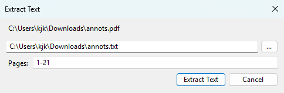

This extract text from the document and saves it as a text file. 

You can also extract from all pages or select a subset of pages.

## From command-line

You can use SumatraPDF cmd-line to extract text from a PDF file.

### Extract all text from PDF

`sumatrapdf-tool convert -o output.txt input.pdf`

### Extract text from selected pages of a PDF

`sumatrapdf-tool convert -o output.txt input.pdf 1-3,4,8-9`

This will extract text from pages 1,2,3,4,8,9.

# Structured text

PDF files don't really contain text. It's made of glyphs (characters) in a given font positioned at (x,y) position in a page.

Extracting text is based on heuristics i.e. the program tries to guess words and lines based on position of characters.

Structured text is detailed information about every character on the page:

- font
- glyph
- (x,y) position on page
- bounding box (area) of the glyph

For example, in XML format it looks like:

```xml
<font name="CharisSIL" size="7.9701">
<char quad="187.4652 295.9985 191.96033 295.9985 187.4652 301.9683 191.96033 301.9683" x="187.4652" y="301.871" bidi="0" color="#000000" alpha="#ff" flags="16" c="d"/>
```

Here it shows that letter `d` in font `CharisSIL` is at a given x/y position in the page.

You can use this output in your custom processing program.

### Extract structured text from PDF in XML format

`sumatrapdf-tool draw -o foo.stext foo.pdf`

### Extract structured text from PDF in JSON format

`sumatrapdf-tool draw -o foo.stext.json -F stext.json foo.pdf`

It's the same information but in JSON format.

::Tool-x-convert-text-to-pdf.md
# Convert text file to a PDF

> The command-line tools are provided by `sumatrapdf-tool`, which is installed next to `SumatraPDF.exe`. They only work after SumatraPDF has been installed.

To use SumatraPDF to convert a text file to a PDF from command-line:

`sumatrapdf-tool convert -o output.pdf input.txt`

More info:

- [sumatrapdf-tool convert](Tool-convert.md)

::Tool-x-compress-pdf.md
# Compress a PDF

> The command-line tools are provided by `sumatrapdf-tool`, which is installed next to `SumatraPDF.exe`. They only work after SumatraPDF has been installed.

**Available in [pre-release 3.7](https://www.sumatrapdfreader.org/prerelease)**

## In application

To compress a PDF in SumatraPDF:
- open PDF document
- `Ctrl + k` for [command palette](Command-Palette.md)
- `Compress PDF`

Or:
- open PDF document
- right-click for context menu
- `Document` > `Compress PDF`

## From command-line

To compress a PDF using SumatraPDF from command-line:

`sumatrapdf-tool clean -gggg -e 100 -f -i -t -Z foo.pdf foo-compressed.pdf`

This uses most aggressive compression flags.

For explanation of all flags see [sumatrapdf-tool clean](Tool-clean.md).

If a PDF file is uncompressed, the compressed version should be smaller.

If a PDF is already compressed, this will have little effect.

You can also [decompress](Tool-x-decompress-pdf.md) PDF.

::Tool-x-decompress-pdf.md
# Decompress a PDF

> The command-line tools are provided by `sumatrapdf-tool`, which is installed next to `SumatraPDF.exe`. They only work after SumatraPDF has been installed.

**Available in [pre-release 3.7](https://www.sumatrapdfreader.org/prerelease)**

## In application

To decompress a PDF in SumatraPDF:
- open PDF document
- `Ctrl + k` for [command palette](Command-Palette.md)
- `Deompress PDF`

Or:
- open PDF document
- right-click for context menu
- `Document` > `Decompress PDF`

## From command-line

To decompress a PDF using SumatraPDF from command-line:

`sumatrapdf-tool clean -d foo.pdf foo-decompressed.pdf`

For explanation of all flags see [sumatrapdf-tool clean](Tool-clean.md).

You might want to de-compress to inspect the structure of PDF file more easily.

If a PDF file is compressed, the decompressed version should be bigger.

If a PDF is already decompressed, this will have little effect.

You can also [compress](Tool-x-compress-pdf.md) PDF.

::Tool-x-encrypt-pdf-with-password.md
# Encrypt a PDF with password

> The command-line tools are provided by `sumatrapdf-tool`, which is installed next to `SumatraPDF.exe`. They only work after SumatraPDF has been installed.

**Available in [pre-release 3.7](https://www.sumatrapdfreader.org/prerelease)**

## In application

To encrypt a PDF in SumatraPDF:
- open un-encrypted PDF document
- `Ctrl + k` for [command palette](Command-Palette.md)
- `Encrypt PDF`

Or:
- open un-encrypted PDF document
- right-click for context menu
- `Document` > `Encrypt PDF`

## From command-line

To encrypt a PDF with password using SumatraPDF from command-line:

`sumatrapdf-tool clean -E aes-256 -U pwd foo.pdf foo-encrypted.pdf`

Flags:

- `-E` : encryption algorithm
- `-U <pwd>` : password required to open PDF file

You can see [all flags](Tool-clean.md).

You can also [decrypt](Tool-x-decrypt-pdf.md)

::Tool-x-decrypt-pdf.md
# Decrypt a PDF

> The command-line tools are provided by `sumatrapdf-tool`, which is installed next to `SumatraPDF.exe`. They only work after SumatraPDF has been installed.

**Available in [pre-release 3.7](https://www.sumatrapdfreader.org/prerelease)**

## In application

To decrypt a PDF in SumatraPDF:
- open encrypted PDF document
- `Ctrl + k` for [command palette](Command-Palette.md)
- `Decrypt PDF`

Or:
- open encrypted PDF document
- right-click for context menu
- `Document` > `Decrypt PDF`

## From command-line

To decrypt a PDF using SumatraPDF from command-line:

`sumatrapdf-tool clean -D -p pwd foo-encrypted.pdf foo-decrypted.pdf`

Flags:

- `-D` : decrypt
- `-p <pwd>` : provide password

You can see [all flags](Tool-clean.md).

You can also [encrypt](Tool-x-encrypt-pdf-with-password.md)

::Tool-x-delete-pages-from-pdf.md
# Delete pages from PDF

> The command-line tools are provided by `sumatrapdf-tool`, which is installed next to `SumatraPDF.exe`. They only work after SumatraPDF has been installed.

**Available in [pre-release 3.7](https://www.sumatrapdfreader.org/prerelease)**

## In application

To delete pages from a PDF in SumatraPDF:
- open PDF document
- `Ctrl + k` for [command palette](Command-Palette.md)
- `Delete Pages From PDF`

Or:
- open PDF document
- right-click for context menu
- `Document` > `Delete Pages From PDF`

## From command-line

To delete a page from a PDF using SumatraPDF:

`sumatrapdf-tool clean input.pdf output.pdf 1-3,5-N`

This deletes page 4 from `input.pdf` and creates `output.pdf`

You can delete any number of pages by providing the range of pages to retain.

`N` is special character meaning: "last page".

For all options see [sumatrapdf-tool clean](Tool-clean.md).

::Tool-x-extract-pages-from-pdf.md
# Extract pages from PDF

> The command-line tools are provided by `sumatrapdf-tool`, which is installed next to `SumatraPDF.exe`. They only work after SumatraPDF has been installed.

**Available in [pre-release 3.7](https://www.sumatrapdfreader.org/prerelease)**

## In application

To extract pages from a PDF in SumatraPDF:
- open PDF document
- `Ctrl + k` for [command palette](Command-Palette.md)
- `Extract Pages From PDF`

Or:
- open PDF document
- right-click for context menu
- `Document` > `Extract Pages From PDF`

## From command-line

To extract pages from a PDF using SumatraPDF on a command line:

`sumatrapdf-tool clean input.pdf output.pdf 1,2-5,8-N`

This extracts pages 1, 2, 3, 4, 5 and 8 to last from `input.pdf` and saves as `output.pdf`

`N` is special character meaning "last page".

## Delete page or pages from PDF

To delete a page you need to extract all pages except the one you want to delete. See [delete pages from PDF](Tool-x-delete-pages-from-pdf.md).

::Tool-x-extract-images-from-pdf.md
# Extract images from a PDF

> The command-line tools are provided by `sumatrapdf-tool`, which is installed next to `SumatraPDF.exe`. They only work after SumatraPDF has been installed.

**Available in [pre-release 3.7](https://www.sumatrapdfreader.org/prerelease)**

You can use SumatraPDF from command-line to extract images embedded in a PDF file.

To extract all images: `sumatrapdf-tool extract input.pdf`

It'll save each image in a file with name `image-<object-number>.png`.

Image extension depends on the type of the file i.e. jpeg images will be saved as `.jpg` file.

## To extract specific images

You can extract only specific images. In a PDF file each image has an object number.

First, you need to find out object numbers of embedded images: `sumatrapdf-tool info -I input.pdf`

The output looks like:

```
Images (9):
        1       (1189 0 R):     [ Flate ] 400x300 8bpc DevRGB (3 0 R)
        1       (1189 0 R):     [ Flate ] 400x300 8bpc DevRGB (6 0 R)
        1       (1189 0 R):     [ Flate ] 602x250 8bpc DevRGB (10 0 R)
        1       (1189 0 R):     [ Flate ] 278x288 8bpc DevRGB (15 0 R)
```

`3`, `6`, `10` and `15` are object numbers.

To extract image 3 and 15: `sumatrapdf-tool extract input.pdf 3 15`

Reference:

- [sumatrapdf-tool extract](Tool-extract.md)
- [sumatrapdf-tool info](Tool-info.md)

::Tool-x-search-pdf.md
# Search text in PDF from command line

> The command-line tools are provided by `sumatrapdf-tool`, which is installed next to `SumatraPDF.exe`. They only work after SumatraPDF has been installed.

To search text in `file.pdf`:

`sumatrapdf-tool grep -i foo file.pdf`

`-i` ignores case i.e. does case-insensitive search, which is probably a good default.

Other options:

- `-a` ignore accents (diacritics)

## Search with a regular expression

`sumatrapdf-tool grep -i -G x.* file.pdf`

- `-G` search pattern is a regex
- `-i` you can combine it with case-insensitive flag
- `x.*` is a regular expression that says: every string that starts with `x`

For all options see [sumatrapdf-tool grep](Tool-grep.md).

::Contribute-translation.md
# Contribute translation

Sumatra is translated into many languages but we rely on you to help us keep translations for your language up to date.

To help us translate Sumatra:

- go to [https://www.apptranslator.org/app/SumatraPDF](https://www.apptranslator.org/app/SumatraPDF)
- log-in with your GitHub account
- pick a language you know
- add new translations or improve existing translations

To get notified about new strings that need to be translated you can subscribe to an rss feed for your language in an RSS reader of your choice (e.g. [https://www.apptranslator.org/rss?app=SumatraPDF&lang=de](https://www.apptranslator.org/rss?app=SumatraPDF&lang=de) is rss feed for changes in German language)

## The meaning of & in translations

& means that the following character is the hot key. For example, `&File` means that `f` key is a hot key in menu items etc. Hot keys are rendered with underline in menu items (although it can be disabled system-wide).

You don’t have to add hot keys in translations - those are for convenience and easier use with a keyboard.

In translated text a different character could be an accelerator.

See [https://github.com/sumatrapdfreader/sumatrapdf/discussions/2919](https://github.com/sumatrapdfreader/sumatrapdf/discussions/2919) for more information.
::How-to-submit-bug-reports.md
# How to submit bug reports

Did you encounter a bug in SumatraPDF?

## Check in latest pre-release build

First, see if it still happens in latest [pre-release version](https://www.sumatrapdfreader.org/prerelease). It's possible that a bug has already been fixed there.

## Create an issue

If the problem is present in latest [pre-release build](https://www.sumatrapdfreader.org/prerelease), please create a bug report in our [issue tracker](https://github.com/sumatrapdfreader/sumatrapdf/issues).

## Provide a test file

Does it involve a specific PDF (or CHM or XPS) file? 

Please attach it to the issue (try dragging and dropping on the issue field). Without a test document we rarely can make progress on fixing the issue.

If the file (or other information) is confidential, you can e-mail it directly to [kkowalczyk@gmail.com](mailto:kkowalczyk@gmail.com) ([Krzysztof Kowalczyk](https://blog.kowalczyk.info/), SumatraPDF's main developer).

## Provide reproduction steps

Often the bug only happens in a specific scenario.

If possible, please provide step-by-step instructions for reproducing the issue.

## Reporting crashes

[Submit crash report](Submit-crash-report.md)
::Submit-crash-report.md
# Submit crash report

Please help us fix SumatraPDF crashes.

If you have a reproducible crash:
* download symbols:
  * menu: `Debug` / `Download Symbols`
  * `Ctrl + K` for command palette and `Debug: Download Symbols`
* trigger the crash
* when you see crash dialog, press `Cancel` to launch default text editor with crash report
* post the content of the crash log as a gist at [https://gist.github.com/](https://gist.github.com/). For example: `Ctrl-A` to select all text, `Ctrl-C` to copy it to a clipboard and then `Ctrl-V` to the gist
* create a bug report at [https://github.com/sumatrapdfreader/sumatrapdf/issues](https://github.com/sumatrapdfreader/sumatrapdf/issues)
* post a link to the gist in the bug report
* **include the file that caused the crash**
    - attach to the GitHub issue (put in a .zip file if file type is not accepted)
    - or, if the file is private, e-mail to kkowalczyk@gmail.com (and reference bug number)
    - I can’t stress it enough: if I can’t reproduce a crash myself, I might not be able to fix it
* provide additional information like:
  * what were you doing when the crash happened
  * when did the crash happen. When opening a file? changing view? etc.
  * how did you open the file? drag & drop on Sumatra window? Double-click in file manager? From command line?
  * the best information is a set of steps I can do to reproduce the crash


::Reporting-printing-bugs.md
# Reporting printing bugs

Printing bugs are hard to diagnose because each printer has a different printer driver, so the same file can print well on one printer and not print on another printer.

That's why when reporting printing bugs in [https://github.com/sumatrapdfreader/sumatrapdf/issues](https://github.com/sumatrapdfreader/sumatrapdf/issues), please make sure to include the following information:

- version of Sumatra
- version of the OS (e.g. windows Vista, windows 10 etc.)
- name of the printer
- can you open and see the file in Sumatra?
- what exactly happens, are there any error messages?
- if it happens only for some files but not the others
    - is there anything different about the files that don't print that jumps out?
    - please attach the file that doesn't print to bug report. If the file is confidential you can e-mail it to [kkowalczyk@gmail.com](mailto:kkowalczyk@gmail.com) ([Krzysztof Kowalczyk](https://blog.kowalczyk.info/), Sumatra's main developer).
::Update-check-doesnt-work.md
# Update check doesn't work?

A new version of Sumatra has been released, you `Help -> Check for updates` menu and it didn't notify about a new release. Is this a bug?

Most likely not.

We wait at least a week before activating update check. That way, if there is a major problem with a new release that we didn't catch in testing, less people will have to re-download the update that fixes the problem.
::Failed-to-load-libmupdf.md
# Failed to load libmupdf.dll

When installed, SumatraPDF consists of 2 files:

* `SumatraPDF.exe`
* `libmupdf.dll`

You're reading this page because loading of `libmupdf.dll` failed and we can't proceed.

**How can that happen?**

There are many possible reasons. The error code and message is what Windows reports.

## Antivirus / security software (most common for portable / pre-release)

Portable and single-file builds extract `libmupdf.dll` next to the executable or under `%LocalAppData%\SumatraPDF-data\` the first time they run.

Some antivirus products:

* block `LoadLibrary` on a just-written DLL
* quarantine or delete the DLL immediately after it is extracted
* return unusual error codes (for example **87** / “Invalid parameter”, **5** / access denied, **32** / sharing violation)

This is especially common with real-time protection and “behavior” or “ransomware” shields.

**What to try:**

1. **Add exclusions** for:
   * the folder that contains `SumatraPDF.exe` (portable install)
   * `%LocalAppData%\SumatraPDF-data\` (extracted build-specific files)
2. Temporarily **disable real-time scanning**, start SumatraPDF once so `libmupdf.dll` can load, then re-enable scanning (keep the exclusions).
3. Check the antivirus quarantine for `libmupdf.dll` and restore it if found.
4. Prefer the **official installer** from [sumatrapdfreader.org](https://www.sumatrapdfreader.org/download-free-pdf-viewer) if portable keeps failing.
5. Re-download SumatraPDF (ensure the download is complete and not modified).

If the dialog shows a Windows error code, note it when asking for help.

## Other causes

* Incomplete copy of a multi-file install (`libmupdf.dll` missing next to the `.exe`)
* Wrong / leftover `libmupdf.dll` from another version (size mismatch)
* Corrupted download or disk errors
* Security policies blocking unsigned or newly written modules

**How to investigate a specific error code:**

* Search: `LoadLibrary <error-code>`
* Ask an AI: `when calling LoadLibrary() Win32 API I got error <code>. What does it mean?`
* Ask in [SumatraPDF discussions](https://github.com/sumatrapdfreader/sumatrapdf/discussions)

See also [Corrupted installation](Corrupted-installation.md) and [Installation](Installation.md).

::Corrupted-installation.md
# Corrupted installation

See also [Installation](Installation.md) for portable vs installer overview.

If you're reading this, you might have been told by SumatraPDF that you have a corrupted installation.

**How can that happen?**

SumatraPDF comes in two flavors: a portable version and an installer.

A portable version is a self-contained executable and cannot be corrupted.

An installer needs to be run to be properly installed. Part of it is extracting `libmupdf.dll` library.

There are 2 possible problems:

- `libmupdf.dll` is missing
- `libmupdf.dll` is there but its version doesn't match the version of `SumatraPDF.exe`

**How to solve the problem?**

If you want to place SumatraPDF in any location, under any name, use the self-contained portable flavor.

If you insist on using the installable version, just install it. The installer will run if it has `-install` in the name of the `.exe` (which it will if you download [official build](https://www.sumatrapdfreader.org/download-free-pdf-viewer)).

If you rename the `.exe`, you can force running the installer with `-install` option.

Alternatively, you can extract `libmupdf.dll` and all other files with `-x` option.

::Why-only-Windows.md
# Why only Windows?

People sometimes suggest that Sumatra should be available for some other operating system: Linux, Mac, Android etc.

This won't happen.

The first reason is that current developers don't know how to write software for those other platforms.

Second reason is that it would mean writing the whole program from scratch for a new platform.

Sumatra is tightly integrated with and optimized for Windows. Making a version for another operating system is not a matter of making a few changes here and there but writing all the UI code from scratch i.e. redoing years of development that went into Sumatra.

SumatraPDF is an open-source project so anyone is free to take our source code and use as much of it as they want to create equivalent for some other operating system, but we're unlikely to do it ourselves.